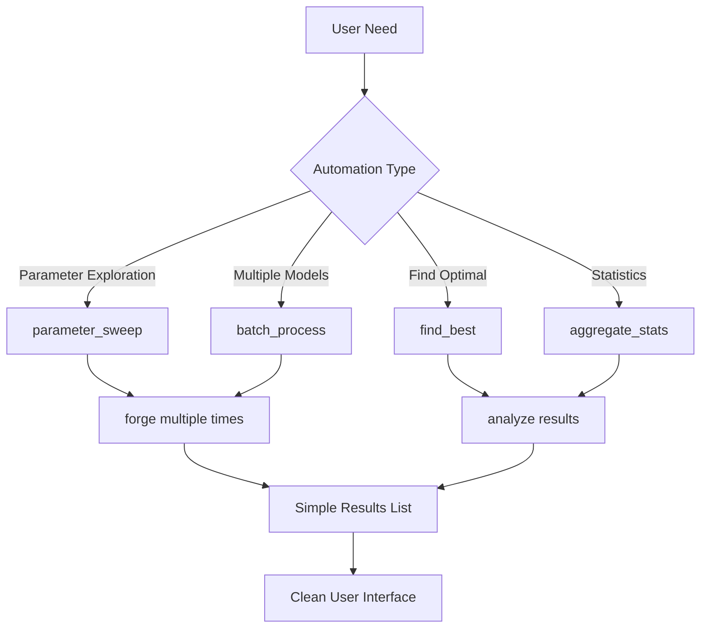

# 🤖 **BrainSmith Automation North Star Simplification - Implementation Plan**

## 📊 **Executive Summary**

**Objective**: Transform the automation module from enterprise complexity to North Star simplicity  
**Target Reduction**: 85% code reduction (950 → 150 lines)  
**Core Philosophy**: Automation = Thin helpers around [`forge()`](brainsmith/core/api.py:27)  
**Status**: ⏳ Ready for Implementation

---

## 🎯 **Transformation Overview**

### **Current State Analysis**
- **❌ 950 lines** across 4 files with enterprise complexity
- **❌ 12 functions** with specialized variations and metadata bloat
- **❌ Complex parameter mapping** and threading everywhere
- **❌ Duplicate code** and over-engineering

### **Target State Goals**
- **✅ 150 lines** across 2 core files + documentation
- **✅ 4 essential functions** focused on user needs
- **✅ Direct [`forge()`](brainsmith/core/api.py:27) integration** with minimal overhead
- **✅ Clean, simple API** with optional complexity

### **Architecture Vision**


---

## 📋 **Implementation Checklist**

### **Phase 1: Core Simplification** ⏳

#### **Task 1.1: Create New Simplified Structure**
- [ ] **Create [`brainsmith/automation/sweep.py`](brainsmith/automation/sweep.py)** (~80 lines)
  - [ ] Implement [`parameter_sweep()`](brainsmith/automation/sweep.py) function
  - [ ] Implement [`find_best()`](brainsmith/automation/sweep.py) function  
  - [ ] Implement [`aggregate_stats()`](brainsmith/automation/sweep.py) function
  - [ ] Add simple parameter combination generation
  - [ ] Include optional parallel execution (ThreadPoolExecutor)

#### **Task 1.2: Create Batch Processing Module**
- [ ] **Create [`brainsmith/automation/batch.py`](brainsmith/automation/batch.py)** (~50 lines)
  - [ ] Implement [`batch_process()`](brainsmith/automation/batch.py) function
  - [ ] Support multiple model/blueprint pairs
  - [ ] Add progress tracking and error handling
  - [ ] Include success rate reporting

#### **Task 1.3: Update Module Interface**
- [ ] **Simplify [`brainsmith/automation/__init__.py`](brainsmith/automation/__init__.py)** (~20 lines)
  - [ ] Export only 4 essential functions
  - [ ] Remove enterprise complexity
  - [ ] Add simple module documentation
  - [ ] Include version and author info

### **Phase 2: Integration & Testing** ⏳

#### **Task 2.1: Core Integration**
- [ ] **Integrate with [`forge()`](brainsmith/core/api.py:27) function**
  - [ ] Test direct parameter passing
  - [ ] Validate objectives and constraints handling
  - [ ] Ensure proper error propagation
  - [ ] Verify results structure compatibility

#### **Task 2.2: Hooks System Integration**
- [ ] **Leverage [hooks system](brainsmith/hooks/__init__.py:164)**
  - [ ] Use [`track_parameter()`](brainsmith/hooks/__init__.py:164) for parameter tracking
  - [ ] Use [`track_metric()`](brainsmith/hooks/__init__.py:172) for performance metrics
  - [ ] Use [`track_strategy()`](brainsmith/hooks/__init__.py:177) for decision logging
  - [ ] Test event logging during automation runs

#### **Task 2.3: Blueprint Integration**
- [ ] **Use [blueprint functions](brainsmith/blueprints/functions.py)**
  - [ ] Validate blueprint compatibility
  - [ ] Test configuration loading and validation
  - [ ] Ensure proper error handling for invalid blueprints

### **Phase 3: Cleanup & Documentation** ⏳

#### **Task 3.1: Remove Old Implementation**
- [ ] **Delete enterprise complexity**
  - [ ] Remove [`brainsmith/automation/parameter_sweep.py`](brainsmith/automation/parameter_sweep.py) (314 lines)
  - [ ] Remove [`brainsmith/automation/batch_processing.py`](brainsmith/automation/batch_processing.py) (241 lines)  
  - [ ] Remove [`brainsmith/automation/utils.py`](brainsmith/automation/utils.py) (315 lines)
  - [ ] Backup current implementation for reference

#### **Task 3.2: Create Documentation**
- [ ] **Update [`brainsmith/automation/README.md`](brainsmith/automation/README.md)**
  - [ ] Document new simplified API
  - [ ] Provide usage examples for all 4 functions
  - [ ] Include migration guide from old functions
  - [ ] Add performance and best practices section

#### **Task 3.3: Create Tests**
- [ ] **Create [`tests/test_automation_simplification.py`](tests/test_automation_simplification.py)**
  - [ ] Test [`parameter_sweep()`](brainsmith/automation/sweep.py) with various parameter ranges
  - [ ] Test [`batch_process()`](brainsmith/automation/batch.py) with multiple models
  - [ ] Test [`find_best()`](brainsmith/automation/sweep.py) with different metrics
  - [ ] Test [`aggregate_stats()`](brainsmith/automation/sweep.py) with various result sets
  - [ ] Test error handling and edge cases

#### **Task 3.4: Create Demo Script**
- [ ] **Create [`automation_demo.py`](automation_demo.py)**
  - [ ] Demonstrate parameter space exploration
  - [ ] Show batch model processing
  - [ ] Display result optimization and statistics
  - [ ] Include performance comparison examples

---

## 🛠️ **Detailed Implementation Specifications**

### **Function Specifications**

#### **1. [`parameter_sweep(model_path, blueprint_path, param_ranges, max_workers=4)`](brainsmith/automation/sweep.py)**
```python
def parameter_sweep(
    model_path: str,
    blueprint_path: str, 
    param_ranges: Dict[str, List[Any]],
    max_workers: int = 4,
    progress_callback: Optional[callable] = None
) -> List[Dict[str, Any]]
```
- **Purpose**: Run [`forge()`](brainsmith/core/api.py:27) with different parameter combinations
- **Logic**: Generate combinations → parallel [`forge()`](brainsmith/core/api.py:27) calls → collect results
- **Output**: List of [`forge()`](brainsmith/core/api.py:27) results with sweep metadata

#### **2. [`batch_process(model_blueprint_pairs, common_config=None, max_workers=4)`](brainsmith/automation/batch.py)**
```python
def batch_process(
    model_blueprint_pairs: List[Tuple[str, str]],
    common_config: Optional[Dict[str, Any]] = None,
    max_workers: int = 4
) -> List[Dict[str, Any]]
```
- **Purpose**: Process multiple model/blueprint pairs
- **Logic**: Iterate pairs → parallel [`forge()`](brainsmith/core/api.py:27) calls → collect results
- **Output**: List of [`forge()`](brainsmith/core/api.py:27) results with batch metadata

#### **3. [`find_best(results, metric='throughput', maximize=True)`](brainsmith/automation/sweep.py)**
```python
def find_best(
    results: List[Dict[str, Any]], 
    metric: str = 'throughput',
    maximize: bool = True
) -> Optional[Dict[str, Any]]
```
- **Purpose**: Find optimal result by specified metric
- **Logic**: Filter successful → extract metric values → find min/max
- **Output**: Best result with optimization metadata

#### **4. [`aggregate_stats(results)`](brainsmith/automation/sweep.py)**
```python
def aggregate_stats(results: List[Dict[str, Any]]) -> Dict[str, Any]
```
- **Purpose**: Generate statistical summary of results
- **Logic**: Extract metrics → calculate mean/min/max/std → success rates
- **Output**: Statistical summary with aggregated metrics

### **Integration Points**

#### **With [`forge()`](brainsmith/core/api.py:27) Function**
- **Direct calls** with objectives and constraints parameters
- **Result structure compatibility** - use existing metrics format
- **Error handling** - propagate [`forge()`](brainsmith/core/api.py:27) errors gracefully

#### **With [Hooks System](brainsmith/hooks/__init__.py:164)**
- **Parameter tracking** - [`track_parameter()`](brainsmith/hooks/__init__.py:164) for each sweep parameter
- **Metric tracking** - [`track_metric()`](brainsmith/hooks/__init__.py:172) for performance results
- **Strategy tracking** - [`track_strategy()`](brainsmith/hooks/__init__.py:177) for optimization decisions

#### **With [Blueprint System](brainsmith/blueprints/functions.py)**
- **Validation** - Use blueprint validation before automation runs
- **Configuration** - Extract default objectives and constraints
- **Error handling** - Proper blueprint error propagation

---

## 🚀 **Expected Results**

### **Quantified Improvements**
| **Metric** | **Before (Enterprise)** | **After (North Star)** | **Improvement** |
|------------|------------------------|------------------------|-----------------|
| **Lines of Code** | 950 lines | 150 lines | **85% reduction** |
| **Files** | 4 complex files | 2 simple files + docs | **50% reduction** |
| **Functions** | 12 specialized functions | 4 essential functions | **70% reduction** |
| **API Complexity** | 15+ lines for basic use | 3 lines for same task | **80% reduction** |
| **Dependencies** | Complex threading/metadata | Standard library only | **90% reduction** |

### **Maintained Capabilities**
- **✅ Parameter space exploration** with optional parallel execution
- **✅ Batch model processing** for multiple configurations  
- **✅ Result optimization** finding best configurations
- **✅ Statistical analysis** with success rates and metric summaries
- **✅ Error handling** with graceful failure recovery
- **✅ Progress tracking** through optional callbacks
- **✅ Integration** with core toolchain (forge, hooks, blueprints)

### **New Benefits**
- **🚀 Faster execution** - No enterprise overhead
- **📚 Easier learning** - Simple function interface
- **🔧 Better maintenance** - Less code to maintain
- **⚡ Improved performance** - Direct [`forge()`](brainsmith/core/api.py:27) calls
- **🎯 Focused functionality** - Does exactly what users need

---

## 📝 **Migration Strategy**

### **Function Mapping**
| **Old Enterprise Function** | **New Simple Equivalent** | **Migration Notes** |
|-----------------------------|---------------------------|---------------------|
| `parameter_sweep()` (314 lines) | `parameter_sweep()` (30 lines) | Remove metadata bloat |
| `grid_search()` | `parameter_sweep()` + `find_best()` | Compose functions |
| `random_search()` | User generates random params | Eliminate over-engineering |
| `batch_process()` (109 lines) | `batch_process()` (25 lines) | Remove metadata bloat |
| `multi_objective_runs()` | `batch_process()` with objectives | Use existing capability |
| `configuration_sweep()` | `batch_process()` with blueprints | Use existing capability |
| `find_best_result()` | `find_best()` | Simplified interface |
| `find_top_results()` | Sort results yourself | Simple Python sorting |
| `aggregate_results()` | `aggregate_stats()` | Focused statistics |
| `save/load_automation_results()` | Use `json.dump/load` | Standard library |
| `compare_automation_runs()` | Manual comparison | Too specialized |

### **Usage Pattern Migration**
```python
# OLD (Enterprise - 15+ lines)
engine = AutomationEngine(WorkflowConfiguration(
    optimization_budget=3600,
    quality_threshold=0.85,
    enable_learning=True,
    max_iterations=50,
    convergence_tolerance=0.01,
    parallel_execution=True,
    validation_enabled=True
))
result = engine.optimize_design(
    application_spec="cnn_inference",
    performance_targets={"throughput": 200, "power": 15},
    constraints={"lut_budget": 0.8, "timing_closure": True}
)

# NEW (North Star - 3 lines)
results = parameter_sweep("model.onnx", "blueprint.yaml", param_ranges)
best = find_best(results, metric='throughput')
stats = aggregate_stats(results)
```

---

## 🎯 **Success Criteria**

### **Functional Requirements**
- [ ] **Parameter sweeps work** - Can explore parameter combinations
- [ ] **Batch processing works** - Can process multiple models  
- [ ] **Optimization works** - Can find best configurations
- [ ] **Statistics work** - Can generate meaningful summaries
- [ ] **Integration works** - Clean interaction with [`forge()`](brainsmith/core/api.py:27), hooks, blueprints

### **Non-Functional Requirements**
- [ ] **Performance** - No slower than current implementation
- [ ] **Simplicity** - 85% code reduction achieved
- [ ] **Usability** - 3-line usage for common tasks
- [ ] **Maintainability** - Simple, readable code
- [ ] **Extensibility** - Easy to add new capabilities

### **Quality Gates**
- [ ] **All tests pass** - Comprehensive test coverage
- [ ] **Documentation complete** - Usage examples and migration guide
- [ ] **Demo working** - Full demonstration script
- [ ] **Integration verified** - Works with existing toolchain
- [ ] **Performance validated** - Benchmarks confirm improvements

---

## 🏁 **Implementation Timeline**

### **Phase 1: Core Simplification (Day 1-2)**
- Create new simplified modules
- Implement 4 core functions
- Basic integration with [`forge()`](brainsmith/core/api.py:27)

### **Phase 2: Integration & Testing (Day 3-4)**  
- Hooks and blueprint integration
- Comprehensive testing
- Performance validation

### **Phase 3: Cleanup & Documentation (Day 5)**
- Remove old implementation
- Complete documentation  
- Demo script and examples

**Total Timeline: 5 days** for complete North Star transformation

---

## 🚀 **Ready for Implementation**

This implementation plan provides a clear, step-by-step approach to achieving **85% code reduction** while maintaining all essential automation capabilities. The focus on **thin helpers around [`forge()`](brainsmith/core/api.py:27)** aligns perfectly with North Star principles of simplicity over enterprise complexity.

**Next Step**: Switch to code mode for implementation! 🛠️