# Blueprint V2 System Implementation Plan

## Executive Summary

This plan outlines the implementation of the missing components to complete the Blueprint V2 system. We have a sophisticated DSE engine that's 90% complete - this plan focuses on the critical FINN integration bridge and a clean new API that will eventually replace the legacy system.

**Key Principles:**
- ✅ **Direct FINN Integration** - No mock components, integrate with real FINN from start
- ✅ **Clean New System** - New `forge_v2()` API with no legacy baggage  
- ✅ **Production Quality** - Build it right the first time
- ✅ **Real-World Testing** - Test with actual FINN DataflowBuildConfig from day one

## Current State Assessment

### ✅ Implemented (Excellent Foundation)
- **Blueprint V2 Parser** - Complete YAML-based design space definition (506 lines)
- **DSE Engine** - Production-ready space exploration with adaptive strategies (619 lines)
- **Strategy Framework** - Multiple algorithms with pluggable architecture (245 lines)
- **Results Analysis** - Advanced Pareto frontier optimization (463 lines)
- **Test Coverage** - 25 comprehensive test cases covering all components

### ❌ Missing Critical Components
- **FINN Integration Bridge** - Connect DSE to actual FINN execution
- **Legacy Conversion Layer** - Bridge 6-entrypoint configs to current FINN API
- **Clean API** - New `forge_v2()` function for Blueprint V2
- **Integration Testing** - End-to-end validation with real FINN

## Implementation Architecture

```mermaid
graph TB
    subgraph "🆕 NEW CLEAN SYSTEM"
        API_V2[forge_v2 Function] --> DETECTOR[Blueprint V2 Loader]
        DETECTOR --> DSE[Design Space Explorer]
        DSE --> BRIDGE[FINN Evaluation Bridge]
        BRIDGE --> LEGACY[Legacy Conversion Layer]
        LEGACY --> FINN_API[Real FINN DataflowBuildConfig]
        FINN_API --> METRICS[Performance Metrics]
        METRICS --> RESULTS[Clean Results Format]
    end
    
    subgraph "🎯 TARGET: Future Direct Integration"
        API_FUTURE[Future forge_v3] --> DIRECT[Direct 6-Entrypoint FINN]
        DIRECT --> ENHANCED[Enhanced Metrics]
    end
    
    style API_V2 fill:#e8f5e8,stroke:#4caf50,stroke-width:3px
    style BRIDGE fill:#ffcccc,stroke:#ff0000,stroke-width:3px
    style LEGACY fill:#ffcccc,stroke:#ff0000,stroke-width:3px
    style FINN_API fill:#ffffcc,stroke:#ffaa00,stroke-width:2px
```



## Detailed Implementation Plan

### Phase 1: Core FINN Integration (Priority 1 - Est. 8-12 hours)

#### 1.1 Create finn_v2 Module Structure (1 hour)
**Objective**: Set up clean module architecture for FINN integration

**Deliverables**:
```
brainsmith/core/finn_v2/
├── __init__.py                 # Clean module exports
├── evaluation_bridge.py        # Main DSE → FINN interface  
├── legacy_conversion.py        # 6-entrypoint → DataflowBuildConfig
├── config_builder.py          # Configuration utilities
└── metrics_extractor.py       # FINN results → DSE metrics
```

**Implementation Details**:
- Clean module structure with clear separation of concerns
- Comprehensive docstrings and type hints
- Error handling strategy for FINN integration failures

#### 1.2 Implement LegacyConversionLayer (3-4 hours) **CRITICAL**
**Objective**: Bridge future 6-entrypoint architecture to current FINN API

**File**: `brainsmith/core/finn_v2/legacy_conversion.py`

**Key Implementation**:
```python
class LegacyConversionLayer:
    """Converts Blueprint V2 6-entrypoint config to FINN DataflowBuildConfig."""
    
    def convert_to_dataflow_config(self, entrypoint_config: Dict[str, List[str]], 
                                 blueprint_config: Dict[str, Any]) -> DataflowBuildConfig:
        """
        Convert 6-entrypoint configuration to legacy FINN format.
        
        Uses docs/finn_brainsmith_interfacing_runner.md for mapping:
        - Entrypoint 1: canonical_ops → custom registration steps
        - Entrypoint 2: model_topology → early transformation steps  
        - Entrypoint 3/4: hw_kernels → kernel registration and specialization
        - Entrypoint 5: hw_kernel transforms → optimization steps
        - Entrypoint 6: hw_graph transforms → graph optimization steps
        """
        
    def _map_entrypoint_to_steps(self, entrypoint_id: int, components: List[str]) -> List[str]:
        """Map entrypoint components to FINN step sequence."""
        
    def _build_finn_config_params(self, blueprint_config: Dict[str, Any]) -> Dict[str, Any]:
        """Extract FINN configuration parameters from blueprint."""
```

**Reference**: Use `docs/finn_brainsmith_interfacing_runner.md` entrypoint mapping table

**Testing Strategy**: 
- Test each entrypoint mapping individually with real FINN
- Validate DataflowBuildConfig creation with FINN's validation
- Error handling for unsupported component combinations

#### 1.3 Implement FINNEvaluationBridge (3-4 hours) **CRITICAL**
**Objective**: Main interface that DSE Explorer calls to evaluate combinations

**File**: `brainsmith/core/finn_v2/evaluation_bridge.py`

**Key Implementation**:
```python
class FINNEvaluationBridge:
    """Bridge from ComponentCombination to FINN execution with real results."""
    
    def __init__(self, blueprint_config: Dict[str, Any]):
        """Initialize with blueprint configuration for FINN parameters."""
        self.legacy_converter = LegacyConversionLayer()
        self.metrics_extractor = MetricsExtractor()
        
    def evaluate_combination(self, model_path: str, combination: ComponentCombination) -> Dict[str, Any]:
        """
        Execute real FINN run for given combination.
        
        Flow:
        1. Convert ComponentCombination → 6-entrypoint config
        2. Use LegacyConversionLayer → DataflowBuildConfig  
        3. Execute FINN build_dataflow_cfg() with real FINN
        4. Extract performance metrics from FINN results
        5. Return standardized metrics for DSE
        """
        
    def _combination_to_entrypoint_config(self, combination: ComponentCombination) -> Dict[str, List[str]]:
        """Convert DSE combination to 6-entrypoint configuration."""
        
    def _execute_finn_run(self, model_path: str, dataflow_config: DataflowBuildConfig) -> Any:
        """Execute real FINN build with error handling."""
        
    def _extract_metrics(self, finn_result: Any) -> Dict[str, Any]:
        """Extract standardized metrics from FINN build results."""
```

**FINN Integration Points**:
- Import real FINN: `from finn.builder.build_dataflow import build_dataflow_cfg`
- Import real FINN config: `from finn.builder.build_dataflow_config import DataflowBuildConfig`
- Real FINN execution with actual build process
- Real metrics extraction from FINN synthesis results

#### 1.4 Implement MetricsExtractor (1-2 hours)
**Objective**: Extract standardized metrics from FINN results for DSE

**File**: `brainsmith/core/finn_v2/metrics_extractor.py`

**Key Implementation**:
```python
class MetricsExtractor:
    """Extract performance metrics from real FINN build results."""
    
    def extract_metrics(self, finn_result: Any, finn_config: DataflowBuildConfig) -> Dict[str, Any]:
        """
        Extract standardized metrics for DSE optimization.
        
        Metrics to Extract:
        - Performance: throughput (fps), latency (ms), clock frequency (MHz)
        - Resources: LUT/DSP/BRAM utilization, power consumption  
        - Quality: success/failure status, build time, warnings
        """
        
    def _extract_performance_metrics(self, finn_result: Any) -> Dict[str, float]:
        """Extract performance metrics from FINN rtlsim results."""
        
    def _extract_resource_metrics(self, finn_result: Any) -> Dict[str, float]:
        """Extract resource utilization from FINN synthesis reports."""
```

#### 1.5 Update DSE Explorer Integration (1 hour)
**Objective**: Connect the sophisticated DSE system to real FINN

**File**: `brainsmith/core/dse_v2/space_explorer.py`

**Changes Required**:
```python
# Line 309: Replace evaluation_function parameter with FINN bridge
# OLD:
metrics = evaluation_function(model_path, combination)

# NEW:  
bridge = FINNEvaluationBridge(self.design_space.blueprint_config)
metrics = bridge.evaluate_combination(model_path, combination)
```

**Additional Updates**:
- Update `ExplorationConfig` to include blueprint configuration
- Add FINN-specific error handling and retry logic
- Update progress callbacks to include FINN build status

### Phase 2: Clean API Implementation (Priority 2 - Est. 4-6 hours)

#### 2.1 Implement forge_v2() Function (2-3 hours)
**Objective**: Create clean new API that will eventually replace legacy system

**File**: `brainsmith/core/api.py` (add new function)

**Implementation**:
```python
def forge_v2(
    model_path: str,
    blueprint_path: str,
    objectives: Optional[Dict[str, Any]] = None,
    constraints: Optional[Dict[str, Any]] = None,
    target_device: Optional[str] = None,
    output_dir: Optional[str] = None,
    dse_config: Optional[Dict[str, Any]] = None
) -> Dict[str, Any]:
    """
    Clean Blueprint V2 API - The future of BrainSmith.
    
    No legacy baggage, no backward compatibility, just the best system we can build.
    
    Args:
        model_path: Path to ONNX model
        blueprint_path: Path to Blueprint V2 YAML
        objectives: Optimization objectives (override blueprint defaults)
        constraints: Resource constraints (override blueprint defaults)  
        target_device: Target FPGA device
        output_dir: Output directory for results
        dse_config: DSE strategy configuration
        
    Returns:
        Clean results dictionary with:
        - best_design: Optimal design point found
        - pareto_frontier: Multi-objective optimization results
        - exploration_summary: DSE execution statistics
        - build_artifacts: FINN build outputs (if successful)
    """
```

**Implementation Flow**:
1. Load and validate Blueprint V2 (strict validation)
2. Create DesignSpaceExplorer with FINN integration
3. Execute design space exploration with real FINN evaluations
4. Return clean, well-structured results

#### 2.2 Implement Blueprint V2 Loading (1-2 hours)
**Objective**: Clean Blueprint V2 loading with comprehensive validation

**Implementation**:
```python
def _load_blueprint_v2(blueprint_path: str) -> DesignSpaceDefinition:
    """Load Blueprint V2 with strict validation - no compromises."""
    
def _validate_blueprint_v2_strict(blueprint: DesignSpaceDefinition) -> None:
    """Strict validation with clear error messages."""
```

**Validation Requirements**:
- Comprehensive design space validation
- Objective/constraint requirement enforcement  
- Strategy compatibility verification
- Clear error messages for developers

#### 2.3 Integration Testing (1 hour)
**Objective**: Validate end-to-end Blueprint V2 → FINN flow

**Test Cases**:
```python
# tests/test_forge_v2_integration.py
def test_end_to_end_bert_blueprint():
    """Test complete flow with bert_accelerator_v2.yaml"""
    
def test_dse_exploration_with_real_finn():
    """Test DSE exploration executes real FINN builds"""
    
def test_metrics_extraction_accuracy():
    """Validate metrics extracted from real FINN results"""
```

### Phase 3: Production Readiness (Priority 3 - Est. 4-6 hours)

#### 3.1 Blueprint-Strategy Alignment (2 hours)
**Objective**: Ensure Blueprint V2 examples work with DSE strategies

**Tasks**:
- Update blueprint examples with comprehensive objectives/constraints
- Implement strategy-blueprint compatibility validation
- Fix hardcoded objective references in strategies

**Files to Update**:
- `brainsmith/libraries/blueprints_v2/transformers/bert_accelerator_v2.yaml`
- `brainsmith/libraries/blueprints_v2/base/transformer_base.yaml`

#### 3.2 Comprehensive Testing (1-2 hours)
**Objective**: Production-quality test coverage

**Test Files to Create**:
```
tests/finn_v2/
├── test_evaluation_bridge.py      # Real FINN integration tests
├── test_legacy_conversion.py      # Entrypoint mapping tests  
├── test_metrics_extractor.py      # FINN results parsing tests
└── test_end_to_end.py             # Complete workflow tests
```

**Testing Strategy**:
- All tests use real FINN (no mocks)
- Test with actual blueprint examples
- Performance benchmarking for DSE evaluation speed
- Error handling validation with malformed inputs

#### 3.3 Documentation & Examples (1 hour)
**Objective**: Clear documentation for the new clean system

**Documentation to Create**:
- `docs/BLUEPRINT_V2_API_GUIDE.md` - forge_v2() usage guide
- `docs/BLUEPRINT_V2_EXAMPLES.md` - End-to-end examples
- `docs/FINN_INTEGRATION_GUIDE.md` - How FINN integration works

### Phase 4: Performance Optimization (Bonus - Est. 2-4 hours)

#### 4.1 DSE Performance Tuning
**Objective**: Optimize for real FINN evaluation performance

**Optimizations**:
- Parallel FINN builds (if FINN supports it)
- Intelligent caching of FINN results
- Early termination for failed builds
- Resource usage optimization

#### 4.2 Production Deployment
**Objective**: Deploy-ready system

**Tasks**:
- Error handling and logging optimization
- Resource cleanup and memory management
- Production configuration defaults
- Monitoring and metrics collection

## Success Criteria

### ✅ Functional Requirements
1. **Complete Integration**: Blueprint V2 → DSE → FINN → Results works end-to-end
2. **Real FINN Execution**: All evaluations use actual FINN DataflowBuildConfig
3. **Clean API**: `forge_v2()` provides excellent developer experience
4. **Performance**: DSE exploration with real FINN completes in reasonable time

### ✅ Quality Requirements  
1. **No Mocks**: All FINN integration uses real FINN from day one
2. **Comprehensive Testing**: All components tested with real FINN
3. **Production Ready**: Error handling, logging, monitoring
4. **Documentation**: Clear usage guides and examples

### ✅ Performance Targets
- **DSE Exploration**: < 30 minutes for 100 FINN evaluations
- **Individual FINN Build**: < 10 minutes per combination
- **Memory Usage**: < 8GB RAM for typical exploration
- **Success Rate**: > 90% of valid combinations complete successfully

## Implementation Timeline

### Week 1: Core Implementation
- **Days 1-2**: LegacyConversionLayer + FINNEvaluationBridge (Real FINN integration)
- **Days 3-4**: DSE Integration + Basic Testing
- **Day 5**: forge_v2() API implementation

### Week 2: Production Readiness  
- **Days 1-2**: Comprehensive testing with real FINN
- **Days 3-4**: Blueprint examples and strategy alignment
- **Day 5**: Documentation and performance optimization

## Risk Mitigation

### High-Risk Items
1. **FINN Build Performance**: Real FINN builds may be too slow for effective DSE
2. **FINN API Stability**: FINN DataflowBuildConfig may change
3. **Resource Requirements**: FINN builds may require significant compute resources

### Mitigation Strategies
1. **Performance Monitoring**: Track FINN build times and optimize bottlenecks
2. **Incremental Testing**: Test each component with real FINN incrementally
3. **Resource Management**: Implement resource cleanup and memory management
4. **Fallback Strategies**: Graceful degradation for FINN build failures

## Long-Term Vision

This implementation creates the foundation for the future of BrainSmith:

1. **Clean Architecture**: New `forge_v2()` will eventually replace legacy `forge()`
2. **Direct FINN Integration**: When FINN implements 6-entrypoint architecture, minimal changes needed
3. **Production Quality**: Real FINN integration from day one ensures production readiness
4. **Extensible Design**: Clean module structure supports future enhancements

The result will be a **world-class design space exploration system** that transforms FINN from a single-run tool into a sophisticated optimization platform for FPGA accelerator design.