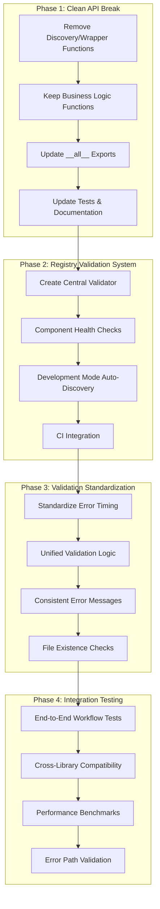
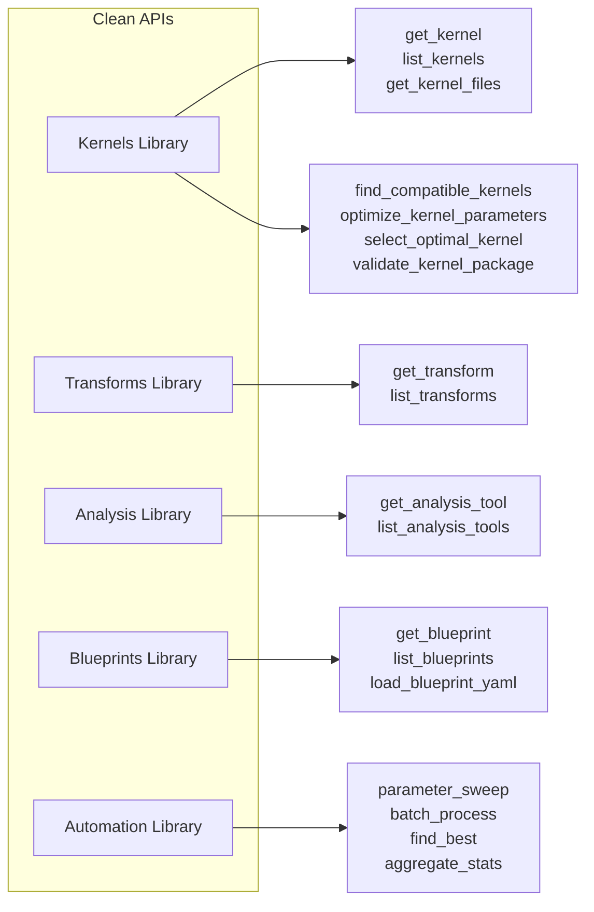

# BrainSmith Libraries: Critical Vulnerabilities Implementation Plan

## Executive Summary

This plan addresses critical vulnerabilities identified in the BrainSmith Libraries refactoring while implementing a clean API break. The focus is on eliminating registry-reality desynchronization risk, standardizing validation approaches, and ensuring robust cross-library integration.

## Critical Vulnerabilities Addressed

1. **Registry-Reality Desynchronization Risk** (CRITICAL)
2. **Inconsistent Validation Strategies** (MEDIUM) 
3. **Cross-Library Integration Testing Gap** (MEDIUM)
4. **Performance Claims Validation** (LOW-MEDIUM)

## Implementation Architecture



## Phase 1: Clean API Break (High Priority)

### 1.1 Functions to REMOVE (No Business Value)

**All Libraries:**
```python
# Discovery wrappers - replaced by registry pattern
discover_all_kernels()
discover_all_transforms()
discover_all_analysis_tools() 
discover_all_blueprints()

# Wrapper functions - no value over new API
get_kernel_by_name()          # Just returns None instead of raising KeyError
get_transform_by_name()       # Same as above
get_analysis_tool_by_name()   # Same as above  
get_blueprint_by_name()       # Same as above
```

**Transforms Library Specific:**
```python
# Step discovery - redundant with registry pattern
discover_all_steps()
get_step()                    # Replaced by get_transform()
validate_step_sequence()     # Complex logic, rarely used
extract_step_metadata()      # Metadata available via registry
```

### 1.2 Functions to KEEP (Business Value)

**Kernels Library:**
```python
# Algorithmic functions with genuine business logic
find_compatible_kernels()     # Filters kernels by requirements
optimize_kernel_parameters()  # Parameter optimization algorithms
select_optimal_kernel()       # Combines compatibility + optimization
validate_kernel_package()     # Package validation logic
generate_finn_config()        # FINN configuration generation

# Core registry functions
get_kernel()
list_kernels()
get_kernel_files()
```

**All Other Libraries:**
```python
# Core registry functions only
get_transform() / list_transforms()
get_analysis_tool() / list_analysis_tools()  
get_blueprint() / list_blueprints()
load_blueprint_yaml()        # Utility function
```

### 1.3 Updated Library Structure



## Phase 2: Registry Validation System (Critical)

### 2.1 Central Registry Validator

**Create:** `brainsmith/libraries/validation.py`

```python
def validate_all_registries() -> Dict[str, Any]:
    """
    Comprehensive validation of all library registries.
    
    Returns:
        {
            'status': 'healthy' | 'degraded' | 'critical',
            'libraries': {
                'kernels': {'errors': [], 'warnings': [], 'component_count': 2},
                'transforms': {'errors': [], 'warnings': [], 'component_count': 10},
                # ... etc
            },
            'summary': {
                'total_components': 17,
                'failed_components': 0,
                'missing_files': []
            }
        }
    """

def validate_registry_integrity(library_name: str, registry: Dict, loader_func: Callable) -> List[str]:
    """Validate specific registry entries can load successfully."""

def suggest_registry_updates() -> Dict[str, List[str]]:
    """
    Development mode: detect unregistered components.
    
    Returns:
        {
            'kernels': {
                'unregistered': ['new_conv_kernel'],
                'orphaned': ['deleted_kernel'] 
            },
            # ... etc
        }
    """
```

### 2.2 Component Health Checks

**Per-Library Health Check Functions:**

```python
# kernels/__init__.py
def _validate_kernel_registry() -> List[str]:
    """Validate all kernels in AVAILABLE_KERNELS can load."""
    errors = []
    for name, package_dir in AVAILABLE_KERNELS.items():
        try:
            get_kernel(name)  # This will fail if package broken
        except Exception as e:
            errors.append(f"Kernel '{name}': {e}")
    return errors

# Similar for other libraries...
```

### 2.3 Development Mode Auto-Discovery

**Environment Variable Activation:**
```bash
export BRAINSMITH_DEV_MODE=1
```

**Auto-Discovery Logic:**
```python
def _check_filesystem_vs_registry():
    """Compare filesystem contents with registry entries."""
    if not os.getenv('BRAINSMITH_DEV_MODE'):
        return
    
    # Scan filesystem for kernel packages
    kernel_dir = Path(__file__).parent
    discovered = {item.name for item in kernel_dir.iterdir() 
                 if item.is_dir() and (item / 'kernel.yaml').exists()}
    
    registered = set(AVAILABLE_KERNELS.keys())
    
    unregistered = discovered - registered
    orphaned = registered - discovered
    
    if unregistered:
        logger.warning(f"DEV MODE: Unregistered kernels found: {unregistered}")
    if orphaned:
        logger.warning(f"DEV MODE: Registry entries with no packages: {orphaned}")
```

## Phase 3: Validation Standardization (Medium Priority)

### 3.1 Consistent Error Timing

**Current State:**
- Blueprints: Validates file existence at access time ✓
- Kernels: Validates at load time (inconsistent)
- Others: No validation

**Target State:**
- ALL libraries validate component availability at access time
- Consistent error messages across all libraries

### 3.2 Standardized Validation Logic

```python
# Common validation pattern for all libraries
def get_component(name: str, registry: Dict, loader_func: Callable):
    """Standardized component access with validation."""
    if name not in registry:
        available = ", ".join(registry.keys())
        raise KeyError(f"Component '{name}' not found. Available: {available}")
    
    component_path = registry[name]
    
    # Validate existence at access time
    if not _validate_component_exists(component_path):
        raise FileNotFoundError(f"Component files not found: {component_path}")
    
    return loader_func(component_path)
```

### 3.3 File Existence Validation

**Apply to All Libraries:**
```python
# kernels/
def get_kernel(name: str) -> KernelPackage:
    if name not in AVAILABLE_KERNELS:
        available = ", ".join(AVAILABLE_KERNELS.keys())
        raise KeyError(f"Kernel '{name}' not found. Available: {available}")
    
    package_dir = AVAILABLE_KERNELS[name]
    package_path = Path(__file__).parent / package_dir
    manifest_path = package_path / "kernel.yaml"
    
    # Validate at access time (like blueprints)
    if not manifest_path.exists():
        raise FileNotFoundError(f"Kernel manifest not found: {manifest_path}")
    
    return load_kernel_package(package_dir)
```

## Phase 4: Integration Testing (Medium Priority)

### 4.1 End-to-End Workflow Tests

**Create:** `tests/test_integration.py`

```python
def test_complete_toolchain_workflow():
    """Test complete workflow using all 5 libraries."""
    # Get components from each library
    kernel = get_kernel("conv2d_hls")
    transform_fn = get_transform("cleanup")
    analysis_tool = get_analysis_tool("roofline_analysis") 
    blueprint_path = get_blueprint("cnn_accelerator")
    
    # Test kernel selection workflow
    requirements = {'operator_type': 'Convolution', 'max_pe': 16}
    selected_kernel = select_optimal_kernel(requirements)
    
    # Test automation workflow  
    results = parameter_sweep(
        model_path="test_model.onnx",
        blueprint_path=blueprint_path,
        param_ranges={'pe_count': [4, 8]},
        max_workers=1
    )
    
    assert len(results) > 0
    assert selected_kernel is not None
    assert all('success' in r for r in results)

def test_cross_library_compatibility():
    """Ensure components from different libraries work together."""
    # Test that kernel selection works with blueprints
    blueprint_data = load_blueprint_yaml("cnn_accelerator")
    kernel_requirements = blueprint_data.get('kernel_requirements', {})
    
    compatible_kernels = find_compatible_kernels(kernel_requirements)
    assert len(compatible_kernels) > 0
    
def test_registry_health_across_all_libraries():
    """Test registry validation across all libraries."""
    health_report = validate_all_registries()
    
    assert health_report['status'] in ['healthy', 'degraded']
    assert health_report['summary']['failed_components'] == 0
```

### 4.2 Performance Benchmarks

```python
def test_registry_performance():
    """Validate O(1) performance claims empirically."""
    import time
    
    # Measure lookup performance across all libraries
    start = time.perf_counter()
    for _ in range(1000):
        get_kernel("conv2d_hls")
        get_transform("cleanup")
        get_analysis_tool("roofline_analysis")
        get_blueprint("cnn_accelerator")
    end = time.perf_counter()
    
    avg_time_ms = (end - start) * 1000 / 1000
    assert avg_time_ms < 10, f"Registry lookups too slow: {avg_time_ms:.2f}ms avg"

def test_memory_usage():
    """Ensure registry pattern doesn't cause memory leaks."""
    import psutil
    import gc
    
    process = psutil.Process()
    initial_memory = process.memory_info().rss
    
    # Load components multiple times
    for _ in range(100):
        get_kernel("conv2d_hls")
        get_transform("cleanup")
        gc.collect()
    
    final_memory = process.memory_info().rss
    memory_growth = final_memory - initial_memory
    
    assert memory_growth < 50 * 1024 * 1024, f"Memory leak detected: {memory_growth} bytes"
```

## Implementation Schedule

| Phase | Duration | Priority | Dependencies |
|-------|----------|----------|--------------|
| 1 - Clean API Break | 2 days | Critical | None |
| 2 - Registry Validation | 3 days | Critical | Phase 1 |
| 3 - Validation Standardization | 2 days | Medium | Phase 2 |
| 4 - Integration Testing | 2 days | Medium | Phase 3 |

**Total Duration:** 9 days

## Success Criteria

### Phase 1 Success:
- [ ] All discovery/wrapper functions removed from all libraries
- [ ] Business logic functions preserved and working
- [ ] All tests pass with new API only
- [ ] Documentation updated to reflect clean API

### Phase 2 Success:
- [ ] Registry validation detects and reports all registry-filesystem mismatches
- [ ] Development mode auto-discovery working
- [ ] CI pipeline integration preventing registry drift
- [ ] Zero false positives in health checks

### Phase 3 Success:
- [ ] Consistent error timing across all libraries (access-time validation)
- [ ] Unified error message format
- [ ] No breaking changes to existing registry pattern

### Phase 4 Success:
- [ ] End-to-end workflows tested and passing
- [ ] Performance benchmarks validating O(1) claims
- [ ] Memory usage regression testing in place
- [ ] Cross-library compatibility verified

## Risk Mitigation

1. **Registry Validation False Positives:** Comprehensive testing in development mode
2. **Performance Regression:** Benchmark before/after comparisons
3. **Breaking Changes:** Thorough testing of business logic functions
4. **Integration Issues:** Incremental testing with each phase completion

This plan systematically addresses all critical vulnerabilities while achieving the clean API break you specified.