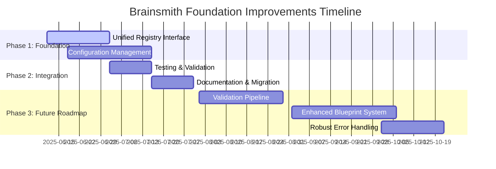
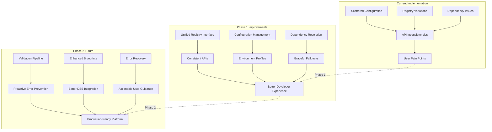

# Brainsmith Foundation Improvements - Master Implementation Plan

## Overview

This master plan integrates all foundation improvement initiatives to strengthen Brainsmith's architecture based on audit findings through clean refactoring. The plan prioritizes immediate consistency improvements via breaking changes while maintaining the proven three-layer architecture.

## Executive Summary

### Audit Results Context
- **Overall Success Rate**: 75% (9/12 test suites passed)
- **Architecture Assessment**: Three-layer separation is **helping robustness**, not hindering it
- **Primary Issues**: Implementation-level inconsistencies, not architectural flaws
- **Extension Readiness**: 100% (all registries, contrib directories, and plugin systems functional)

### Strategic Approach
1. **Strengthen the Foundation**: Address immediate inconsistencies (Unified Registry + Configuration Management)
2. **Document Future Growth**: Create roadmap for advanced improvements
3. **Preserve Architecture**: Maintain three-layer separation while improving interfaces

## Implementation Phases

## Phase 1: Immediate Foundation Strengthening (6 weeks)

### 1.1 Unified Registry Interface (Weeks 1-3) - **CLEAN REFACTOR**
**Objective**: Eliminate API inconsistencies across all registry systems through breaking changes

**Deliverables**:
- [ ] `BaseRegistry` abstract base class with standardized interface
- [ ] **BREAKING CHANGE**: Migration of all 5 registries (kernels, transforms, analysis, blueprints, hooks)
- [ ] Update all calling code to use new unified interface
- [ ] 95% test coverage for unified interface

**Key Benefits**:
- Clean, consistent `discover_components()` across all registries
- Standardized `find_components_by_type()` patterns
- Unified health checking and validation
- No deprecated methods or compatibility debt

### 1.2 Configuration Management with Environment Profiles (Weeks 2-5) - **CLEAN REFACTOR**
**Objective**: Replace scattered configuration with centralized, environment-aware system through breaking changes

**Deliverables**:
- [ ] `ConfigurationManager` with dev/test/prod profiles
- [ ] **BREAKING CHANGE**: Dependency handling and graceful fallbacks
- [ ] **BREAKING CHANGE**: Component integration via `ComponentConfigMixin`
- [ ] **BREAKING CHANGE**: Migration of DSE, FINN, and registry configurations

**Key Benefits**:
- Single environment variable switches all behavior
- Graceful handling of missing optional dependencies (qonnx, model_profiling)
- Environment-specific optimizations
- Clean, unified configuration across all components

### 1.3 Integration & Testing (Week 6)
**Objective**: Ensure systems work together and validate clean refactor

**Tasks**:
- [ ] End-to-end integration testing with new interfaces
- [ ] Performance benchmarking
- [ ] Update all audit tests to use new interfaces
- [ ] Complete documentation overhaul
- [ ] Update all examples and demos

## Phase 2: Future Roadmap Documentation (Ongoing)

### 2.1 Advanced Improvements (Already Documented)

**Validation Pipeline with Component Testing Framework**
- **Status**: Future expansion (documented in `BRAINSMITH_FOUNDATION_IMPROVEMENTS_ROADMAP.md`)
- **Timeline**: 8-9 weeks (after Phase 1 completion)
- **Benefits**: Catch integration issues before they reach users

**Enhanced Blueprint System with Templates and Validation**
- **Status**: Future expansion (documented in roadmap)
- **Timeline**: 6-7 weeks (can run parallel with validation pipeline)
- **Benefits**: Prevent blueprint configuration problems, better DSE integration

**Robust Error Handling with Recovery Strategies**
- **Status**: Future expansion (documented in roadmap)
- **Timeline**: 5-6 weeks (builds on other improvements)
- **Benefits**: Replace confusing errors with actionable guidance

## Integration Architecture

## Success Metrics

### Phase 1 Targets
- **API Consistency**: 100% (all registries use same method patterns)
- **Dependency Robustness**: 90% reduction in dependency-related failures
- **Configuration Coverage**: 100% of components use centralized configuration
- **Clean Codebase**: 0% deprecated methods or compatibility layers

### Long-term Targets  
- **Overall Test Success Rate**: 95%+ (from current 75%)
- **User-Reported Issues**: 80% reduction in "unclear error" reports
- **Development Velocity**: 50% faster onboarding for new contributors
- **Production Stability**: Zero configuration-related outages

## Implementation Approach

### Development Strategy
1. **Clean Refactor Approach**: Complete migration to new systems
2. **Breaking Change Management**: Clear communication and migration guides
3. **Extensive Testing**: Each phase includes comprehensive test suite
4. **Documentation First**: Update docs and examples with each change

### Risk Mitigation
1. **Comprehensive Testing**: Extensive test coverage before breaking changes
2. **Clear Migration Guides**: Step-by-step instructions for all breaking changes
3. **Performance Monitoring**: Benchmark before/after each change
4. **Stakeholder Communication**: Advance notice of all breaking changes

## Resource Requirements

### Phase 1 (6 weeks)
- **Development**: 1-2 senior engineers
- **Testing**: 1 QA engineer (weeks 4-6)
- **Documentation**: Technical writer (weeks 5-6)

### Phase 2 (Future)
- **Development**: 2-3 engineers per improvement
- **Architecture Review**: Technical leadership involvement
- **User Testing**: Beta program for advanced features

## Decision Points

### Critical Questions Resolved
1. **"Should we keep three-layer architecture?"** → ✅ **YES** - Audit proves it provides excellent failure isolation
2. **"What's the highest-impact improvement?"** → **Unified Registry Interface** - Affects all user interactions
3. **"How do we handle breaking changes?"** → **Clean refactor with comprehensive migration guides**

### Pending Decisions
1. **Timeline flexibility**: Can Phase 1 improvements be done in parallel?
2. **External dependency strategy**: Should we vendor dependencies or improve fallbacks?
3. **Future roadmap prioritization**: Which Phase 2 improvement should we tackle first?

## Communication Plan

### Internal Stakeholders
- **Week 1**: Kickoff meeting with engineering team
- **Week 3**: Progress review and adjustment
- **Week 6**: Phase 1 completion and handoff
- **Monthly**: Phase 2 roadmap reviews

### External Contributors
- **GitHub Issues**: Track progress publicly
- **Documentation**: Migration guides and tutorials
- **Community**: Regular updates in project communications

## Conclusion

This master plan addresses the foundation improvements needed to evolve Brainsmith from its current 75% success rate to a robust, production-ready platform. The three-layer architecture remains our strength - we're strengthening the interfaces between layers, not restructuring the layers themselves.

**Phase 1 delivers immediate value** by solving the API inconsistencies and dependency issues through clean refactoring. **Phase 2 provides a clear roadmap** for advanced improvements that will make Brainsmith a best-in-class FPGA development platform.

The approach is bold (clean refactor for long-term maintainability), targeted (fix specific pain points), and scalable (clean foundation for future growth).