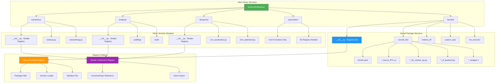

# BrainSmith Libraries Refactoring Plan: Registry Dictionary Pattern

## Executive Summary

This document outlines the complete refactoring of BrainSmith's component libraries to eliminate the problematic "magical discovery system" and replace it with an explicit Registry Dictionary Pattern. This change addresses critical issues including filesystem dependencies, silent failures, race conditions, and testing difficulties while maintaining simplicity for contributors.

## Current State Analysis

After analyzing all 5 libraries (`kernels/`, `transforms/`, `analysis/`, `blueprints/`, `automation/`), each implements the **problematic magical discovery pattern**:

### Critical Problems Identified:

1. **Filesystem Scanning Functions**:
   - `discover_all_kernels()` - scans directories for `kernel.yaml`
   - `discover_all_analysis_tools()` - scans for analysis tool packages  
   - `discover_all_automation_components()` - scans for automation tools
   - `discover_all_blueprints()` - scans for blueprint YAML files
   - `discover_all_transforms()` - scans for transform modules

2. **Complex Registry Classes**:
   - All inherit from `BaseRegistry` with complex discovery logic
   - Hidden filesystem dependencies
   - Global singleton instances (`_global_registry = None`)
   - Complex caching and health checking

3. **Runtime Discovery Issues**:
   - Components discovered at runtime based on filesystem layout
   - Silent failures when directories missing
   - Race conditions in concurrent access
   - Untestable due to filesystem dependencies

## Solution: Registry Dictionary Pattern

### **Phase 1: Kernels Library** (Most Critical)
**Target**: `brainsmith/libraries/kernels/`

**Before**:
```python
# kernels/functions.py - Line 18
def discover_all_kernels(additional_paths: Optional[List[str]] = None) -> Dict[str, KernelPackage]:
    # Scans filesystem for kernel.yaml files
    kernels = {}
    search_paths = []
    # ... complex filesystem scanning logic
```

**After**:
```python
# kernels/__init__.py
from .types import KernelPackage
from .package_loader import load_kernel_package
import yaml
from pathlib import Path

# Simple registry maps kernel names to their package directories
AVAILABLE_KERNELS = {
    "conv2d_hls": "conv2d_hls",
    "matmul_rtl": "matmul_rtl",
}

def get_kernel(name: str) -> KernelPackage:
    """Get kernel package by name. Fails fast if not found."""
    if name not in AVAILABLE_KERNELS:
        available = ", ".join(AVAILABLE_KERNELS.keys())
        raise KeyError(f"Kernel '{name}' not found. Available: {available}")
    
    package_dir = AVAILABLE_KERNELS[name]
    return load_kernel_package(package_dir)

def list_kernels() -> List[str]:
    """List all available kernel names."""
    return list(AVAILABLE_KERNELS.keys())

def get_kernel_files(name: str) -> Dict[str, str]:
    """Get all file paths for a kernel package."""
    if name not in AVAILABLE_KERNELS:
        raise KeyError(f"Kernel '{name}' not found")
    
    package_dir = AVAILABLE_KERNELS[name]
    package_path = Path(__file__).parent / package_dir
    manifest_path = package_path / "kernel.yaml"
    
    with open(manifest_path, 'r') as f:
        manifest = yaml.safe_load(f)
    
    # Resolve file paths relative to package directory
    files = {}
    for logical_name, filename in manifest.get("files", {}).items():
        files[logical_name] = str(package_path / filename)
    
    return files
```

**Generic Package Loader** (`kernels/package_loader.py`):
```python
import yaml
from pathlib import Path
from .types import KernelPackage

def load_kernel_package(package_dir: str) -> KernelPackage:
    """
    Generic loader that creates KernelPackage from any kernel.yaml.
    No custom loader code required per kernel!
    """
    package_path = Path(__file__).parent / package_dir
    manifest_path = package_path / "kernel.yaml"
    
    if not manifest_path.exists():
        raise FileNotFoundError(f"No kernel.yaml found in {package_path}")
    
    with open(manifest_path, 'r') as f:
        manifest = yaml.safe_load(f)
    
    # Create KernelPackage directly from manifest
    return KernelPackage(
        name=manifest.get("name", package_dir),
        operator_type=manifest.get("operator_type", "Unknown"),
        backend=manifest.get("backend", "Unknown"),
        version=manifest.get("version", "1.0.0"),
        author=manifest.get("author", ""),
        license=manifest.get("license", ""),
        description=manifest.get("description", ""),
        parameters=manifest.get("parameters", {}),
        files=manifest.get("files", {}),
        performance=manifest.get("performance", {}),
        validation=manifest.get("validation", {}),
        repository=manifest.get("repository", {}),
        package_path=str(package_path)
    )
```

**Migration Actions**:
- **DELETE**: `registry.py`, `functions.py` discovery logic
- **KEEP**: `types.py`, individual kernel implementations
- **REPLACE**: `discover_all_kernels()` → `list_kernels()`
- **REPLACE**: `get_kernel_by_name()` → `get_kernel()`

### **Phase 2: Transforms Library**
**Target**: `brainsmith/libraries/transforms/`

**New Structure**:
```python
# transforms/__init__.py
from .cleanup import cleanup_step, cleanup_advanced_step
from .streamlining import streamlining_step
from .hardware import infer_hardware_step

AVAILABLE_TRANSFORMS = {
    "cleanup": cleanup_step,
    "cleanup_advanced": cleanup_advanced_step,
    "streamlining": streamlining_step,
    "infer_hardware": infer_hardware_step,
}

def get_transform(name: str):
    """Get transform function by name. Fails fast if not found."""
    if name not in AVAILABLE_TRANSFORMS:
        available = ", ".join(AVAILABLE_TRANSFORMS.keys())
        raise KeyError(f"Transform '{name}' not found. Available: {available}")
    return AVAILABLE_TRANSFORMS[name]

def list_transforms() -> List[str]:
    """List all available transform names."""
    return list(AVAILABLE_TRANSFORMS.keys())
```

### **Phase 3: Analysis Library**
**Target**: `brainsmith/libraries/analysis/`

**New Structure**:
```python
# analysis/__init__.py  
from .profiling import roofline_analysis, RooflineProfiler
from .tools import generate_hw_kernel

AVAILABLE_ANALYSIS_TOOLS = {
    "roofline_analysis": roofline_analysis,
    "roofline_profiler": RooflineProfiler,
    "generate_hw_kernel": generate_hw_kernel,
}

def get_analysis_tool(name: str):
    """Get analysis tool by name. Fails fast if not found."""
    if name not in AVAILABLE_ANALYSIS_TOOLS:
        available = ", ".join(AVAILABLE_ANALYSIS_TOOLS.keys())
        raise KeyError(f"Analysis tool '{name}' not found. Available: {available}")
    return AVAILABLE_ANALYSIS_TOOLS[name]
```

### **Phase 4: Blueprints Library**  
**Target**: `brainsmith/libraries/blueprints/`

**New Structure**:
```python
# blueprints/__init__.py
from .cnn_accelerator import CNNAcceleratorBlueprint
from .bert_optimized import BertOptimizedBlueprint
from .mobilenet import MobileNetBlueprint

AVAILABLE_BLUEPRINTS = {
    "cnn_accelerator": CNNAcceleratorBlueprint,
    "bert_optimized": BertOptimizedBlueprint, 
    "mobilenet": MobileNetBlueprint,
}

def get_blueprint(name: str):
    """Get blueprint class by name. Fails fast if not found."""
    if name not in AVAILABLE_BLUEPRINTS:
        available = ", ".join(AVAILABLE_BLUEPRINTS.keys())
        raise KeyError(f"Blueprint '{name}' not found. Available: {available}")
    return AVAILABLE_BLUEPRINTS[name]
```

### **Phase 5: Automation Library**
**Target**: `brainsmith/libraries/automation/`

**New Structure**:
```python
# automation/__init__.py - Keep existing functions, remove registry
from .sweep import parameter_sweep, find_best, aggregate_stats
from .batch import batch_process

# Remove all registry-related imports and functions
# Keep only the core automation functions

__all__ = [
    'parameter_sweep',
    'batch_process', 
    'find_best',
    'aggregate_stats'
]
```

## Implementation Architecture



## Files to Delete (Annihilate)

### **Registry Files** - Complete Removal:
- `brainsmith/libraries/kernels/registry.py`
- `brainsmith/libraries/transforms/registry.py`
- `brainsmith/libraries/analysis/registry.py`
- `brainsmith/libraries/blueprints/registry.py`
- `brainsmith/libraries/automation/registry.py`
- `brainsmith/core/registry/base.py` (if no longer used)

### **Discovery Functions** - Replace with Dictionary Access:
- All `discover_all_*()` functions
- All `get_*_registry()` functions
- All `refresh_*_registry()` functions

## Folder Structure to Preserve

### **Keep Existing Organization**:
The current folder organization is excellent and should be preserved:

```
brainsmith/libraries/
├── kernels/
│   ├── __init__.py              # NEW: Registry dictionary
│   ├── conv2d_hls/              # KEEP: Complete package
│   │   ├── kernel.yaml          # KEEP: Manifest
│   │   ├── conv2d_source_RTL.sv # KEEP: RTL source
│   │   ├── conv2d_hw_custom_op.py # KEEP: HW custom op
│   │   ├── conv2d_rtl_backend.py  # KEEP: RTL backend
│   │   └── conv2d_wrapper.v       # KEEP: Wrapper
│   ├── matmul_rtl/              # KEEP: Complete package
│   ├── custom_ops/              # KEEP: Shared custom operations
│   ├── hw_sources/              # KEEP: Shared hardware sources
│   └── contrib/                 # KEEP: Community contributions
├── transforms/
│   ├── __init__.py              # NEW: Simple registry
│   ├── cleanup.py               # KEEP: Individual transform files
│   └── streamlining.py          # KEEP: Individual transform files
├── analysis/
│   ├── __init__.py              # NEW: Simple registry
│   ├── profiling/               # KEEP: Analysis tool groups
│   └── tools/                   # KEEP: Analysis tool groups
├── blueprints/
│   ├── __init__.py              # NEW: Simple registry
│   ├── cnn_accelerator.py       # KEEP: Individual blueprints
│   └── bert_optimized.py        # KEEP: Individual blueprints
└── automation/
    ├── __init__.py              # UPDATED: Remove registry, keep functions
    ├── sweep.py                 # KEEP: Core automation functions
    └── batch.py                 # KEEP: Core automation functions
```

**Key Principles**:
- **Kernels**: Complex packages → Package registry with loaders
- **Other Libraries**: Simple components → Direct function/class registry
- **Folder Organization**: Preserved for logical grouping
- **Contrib Directories**: Maintained for community contributions

## Implementation Timeline

1. **Week 1**: Kernels library (most critical, used by core)
2. **Week 2**: Transforms library (complex due to steps system)  
3. **Week 3**: Analysis library (straightforward)
4. **Week 4**: Blueprints library (straightforward)
5. **Week 5**: Automation library (remove registry, keep functions)
6. **Week 6**: Integration testing and cleanup

---

# How to Add Custom Components: Complete Guide

## Overview for Contributors

After the refactoring, adding custom components to BrainSmith libraries becomes extremely simple and predictable. Contributors follow a **two-step process**:

1. **Create component file**
2. **Add to registry dictionary**

No complex registration APIs, no filesystem scanning magic, no hidden dependencies.

## 1. Adding a Custom Kernel Package

**Important**: Kernels are complete packages with multiple files, not single Python classes. Each kernel package contains RTL sources, Python backends, wrappers, and manifests.

### Step 1: Create Kernel Package Directory Structure

Create the complete package structure:

```bash
brainsmith/libraries/kernels/my_awesome_conv/
├── kernel.yaml                    # Package manifest (required)
├── my_awesome_conv_source_RTL.sv  # RTL source code
├── my_awesome_conv_hw_custom_op.py # Python HW custom operation
├── my_awesome_conv_rtl_backend.py  # RTL backend implementation
├── my_awesome_conv_wrapper.v       # Verilog wrapper
└── tests/                          # Optional test files
    ├── test_basic.py
    └── test_performance.py
```

### Step 2: Create Kernel Manifest

Create `brainsmith/libraries/kernels/my_awesome_conv/kernel.yaml`:

```yaml
name: "my_awesome_conv"
operator_type: "Convolution"
backend: "HLS"
version: "1.0.0"
author: "Your Name"
license: "MIT"
description: "Ultra-optimized convolution kernel for edge inference"

# Parameter specifications
parameters:
  pe_range: [1, 64]
  simd_range: [2, 32]
  supported_datatypes: ["int8", "int16"]
  memory_modes: ["internal", "external"]

# File mappings (logical name -> actual file path)
files:
  rtl_source: "my_awesome_conv_source_RTL.sv"
  hw_custom_op: "my_awesome_conv_hw_custom_op.py"
  rtl_backend: "my_awesome_conv_rtl_backend.py"
  rtl_wrapper: "my_awesome_conv_wrapper.v"

# Performance characteristics
performance:
  base_throughput: 5000
  base_latency: 4
  resource_estimates:
    luts: 8000
    dsps: 32
    brams: 6
  benchmarks:
    - model: "custom_cnn"
      throughput: 4800
      latency: 5

# Validation and testing
validation:
  test_cases: ["test_basic.py", "test_performance.py"]
  verified: true
  compatibility: ["finn-0.9+", "vivado-2022.1+"]
  last_tested: "2024-12-01"

# Repository information
repository:
  url: "https://github.com/your-name/my-awesome-conv"
  commit: "main"
```

### Step 3: Implement Kernel Files

Create the actual implementation files:

**RTL Source** (`my_awesome_conv_source_RTL.sv`):
```systemverilog
// Your SystemVerilog RTL implementation
module my_awesome_conv #(
    parameter PE = 16,
    parameter SIMD = 8,
    parameter DATA_WIDTH = 8
) (
    input  logic clk,
    input  logic rst_n,
    // Add your interface signals
    input  logic [DATA_WIDTH-1:0] data_in,
    output logic [DATA_WIDTH-1:0] data_out,
    // Control signals
    input  logic start,
    output logic done
);
    // Your RTL implementation here
endmodule
```

**Python HW Custom Op** (`my_awesome_conv_hw_custom_op.py`):
```python
from finn.core.datatype import DataType
from finn.custom_op.fpgadataflow.hwcustomop import HWCustomOp

class MyAwesomeConv_HW(HWCustomOp):
    """Hardware custom operation for MyAwesome convolution."""
    
    def get_nodeattr_types(self):
        return {
            "PE": ("i", True, 0),
            "SIMD": ("i", True, 0),
            "DataType": ("s", True, ""),
        }
    
    def make_shape_compatible_op(self, model):
        # Implementation for shape compatibility
        pass
    
    def infer_node_datatype(self, model):
        # Implementation for datatype inference
        pass
    
    def verify_node(self):
        # Implementation for node verification
        pass
    
    def get_input_datatype(self):
        return DataType[self.get_nodeattr("DataType")]
    
    def get_output_datatype(self):
        return self.get_input_datatype()
```

### Step 4: Register in Main Dictionary

Edit `brainsmith/libraries/kernels/__init__.py`:

```python
# Simple registry maps kernel names to their package directories
AVAILABLE_KERNELS = {
    "conv2d_hls": "conv2d_hls",
    "matmul_rtl": "matmul_rtl",
    "my_awesome_conv": "my_awesome_conv",  # ADD THIS LINE
}
```

### Step 5: Test Your Kernel

```python
from brainsmith.libraries.kernels import get_kernel, list_kernels

# Check that your kernel is available
kernels = list_kernels()
assert "my_awesome_conv" in kernels

# Get your kernel
my_kernel = get_kernel("my_awesome_conv")
assert my_kernel.name == "my_awesome_conv"

# Test compatibility
requirements = {'operator_type': 'Convolution', 'max_pe': 32}
assert my_kernel.is_compatible_with(requirements)
```

**That's it!** Your kernel is now available throughout BrainSmith.

## 2. Adding a Custom Transform

### Step 1: Create Transform Function

Create: `brainsmith/libraries/transforms/my_optimization.py`

```python
import logging
from typing import Any, Dict

logger = logging.getLogger(__name__)

def my_custom_optimization_step(model, config: Dict[str, Any]):
    """
    Apply custom optimization patterns to the model.
    
    Args:
        model: ONNX or FINN model to transform
        config: Configuration parameters
        
    Returns:
        Transformed model
    """
    logger.info("Applying my custom optimization step")
    
    # Your custom optimization logic here
    optimized_model = apply_my_optimizations(model, config)
    
    # Validation
    if not validate_optimization_results(optimized_model):
        raise ValueError("Custom optimization validation failed")
    
    logger.info("Custom optimization completed successfully")
    return optimized_model

def apply_my_optimizations(model, config):
    """Your actual optimization implementation."""
    # Implementation details here
    return model

def validate_optimization_results(model):
    """Validate that optimization didn't break the model."""
    # Validation logic here
    return True
```

### Step 2: Register in Dictionary

Edit `brainsmith/libraries/transforms/__init__.py`:

```python
from .cleanup import cleanup_step, cleanup_advanced_step
from .streamlining import streamlining_step
from .hardware import infer_hardware_step
from .my_optimization import my_custom_optimization_step  # ADD THIS

AVAILABLE_TRANSFORMS = {
    "cleanup": cleanup_step,
    "cleanup_advanced": cleanup_advanced_step,
    "streamlining": streamlining_step,
    "infer_hardware": infer_hardware_step,
    "my_custom_optimization": my_custom_optimization_step,  # ADD THIS
}
```

### Step 3: Use Your Transform

```python
from brainsmith.libraries.transforms import get_transform

# Get your transform
my_transform = get_transform("my_custom_optimization")

# Apply to model
optimized_model = my_transform(model, config={'optimization_level': 'aggressive'})
```

## 3. Adding a Custom Analysis Tool

### Step 1: Create Analysis Tool

Create: `brainsmith/libraries/analysis/power_estimator.py`

```python
from typing import Dict, Any, Optional
import logging

logger = logging.getLogger(__name__)

class PowerEstimator:
    """Custom power estimation tool for FPGA designs."""
    
    def __init__(self):
        self.analysis_type = "power_estimation"
        self.name = "power_estimator"
        self.description = "Estimates power consumption for FPGA accelerators"
    
    def estimate_power(self, model_config: Dict[str, Any], 
                      hardware_config: Dict[str, Any]) -> Dict[str, float]:
        """
        Estimate power consumption for the given configuration.
        
        Args:
            model_config: Model architecture and parameters
            hardware_config: Target hardware specifications
            
        Returns:
            Power estimation results in watts
        """
        logger.info("Starting power estimation analysis")
        
        # Your power estimation algorithm
        static_power = self._estimate_static_power(hardware_config)
        dynamic_power = self._estimate_dynamic_power(model_config, hardware_config)
        
        results = {
            'total_power_w': static_power + dynamic_power,
            'static_power_w': static_power,
            'dynamic_power_w': dynamic_power,
            'power_efficiency_gops_per_w': self._calculate_efficiency(model_config, dynamic_power)
        }
        
        logger.info(f"Power estimation completed: {results['total_power_w']:.2f}W total")
        return results
    
    def _estimate_static_power(self, hw_config: Dict[str, Any]) -> float:
        """Estimate static power consumption."""
        device = hw_config.get('device', 'zynq')
        base_power = {'zynq': 1.5, 'ultrascale': 3.0, 'versal': 5.0}
        return base_power.get(device, 2.0)
    
    def _estimate_dynamic_power(self, model_config: Dict[str, Any], 
                               hw_config: Dict[str, Any]) -> float:
        """Estimate dynamic power from switching activity."""
        # Simplified power model
        ops_per_sec = model_config.get('ops_per_sec', 1000000)
        frequency_mhz = hw_config.get('frequency_mhz', 200)
        
        # Power scales with activity
        dynamic_power = (ops_per_sec / 1000000) * (frequency_mhz / 200) * 2.5
        return dynamic_power
    
    def _calculate_efficiency(self, model_config: Dict[str, Any], power: float) -> float:
        """Calculate GOPS per watt efficiency."""
        gops = model_config.get('ops_per_sec', 0) / 1000000000
        return gops / power if power > 0 else 0

# Convenience function
def power_analysis(model_config: Dict[str, Any], 
                  hardware_config: Dict[str, Any]) -> Dict[str, float]:
    """Quick power analysis function."""
    estimator = PowerEstimator()
    return estimator.estimate_power(model_config, hardware_config)
```

### Step 2: Register in Dictionary

Edit `brainsmith/libraries/analysis/__init__.py`:

```python
from .profiling import roofline_analysis, RooflineProfiler
from .tools import generate_hw_kernel
from .power_estimator import PowerEstimator, power_analysis  # ADD THIS

AVAILABLE_ANALYSIS_TOOLS = {
    "roofline_analysis": roofline_analysis,
    "roofline_profiler": RooflineProfiler,
    "generate_hw_kernel": generate_hw_kernel,
    "power_estimator": PowerEstimator,        # ADD THIS
    "power_analysis": power_analysis,         # ADD THIS
}
```

### Step 3: Use Your Analysis Tool

```python
from brainsmith.libraries.analysis import get_analysis_tool

# Get your tool
power_tool = get_analysis_tool("power_analysis")

# Run analysis
power_results = power_tool(
    model_config={'ops_per_sec': 2000000},
    hardware_config={'device': 'ultrascale', 'frequency_mhz': 250}
)

print(f"Estimated power: {power_results['total_power_w']:.2f}W")
```

## 4. Adding a Custom Blueprint

### Step 1: Create Blueprint Class

Create: `brainsmith/libraries/blueprints/edge_inference.py`

```python
from typing import Dict, Any, List
from dataclasses import dataclass

@dataclass
class EdgeInferenceBlueprint:
    """Optimized blueprint for edge inference scenarios."""
    
    name: str = "edge_inference"
    version: str = "1.0.0"
    description: str = "Ultra-low power inference for edge devices"
    model_type: str = "CNN"
    target_platform: str = "Zynq-7000"
    
    def __post_init__(self):
        self.parameters = {
            'pe_count': {
                'type': 'integer',
                'range': [2, 16],
                'default': 8,
                'description': 'Processing elements (limited for edge)'
            },
            'simd_width': {
                'type': 'integer', 
                'range': [2, 8],
                'default': 4,
                'description': 'SIMD width (limited for edge)'
            },
            'power_mode': {
                'type': 'categorical',
                'values': ['ultra_low', 'low', 'balanced'],
                'default': 'low',
                'description': 'Power optimization mode'
            },
            'memory_optimization': {
                'type': 'boolean',
                'default': True,
                'description': 'Enable aggressive memory optimization'
            }
        }
        
        self.targets = {
            'power': {
                'direction': 'minimize',
                'priority': 'high',
                'target_value': 2.0,  # 2W target
                'weight': 0.6
            },
            'latency': {
                'direction': 'minimize',
                'priority': 'high', 
                'target_value': 50.0,  # 50ms target
                'weight': 0.4
            }
        }
        
        self.constraints = {
            'max_lut_util': 0.70,    # Conservative for edge
            'max_dsp_util': 0.80,    # Conservative for edge
            'max_bram_util': 0.60,   # Conservative for edge
            'max_power_w': 3.0,      # Hard power limit
            'min_frequency_mhz': 50  # Minimum viable frequency
        }
    
    def validate_configuration(self, config: Dict[str, Any]) -> List[str]:
        """Validate user configuration against blueprint constraints."""
        errors = []
        
        # Check power constraints
        if config.get('estimated_power', 0) > self.constraints['max_power_w']:
            errors.append(f"Power {config['estimated_power']}W exceeds limit {self.constraints['max_power_w']}W")
        
        # Check resource utilization
        for resource in ['lut_util', 'dsp_util', 'bram_util']:
            limit_key = f'max_{resource}'
            if limit_key in self.constraints:
                if config.get(resource, 0) > self.constraints[limit_key]:
                    errors.append(f"{resource} {config[resource]} exceeds limit {self.constraints[limit_key]}")
        
        return errors
    
    def get_recommended_settings(self, use_case: str = 'balanced') -> Dict[str, Any]:
        """Get recommended parameter settings for specific use cases."""
        if use_case == 'ultra_low_power':
            return {
                'pe_count': 4,
                'simd_width': 2,
                'power_mode': 'ultra_low',
                'memory_optimization': True,
                'clock_frequency': 50
            }
        elif use_case == 'low_latency':
            return {
                'pe_count': 16,
                'simd_width': 8,
                'power_mode': 'balanced',
                'memory_optimization': False,
                'clock_frequency': 100
            }
        else:  # balanced
            return {
                'pe_count': 8,
                'simd_width': 4,
                'power_mode': 'low',
                'memory_optimization': True,
                'clock_frequency': 75
            }
```

### Step 2: Register in Dictionary

Edit `brainsmith/libraries/blueprints/__init__.py`:

```python
from .cnn_accelerator import CNNAcceleratorBlueprint
from .bert_optimized import BertOptimizedBlueprint
from .mobilenet import MobileNetBlueprint
from .edge_inference import EdgeInferenceBlueprint  # ADD THIS

AVAILABLE_BLUEPRINTS = {
    "cnn_accelerator": CNNAcceleratorBlueprint,
    "bert_optimized": BertOptimizedBlueprint, 
    "mobilenet": MobileNetBlueprint,
    "edge_inference": EdgeInferenceBlueprint,  # ADD THIS
}
```

### Step 3: Use Your Blueprint

```python
from brainsmith.libraries.blueprints import get_blueprint

# Get your blueprint
edge_blueprint = get_blueprint("edge_inference")

# Get recommended settings
settings = edge_blueprint.get_recommended_settings('ultra_low_power')
print(f"Recommended PE count: {settings['pe_count']}")

# Validate a configuration
config = {'estimated_power': 2.5, 'lut_util': 0.65}
errors = edge_blueprint.validate_configuration(config)
if errors:
    print("Configuration issues:", errors)
else:
    print("Configuration is valid for edge inference")
```

## 5. Adding Custom Automation Functions

### Step 1: Create Automation Function

Create: `brainsmith/libraries/automation/custom_sweep.py`

```python
from typing import Dict, List, Any, Callable
import logging
from concurrent.futures import ThreadPoolExecutor, as_completed

logger = logging.getLogger(__name__)

def advanced_parameter_sweep(
    model_path: str,
    blueprint_path: str,
    parameter_ranges: Dict[str, List[Any]],
    optimization_targets: List[str] = ['throughput'],
    early_stopping: bool = True,
    max_workers: int = 4
) -> List[Dict[str, Any]]:
    """
    Advanced parameter sweep with early stopping and optimization targeting.
    
    Args:
        model_path: Path to ONNX model
        blueprint_path: Path to blueprint YAML
        parameter_ranges: Dictionary of parameter names to value lists
        optimization_targets: List of metrics to optimize for
        early_stopping: Stop early if convergence detected
        max_workers: Maximum parallel workers
        
    Returns:
        List of results sorted by optimization targets
    """
    from brainsmith.core.api import forge
    
    # Generate all parameter combinations
    combinations = generate_parameter_combinations(parameter_ranges)
    
    logger.info(f"Starting advanced sweep with {len(combinations)} combinations")
    
    results = []
    best_score = float('-inf')
    stagnation_count = 0
    
    with ThreadPoolExecutor(max_workers=max_workers) as executor:
        # Submit all jobs
        future_to_params = {}
        for params in combinations:
            future = executor.submit(run_single_evaluation, model_path, blueprint_path, params)
            future_to_params[future] = params
        
        # Process results as they complete
        for future in as_completed(future_to_params):
            params = future_to_params[future]
            try:
                result = future.result()
                result['parameters'] = params
                results.append(result)
                
                # Calculate optimization score
                score = calculate_optimization_score(result, optimization_targets)
                
                # Early stopping logic
                if early_stopping:
                    if score > best_score:
                        best_score = score
                        stagnation_count = 0
                        logger.info(f"New best score: {score:.4f}")
                    else:
                        stagnation_count += 1
                        
                    if stagnation_count >= 10:  # Stop after 10 non-improving results
                        logger.info("Early stopping triggered - convergence detected")
                        # Cancel remaining futures
                        for remaining_future in future_to_params:
                            remaining_future.cancel()
                        break
                        
            except Exception as e:
                logger.warning(f"Evaluation failed for {params}: {e}")
    
    # Sort results by optimization score
    results.sort(key=lambda x: calculate_optimization_score(x, optimization_targets), reverse=True)
    
    logger.info(f"Advanced sweep completed with {len(results)} successful evaluations")
    return results

def generate_parameter_combinations(parameter_ranges: Dict[str, List[Any]]) -> List[Dict[str, Any]]:
    """Generate all combinations of parameters."""
    import itertools
    
    keys = list(parameter_ranges.keys())
    values = list(parameter_ranges.values())
    
    combinations = []
    for combination in itertools.product(*values):
        combinations.append(dict(zip(keys, combination)))
    
    return combinations

def run_single_evaluation(model_path: str, blueprint_path: str, params: Dict[str, Any]) -> Dict[str, Any]:
    """Run a single forge evaluation with given parameters."""
    from brainsmith.core.api import forge
    
    try:
        result = forge(model_path, blueprint_path, constraints=params)
        return result
    except Exception as e:
        # Return failure result
        return {
            'success': False,
            'error': str(e),
            'metrics': {'performance': {}, 'resources': {}}
        }

def calculate_optimization_score(result: Dict[str, Any], targets: List[str]) -> float:
    """Calculate a composite optimization score."""
    if not result.get('success', True):
        return float('-inf')
    
    metrics = result.get('metrics', {})
    performance = metrics.get('performance', {})
    resources = metrics.get('resources', {})
    
    score = 0.0
    for target in targets:
        if target == 'throughput':
            score += performance.get('throughput_ops_sec', 0) / 1000000  # Normalize
        elif target == 'latency':
            latency = performance.get('latency_ms', 1000)
            score += (1000 - latency) / 1000  # Invert latency (lower is better)
        elif target == 'efficiency':
            lut_util = resources.get('lut_utilization', 1.0)
            score += (1.0 - lut_util)  # Reward lower utilization
    
    return score / len(targets)  # Average score
```

### Step 2: Register in Module

Edit `brainsmith/libraries/automation/__init__.py`:

```python
from .sweep import parameter_sweep, find_best, aggregate_stats
from .batch import batch_process
from .custom_sweep import advanced_parameter_sweep  # ADD THIS

__all__ = [
    'parameter_sweep',
    'batch_process', 
    'find_best',
    'aggregate_stats',
    'advanced_parameter_sweep',  # ADD THIS
]
```

### Step 3: Use Your Custom Automation

```python
from brainsmith.libraries.automation import advanced_parameter_sweep

# Use advanced sweep with early stopping
results = advanced_parameter_sweep(
    'model.onnx',
    'blueprint.yaml',
    {
        'pe_count': [4, 8, 16, 32, 64],
        'simd_width': [2, 4, 8, 16],
        'memory_mode': ['internal', 'external']
    },
    optimization_targets=['throughput', 'efficiency'],
    early_stopping=True,
    max_workers=4
)

print(f"Best configuration: {results[0]['parameters']}")
print(f"Best score: {results[0]['optimization_score']}")
```

---

# Benefits Summary

## For Contributors

### **Before Refactoring** (Magical Discovery):
1. ❌ Create component file
2. ❌ Create `kernel.yaml` manifest
3. ❌ Put in correct directory structure
4. ❌ Hope filesystem scanning finds it
5. ❌ Debug mysterious discovery failures
6. ❌ Deal with race conditions and caching issues

### **After Refactoring** (Registry Dictionary):
1. ✅ Create component file
2. ✅ Add one line to dictionary
3. ✅ **Done!**

## For Maintainers

### **Testing Benefits**:
- ✅ **Unit testable**: No filesystem dependencies
- ✅ **Mockable**: Easy to inject test components
- ✅ **Predictable**: No race conditions or caching issues
- ✅ **Fast**: No filesystem scanning overhead

### **Debugging Benefits**:
- ✅ **Clear errors**: "Component 'xyz' not found. Available: a, b, c"
- ✅ **Explicit dependencies**: All imports visible in `__init__.py`
- ✅ **No silent failures**: Fail-fast on missing components
- ✅ **IDE support**: Full autocomplete and static analysis

### **Performance Benefits**:
- ✅ **Instant startup**: No directory scanning
- ✅ **O(1) lookup**: Dictionary access vs filesystem traversal
- ✅ **No caching complexity**: No cache invalidation needed
- ✅ **Deterministic**: Same behavior every time

This refactoring **completely eliminates the magical discovery system** while maintaining the simplicity that makes BrainSmith accessible to FPGA developers and data scientists. The explicit registration approach ensures predictable behavior while keeping contribution barriers low.