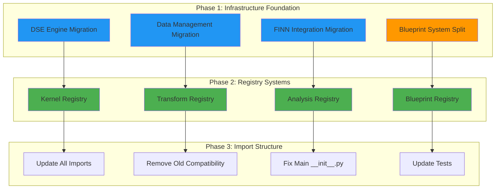
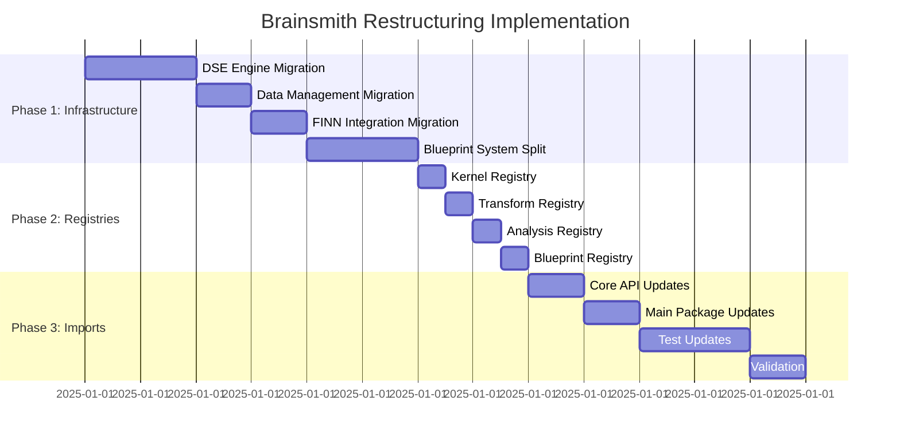

# Brainsmith Restructuring Completion Plan
**Complete Infrastructure Rebuild with Registry Systems**

---

## 🎯 **Implementation Strategy**

**Approach**: Complete hard pivot to new structure with no backward compatibility
- ✅ **Clean Architecture**: Proper three-layer separation
- ❌ **No Legacy Support**: Remove all old import paths
- 🔧 **Registry Systems**: Include Phase 2 registry implementation
- 📊 **Enhanced Core Metrics**: Ensure full functionality in core layer

---

## 📋 **Current State Analysis**

### **✅ Successfully Implemented**
- Core layer (`brainsmith/core/`) - 95% complete
- Libraries layer (`brainsmith/libraries/`) - 85% complete  
- Basic infrastructure structure exists

### **❌ Critical Missing Components**
- Complete DSE engine infrastructure
- Data management system
- FINN integration layer
- Blueprint system properly split
- Registry systems for libraries
- Proper import structure

---

## 🏗️ **Implementation Architecture**



---

## 📁 **Target Architecture Structure**

### **Final Directory Structure**
```
brainsmith/
├── core/                          # ✅ Keep as-is, enhance metrics
│   ├── api.py                     # [KEEP]
│   ├── cli.py                     # [KEEP]
│   ├── metrics.py                 # [ENHANCE] - Add missing functionality
│   └── types.py                   # [NEW] - Consolidated core types
│
├── infrastructure/                # 🔧 Complete rebuild
│   ├── dse/                       # Complete DSE engine
│   │   ├── __init__.py            # [UPDATE]
│   │   ├── design_space.py        # [KEEP] 
│   │   ├── engine.py              # [NEW] ← retrieved_old_stuff/dse/functions.py
│   │   ├── helpers.py             # [NEW] ← retrieved_old_stuff/dse/helpers.py
│   │   ├── types.py               # [NEW] ← retrieved_old_stuff/dse/types.py
│   │   ├── interface.py           # [NEW] - Main DSE interface
│   │   └── blueprint_manager.py   # [NEW] - Blueprint → Design Space
│   ├── data/                      # Complete data management
│   │   ├── __init__.py            # [UPDATE]
│   │   ├── collection.py          # [NEW] ← retrieved_old_stuff/data/functions.py
│   │   ├── export.py              # [NEW] ← retrieved_old_stuff/data/export.py
│   │   ├── types.py               # [NEW] ← retrieved_old_stuff/data/types.py
│   │   └── management.py          # [NEW] - Data lifecycle
│   ├── finn/                      # Complete FINN integration
│   │   ├── __init__.py            # [UPDATE]
│   │   ├── interface.py           # [NEW] ← retrieved_old_stuff/finn/interface.py
│   │   ├── types.py               # [NEW] ← retrieved_old_stuff/finn/types.py
│   │   └── finn_interface.py      # [KEEP] - Core FINN interface
│   └── hooks/                     # Enhanced hooks system
│       ├── __init__.py            # [KEEP]
│       ├── events.py              # [KEEP]
│       ├── types.py               # [KEEP]
│       ├── registry.py            # [NEW] - Plugin registry
│       └── plugins/               # [KEEP]
│
├── libraries/                     # 🎯 Add blueprint library + registries
│   ├── blueprints/                # [NEW] - Blueprint library
│   │   ├── __init__.py            # Blueprint collection interface
│   │   ├── registry.py            # Blueprint discovery system
│   │   ├── yaml/                  # [MOVE] from infrastructure/blueprint/yaml/
│   │   │   ├── bert_simple.yaml
│   │   │   ├── bert_extensible.yaml
│   │   │   └── bert.yaml
│   │   ├── templates/             # [NEW] - Blueprint templates
│   │   │   ├── minimal.yaml
│   │   │   ├── performance.yaml
│   │   │   └── efficiency.yaml
│   │   └── contrib/               # [NEW] - Community blueprints
│   ├── kernels/                   # [ENHANCE] - Add registry
│   │   ├── registry.py            # [NEW] - Kernel discovery
│   │   └── [existing files...]
│   ├── transforms/                # [ENHANCE] - Add registry
│   │   ├── registry.py            # [NEW] - Transform discovery
│   │   └── [existing files...]
│   ├── analysis/                  # [ENHANCE] - Add registry
│   │   ├── registry.py            # [NEW] - Analysis tool discovery
│   │   └── [existing files...]
│   └── automation/                # [ENHANCE] - Add registry
│       ├── registry.py            # [NEW] - Automation tool discovery
│       └── [existing files...]
```

---

## 🔧 **Phase 1: Infrastructure Foundation**

### **1.1 DSE Engine Migration**
**Objective**: Complete the DSE infrastructure with full functionality

**Actions**:
1. **Move retrieved DSE components**:
   - `retrieved_old_stuff/dse/functions.py` → `brainsmith/infrastructure/dse/engine.py`
   - `retrieved_old_stuff/dse/helpers.py` → `brainsmith/infrastructure/dse/helpers.py`
   - `retrieved_old_stuff/dse/types.py` → `brainsmith/infrastructure/dse/types.py`

2. **Create DSE interface** (`infrastructure/dse/interface.py`):
   ```python
   from .engine import parameter_sweep, batch_evaluate, find_best_result
   from .types import DSEConfiguration, DSEResult
   from .design_space import DesignSpace
   
   class DSEInterface:
       def __init__(self, config: DSEConfiguration):
           self.config = config
       
       def explore_design_space(self, model_path: str, stages: List[str]) -> List[DSEResult]:
           return parameter_sweep(model_path, self.config.blueprint_path, 
                                self.config.parameter_space, self.config)
   ```

3. **Create blueprint manager** (`infrastructure/dse/blueprint_manager.py`):
   ```python
   from ..libraries.blueprints import load_blueprint_yaml
   from .design_space import DesignSpace
   
   def convert_blueprint_to_design_space(blueprint_data: Dict[str, Any]) -> DesignSpace:
       # Convert blueprint to DesignSpace object
   
   def load_and_validate_blueprint(blueprint_path: str) -> Dict[str, Any]:
       # Load from libraries/blueprints and validate
   ```

### **1.2 Data Management Migration**
**Objective**: Complete data collection and export infrastructure

**Actions**:
1. **Move data components**:
   - `retrieved_old_stuff/data/functions.py` → `brainsmith/infrastructure/data/collection.py`
   - `retrieved_old_stuff/data/export.py` → `brainsmith/infrastructure/data/export.py`
   - `retrieved_old_stuff/data/types.py` → `brainsmith/infrastructure/data/types.py`

2. **Create data management** (`infrastructure/data/management.py`):
   ```python
   from .collection import collect_build_metrics, collect_dse_metrics
   from .export import export_metrics, export_analysis
   
   class DataManager:
       def collect_and_export(self, build_result, export_path: str):
           metrics = collect_build_metrics(build_result)
           export_metrics(metrics, export_path)
   ```

### **1.3 FINN Integration Migration**
**Objective**: Complete FINN abstraction layer

**Actions**:
1. **Move FINN components**:
   - `retrieved_old_stuff/finn/interface.py` → `brainsmith/infrastructure/finn/interface.py`
   - `retrieved_old_stuff/finn/types.py` → `brainsmith/infrastructure/finn/types.py`

2. **Update FINN __init__.py**:
   ```python
   from .interface import FINNInterface, build_accelerator
   from .types import FINNConfig, FINNResult
   from .finn_interface import FINNInterface as CoreFINNInterface
   ```

### **1.4 Blueprint System Split**
**Objective**: Split blueprints into library collection + DSE management

**Actions**:
1. **Create blueprint library** (`libraries/blueprints/`):
   - Move `infrastructure/blueprint/yaml/` → `libraries/blueprints/yaml/`
   - Create blueprint collection interface
   - Add blueprint templates

2. **Move blueprint functions to DSE**:
   - `infrastructure/blueprint/functions.py` → `infrastructure/dse/blueprint_functions.py`
   - Update imports throughout codebase

3. **Remove old blueprint directory**:
   - Delete `brainsmith/infrastructure/blueprint/`

---

## 🔧 **Phase 2: Registry Systems**

### **2.1 Library Registry Pattern**
**Standard registry interface for all libraries**:

```python
# Example: libraries/kernels/registry.py
class KernelRegistry:
    def __init__(self):
        self._kernels = {}
        self._discover_kernels()
    
    def _discover_kernels(self):
        # Auto-discover kernels in directory
        
    def register_kernel(self, name: str, kernel_class):
        self._kernels[name] = kernel_class
    
    def get_kernel(self, name: str):
        return self._kernels.get(name)
    
    def list_kernels(self) -> List[str]:
        return list(self._kernels.keys())

# Global registry instance
kernel_registry = KernelRegistry()
```

### **2.2 Registry Implementation Plan**

| Library | Registry File | Discovers | Exports |
|---------|---------------|-----------|----------|
| `kernels` | `registry.py` | `*.py` files with kernel classes | `kernel_registry` |
| `transforms` | `registry.py` | `steps/*.py` and `operations/*.py` | `transform_registry` |
| `analysis` | `registry.py` | `profiling/*.py` and `tools/*.py` | `analysis_registry` |
| `automation` | `registry.py` | `*.py` files with automation functions | `automation_registry` |
| `blueprints` | `registry.py` | `yaml/*.yaml` files | `blueprint_registry` |

---

## 🔧 **Phase 3: Import Structure Cleanup**

### **3.1 Core API Import Updates**
**Update `brainsmith/core/api.py`**:
```python
# OLD (broken imports):
from ..blueprints.functions import load_blueprint_yaml  # ❌ 

# NEW (correct imports):
from ..infrastructure.dse.blueprint_functions import load_blueprint_yaml  # ✅
from ..infrastructure.dse import DSEInterface, DSEConfiguration  # ✅
from ..infrastructure.data import collect_build_metrics  # ✅
from ..infrastructure.finn import build_accelerator  # ✅
```

### **3.2 Main Package Import Updates**
**Update `brainsmith/__init__.py`**:
```python
# Remove all old compatibility imports
# Add clean imports from new structure
from .core.api import forge, validate_blueprint
from .infrastructure.dse import DesignSpace, DesignPoint, ParameterDefinition
from .infrastructure.dse import DSEInterface, DSEConfiguration

# Library registries
from .libraries.kernels.registry import kernel_registry
from .libraries.transforms.registry import transform_registry
from .libraries.analysis.registry import analysis_registry
from .libraries.blueprints.registry import blueprint_registry
```

### **3.3 Test Import Updates**
**Update all test files**:
- `new_tests/core/test_forge_api.py`: Update blueprint imports
- `new_tests/core/test_validation.py`: Update validation imports
- All other test files: Update to new import structure

---

## 📊 **Enhanced Core Metrics**

### **Ensure `brainsmith/core/metrics.py` Completeness**
**Required functionality**:
1. ✅ **DSEMetrics class** - Currently implemented
2. ✅ **PerformanceMetrics class** - Currently implemented  
3. ✅ **ResourceMetrics class** - Currently implemented
4. 🔧 **Add missing utilities**:
   ```python
   # Add to core/metrics.py
   def create_metrics_from_build_result(build_result: Any) -> DSEMetrics:
       """Create DSEMetrics from any build result format"""
       
   def aggregate_dse_metrics(metrics_list: List[DSEMetrics]) -> DSEMetrics:
       """Aggregate multiple DSE metrics into summary"""
   ```

---

## 🎯 **Implementation Execution Plan**

### **Step-by-Step Implementation**



### **Detailed Implementation Steps**

**Phase 1 (6 hours)**:
1. Create new directory structure
2. Move retrieved components to correct locations
3. Update all internal imports
4. Split blueprint system
5. Remove old blueprint directory

**Phase 2 (2 hours)**:
1. Implement registry pattern for all libraries
2. Add auto-discovery functionality
3. Update library __init__.py files
4. Test registry functionality

**Phase 3 (4 hours)**:
1. Update core API imports
2. Update main package imports  
3. Update all test imports
4. Run full test suite validation
5. Fix any remaining import issues

**Total Estimated Time: 12 hours**

---

## ✅ **Success Criteria**

### **Functional Requirements**
1. ✅ **forge() function works** with new structure
2. ✅ **All tests pass** with updated imports
3. ✅ **Blueprint system works** from new locations
4. ✅ **DSE engine functional** with complete infrastructure
5. ✅ **Registry systems operational** for all libraries

### **Architectural Requirements**
1. ✅ **Clean three-layer separation** (Core → Infrastructure → Libraries)
2. ✅ **No backward compatibility** (clean break from old structure)
3. ✅ **Blueprint split** (YAML files in libraries, management in infrastructure)
4. ✅ **Registry systems** enable auto-discovery
5. ✅ **Import structure** follows new architecture

### **Quality Requirements**
1. ✅ **All imports resolve correctly**
2. ✅ **No circular dependencies**
3. ✅ **Test suite passes** with new structure
4. ✅ **Documentation updated** for new paths
5. ✅ **Performance maintained** or improved

---

## 🚀 **Next Actions**

1. **Approve this plan** or request modifications
2. **Switch to Code mode** for implementation
3. **Execute Phase 1** (Infrastructure Foundation)
4. **Execute Phase 2** (Registry Systems)  
5. **Execute Phase 3** (Import Cleanup)
6. **Validate complete system** functionality

This plan provides a complete restructuring that achieves the architectural vision while ensuring all functionality is preserved and enhanced with registry systems for future extensibility.