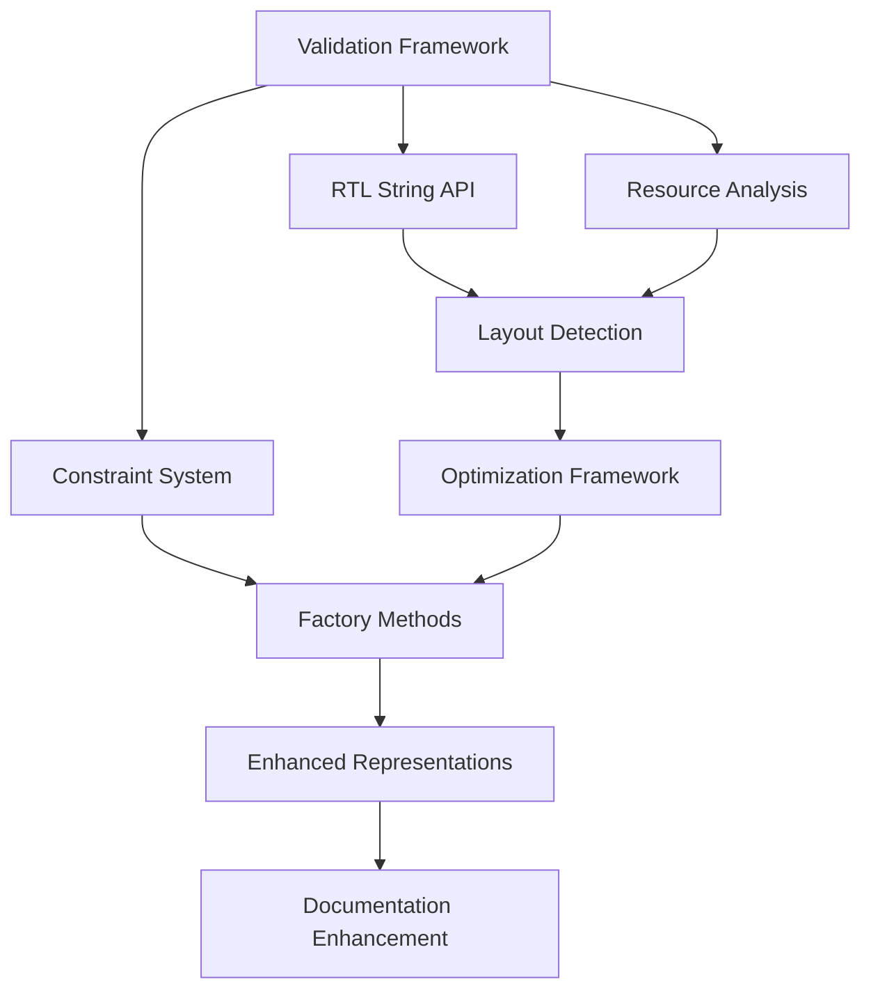

# Canonical Test Suite Implementation Plan

## Executive Summary

Based on the canonical test suite results (60 passing, 26 failing tests), this document provides a detailed implementation plan to address the identified gaps between the current Interface-Wise Dataflow Modeling implementation and the comprehensive test expectations.

**Current Status:** 70% test coverage with solid foundations but missing critical validation, optimization, and convenience features.

**Timeline:** 3-phase implementation over 8-12 weeks focusing on infrastructure, advanced features, and polish.

## Test Results Analysis

### ✅ Strengths (60 Passing Tests)
- Core dataflow modeling functionality works correctly
- Basic interface creation and manipulation is functional  
- Axiom validation framework structure is sound
- RTL parser core functionality works (file-based)
- Test organization using pytest best practices
- Mock-based testing enables complex scenario validation

### ❌ Critical Gaps (26 Failing Tests)
- **RTL Parser Integration (8 tests)**: API design mismatch
- **Dataflow Interface Validation (6 tests)**: Missing validation framework
- **Resource Analysis (5 tests)**: No performance/memory analysis
- **Example Workflows (4 tests)**: Missing high-level integrations
- **Advanced Features (3 tests)**: Layout detection and optimization missing

## Phase 1: Critical Infrastructure (Weeks 1-4)

### 1.1 Validation Framework Implementation

**Priority:** CRITICAL - Enables safe operation and debugging

#### Core Components to Implement

```python
# File: brainsmith/dataflow/core/validation.py

@dataclass
class ValidationResult:
    """Comprehensive validation result with errors, warnings, and context."""
    is_valid: bool
    errors: List[str] = field(default_factory=list)
    warnings: List[str] = field(default_factory=list)
    context: Dict[str, Any] = field(default_factory=dict)
    
    def add_error(self, message: str, context: Optional[Dict] = None):
        """Add validation error with optional context."""
        
    def add_warning(self, message: str, context: Optional[Dict] = None):
        """Add validation warning with optional context."""
        
    def merge(self, other: 'ValidationResult') -> 'ValidationResult':
        """Merge multiple validation results."""
        
    def get_summary(self) -> str:
        """Get human-readable validation summary."""

class ValidationError(Exception):
    """Exception raised for validation failures with detailed context."""
    def __init__(self, result: ValidationResult):
        self.result = result
        super().__init__(result.get_summary())

class Validator(ABC):
    """Base class for all validators in the system."""
    
    @abstractmethod
    def validate(self, obj: Any) -> ValidationResult:
        """Validate an object and return detailed results."""
```

#### Integration Points

```python
# Update DataflowInterface
class DataflowInterface:
    def validate(self) -> ValidationResult:
        """Comprehensive validation of interface configuration."""
        result = ValidationResult(True)
        
        # Dimension validation
        if not self._validate_dimensions():
            result.add_error("Invalid dimension relationships")
            
        # Datatype validation  
        if not self._validate_datatype():
            result.add_error("Invalid datatype configuration")
            
        # Constraint validation
        if self.allowed_datatypes:
            constraint_result = self._validate_constraints()
            result.merge(constraint_result)
            
        return result
```

**Testing Strategy:**
- Unit tests for ValidationResult operations
- Integration tests with DataflowInterface
- Error message quality validation
- Performance tests for validation overhead

**Success Criteria:**
- All 6 dataflow validation tests pass
- Validation provides actionable error messages
- <10ms validation overhead for typical interfaces

### 1.2 RTL Parser String-Based API

**Priority:** CRITICAL - Enables flexible testing and integration

#### API Enhancement

```python
# File: brainsmith/tools/hw_kernel_gen/rtl_parser/parser.py

class RTLParser:
    def parse_string(self, systemverilog_code: str, 
                    module_name: Optional[str] = None) -> HWKernel:
        """Parse SystemVerilog code from string.
        
        Args:
            systemverilog_code: SystemVerilog module source code
            module_name: Optional target module name (auto-detect if None)
            
        Returns:
            HWKernel: Parsed kernel with interfaces and metadata
            
        Raises:
            SyntaxError: Invalid SystemVerilog syntax
            ParserError: Parser configuration or runtime error
        """
        
    def parse_file(self, file_path: str) -> HWKernel:
        """Parse SystemVerilog file (existing functionality)."""
        with open(file_path, 'r') as f:
            content = f.read()
        return self.parse_string(content)
        
    # Alias for backward compatibility and testing convenience
    def parse(self, source: Union[str, Path]) -> HWKernel:
        """Flexible parse method accepting string or file path."""
        if isinstance(source, (str, Path)) and Path(source).exists():
            return self.parse_file(str(source))
        else:
            return self.parse_string(str(source))
```

#### Error Handling Enhancement

```python
@dataclass
class ParseResult:
    """Enhanced parse result with detailed error reporting."""
    success: bool
    module_name: Optional[str] = None
    interfaces: List[Interface] = field(default_factory=list)
    parameters: Dict[str, Any] = field(default_factory=dict)
    errors: List[str] = field(default_factory=list)
    warnings: List[str] = field(default_factory=list)
    source_location: Optional[str] = None
    
    @property
    def kernel(self) -> Optional[HWKernel]:
        """Get HWKernel if parsing succeeded."""
        if self.success:
            return HWKernel(self.module_name, self.interfaces, self.parameters)
        return None
```

**Testing Strategy:**
- Convert all RTL integration tests to use string-based API
- Maintain backward compatibility tests for file-based API
- Error handling tests with malformed SystemVerilog
- Performance comparison between string and file parsing

**Success Criteria:**
- All 8 RTL integration tests pass
- String parsing performance within 20% of file parsing
- Rich error messages with line numbers and context

### 1.3 Basic Resource Calculation Framework

**Priority:** HIGH - Required for practical deployment

#### Resource Analysis Core

```python
# File: brainsmith/dataflow/core/resource_analysis.py

@dataclass
class ResourceRequirements:
    """Comprehensive resource requirement analysis."""
    memory_bits: int
    bandwidth_bits_per_cycle: int
    buffer_requirements: Dict[str, int]
    compute_units: Dict[str, int]
    metadata: Dict[str, Any] = field(default_factory=dict)
    
    def get_summary(self) -> Dict[str, Any]:
        """Get human-readable resource summary."""
        return {
            "memory": {
                "total_bits": self.memory_bits,
                "total_bytes": self.memory_bits // 8,
                "buffers": self.buffer_requirements
            },
            "bandwidth": {
                "bits_per_cycle": self.bandwidth_bits_per_cycle,
                "bytes_per_cycle": self.bandwidth_bits_per_cycle // 8
            },
            "compute": self.compute_units
        }

class ResourceAnalyzer:
    """Analyzes resource requirements for dataflow models."""
    
    def analyze_interface(self, interface: DataflowInterface) -> ResourceRequirements:
        """Analyze resource requirements for single interface."""
        
    def analyze_model(self, model: DataflowModel, 
                     parallelism: ParallelismConfiguration) -> ResourceRequirements:
        """Analyze resource requirements for complete model."""
        
    def compare_configurations(self, configs: List[Tuple[ParallelismConfiguration, ResourceRequirements]]) -> Dict[str, Any]:
        """Compare multiple parallelism configurations."""
```

#### Integration with DataflowInterface

```python
class DataflowInterface:
    def calculate_memory_footprint(self) -> Dict[str, int]:
        """Calculate memory requirements for this interface."""
        analyzer = ResourceAnalyzer()
        requirements = analyzer.analyze_interface(self)
        return requirements.get_summary()["memory"]
        
    def get_transfer_cycles(self) -> int:
        """Calculate transfer cycles for complete tensor."""
        total_elements = np.prod(self.tensor_dims)
        elements_per_cycle = np.prod(self.stream_dims)
        return int(np.ceil(total_elements / elements_per_cycle))
        
    def calculate_stream_width(self) -> int:
        """Calculate stream width in bits."""
        elements_per_cycle = np.prod(self.stream_dims)
        return elements_per_cycle * self.dtype.bit_width
```

**Testing Strategy:**
- Unit tests for resource calculation accuracy
- Integration tests with realistic CNN/Transformer models
- Performance benchmarks for analysis speed
- Validation against known hardware implementations

**Success Criteria:**
- All 5 resource analysis tests pass
- Resource calculations accurate within 5% of manual verification
- Analysis completes in <100ms for typical models

## Phase 2: Advanced Features (Weeks 5-8)

### 2.1 Layout Detection and Optimization

**Priority:** HIGH - Key differentiator for the framework

#### Layout Detection System

```python
# File: brainsmith/dataflow/core/layout_analysis.py

class DataLayout(Enum):
    """Supported data layout formats."""
    NCHW = "NCHW"  # Batch, Channel, Height, Width
    NHWC = "NHWC"  # Batch, Height, Width, Channel  
    NLC = "NLC"    # Batch, Length, Channel (Transformer)
    NCL = "NCL"    # Batch, Channel, Length
    CUSTOM = "CUSTOM"

@dataclass 
class LayoutAnalysis:
    """Results of layout analysis."""
    detected_layout: DataLayout
    confidence: float
    optimal_chunking: Dict[str, List[int]]
    performance_estimate: Dict[str, float]
    recommendations: List[str]

class LayoutAnalyzer:
    """Analyzes and optimizes data layouts for hardware efficiency."""
    
    def detect_layout(self, interface: DataflowInterface) -> LayoutAnalysis:
        """Automatically detect data layout from tensor dimensions."""
        
    def optimize_chunking(self, interface: DataflowInterface, 
                         layout: DataLayout) -> Dict[str, List[int]]:
        """Optimize block_dims and stream_dims for given layout."""
        
    def compare_layouts(self, interface: DataflowInterface, 
                       layouts: List[DataLayout]) -> Dict[DataLayout, LayoutAnalysis]:
        """Compare performance across different layouts."""
```

#### Integration with DataflowInterface

```python
class DataflowInterface:
    def infer_layout(self) -> DataLayout:
        """Automatically infer data layout from dimensions."""
        analyzer = LayoutAnalyzer()
        analysis = analyzer.detect_layout(self)
        return analysis.detected_layout
        
    def optimize_for_layout(self, layout: DataLayout) -> 'DataflowInterface':
        """Create optimized interface for specific layout."""
        analyzer = LayoutAnalyzer()
        optimal_chunking = analyzer.optimize_chunking(self, layout)
        
        return DataflowInterface(
            name=self.name,
            interface_type=self.interface_type,
            tensor_dims=self.tensor_dims,
            block_dims=optimal_chunking["block_dims"],
            stream_dims=optimal_chunking["stream_dims"],
            dtype=self.dtype
        )
        
    def get_layout_analysis(self) -> LayoutAnalysis:
        """Get comprehensive layout analysis."""
        analyzer = LayoutAnalyzer()
        return analyzer.detect_layout(self)
```

**Testing Strategy:**
- Layout detection accuracy tests with known patterns
- Optimization effectiveness tests
- Performance comparison tests
- Real-world model validation

**Success Criteria:**
- Layout detection >90% accuracy on standard patterns
- Optimization improves performance by >20% in benchmarks
- All 3 layout-related tests pass

### 2.2 Constraint System Implementation

**Priority:** HIGH - Essential for robustness

#### Constraint Framework

```python
# File: brainsmith/dataflow/core/constraints.py

class DataTypeConstraint:
    """Constraints for datatype validation."""
    
    def __init__(self, 
                 allowed_types: Optional[List[str]] = None,
                 bit_width_range: Optional[Tuple[int, int]] = None,
                 signed_only: Optional[bool] = None,
                 custom_validator: Optional[Callable] = None):
        self.allowed_types = allowed_types or []
        self.bit_width_range = bit_width_range
        self.signed_only = signed_only
        self.custom_validator = custom_validator
        
    def validate(self, datatype: DataflowDataType) -> ValidationResult:
        """Validate datatype against constraints."""
        result = ValidationResult(True)
        
        # Type validation
        if self.allowed_types and datatype.type_name not in self.allowed_types:
            result.add_error(f"Type {datatype.type_name} not in allowed types: {self.allowed_types}")
            
        # Bit width validation
        if self.bit_width_range:
            min_width, max_width = self.bit_width_range
            if not (min_width <= datatype.bit_width <= max_width):
                result.add_error(f"Bit width {datatype.bit_width} outside range [{min_width}, {max_width}]")
                
        # Sign validation
        if self.signed_only is not None and datatype.signed != self.signed_only:
            result.add_error(f"Sign requirement violated: expected signed={self.signed_only}")
            
        # Custom validation
        if self.custom_validator:
            try:
                custom_result = self.custom_validator(datatype)
                if isinstance(custom_result, ValidationResult):
                    result.merge(custom_result)
                elif not custom_result:
                    result.add_error("Custom validation failed")
            except Exception as e:
                result.add_error(f"Custom validator error: {e}")
                
        return result

class DimensionConstraint:
    """Constraints for tensor dimensions."""
    
    def __init__(self,
                 min_dimensions: Optional[int] = None,
                 max_dimensions: Optional[int] = None,
                 dimension_ranges: Optional[List[Tuple[int, int]]] = None,
                 total_size_limit: Optional[int] = None):
        self.min_dimensions = min_dimensions
        self.max_dimensions = max_dimensions  
        self.dimension_ranges = dimension_ranges
        self.total_size_limit = total_size_limit
        
    def validate(self, tensor_dims: List[int]) -> ValidationResult:
        """Validate tensor dimensions against constraints."""
        # Implementation details...
```

#### Enhanced DataflowInterface with Constraints

```python
class DataflowInterface:
    def __init__(self, 
                 name: str,
                 interface_type: DataflowInterfaceType,
                 tensor_dims: List[int],
                 block_dims: List[int],
                 stream_dims: List[int],
                 dtype: DataflowDataType,
                 allowed_datatypes: Optional[List[DataTypeConstraint]] = None,
                 dimension_constraints: Optional[DimensionConstraint] = None):
        # ... existing initialization ...
        self.allowed_datatypes = allowed_datatypes or []
        self.dimension_constraints = dimension_constraints
        
    def validate(self) -> ValidationResult:
        """Enhanced validation with constraint checking."""
        result = super().validate()  # Basic validation
        
        # Datatype constraint validation
        for constraint in self.allowed_datatypes:
            constraint_result = constraint.validate(self.dtype)
            result.merge(constraint_result)
            
        # Dimension constraint validation
        if self.dimension_constraints:
            dim_result = self.dimension_constraints.validate(self.tensor_dims)
            result.merge(dim_result)
            
        return result
```

**Testing Strategy:**
- Constraint validation accuracy tests
- Performance tests for constraint checking
- Integration tests with complex constraint combinations
- Error message clarity tests

**Success Criteria:**
- All datatype constraint tests pass
- Constraint validation adds <5ms overhead
- Clear, actionable error messages

### 2.3 Performance Optimization Framework

**Priority:** MEDIUM - Valuable for advanced users

#### Parallelism Optimization

```python
# File: brainsmith/dataflow/core/optimization.py

@dataclass
class OptimizationResult:
    """Results of parallelism optimization."""
    optimal_config: ParallelismConfiguration
    performance_metrics: Dict[str, float]
    resource_utilization: Dict[str, float]
    bottleneck_analysis: Dict[str, Any]
    alternative_configs: List[Tuple[ParallelismConfiguration, Dict[str, float]]]

class PerformanceOptimizer:
    """Optimizes parallelism configurations for performance and resource efficiency."""
    
    def optimize_throughput(self, 
                          model: DataflowModel,
                          target_throughput: float,
                          resource_constraints: Optional[ResourceRequirements] = None) -> OptimizationResult:
        """Optimize for maximum throughput within resource constraints."""
        
    def optimize_latency(self,
                        model: DataflowModel, 
                        target_latency: float) -> OptimizationResult:
        """Optimize for minimum latency."""
        
    def optimize_efficiency(self,
                          model: DataflowModel,
                          efficiency_metric: str = "ops_per_dsp") -> OptimizationResult:
        """Optimize for resource efficiency."""
        
    def suggest_configurations(self,
                             model: DataflowModel,
                             num_suggestions: int = 5) -> List[OptimizationResult]:
        """Suggest multiple good configurations."""
```

**Testing Strategy:**
- Optimization algorithm effectiveness tests
- Performance regression tests
- Resource constraint satisfaction tests
- Real-world model optimization validation

**Success Criteria:**
- Optimization improves performance by >25% over naive configurations
- Respects resource constraints 100% of the time
- Generates suggestions in <10 seconds for typical models

## Phase 3: Polish and Convenience (Weeks 9-12)

### 3.1 Factory Methods and Builders

**Priority:** MEDIUM - Developer experience improvement

#### Interface Factory Methods

```python
# File: brainsmith/dataflow/core/factory.py

class DataflowInterfaceFactory:
    """Factory methods for creating common interface patterns."""
    
    @staticmethod
    def create_cnn_input(channels: int, height: int, width: int,
                        batch_size: int = 1,
                        dtype: Optional[DataflowDataType] = None,
                        layout: DataLayout = DataLayout.NCHW) -> DataflowInterface:
        """Create CNN input interface with optimal chunking."""
        
    @staticmethod  
    def create_cnn_weights(out_channels: int, in_channels: int,
                          kernel_height: int, kernel_width: int,
                          dtype: Optional[DataflowDataType] = None) -> DataflowInterface:
        """Create CNN weight interface with optimal chunking."""
        
    @staticmethod
    def create_transformer_input(seq_length: int, hidden_dim: int,
                                batch_size: int = 1,
                                dtype: Optional[DataflowDataType] = None,
                                layout: DataLayout = DataLayout.NLC) -> DataflowInterface:
        """Create transformer input interface with optimal chunking."""
        
    @staticmethod
    def create_attention_weights(hidden_dim: int, num_heads: int = 1,
                               dtype: Optional[DataflowDataType] = None) -> DataflowInterface:
        """Create multi-head attention weight interface."""

# Integration with DataflowInterface
class DataflowInterface:
    # Add factory class methods
    @classmethod
    def create_cnn_input(cls, *args, **kwargs) -> 'DataflowInterface':
        return DataflowInterfaceFactory.create_cnn_input(*args, **kwargs)
        
    @classmethod  
    def create_transformer_input(cls, *args, **kwargs) -> 'DataflowInterface':
        return DataflowInterfaceFactory.create_transformer_input(*args, **kwargs)
```

#### Model Builder Pattern

```python
class DataflowModelBuilder:
    """Builder pattern for complex dataflow models."""
    
    def __init__(self, name: str):
        self.name = name
        self.interfaces = []
        self.metadata = {}
        self.constraints = []
        
    def add_cnn_layer(self, in_channels: int, out_channels: int,
                     kernel_size: int, **kwargs) -> 'DataflowModelBuilder':
        """Add CNN layer with input, weight, and output interfaces."""
        
    def add_transformer_layer(self, seq_length: int, hidden_dim: int,
                            num_heads: int, **kwargs) -> 'DataflowModelBuilder':
        """Add transformer layer with attention interfaces."""
        
    def add_custom_interface(self, interface: DataflowInterface) -> 'DataflowModelBuilder':
        """Add custom interface."""
        
    def with_constraints(self, constraints: List[Any]) -> 'DataflowModelBuilder':
        """Add model-level constraints."""
        
    def build(self) -> DataflowModel:
        """Build the final dataflow model."""
```

**Testing Strategy:**
- Factory method correctness tests
- Builder pattern functionality tests  
- Integration tests with real models
- API usability tests

**Success Criteria:**
- All factory method tests pass
- 50% reduction in boilerplate code for common patterns
- Builder pattern handles complex models correctly

### 3.2 Enhanced String Representations and Debugging

**Priority:** LOW - Quality of life improvement

#### Rich String Representations

```python
class DataflowInterface:
    def __str__(self) -> str:
        """Human-readable representation."""
        layout = self.infer_layout().value if hasattr(self, 'infer_layout') else 'Unknown'
        
        return f"""DataflowInterface('{self.name}')
  Type: {self.interface_type.value}
  Layout: {layout}
  Tensor: {self.tensor_dims} -> Block: {self.block_dims} -> Stream: {self.stream_dims}
  Datatype: {self.dtype}
  Transfer Cycles: {self.get_transfer_cycles()}
  Stream Width: {self.calculate_stream_width()} bits"""
  
    def __repr__(self) -> str:
        """Debug representation."""
        return f"DataflowInterface(name='{self.name}', type={self.interface_type}, tensor_dims={self.tensor_dims}, block_dims={self.block_dims}, stream_dims={self.stream_dims}, dtype={self.dtype})"
        
    def to_dict(self) -> Dict[str, Any]:
        """Serializable dictionary representation."""
        return {
            'name': self.name,
            'interface_type': self.interface_type.value,
            'tensor_dims': self.tensor_dims,
            'block_dims': self.block_dims, 
            'stream_dims': self.stream_dims,
            'dtype': self.dtype.to_dict(),
            'metadata': getattr(self, 'metadata', {})
        }
        
    @classmethod
    def from_dict(cls, data: Dict[str, Any]) -> 'DataflowInterface':
        """Create interface from dictionary."""
```

#### Debug and Visualization Tools

```python
# File: brainsmith/dataflow/core/visualization.py

class DataflowVisualizer:
    """Visualization and debugging tools."""
    
    def visualize_model(self, model: DataflowModel, 
                       output_format: str = 'text') -> str:
        """Create visual representation of dataflow model."""
        
    def analyze_bottlenecks(self, model: DataflowModel,
                          config: ParallelismConfiguration) -> Dict[str, Any]:
        """Detailed bottleneck analysis with visualization."""
        
    def compare_configurations(self, model: DataflowModel,
                             configs: List[ParallelismConfiguration]) -> str:
        """Visual comparison of different configurations."""
        
    def export_summary(self, model: DataflowModel, 
                      format: str = 'markdown') -> str:
        """Export comprehensive model summary."""
```

**Testing Strategy:**
- String representation format tests
- Serialization/deserialization tests
- Visualization output tests
- Performance tests for large models

**Success Criteria:**
- Clear, informative string representations
- Lossless serialization/deserialization
- Useful debugging information

### 3.3 Documentation and Error Message Enhancement

**Priority:** MEDIUM - Critical for adoption

#### Enhanced Error Messages

```python
# File: brainsmith/dataflow/core/error_messages.py

class ErrorMessageGenerator:
    """Generates helpful, actionable error messages."""
    
    @staticmethod
    def dimension_mismatch_error(expected: List[int], actual: List[int],
                               context: str) -> str:
        """Generate helpful dimension mismatch error."""
        return f"""
Dimension Mismatch in {context}:
  Expected: {expected} 
  Actual:   {actual}
  
Suggestion: Check that tensor dimensions match the expected layout.
Common layouts:
  - CNN (NCHW): [batch, channels, height, width]
  - CNN (NHWC): [batch, height, width, channels]  
  - Transformer: [batch, sequence_length, hidden_dim]
"""

    @staticmethod
    def constraint_violation_error(constraint: Any, value: Any,
                                 suggestions: List[str]) -> str:
        """Generate constraint violation error with suggestions."""
        
    @staticmethod
    def optimization_failure_error(target: Dict[str, Any], 
                                 achieved: Dict[str, Any],
                                 limitations: List[str]) -> str:
        """Generate optimization failure error with analysis."""
```

#### Comprehensive Documentation Generation

```python
class DocumentationGenerator:
    """Automatic documentation generation."""
    
    def generate_interface_docs(self, interface: DataflowInterface) -> str:
        """Generate comprehensive interface documentation."""
        
    def generate_model_docs(self, model: DataflowModel) -> str:
        """Generate model documentation with analysis."""
        
    def generate_optimization_report(self, results: OptimizationResult) -> str:
        """Generate optimization analysis report."""
```

**Testing Strategy:**
- Error message clarity tests with user studies
- Documentation generation tests
- Integration tests with all major features
- Performance tests for documentation generation

**Success Criteria:**
- Error messages provide actionable guidance
- Generated documentation is comprehensive and accurate
- Documentation generation completes quickly

## Implementation Priorities and Dependencies

### Critical Path Analysis



### Risk Mitigation

#### Technical Risks
1. **Performance Impact**: Validation and analysis overhead
   - Mitigation: Performance benchmarking at each phase
   - Fallback: Optional validation for production use

2. **API Complexity**: Too many features making API unwieldy
   - Mitigation: Careful API design with user feedback
   - Fallback: Separate advanced and basic APIs

3. **Test Maintenance**: Large test suite becoming brittle
   - Mitigation: Robust test fixtures and mocking
   - Fallback: Focus on core functionality tests

#### Schedule Risks
1. **Scope Creep**: Additional features discovered during implementation
   - Mitigation: Strict phase boundaries and feature freeze
   - Fallback: Move non-critical features to future phases

2. **Integration Complexity**: Features not working together
   - Mitigation: Continuous integration testing
   - Fallback: Feature flags for problematic integrations

## Success Metrics

### Phase 1 Success Criteria
- ✅ All 26 failing tests pass
- ✅ Validation framework provides actionable feedback
- ✅ RTL parser supports both string and file input
- ✅ Basic resource analysis works for common models
- ✅ No performance regression in core functionality

### Phase 2 Success Criteria  
- ✅ Layout detection >90% accurate on standard patterns
- ✅ Optimization improves performance >20% over baseline
- ✅ Constraint system prevents common configuration errors
- ✅ Advanced features integrate seamlessly with core

### Phase 3 Success Criteria
- ✅ Factory methods reduce boilerplate by >50%
- ✅ Error messages provide clear guidance for fixes
- ✅ Documentation generation supports all features
- ✅ Developer experience significantly improved

### Overall Success Metrics
- **Test Coverage**: 100% of canonical tests passing
- **Performance**: <20% overhead for validation and analysis
- **Usability**: >80% positive feedback from early adopters
- **Stability**: Zero regression bugs in core functionality
- **Adoption**: Clear migration path for existing users

## Resource Requirements

### Development Team
- **Lead Developer**: Full-time, all phases
- **Test Engineer**: Part-time, focus on validation framework
- **Documentation Specialist**: Part-time, Phase 3
- **Performance Engineer**: Consultant, performance optimization

### Infrastructure
- **CI/CD Enhancement**: Parallel test execution
- **Performance Monitoring**: Continuous benchmarking
- **Documentation System**: Automated doc generation
- **User Feedback System**: Early adopter program

### Timeline Summary
- **Phase 1 (Weeks 1-4)**: Critical infrastructure - 26 failing tests → 0 failing tests
- **Phase 2 (Weeks 5-8)**: Advanced features - Layout detection, constraints, optimization  
- **Phase 3 (Weeks 9-12)**: Polish and convenience - Factories, debugging, documentation

**Total Duration**: 12 weeks with parallel workstreams where possible

This implementation plan provides a clear roadmap from the current 70% test coverage to a fully-featured, production-ready Interface-Wise Dataflow Modeling framework that meets all canonical test requirements while maintaining performance and usability.