# DSE Module North Star Simplification Plan

## Executive Summary

The current DSE module contains **6,000+ lines** of enterprise complexity across 11 files with **no actual DSE functionality**. This represents a perfect greenfield opportunity to build North Star-aligned DSE foundations from scratch.

**Goal**: Replace complex academic framework with ~200 lines of simple functions that provide practical FPGA design space exploration.

## Current State Analysis

### Complexity Assessment
- **Total Lines**: 6,000+ lines across 11 files
- **Advanced Module**: 3,000+ lines of enterprise algorithms (`brainsmith/dse/advanced/`)
- **Core Issue**: Academic research framework instead of practical DSE functions
- **Usage**: No meaningful DSE search currently exists - just hooks for future work

### Major North Star Violations

#### 1. Enterprise Disease
- Complex workflow orchestration (1,462 lines in `analysis.py`)
- Abstract base classes and factory patterns (`interface.py`, `algorithms.py`)
- Configuration objects with dozens of parameters (`strategies.py`)
- Plugin architectures for core functionality

#### 2. Academic Over-Engineering
- NSGA-II, SPEA2, MOEA/D algorithms (1,203 lines in `algorithms.py`)
- Custom statistical analysis when scipy exists
- Research features 99% of users don't need
- Theoretical completeness over practical utility

#### 3. Framework Bloat
- Multiple abstraction layers
- Event systems for simple data flow
- Dependency injection for straightforward tools
- Meta-optimization frameworks

## North Star Vision

> **"Make FPGA design space exploration as simple as calling a function."**

### Target API
```python
# This should be the entire DSE API
results = brainsmith.parameter_sweep(model, blueprint, parameters)
best = brainsmith.find_best_result(results, metric='throughput')
brainsmith.batch_evaluate(models, blueprint, output_dir='./results')
```

### Success Criteria
- **5 minutes** to first DSE result
- **3 core functions** to learn
- **Direct integration** with existing simplified modules
- **Data exposure** for external analysis tools

## Detailed Implementation Plan

### Phase 1: Core DSE Functions (Replace 6,000+ lines with ~200 lines)

#### File Structure
```
brainsmith/dse/
├── functions.py     (~100 lines) - Core DSE functions
├── helpers.py       (~50 lines)  - Utility functions
├── types.py         (~50 lines)  - Simple data types
└── __init__.py      (~20 lines)  - Public API exports
```

#### 1.1 Core Functions (`brainsmith/dse/functions.py`)

**Primary Functions:**
- `parameter_sweep(model, blueprint, parameters)` - Run parameter combinations
- `batch_evaluate(model_list, blueprint, parameters)` - Process multiple models  
- `find_best_result(results, metric)` - Simple result comparison
- `compare_results(results, metrics)` - Multi-metric comparison
- `sample_design_space(parameters, strategy, n_samples)` - Smart sampling

**Integration Points:**
```python
def parameter_sweep(model_path: str, blueprint_path: str, parameters: Dict[str, List[Any]]) -> List[DSEResult]:
    """
    Run parameter sweep using simplified blueprint and core systems.
    
    Integrates with:
    - brainsmith.blueprints.functions.load_blueprint_yaml()
    - brainsmith.core.api.forge()
    - brainsmith.hooks.log_dse_event()
    """
    blueprint = load_blueprint_yaml(blueprint_path)
    results = []
    
    for param_combo in generate_parameter_grid(parameters):
        # Log DSE event for hooks integration
        log_dse_event('parameter_evaluation_start', {'parameters': param_combo})
        
        # Use core forge() function for evaluation
        result = forge(model_path, blueprint, **param_combo)
        
        # Extract metrics using simplified metrics system
        dse_result = DSEResult(
            parameters=param_combo,
            metrics=result['metrics'],
            build_success=result.get('build_success', True),
            build_time=result.get('build_time', 0.0)
        )
        results.append(dse_result)
        
        log_dse_event('parameter_evaluation_complete', {'result': dse_result})
    
    return results
```

#### 1.2 Helper Functions (`brainsmith/dse/helpers.py`)

**Utility Functions:**
- `generate_parameter_grid(parameters)` - Create parameter combinations
- `create_parameter_samples(parameters, strategy)` - Latin hypercube, random sampling
- `export_results(results, format)` - Export to pandas, CSV, JSON
- `estimate_runtime(parameters, benchmark_time)` - Runtime estimation

**Analysis Hooks Integration:**
```python
def export_results(results: List[DSEResult], format: str = 'pandas') -> Any:
    """
    Export DSE results for external analysis tools.
    
    Integrates with brainsmith.analysis hooks patterns.
    """
    if format == 'pandas':
        import pandas as pd
        data = []
        for result in results:
            row = result.parameters.copy()
            row.update(result.metrics.to_dict())
            row['build_success'] = result.build_success
            row['build_time'] = result.build_time
            data.append(row)
        return pd.DataFrame(data)
    elif format == 'csv':
        df = export_results(results, 'pandas')
        return df.to_csv(index=False)
    elif format == 'json':
        return [result.to_dict() for result in results]
```

#### 1.3 Simple Data Types (`brainsmith/dse/types.py`)

**Essential Types:**
```python
@dataclass
class DSEResult:
    """Simple DSE result container - integrates with brainsmith.core.metrics."""
    parameters: Dict[str, Any]
    metrics: 'DSEMetrics'  # From brainsmith.core.metrics
    build_success: bool = True
    build_time: float = 0.0
    metadata: Dict[str, Any] = field(default_factory=dict)
    
    def to_dict(self) -> Dict[str, Any]:
        """Convert to dictionary for analysis hooks."""
        return {
            'parameters': self.parameters,
            'metrics': self.metrics.to_dict(),
            'build_success': self.build_success,
            'build_time': self.build_time,
            'metadata': self.metadata
        }

@dataclass 
class ParameterSet:
    """Parameter combination definition."""
    name: str
    parameters: Dict[str, Any]
    description: str = ""

@dataclass
class ComparisonResult:
    """Result of comparing multiple DSE results."""
    best_result: DSEResult
    ranking: List[DSEResult]
    comparison_metric: str
    summary_stats: Dict[str, Any]
```

### Phase 2: Integration with Streamlined Modules

#### 2.1 Core API Integration

**Update `brainsmith/core/api.py`:**
```python
def forge_parameter_sweep(model_path: str, blueprint_path: str, 
                         parameters: Dict[str, List[Any]]) -> List[Dict[str, Any]]:
    """
    Core API support for parameter sweeps.
    Extends forge() to handle parameter combinations.
    """
    from ..dse.functions import parameter_sweep
    return parameter_sweep(model_path, blueprint_path, parameters)
```

#### 2.2 Blueprint System Integration

**Use simplified blueprint functions:**
```python
# In dse/functions.py
from ..blueprints.functions import (
    load_blueprint_yaml,
    get_build_steps,
    get_objectives,
    get_constraints
)

def extract_parameter_space(blueprint_data: Dict[str, Any]) -> Dict[str, List[Any]]:
    """Extract parameter space from simplified blueprint."""
    # Use blueprint functions to get parameter definitions
    build_steps = get_build_steps(blueprint_data)
    objectives = get_objectives(blueprint_data)
    
    # Create parameter space from blueprint configuration
    parameter_space = {}
    # ... implementation using simplified blueprint structure
    return parameter_space
```

#### 2.3 Hooks System Integration

**DSE Event Logging:**
```python
# In dse/functions.py
from ..hooks import log_dse_event, log_optimization_event

def parameter_sweep(model_path: str, blueprint_path: str, parameters: Dict[str, List[Any]]) -> List[DSEResult]:
    log_optimization_event('dse_start', {
        'model': model_path,
        'blueprint': blueprint_path,
        'parameter_count': len(parameters),
        'total_combinations': _count_combinations(parameters)
    })
    
    # ... DSE implementation
    
    log_optimization_event('dse_complete', {
        'results_count': len(results),
        'success_rate': sum(1 for r in results if r.build_success) / len(results)
    })
```

#### 2.4 Metrics System Integration

**Use simplified metrics:**
```python
# In dse/functions.py
from ..core.metrics import DSEMetrics, create_metrics

def _extract_result_metrics(forge_result: Dict[str, Any]) -> DSEMetrics:
    """Extract DSE metrics from forge result using simplified metrics system."""
    metrics = create_metrics()
    
    # Extract performance metrics
    if 'metrics' in forge_result:
        result_metrics = forge_result['metrics']
        metrics.performance.throughput_ops_sec = result_metrics.get('throughput', 0.0)
        metrics.performance.latency_ms = result_metrics.get('latency', 0.0)
        metrics.resources.lut_utilization_percent = result_metrics.get('lut_util', 0.0)
        # ... other metrics
    
    return metrics
```

#### 2.5 FINN Interface Integration

**Use simplified FINN interface:**
```python
# In dse/functions.py  
from ..finn import build_accelerator

def _evaluate_design_point(model_path: str, blueprint_config: Dict[str, Any], 
                          parameters: Dict[str, Any]) -> DSEResult:
    """Evaluate single design point using simplified FINN interface."""
    try:
        # Use simplified FINN build function
        finn_result = build_accelerator(
            model_path=model_path,
            blueprint_config=blueprint_config,
            **parameters
        )
        
        # Convert to DSE result
        metrics = _extract_result_metrics(finn_result)
        return DSEResult(
            parameters=parameters,
            metrics=metrics,
            build_success=finn_result.build_success,
            build_time=finn_result.build_time_seconds
        )
    except Exception as e:
        # Return failed result
        return DSEResult(
            parameters=parameters,
            metrics=create_metrics(),
            build_success=False,
            build_time=0.0,
            metadata={'error': str(e)}
        )
```

### Phase 3: Migration Strategy

#### 3.1 Files to Remove (6,000+ lines)
```bash
# Delete entire advanced directory
rm -rf brainsmith/dse/advanced/

# Replace complex modules
brainsmith/dse/analysis.py        # 1,462 lines → simple export functions
brainsmith/dse/external.py        # 517 lines → remove external framework complexity  
brainsmith/dse/interface.py       # 350 lines → replace with simple functions
brainsmith/dse/strategies.py      # 420 lines → replace with basic sampling
brainsmith/dse/simple.py          # 424 lines → merge useful parts into functions.py
```

#### 3.2 Backwards Compatibility
```python
# In dse/__init__.py - provide compatibility wrappers
def create_dse_engine(*args, **kwargs):
    """Deprecated: Use parameter_sweep() instead."""
    import warnings
    warnings.warn("create_dse_engine is deprecated. Use parameter_sweep() instead.", 
                  DeprecationWarning, stacklevel=2)
    # Return simple wrapper or fallback

# Legacy function mapping
DSEInterface = parameter_sweep  # Map old class to new function
DSEEngine = parameter_sweep     # Map old class to new function
```

#### 3.3 Update Imports
```python
# brainsmith/dse/__init__.py
"""
Simplified DSE: Functions Over Frameworks

North Star aligned design space exploration for FPGA accelerators.
"""

from .functions import (
    parameter_sweep,
    batch_evaluate, 
    find_best_result,
    compare_results,
    sample_design_space
)

from .helpers import (
    generate_parameter_grid,
    create_parameter_samples,
    export_results,
    estimate_runtime
)

from .types import (
    DSEResult,
    ParameterSet,
    ComparisonResult
)

__all__ = [
    # Core DSE functions
    'parameter_sweep',
    'batch_evaluate',
    'find_best_result', 
    'compare_results',
    'sample_design_space',
    
    # Helper functions
    'generate_parameter_grid',
    'create_parameter_samples',
    'export_results',
    'estimate_runtime',
    
    # Data types
    'DSEResult',
    'ParameterSet', 
    'ComparisonResult'
]
```

### Phase 4: Testing and Documentation

#### 4.1 Test Suite (`tests/test_dse_simplification.py`)
```python
def test_parameter_sweep_integration():
    """Test parameter sweep with all module integrations."""
    parameters = {
        'pe_count': [1, 2, 4],
        'precision': [8, 16]
    }
    
    results = parameter_sweep('test_model.onnx', 'test_blueprint.yaml', parameters)
    
    assert len(results) == 6  # 3 * 2 combinations
    assert all(isinstance(r, DSEResult) for r in results)
    assert all(r.build_success for r in results)

def test_analysis_hooks_integration():
    """Test data export for external analysis tools."""
    results = [create_test_dse_result() for _ in range(5)]
    
    # Test pandas export
    df = export_results(results, 'pandas')
    assert len(df) == 5
    assert 'throughput' in df.columns
    
    # Test CSV export  
    csv_data = export_results(results, 'csv')
    assert isinstance(csv_data, str)
    
def test_metrics_integration():
    """Test integration with simplified metrics system."""
    result = DSEResult(
        parameters={'pe_count': 4},
        metrics=create_metrics(),
        build_success=True
    )
    
    result.metrics.performance.throughput_ops_sec = 1000.0
    
    assert result.metrics.get_optimization_score() > 0
    assert result.to_dict()['metrics']['performance']['throughput_ops_sec'] == 1000.0
```

#### 4.2 Documentation (`brainsmith/dse/DESIGN.md`)
- Simple usage examples
- Integration patterns with other modules
- Migration guide from complex to simple
- Best practices for DSE workflows

#### 4.3 Working Demo (`dse_demo.py`)
```python
"""
DSE Simplification Demo

Shows practical FPGA design space exploration using simplified DSE functions.
"""
import brainsmith

# Basic parameter sweep
parameters = {
    'pe_count': [1, 2, 4, 8],
    'simd_factor': [1, 2, 4], 
    'precision': [8, 16]
}

print("Running parameter sweep...")
results = brainsmith.parameter_sweep('model.onnx', 'blueprint.yaml', parameters)

print(f"Evaluated {len(results)} configurations")
print(f"Success rate: {sum(1 for r in results if r.build_success) / len(results):.1%}")

# Find best performing configuration
best = brainsmith.find_best_result(results, 'throughput_ops_sec')
print(f"Best config: {best.parameters}")
print(f"Throughput: {best.metrics.performance.throughput_ops_sec:.1f} ops/sec")

# Export for external analysis
df = brainsmith.dse.export_results(results, 'pandas')
print(f"Exported {len(df)} results to pandas DataFrame")

# Use standard data science tools
import matplotlib.pyplot as plt
df.plot(x='pe_count', y='throughput', kind='scatter')
plt.title('Throughput vs PE Count')
plt.show()
```

## Implementation Checklist

### Phase 1: Core Functions ✅
- [ ] Create `brainsmith/dse/functions.py` with core DSE functions
- [ ] Create `brainsmith/dse/helpers.py` with utility functions  
- [ ] Create `brainsmith/dse/types.py` with simple data types
- [ ] Update `brainsmith/dse/__init__.py` with clean exports

### Phase 2: Integration ✅
- [ ] Integrate `parameter_sweep()` with `brainsmith.core.api.forge()`
- [ ] Integrate with `brainsmith.blueprints.functions` for blueprint loading
- [ ] Integrate with `brainsmith.hooks` for event logging
- [ ] Integrate with `brainsmith.core.metrics` for result metrics
- [ ] Integrate with `brainsmith.finn.interface` for accelerator builds

### Phase 3: Migration ✅
- [ ] Remove `brainsmith/dse/advanced/` directory (3,000+ lines)
- [ ] Replace `brainsmith/dse/analysis.py` with simple export functions
- [ ] Remove `brainsmith/dse/external.py` (external framework complexity)
- [ ] Replace `brainsmith/dse/interface.py` with function-based API
- [ ] Replace `brainsmith/dse/strategies.py` with basic sampling
- [ ] Merge useful parts of `brainsmith/dse/simple.py` into new functions

### Phase 4: Testing and Documentation ✅
- [ ] Create comprehensive test suite `tests/test_dse_simplification.py`
- [ ] Create design document `brainsmith/dse/DESIGN.md`
- [ ] Create working demo `dse_demo.py` 
- [ ] Verify all integration points work correctly
- [ ] Validate 97% code reduction achieved

### Phase 5: Validation ✅
- [ ] Test time to first success < 5 minutes
- [ ] Verify API surface reduced to 8 core functions
- [ ] Confirm integration with all streamlined modules
- [ ] Validate data export to external analysis tools
- [ ] Check backwards compatibility for any existing usage

## Success Metrics

### Code Reduction
- **Before**: 6,000+ lines across 11 files
- **After**: ~200 lines across 4 files  
- **Target**: **97% line reduction**

### API Simplification  
- **Before**: 50+ classes, complex configuration objects, enterprise patterns
- **After**: 8 simple functions, 3 data types
- **Target**: **95% API surface reduction**

### User Experience
- **Time to first success**: < 5 minutes (vs impossible before)
- **Learning curve**: 3 core functions to learn vs enterprise framework
- **Integration effort**: Single function call vs complex configuration
- **External tool support**: Direct pandas/scipy/matplotlib integration

### North Star Alignment
✅ **Functions Over Frameworks**: 8 functions replace enterprise framework  
✅ **Simplicity Over Sophistication**: Simple parameter sweeps vs academic algorithms  
✅ **Focus Over Feature Creep**: Core FPGA DSE only, no research features  
✅ **Hooks Over Implementation**: Export data for external analysis tools  
✅ **Performance Over Purity**: Fast, practical results vs theoretical completeness  

## Integration Architecture

```mermaid
graph TD
    A[DSE Functions] --> B[Core API forge&#40;&#41;]
    A --> C[Blueprint Functions]
    A --> D[Hooks System]
    A --> E[Metrics System]
    A --> F[FINN Interface]
    
    B --> B1[parameter_sweep integration]
    C --> C1[load_blueprint_yaml&#40;&#41;]
    C --> C2[get_build_steps&#40;&#41;]
    D --> D1[log_dse_event&#40;&#41;]
    D --> D2[log_optimization_event&#40;&#41;]
    E --> E1[DSEMetrics]
    E --> E2[create_metrics&#40;&#41;]
    F --> F1[build_accelerator&#40;&#41;]
    
    G[External Tools] --> A
    G --> G1[pandas DataFrame]
    G --> G2[CSV export]
    G --> G3[JSON export]
    G --> G4[matplotlib/seaborn]
```



This transformation will make BrainSmith DSE **the simplest way** to explore FPGA design spaces while maintaining seamless integration with all streamlined BrainSmith modules.