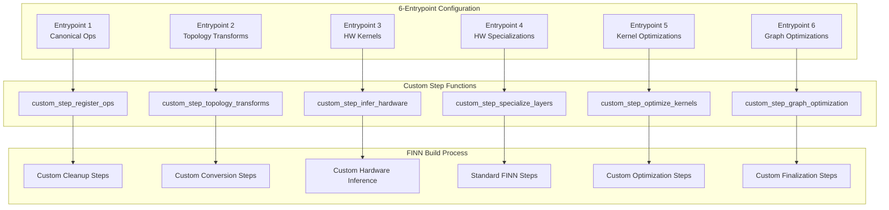

# FINN Custom Steps Integration: Bridging 6-Entrypoint to Real FINN Implementation

**Version**: 1.1  
**Date**: June 14, 2025  
**Critical Update**: Based on real FINN custom steps implementation analysis

## Executive Summary

Analysis of the BERT demo implementation reveals that our 6-entrypoint → FINN mapping requires **custom step functions**, not just step names. This document updates the integration architecture to support real FINN custom step patterns.

## 1. Critical Gap Analysis

### What bert.py Reveals

The BERT implementation shows the **actual FINN interface pattern**:

```python
# Real FINN BUILD_STEPS (from bert.py lines 380-402)
BUILD_STEPS = [
    # Custom functions, not strings
    custom_step_cleanup,
    custom_step_remove_head, 
    custom_step_remove_tail,
    custom_step_qonnx2finn,
    
    custom_step_generate_reference_io,
    custom_streamlining_step,
    custom_step_infer_hardware,
    
    # Standard FINN steps (functions imported)
    step_create_dataflow_partition,
    step_specialize_layers,
    step_target_fps_parallelization,
    step_apply_folding_config,
    step_minimize_bit_width,
    step_generate_estimate_reports,
    step_hw_codegen,
    step_hw_ipgen,
    step_measure_rtlsim_performance,
    step_set_fifo_depths,
    step_create_stitched_ip,
    
    # More custom steps
    custom_step_shell_metadata_handover,
]
```

### Our Previous Understanding vs Reality

| Our Mapping | Reality | Impact |
|-------------|---------|---------|
| Step names (strings) | Step functions | **Critical** - Won't execute |
| Simple parameter mapping | Complex transformations | **Major** - Insufficient capability |
| Generic steps | Domain-specific custom steps | **Major** - Missing functionality |
| Standard FINN only | Mixed standard + custom | **Critical** - Incomplete implementation |

## 2. Updated 6-Entrypoint → Custom Steps Architecture

### Revised Mental Model



## 3. Custom Step Function Implementation Pattern

### Step Function Signature

All FINN steps follow the pattern:
```python
def custom_step_name(model: ModelWrapper, cfg: DataflowBuildConfig) -> ModelWrapper:
    """
    Custom step documentation.
    
    Args:
        model: FINN/QONNX model wrapper
        cfg: FINN build configuration
        
    Returns:
        Transformed model
    """
    # Apply transformations
    model = model.transform(SomeTransformation())
    return model
```

### Real Custom Step Examples from bert.py

#### Entrypoint 1: Canonical Operations Registration
```python
def custom_step_qonnx2finn(model, cfg):
    """BERT-specific QONNX to FINN conversion with SoftMax handling."""
    model = model.transform(ExpandNorms())  # BrainSmith custom transform
    model = model.transform(FoldConstants())
    model = model.transform(ConvertDivToMul())
    model = model.transform(ConvertQONNXtoFINN())
    return model
```

#### Entrypoint 2: Topology Transformations
```python
def custom_streamlining_step(model, cfg):
    """BERT-specific streamlining with SoftMax Mul handling."""
    model = model.transform(absorb.AbsorbSignBiasIntoMultiThreshold())
    model = model.transform(absorb.AbsorbAddIntoMultiThreshold())
    model = model.transform(absorb.AbsorbMulIntoMultiThreshold())
    model = model.transform(RoundAndClipThresholds())
    model = model.transform(reorder.MoveOpPastFork(["Mul"]))
    model = model.transform(reorder.MoveScalarMulPastMatMul())
    model = model.transform(reorder.MoveScalarLinearPastInvariants())
    model = model.transform(absorb.AbsorbMulIntoMultiThreshold())
    model = model.transform(absorb.AbsorbAddIntoMultiThreshold())
    model = model.transform(InferDataTypes(allow_scaledint_dtypes=False))
    model = model.transform(GiveUniqueNodeNames())
    return model
```

#### Entrypoint 3: Hardware Inference
```python
def custom_step_infer_hardware(model, cfg):
    """BERT-specific hardware inference including custom ops."""
    model = model.transform(to_bs_hw.InferLayerNorm())  # BrainSmith custom
    model = model.transform(to_hw.InferDuplicateStreamsLayer())
    model = model.transform(to_hw.InferElementwiseBinaryOperation())
    model = model.transform(to_bs_hw.InferShuffle())  # BrainSmith custom
    model = model.transform(to_bs_hw.InferHWSoftmax())  # BrainSmith custom
    model = model.transform(to_hw.InferThresholdingLayer())
    model = model.transform(to_hw.InferQuantizedMatrixVectorActivation())
    return model
```

## 4. Updated LegacyConversionLayer Implementation

### Function-Based Step Mapping

```python
class LegacyConversionLayer:
    def __init__(self):
        """Initialize with function mappings, not string mappings."""
        self.entrypoint_function_mappings = self._initialize_function_mappings()
        self.standard_finn_steps = self._import_standard_steps()
    
    def _initialize_function_mappings(self):
        """Map entrypoint components to actual step functions."""
        return {
            # Entrypoint 1: Canonical ops → custom conversion functions
            1: {
                'LayerNorm': self._create_layernorm_registration_step,
                'Softmax': self._create_softmax_registration_step,
                'GELU': self._create_gelu_registration_step,
                'MultiHeadAttention': self._create_mha_registration_step
            },
            
            # Entrypoint 2: Topology transforms → custom streamlining functions
            2: {
                'cleanup': self._create_cleanup_step,
                'streamlining': self._create_streamlining_step,
                'remove_head': self._create_remove_head_step,
                'remove_tail': self._create_remove_tail_step
            },
            
            # Entrypoint 3: HW kernels → custom inference functions
            3: {
                'MatMul': self._create_matmul_inference_step,
                'LayerNorm': self._create_layernorm_inference_step,
                'Softmax': self._create_softmax_inference_step
            },
            
            # ... continue for all entrypoints
        }
    
    def _import_standard_steps(self):
        """Import standard FINN step functions."""
        from finn.builder.build_dataflow_steps import (
            step_create_dataflow_partition,
            step_specialize_layers,
            step_target_fps_parallelization,
            step_apply_folding_config,
            step_minimize_bit_width,
            step_generate_estimate_reports,
            step_hw_codegen,
            step_hw_ipgen,
            step_set_fifo_depths,
            step_create_stitched_ip,
            step_measure_rtlsim_performance
        )
        
        return {
            'step_create_dataflow_partition': step_create_dataflow_partition,
            'step_specialize_layers': step_specialize_layers,
            'step_target_fps_parallelization': step_target_fps_parallelization,
            'step_apply_folding_config': step_apply_folding_config,
            'step_minimize_bit_width': step_minimize_bit_width,
            'step_generate_estimate_reports': step_generate_estimate_reports,
            'step_hw_codegen': step_hw_codegen,
            'step_hw_ipgen': step_hw_ipgen,
            'step_set_fifo_depths': step_set_fifo_depths,
            'step_create_stitched_ip': step_create_stitched_ip,
            'step_measure_rtlsim_performance': step_measure_rtlsim_performance
        }
```

### Custom Step Function Generators

```python
def _create_layernorm_registration_step(self, config_params):
    """Generate LayerNorm registration step function."""
    def custom_step_register_layernorm(model, cfg):
        """Register LayerNorm operations for FINN processing."""
        from brainsmith.transformation.expand_norms import ExpandNorms
        model = model.transform(ExpandNorms())
        return model
    
    return custom_step_register_layernorm

def _create_streamlining_step(self, config_params):
    """Generate custom streamlining step function."""
    def custom_streamlining_step(model, cfg):
        """Apply domain-specific streamlining transformations."""
        import finn.transformation.streamline as absorb
        import finn.transformation.streamline.reorder as reorder
        from finn.transformation.streamline.round_thresholds import RoundAndClipThresholds
        from qonnx.transformation.infer_datatypes import InferDataTypes
        from qonnx.transformation.general import GiveUniqueNodeNames
        
        # Apply streamlining sequence based on entrypoint config
        model = model.transform(absorb.AbsorbSignBiasIntoMultiThreshold())
        model = model.transform(absorb.AbsorbAddIntoMultiThreshold())
        model = model.transform(absorb.AbsorbMulIntoMultiThreshold())
        model = model.transform(RoundAndClipThresholds())
        
        # Apply reordering if specified in config
        if config_params.get('enable_reordering', True):
            model = model.transform(reorder.MoveOpPastFork(["Mul"]))
            model = model.transform(reorder.MoveScalarMulPastMatMul())
            model = model.transform(reorder.MoveScalarLinearPastInvariants())
        
        model = model.transform(absorb.AbsorbMulIntoMultiThreshold())
        model = model.transform(absorb.AbsorbAddIntoMultiThreshold())
        model = model.transform(InferDataTypes(allow_scaledint_dtypes=False))
        model = model.transform(GiveUniqueNodeNames())
        return model
    
    return custom_streamlining_step

def _create_hardware_inference_step(self, config_params):
    """Generate hardware inference step function."""
    def custom_step_infer_hardware(model, cfg):
        """Infer hardware implementations for custom operations."""
        import finn.transformation.fpgadataflow.convert_to_hw_layers as to_hw
        import brainsmith.transformation.convert_to_hw_layers as to_bs_hw
        
        # Apply BrainSmith custom inference
        model = model.transform(to_bs_hw.InferLayerNorm())
        model = model.transform(to_bs_hw.InferShuffle())
        model = model.transform(to_bs_hw.InferHWSoftmax())
        
        # Apply standard FINN inference
        model = model.transform(to_hw.InferDuplicateStreamsLayer())
        model = model.transform(to_hw.InferElementwiseBinaryOperation())
        model = model.transform(to_hw.InferThresholdingLayer())
        model = model.transform(to_hw.InferQuantizedMatrixVectorActivation())
        
        return model
    
    return custom_step_infer_hardware
```

### Updated Step Sequence Building

```python
def _build_step_function_list(self, entrypoint_config: Dict[str, List[str]]) -> List[callable]:
    """Build list of step functions from 6-entrypoint configuration."""
    steps = []
    
    # Entrypoint 1: Custom operations registration
    for op in entrypoint_config.get('entrypoint_1', []):
        if op in self.entrypoint_function_mappings[1]:
            step_func = self.entrypoint_function_mappings[1][op]({})
            steps.append(step_func)
    
    # Entrypoint 2: Topology transformations
    for transform in entrypoint_config.get('entrypoint_2', []):
        if transform in self.entrypoint_function_mappings[2]:
            step_func = self.entrypoint_function_mappings[2][transform]({})
            steps.append(step_func)
    
    # Entrypoint 3: Hardware inference
    hw_kernels = entrypoint_config.get('entrypoint_3', [])
    if hw_kernels:
        # Create combined hardware inference step
        step_func = self._create_hardware_inference_step({'kernels': hw_kernels})
        steps.append(step_func)
    
    # Standard FINN steps (imported functions)
    steps.extend([
        self.standard_finn_steps['step_create_dataflow_partition'],
        self.standard_finn_steps['step_specialize_layers']
    ])
    
    # Entrypoint 5: Kernel optimizations
    hw_transforms = entrypoint_config.get('entrypoint_5', [])
    if 'target_fps_parallelization' in hw_transforms:
        steps.append(self.standard_finn_steps['step_target_fps_parallelization'])
    if 'apply_folding_config' in hw_transforms:
        steps.append(self.standard_finn_steps['step_apply_folding_config'])
    if 'minimize_bit_width' in hw_transforms:
        steps.append(self.standard_finn_steps['step_minimize_bit_width'])
    
    # Standard build progression
    steps.extend([
        self.standard_finn_steps['step_generate_estimate_reports'],
        self.standard_finn_steps['step_hw_codegen'],
        self.standard_finn_steps['step_hw_ipgen']
    ])
    
    # Entrypoint 6: Graph optimizations
    graph_transforms = entrypoint_config.get('entrypoint_6', [])
    if 'set_fifo_depths' in graph_transforms:
        steps.append(self.standard_finn_steps['step_set_fifo_depths'])
    if 'create_stitched_ip' in graph_transforms:
        steps.append(self.standard_finn_steps['step_create_stitched_ip'])
    
    # Final performance measurement
    steps.append(self.standard_finn_steps['step_measure_rtlsim_performance'])
    
    return steps
```

## 5. DataflowBuildConfig with Custom Steps

### Updated Configuration Creation

```python
def convert_to_dataflow_config(self, entrypoint_config: Dict[str, List[str]], 
                             blueprint_config: Dict[str, Any]):
    """Convert 6-entrypoint config to DataflowBuildConfig with custom steps."""
    try:
        from finn.builder.build_dataflow_config import DataflowBuildConfig, DataflowOutputType
        
        # Build step function list (not string list)
        step_functions = self._build_step_function_list(entrypoint_config)
        
        # Extract FINN parameters
        finn_params = self._build_finn_config_params(blueprint_config)
        
        # Create DataflowBuildConfig with function list
        dataflow_config = DataflowBuildConfig(
            steps=step_functions,  # List of functions, not strings
            output_dir=finn_params.get('output_dir', './finn_output'),
            synth_clk_period_ns=finn_params.get('synth_clk_period_ns', 5.0),
            target_fps=finn_params.get('target_fps', None),
            folding_config_file=finn_params.get('folding_config_file', None),
            generate_outputs=[DataflowOutputType.STITCHED_IP],
            board=finn_params.get('board', None),
            auto_fifo_depths=finn_params.get('auto_fifo_depths', True),
            verify_steps=finn_params.get('verify_steps', []),
            save_intermediate_models=finn_params.get('save_intermediate_models', True)
        )
        
        logger.info(f"Created DataflowBuildConfig with {len(step_functions)} custom step functions")
        return dataflow_config
        
    except ImportError as e:
        logger.error(f"FINN import failed: {e}")
        raise RuntimeError("FINN not available - ensure FINN is installed and accessible")
    except Exception as e:
        logger.error(f"DataflowBuildConfig creation failed: {e}")
        raise RuntimeError(f"Failed to create FINN configuration: {str(e)}")
```

## 6. BrainSmith Custom Transformation Integration

### Required BrainSmith Transformations

Based on bert.py imports, we need these BrainSmith transformations:

```python
# Required imports for BrainSmith custom transformations
from brainsmith.transformation.expand_norms import ExpandNorms
import brainsmith.transformation.convert_to_hw_layers as to_bs_hw

# Custom transformations that need to be available:
# - to_bs_hw.InferLayerNorm()
# - to_bs_hw.InferShuffle() 
# - to_bs_hw.InferHWSoftmax()
# - ExpandNorms()
```

### Transformation Availability Check

```python
def _validate_brainsmith_transformations(self):
    """Ensure required BrainSmith transformations are available."""
    required_transforms = [
        'brainsmith.transformation.expand_norms.ExpandNorms',
        'brainsmith.transformation.convert_to_hw_layers.InferLayerNorm',
        'brainsmith.transformation.convert_to_hw_layers.InferShuffle',
        'brainsmith.transformation.convert_to_hw_layers.InferHWSoftmax'
    ]
    
    missing = []
    for transform_path in required_transforms:
        module_path, class_name = transform_path.rsplit('.', 1)
        try:
            module = importlib.import_module(module_path)
            getattr(module, class_name)
        except (ImportError, AttributeError):
            missing.append(transform_path)
    
    if missing:
        raise RuntimeError(f"Missing BrainSmith transformations: {missing}")
```

## 7. Complete Integration Example

### BERT Accelerator with Custom Steps

```python
# 6-Entrypoint Configuration for BERT
entrypoint_config = {
    'entrypoint_1': ['LayerNorm', 'Softmax', 'GELU'],
    'entrypoint_2': ['cleanup', 'remove_head', 'remove_tail', 'streamlining'],
    'entrypoint_3': ['MatMul', 'LayerNorm', 'Softmax'],
    'entrypoint_4': ['matmul_hls', 'layernorm_custom'],
    'entrypoint_5': ['target_fps_parallelization', 'apply_folding_config'],
    'entrypoint_6': ['set_fifo_depths', 'create_stitched_ip', 'shell_metadata']
}

# Blueprint Configuration
blueprint_config = {
    'constraints': {
        'target_frequency_mhz': 200,
        'target_throughput_fps': 3000
    },
    'configuration_files': {
        'folding_override': 'configs/bert_folding.json'
    },
    'output_dir': './bert_build'
}

# Convert to DataflowBuildConfig
converter = LegacyConversionLayer()
config = converter.convert_to_dataflow_config(entrypoint_config, blueprint_config)

# Generated step function list equivalent to bert.py BUILD_STEPS
assert len(config.steps) > 15  # Multiple custom + standard steps
assert all(callable(step) for step in config.steps)  # All functions, not strings

# Execute FINN build
from finn.builder.build_dataflow import build_dataflow_cfg
result = build_dataflow_cfg("bert_model.onnx", config)
```

### Generated Step Function Sequence

The conversion produces a step function list equivalent to:

```python
[
    custom_step_register_layernorm,    # From entrypoint_1: LayerNorm
    custom_step_register_softmax,      # From entrypoint_1: Softmax  
    custom_step_register_gelu,         # From entrypoint_1: GELU
    custom_step_cleanup,               # From entrypoint_2: cleanup
    custom_step_remove_head,           # From entrypoint_2: remove_head
    custom_step_remove_tail,           # From entrypoint_2: remove_tail
    custom_streamlining_step,          # From entrypoint_2: streamlining
    custom_step_infer_hardware,        # From entrypoint_3: combined
    step_create_dataflow_partition,    # Standard FINN step
    step_specialize_layers,            # Standard FINN step
    step_target_fps_parallelization,   # From entrypoint_5
    step_apply_folding_config,         # From entrypoint_5
    step_generate_estimate_reports,    # Standard FINN step
    step_hw_codegen,                   # Standard FINN step
    step_hw_ipgen,                     # Standard FINN step
    step_set_fifo_depths,              # From entrypoint_6
    step_create_stitched_ip,           # From entrypoint_6
    custom_step_shell_metadata,        # From entrypoint_6: shell_metadata
    step_measure_rtlsim_performance    # Standard final step
]
```

## 8. Implementation Priorities

### Critical Updates Required

1. **Update LegacyConversionLayer**: Replace string mappings with function generators
2. **Implement Custom Step Functions**: Create actual transformation functions for each entrypoint component
3. **Import Standard FINN Steps**: Properly import and reference FINN step functions
4. **Validate BrainSmith Transformations**: Ensure required custom transformations are available
5. **Test Function-Based Configuration**: Verify DataflowBuildConfig accepts function lists

### BrainSmith Transformation Dependencies

```python
# Required BrainSmith files that must exist:
# brainsmith/transformation/expand_norms.py
# brainsmith/transformation/convert_to_hw_layers.py  
# - with InferLayerNorm, InferShuffle, InferHWSoftmax classes

# These are referenced in bert.py but may not exist in current codebase
```

### Testing Strategy

1. **Function Generation Testing**: Verify step function generators create valid functions
2. **Custom Step Execution Testing**: Test individual custom step functions with mock models
3. **Full Integration Testing**: Execute complete BERT-style builds with generated configurations
4. **Transformation Availability Testing**: Verify all required BrainSmith transformations exist

## Conclusion

The analysis of `bert.py` reveals that our FINN integration must support **custom step functions**, not just parameter mapping. This requires a fundamental architecture update to:

1. **Generate step functions dynamically** from 6-entrypoint configurations
2. **Integrate BrainSmith custom transformations** into the step functions
3. **Mix custom and standard FINN steps** in the proper execution sequence
4. **Provide DataflowBuildConfig with function lists** instead of string lists

This updated understanding enables **real FINN builds** with domain-specific optimizations while maintaining the 6-entrypoint abstraction for future FINN integration.

---

**Document Version**: 1.1  
**Last Updated**: June 14, 2025  
**Critical Update**: Based on bert.py real implementation analysis  
**Next Action**: Implement function-based LegacyConversionLayer