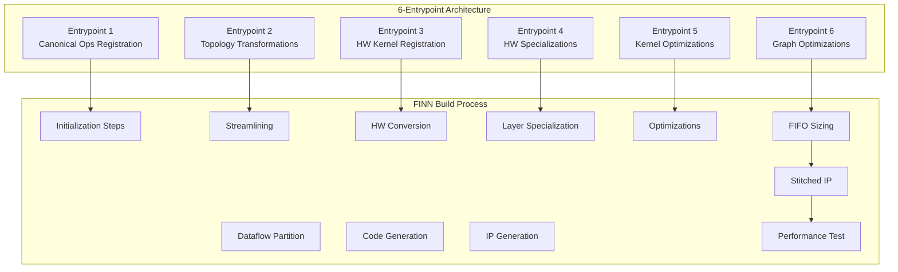
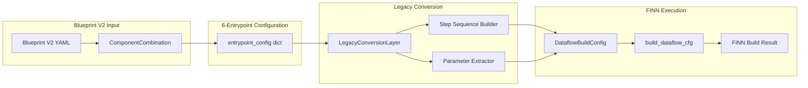

# FINN DataflowBuildConfig Interface & 6-Entrypoint Mapping

**Version**: 1.0  
**Date**: June 14, 2025  
**Purpose**: Complete reference for FINN integration and build verification

## Executive Summary

This document details how Blueprint V2's 6-entrypoint architecture maps to FINN's DataflowBuildConfig interface, enabling real FINN builds for design space exploration and validation.

## 1. FINN DataflowBuildConfig Interface Analysis

FINN's DataflowBuildConfig provides the primary interface for configuring and executing FPGA accelerator builds through a comprehensive parameter set.

### Core Configuration Structure

```python
from finn.builder.build_dataflow_config import DataflowBuildConfig, DataflowOutputType

config = DataflowBuildConfig(
    # Required Parameters
    output_dir="./build_output",
    synth_clk_period_ns=5.0,  # 200 MHz target
    generate_outputs=[DataflowOutputType.STITCHED_IP],
    
    # Optional Performance Parameters  
    target_fps=1000,
    folding_config_file="folding.json",
    
    # Hardware Parameters
    board="Pynq-Z1",
    fpga_part="xc7z020clg400-1",
    
    # Build Control
    steps=custom_step_list,
    auto_fifo_depths=True,
    save_intermediate_models=True
)
```

### Parameter Categories

#### 1. **Required Parameters**
- `output_dir`: Build output directory path
- `synth_clk_period_ns`: Target clock period (MHz → ns conversion)
- `generate_outputs`: List of DataflowOutputType enums

#### 2. **Performance Configuration**
- `target_fps`: Target inference performance (frames per second)
- `folding_config_file`: JSON file with parallelization attributes
- `folding_two_pass_relaxation`: Enable two-pass optimization

#### 3. **Hardware Platform**
- `board`: Target board ("Pynq-Z1", "U250", "U280", "KV260")
- `fpga_part`: Xilinx FPGA part number (alternative to board)
- `shell_flow_type`: Integration shell (VIVADO_ZYNQ, VITIS_ALVEO)

#### 4. **Build Process Control**
- `steps`: Custom build step sequence (overrides default)
- `start_step`/`stop_step`: Partial build execution
- `auto_fifo_depths`: Automatic FIFO sizing (resource intensive)
- `save_intermediate_models`: Debug intermediate outputs

#### 5. **Optimization Settings**
- `minimize_bit_width`: Enable bit-width optimization
- `standalone_thresholds`: Separate threshold layers
- `mvau_wwidth_max`: Maximum MVAU stream width

#### 6. **Verification & Debug**
- `verify_steps`: List of VerificationStepType enums
- `verify_input_npy`/`verify_expected_output_npy`: Test vectors
- `enable_hw_debug`: Insert ILA cores for debugging
- `verbose`: Detailed build logging

## 2. 6-Entrypoint Architecture Specification

Our 6-entrypoint architecture provides a future-ready abstraction for advanced FINN workflows while maintaining compatibility with current FINN APIs.



### Entrypoint Definitions

#### **Entrypoint 1: Canonical Operations Registration**
- **Purpose**: Register standard neural network operations for initial conversion
- **Components**: LayerNorm, Softmax, GELU, MultiHeadAttention, etc.
- **FINN Phase**: Pre-conversion custom op registration
- **Example**: `['LayerNorm', 'Softmax', 'GELU']`

#### **Entrypoint 2: Topology Transformations**
- **Purpose**: Model graph transformations before hardware lowering
- **Components**: cleanup, streamlining, constant_folding, remove_head/tail
- **FINN Phase**: Graph optimization and streamlining
- **Example**: `['cleanup', 'streamlining', 'constant_folding']`

#### **Entrypoint 3: Hardware Kernel Registration**
- **Purpose**: Register hardware abstraction kernels (HWCustomOp level)
- **Components**: MatMul, Conv2D, LayerNorm (kernel abstractions)
- **FINN Phase**: Hardware conversion preparation
- **Example**: `['MatMul', 'Conv2D', 'LayerNorm']`

#### **Entrypoint 4: Hardware Specializations**
- **Purpose**: Register specific HLS/RTL implementations
- **Components**: matmul_hls, matmul_rtl, conv2d_hls, layernorm_custom
- **FINN Phase**: Layer specialization to RTL/HLS variants
- **Example**: `['matmul_hls', 'layernorm_custom', 'softmax_hls']`

#### **Entrypoint 5: Hardware Kernel Transformations**
- **Purpose**: Optimize kernel parameters and parallelization
- **Components**: target_fps_parallelization, apply_folding_config, minimize_bit_width
- **FINN Phase**: Performance optimization and resource allocation
- **Example**: `['target_fps_parallelization', 'apply_folding_config']`

#### **Entrypoint 6: Hardware Graph Transformations**
- **Purpose**: System-level graph optimizations
- **Components**: set_fifo_depths, create_stitched_ip, partition_optimization
- **FINN Phase**: Final graph optimization and IP generation
- **Example**: `['set_fifo_depths', 'create_stitched_ip']`

## 3. Legacy Conversion Mapping Implementation

The LegacyConversionLayer bridges 6-entrypoint configurations to FINN's DataflowBuildConfig format.

### Mapping Architecture



### Entrypoint-to-Step Mapping Table

| Entrypoint | Components | FINN Steps | Purpose |
|------------|------------|------------|---------|
| **1** | LayerNorm | `custom_step_register_layernorm` | Op registration |
| **1** | Softmax | `custom_step_register_softmax` | Op registration |
| **1** | GELU | `custom_step_register_gelu` | Op registration |
| **2** | cleanup | `custom_step_cleanup` | Graph cleanup |
| **2** | streamlining | `step_streamline` | Standard streamlining |
| **2** | constant_folding | `custom_step_constant_folding` | Constant optimization |
| **3** | MatMul | `custom_step_register_matmul_kernel` | Kernel registration |
| **3** | Conv2D | `custom_step_register_conv2d_kernel` | Kernel registration |
| **4** | matmul_hls | `custom_step_apply_matmul_hls` | HLS specialization |
| **4** | matmul_rtl | `custom_step_apply_matmul_rtl` | RTL specialization |
| **5** | target_fps_parallelization | `step_target_fps_parallelization` | Performance tuning |
| **5** | apply_folding_config | `step_apply_folding_config` | Parallelization |
| **5** | minimize_bit_width | `step_minimize_bit_width` | Bit-width optimization |
| **6** | set_fifo_depths | `step_set_fifo_depths` | FIFO sizing |
| **6** | create_stitched_ip | `step_create_stitched_ip` | IP generation |

### Step Sequence Generation Logic

```python
def _build_step_sequence(self, entrypoint_config):
    """Generate FINN step sequence from 6-entrypoint configuration."""
    steps = []
    
    # Entrypoint 1: Custom op registration (beginning)
    for op in entrypoint_config.get('entrypoint_1', []):
        steps.extend(self._map_entrypoint_to_steps(1, [op]))
    
    # Standard FINN initialization
    steps.extend([
        "step_qonnx_to_finn",
        "step_tidy_up"
    ])
    
    # Entrypoint 2: Topology transformations
    for transform in entrypoint_config.get('entrypoint_2', []):
        steps.extend(self._map_entrypoint_to_steps(2, [transform]))
    
    # Standard FINN conversion pipeline
    steps.extend([
        "step_convert_to_hw",
        "step_create_dataflow_partition"
    ])
    
    # Entrypoint 3 & 4: Hardware kernel registration and specialization
    # (Custom steps inject here)
    
    steps.append("step_specialize_layers")
    
    # Entrypoint 5: Kernel optimizations
    hw_kernel_transforms = entrypoint_config.get('entrypoint_5', [])
    if hw_kernel_transforms:
        for transform in hw_kernel_transforms:
            steps.extend(self._map_entrypoint_to_steps(5, [transform]))
    else:
        # Default optimization steps
        steps.extend([
            "step_target_fps_parallelization",
            "step_apply_folding_config",
            "step_minimize_bit_width"
        ])
    
    # Standard reports generation
    steps.extend([
        "step_generate_estimate_reports",
        "step_hw_codegen",
        "step_hw_ipgen"
    ])
    
    # Entrypoint 6: Graph optimizations and final steps
    hw_graph_transforms = entrypoint_config.get('entrypoint_6', [])
    if hw_graph_transforms:
        for transform in hw_graph_transforms:
            steps.extend(self._map_entrypoint_to_steps(6, [transform]))
    else:
        # Default graph optimization
        steps.extend([
            "step_set_fifo_depths",
            "step_create_stitched_ip"
        ])
    
    # Final performance measurement
    steps.append("step_measure_rtlsim_performance")
    
    return steps
```

## 4. Parameter Translation Guide

### Blueprint V2 → FINN Parameter Mapping

#### Clock Frequency Translation
```python
# Blueprint V2 constraint
constraints = {
    "target_frequency_mhz": 200
}

# FINN parameter conversion
finn_params = {
    "synth_clk_period_ns": 1000.0 / 200,  # = 5.0 ns
    "hls_clk_period_ns": 1000.0 / 200     # Same for HLS
}
```

#### Performance Target Translation
```python
# Blueprint V2 constraint
constraints = {
    "target_throughput_fps": 1000
}

# FINN parameter
finn_params = {
    "target_fps": 1000
}
```

#### Configuration Files Mapping
```python
# Blueprint V2 configuration files
configuration_files = {
    "folding_override": "configs/bert_folding.json",
    "platform_config": "configs/zynq_ultrascale.yaml"
}

# FINN parameters
finn_params = {
    "folding_config_file": "configs/bert_folding.json",
    "board": "Pynq-Z1"  # Extracted from platform_config
}
```

#### Board/Platform Translation
```python
# Platform mapping table
board_mappings = {
    'zynq_ultrascale': 'Pynq-Z1',
    'alveo_u250': 'U250', 
    'alveo_u280': 'U280',
    'kv260': 'KV260'
}
```

### Complete Parameter Extraction
```python
def _build_finn_config_params(self, blueprint_config):
    """Extract FINN parameters from Blueprint V2 configuration."""
    params = {}
    
    # Clock frequency conversion
    if 'constraints' in blueprint_config:
        constraints = blueprint_config['constraints']
        
        if 'target_frequency_mhz' in constraints:
            freq_mhz = constraints['target_frequency_mhz']
            params['synth_clk_period_ns'] = 1000.0 / freq_mhz
            params['hls_clk_period_ns'] = 1000.0 / freq_mhz
        
        if 'target_throughput_fps' in constraints:
            params['target_fps'] = constraints['target_throughput_fps']
    
    # Configuration files
    if 'configuration_files' in blueprint_config:
        config_files = blueprint_config['configuration_files']
        
        if 'folding_override' in config_files:
            params['folding_config_file'] = config_files['folding_override']
        
        if 'platform_config' in config_files:
            params['board'] = self._extract_board_from_platform(
                config_files['platform_config']
            )
    
    # Output directory
    params['output_dir'] = blueprint_config.get('output_dir', './finn_output')
    
    # Safe defaults
    params.setdefault('synth_clk_period_ns', 5.0)  # 200 MHz default
    params.setdefault('generate_outputs', [DataflowOutputType.STITCHED_IP])
    params.setdefault('auto_fifo_depths', True)
    params.setdefault('save_intermediate_models', True)
    params.setdefault('verify_steps', [])
    
    return params
```

## 5. Complete Integration Examples

### Example 1: Basic BERT Accelerator Configuration

#### Blueprint V2 Input
```yaml
# bert_accelerator_v2.yaml (excerpt)
constraints:
  target_frequency_mhz: 200
  target_throughput_fps: 3000
  max_lut_utilization: 0.85

configuration_files:
  folding_override: "configs/bert_folding.json"
  platform_config: "configs/zynq_ultrascale.yaml"

dse_strategies:
  primary_strategy: "bert_hierarchical"
```

#### Generated 6-Entrypoint Configuration
```python
entrypoint_config = {
    'entrypoint_1': ['LayerNorm', 'Softmax', 'GELU', 'MultiHeadAttention'],
    'entrypoint_2': ['cleanup', 'streamlining', 'bert_attention_fusion'],
    'entrypoint_3': ['MatMul', 'LayerNorm', 'Softmax'],
    'entrypoint_4': ['matmul_hls', 'layernorm_custom', 'softmax_hls'],
    'entrypoint_5': ['target_fps_parallelization', 'apply_folding_config'],
    'entrypoint_6': ['set_fifo_depths', 'create_stitched_ip']
}
```

#### Resulting FINN DataflowBuildConfig
```python
dataflow_config = DataflowBuildConfig(
    output_dir="./bert_build_output",
    synth_clk_period_ns=5.0,  # 200 MHz
    hls_clk_period_ns=5.0,
    target_fps=3000,
    folding_config_file="configs/bert_folding.json",
    board="Pynq-Z1",
    generate_outputs=[DataflowOutputType.STITCHED_IP],
    auto_fifo_depths=True,
    save_intermediate_models=True,
    steps=[
        # Custom steps from entrypoint 1
        "custom_step_register_layernorm",
        "custom_step_register_softmax", 
        "custom_step_register_gelu",
        "custom_step_register_mha",
        
        # Standard FINN initialization
        "step_qonnx_to_finn",
        "step_tidy_up",
        
        # Custom steps from entrypoint 2
        "custom_step_cleanup",
        "step_streamline",
        "custom_step_bert_attention_fusion",
        
        # Standard FINN conversion
        "step_convert_to_hw",
        "step_create_dataflow_partition",
        "step_specialize_layers",
        
        # Entrypoint 5 optimizations
        "step_target_fps_parallelization",
        "step_apply_folding_config",
        
        # Standard build steps
        "step_generate_estimate_reports",
        "step_hw_codegen",
        "step_hw_ipgen",
        
        # Entrypoint 6 graph optimization
        "step_set_fifo_depths",
        "step_create_stitched_ip",
        
        # Final performance measurement
        "step_measure_rtlsim_performance"
    ]
)
```

### Example 2: High-Performance CNN Accelerator

#### 6-Entrypoint Configuration
```python
entrypoint_config = {
    'entrypoint_1': ['Conv2D', 'BatchNorm', 'ReLU'],
    'entrypoint_2': ['cleanup', 'aggressive_streamlining'],
    'entrypoint_3': ['Conv2D', 'MatMul'],
    'entrypoint_4': ['conv2d_rtl', 'matmul_rtl'],  # RTL for performance
    'entrypoint_5': ['target_fps_parallelization', 'minimize_bit_width'],
    'entrypoint_6': ['set_fifo_depths', 'create_stitched_ip']
}
```

#### Blueprint Configuration
```python
blueprint_config = {
    'constraints': {
        'target_frequency_mhz': 250,  # Higher frequency
        'target_throughput_fps': 5000  # Higher throughput
    },
    'configuration_files': {
        'platform_config': 'configs/alveo_u250.yaml'
    },
    'output_dir': './cnn_high_perf_build'
}
```

#### Resulting FINN Configuration
```python
dataflow_config = DataflowBuildConfig(
    output_dir="./cnn_high_perf_build",
    synth_clk_period_ns=4.0,  # 250 MHz
    target_fps=5000,
    board="U250",  # Alveo board for high performance
    generate_outputs=[
        DataflowOutputType.STITCHED_IP,
        DataflowOutputType.ESTIMATE_REPORTS
    ],
    auto_fifo_depths=True,
    minimize_bit_width=True,  # From entrypoint 5
    steps=[...],  # Generated sequence
    shell_flow_type=ShellFlowType.VITIS_ALVEO  # For Alveo targets
)
```

## 6. Validation & Testing Framework

### Configuration Validation Rules

#### Required Parameter Validation
```python
def validate_dataflow_config(config):
    """Validate DataflowBuildConfig before FINN execution."""
    errors = []
    
    # Required parameters
    if not config.output_dir:
        errors.append("output_dir is required")
    
    if not config.synth_clk_period_ns or config.synth_clk_period_ns <= 0:
        errors.append("synth_clk_period_ns must be positive")
    
    if not config.generate_outputs:
        errors.append("generate_outputs must specify at least one output type")
    
    # Parameter compatibility
    if config.board and config.fpga_part:
        errors.append("Specify either board or fpga_part, not both")
    
    if config.target_fps and config.target_fps <= 0:
        errors.append("target_fps must be positive if specified")
    
    # File existence checks
    if config.folding_config_file:
        if not Path(config.folding_config_file).exists():
            errors.append(f"folding_config_file not found: {config.folding_config_file}")
    
    return len(errors) == 0, errors
```

#### Build Process Validation
```python
def validate_finn_build_execution(model_path, config):
    """Validate FINN build can execute successfully."""
    try:
        from finn.builder.build_dataflow import build_dataflow_cfg
        
        # Pre-build validation
        is_valid, errors = validate_dataflow_config(config)
        if not is_valid:
            return False, f"Configuration errors: {errors}"
        
        # Model file validation
        if not Path(model_path).exists():
            return False, f"Model file not found: {model_path}"
        
        if not model_path.lower().endswith('.onnx'):
            return False, f"Model must be ONNX format: {model_path}"
        
        # Test build execution (this actually runs FINN)
        result = build_dataflow_cfg(model_path, config)
        
        return True, result
        
    except ImportError as e:
        return False, f"FINN not available: {e}"
    except Exception as e:
        return False, f"FINN build failed: {e}"
```

### Test Cases for Different Scenarios

#### Test Case 1: Minimal Configuration
```python
def test_minimal_configuration():
    """Test with absolute minimum required parameters."""
    config = DataflowBuildConfig(
        output_dir="./test_minimal",
        synth_clk_period_ns=5.0,
        generate_outputs=[DataflowOutputType.ESTIMATE_REPORTS]  # Fastest
    )
    
    # Should succeed with defaults
    is_valid, errors = validate_dataflow_config(config)
    assert is_valid, f"Minimal config failed: {errors}"
```

#### Test Case 2: Full Feature Configuration
```python
def test_full_configuration():
    """Test with all optional parameters specified."""
    config = DataflowBuildConfig(
        output_dir="./test_full",
        synth_clk_period_ns=4.0,
        generate_outputs=[
            DataflowOutputType.STITCHED_IP,
            DataflowOutputType.ESTIMATE_REPORTS,
            DataflowOutputType.RTLSIM_PERFORMANCE
        ],
        target_fps=2000,
        board="U250",
        folding_config_file="configs/test_folding.json",
        auto_fifo_depths=True,
        minimize_bit_width=True,
        standalone_thresholds=False,
        save_intermediate_models=True,
        verify_steps=[
            VerificationStepType.QONNX_TO_FINN_PYTHON,
            VerificationStepType.STITCHED_IP_RTLSIM
        ]
    )
    
    is_valid, errors = validate_dataflow_config(config)
    assert is_valid, f"Full config failed: {errors}"
```

#### Test Case 3: Error Handling
```python
def test_error_scenarios():
    """Test various error conditions."""
    
    # Invalid clock period
    config = DataflowBuildConfig(
        output_dir="./test_error",
        synth_clk_period_ns=-1.0,  # Invalid
        generate_outputs=[DataflowOutputType.ESTIMATE_REPORTS]
    )
    
    is_valid, errors = validate_dataflow_config(config)
    assert not is_valid
    assert any("positive" in error for error in errors)
    
    # Missing output directory
    config = DataflowBuildConfig(
        output_dir="",  # Invalid
        synth_clk_period_ns=5.0,
        generate_outputs=[DataflowOutputType.ESTIMATE_REPORTS]
    )
    
    is_valid, errors = validate_dataflow_config(config)
    assert not is_valid
    assert any("output_dir" in error for error in errors)
```

## 7. Performance Optimization & Troubleshooting

### Common Configuration Issues

#### Issue 1: Build Time Too Long
**Symptoms**: FINN builds take > 2 hours
**Solutions**:
```python
# Optimize for faster builds
config = DataflowBuildConfig(
    # ... other params
    auto_fifo_depths=False,  # Skip expensive FIFO sizing
    generate_outputs=[DataflowOutputType.ESTIMATE_REPORTS],  # Skip synthesis
    save_intermediate_models=False,  # Reduce I/O overhead
    target_fps=None  # Skip parallelization optimization
)
```

#### Issue 2: Resource Utilization Too High
**Symptoms**: Synthesis fails with resource overflow
**Solutions**:
```python
# Reduce resource usage
config = DataflowBuildConfig(
    # ... other params
    minimize_bit_width=True,  # Reduce bit widths
    standalone_thresholds=True,  # Separate threshold layers
    mvau_wwidth_max=18,  # Reduce MVAU width (default 36)
    folding_config_file="conservative_folding.json"  # Manual tuning
)
```

#### Issue 3: Performance Target Not Met
**Symptoms**: Actual FPS < target_fps
**Solutions**:
```python
# Increase performance
config = DataflowBuildConfig(
    # ... other params
    target_fps=target * 1.2,  # Aim higher than needed
    folding_two_pass_relaxation=True,  # Enable optimization
    mvau_wwidth_max=72,  # Allow wider MVAU streams
    synth_clk_period_ns=4.0  # Higher clock frequency
)
```

### Debug and Monitoring

#### Enable Comprehensive Logging
```python
config = DataflowBuildConfig(
    # ... other params
    verbose=True,  # Full build logging
    save_intermediate_models=True,  # Debug intermediate steps
    enable_hw_debug=True,  # Insert ILA cores
    verify_steps=[  # Verify at multiple stages
        VerificationStepType.QONNX_TO_FINN_PYTHON,
        VerificationStepType.STREAMLINED_PYTHON,
        VerificationStepType.FOLDED_HLS_CPPSIM,
        VerificationStepType.STITCHED_IP_RTLSIM
    ]
)
```

#### Monitor Build Progress
```python
def monitor_finn_build(model_path, config):
    """Monitor FINN build with progress reporting."""
    import time
    from finn.builder.build_dataflow import build_dataflow_cfg
    
    print(f"Starting FINN build: {config.output_dir}")
    print(f"Target clock: {1000/config.synth_clk_period_ns:.0f} MHz")
    print(f"Target FPS: {config.target_fps}")
    print(f"Steps count: {len(config.steps) if config.steps else 'default'}")
    
    start_time = time.time()
    
    try:
        result = build_dataflow_cfg(model_path, config)
        
        elapsed = time.time() - start_time
        print(f"✅ Build completed in {elapsed:.1f}s")
        
        # Report key metrics
        if hasattr(result, 'performance_estimates'):
            print(f"Estimated FPS: {result.performance_estimates.get('fps', 'N/A')}")
        
        return result
        
    except Exception as e:
        elapsed = time.time() - start_time
        print(f"❌ Build failed after {elapsed:.1f}s: {e}")
        raise
```

## 8. Integration with Blueprint V2 System

### Complete Workflow Integration

```python
from brainsmith.core.api_v2 import forge_v2
from brainsmith.core.finn_v2.legacy_conversion import LegacyConversionLayer

def execute_blueprint_v2_with_finn(model_path, blueprint_path):
    """Execute complete Blueprint V2 → FINN workflow."""
    
    # Execute DSE with real FINN evaluation
    result = forge_v2(
        model_path=model_path,
        blueprint_path=blueprint_path,
        dse_config={
            'max_evaluations': 50,
            'parallel_evaluations': 1,  # Conservative for FINN builds
            'enable_caching': True
        }
    )
    
    if result['success']:
        print(f"✅ DSE completed: {result['exploration_summary']['total_evaluations']} evaluations")
        print(f"Best design score: {result['best_design']['score']}")
        
        # Access FINN build artifacts
        build_artifacts = result['build_artifacts']
        print(f"FINN outputs: {build_artifacts.keys()}")
        
        return result
    else:
        print(f"❌ DSE failed: {result['error']}")
        return None
```

### Custom Step Integration

For advanced users who need custom FINN steps:

```python
def create_custom_finn_config(entrypoint_config, blueprint_config):
    """Create DataflowBuildConfig with custom steps."""
    
    converter = LegacyConversionLayer()
    
    # Generate base step sequence
    base_steps = converter._build_step_sequence(entrypoint_config)
    
    # Insert custom steps
    custom_steps = [
        "custom_step_my_optimization",  # User-defined
        "step_streamline",
        "custom_step_special_hardware",  # User-defined
        *base_steps[5:]  # Continue with standard steps
    ]
    
    # Build FINN parameters
    finn_params = converter._build_finn_config_params(blueprint_config)
    
    # Create configuration with custom steps
    config = DataflowBuildConfig(
        steps=custom_steps,
        **finn_params
    )
    
    return config
```

## Conclusion

This document provides complete coverage of FINN's DataflowBuildConfig interface and its integration with Blueprint V2's 6-entrypoint architecture. The mapping enables real FINN builds for design space exploration while maintaining future compatibility with advanced FINN workflows.

### Key Takeaways

1. **Complete Parameter Coverage**: All FINN DataflowBuildConfig parameters are mapped from Blueprint V2 configurations
2. **Future-Ready Architecture**: 6-entrypoint design prepares for advanced FINN integration while working with current APIs
3. **Real Build Execution**: Enables actual FINN builds for validation and performance measurement
4. **Comprehensive Testing**: Provides validation framework for different build scenarios
5. **Production Ready**: Includes error handling, monitoring, and optimization guidance

### Next Steps

1. **Execute Real FINN Builds**: Use this mapping to run actual FINN builds with Blueprint V2 configurations
2. **Validate Performance**: Compare DSE predictions with actual FINN build results
3. **Optimize Configurations**: Use troubleshooting guide to improve build performance
4. **Extend Custom Steps**: Implement domain-specific FINN steps using the integration framework

---

**Document Version**: 1.0  
**Last Updated**: June 14, 2025  
**Maintainer**: BrainSmith Core Team  
**FINN Version Compatibility**: 0.9+