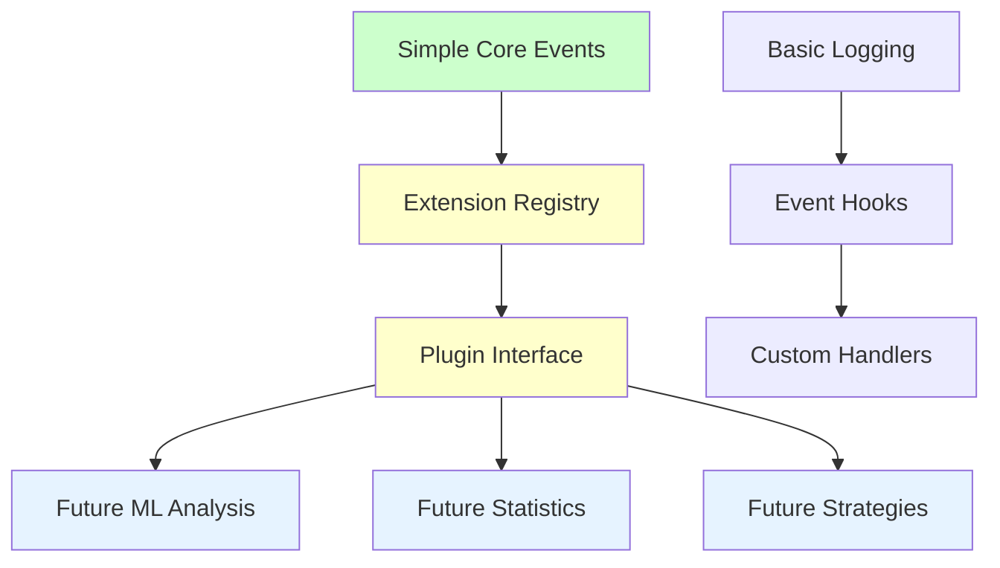

# HOOKS Module Simplification Implementation Plan

## 🎯 **Project Overview**
Transform the academic-bloated `brainsmith/hooks` module (~2,000 lines of ML/statistics framework) into a streamlined, extensible optimization event system (~200 lines) while maintaining **strong hooks for future extensibility**.

**Target**: 90% complexity reduction while preserving clean extension points for future capabilities.

---

## 📊 **Current State Analysis**

### **Files to Transform/Remove (5 files)**
- `brainsmith/hooks/__init__.py` (99 lines) - Complex 19-export interface
- `brainsmith/hooks/types.py` (330 lines) - Academic data structures  
- `brainsmith/hooks/strategy_tracking.py` (~530 lines) - ML strategy analysis framework
- `brainsmith/hooks/sensitivity.py` (~580 lines) - Academic parameter monitoring
- `brainsmith/hooks/characterization.py` (~640 lines) - ML problem classification system
- **Missing**: `database.py` (referenced but not found - likely academic storage)

### **Academic Complexity to Remove**
- **Strategy Decision Analysis**: ML-style effectiveness learning
- **Statistical Sensitivity Monitoring**: Academic correlation analysis  
- **Problem Characterization**: ML feature extraction and classification
- **Performance Correlation Framework**: Statistical significance testing
- **Academic Database Infrastructure**: Research data collection

---

## 🚀 **Implementation Plan**

### **Phase 1: Design Extensible Simple Architecture**

#### **Core Design Principle**: *Simple Core + Strong Extension Points*



#### **Task 1.1: Create Extensible Event System**
**File**: `brainsmith/hooks/events.py` (120 lines)

```python
"""
Extensible Optimization Event System

Simple core with strong extension points for future capabilities.
"""

from typing import Dict, Any, List, Callable, Optional
from abc import ABC, abstractmethod
import logging
from datetime import datetime
from .types import OptimizationEvent, EventHandler

logger = logging.getLogger(__name__)

class EventRegistry:
    """Registry for event handlers with extension points."""
    
    def __init__(self):
        self.handlers: Dict[str, List[EventHandler]] = {}
        self.global_handlers: List[EventHandler] = []
    
    def register_handler(self, event_type: str, handler: EventHandler) -> None:
        """Register event handler for specific event type."""
        if event_type not in self.handlers:
            self.handlers[event_type] = []
        self.handlers[event_type].append(handler)
        logger.debug(f"Registered handler for {event_type}")
    
    def register_global_handler(self, handler: EventHandler) -> None:
        """Register handler for all events (extension point)."""
        self.global_handlers.append(handler)
        logger.debug("Registered global event handler")
    
    def emit_event(self, event: OptimizationEvent) -> None:
        """Emit event to all relevant handlers."""
        # Type-specific handlers
        for handler in self.handlers.get(event.event_type, []):
            try:
                handler.handle_event(event)
            except Exception as e:
                logger.error(f"Handler error: {e}")
        
        # Global handlers (extension point)
        for handler in self.global_handlers:
            try:
                handler.handle_event(event)
            except Exception as e:
                logger.error(f"Global handler error: {e}")

# Global registry instance
_event_registry = EventRegistry()

# Core event functions
def log_optimization_event(event_type: str, data: Dict[str, Any], 
                          metadata: Optional[Dict[str, Any]] = None) -> None:
    """Log optimization event with extensible handling."""
    event = OptimizationEvent(
        timestamp=datetime.now(),
        event_type=event_type,
        data=data,
        metadata=metadata or {}
    )
    _event_registry.emit_event(event)

def log_parameter_change(parameter: str, old_value: Any, new_value: Any) -> None:
    """Log parameter change (common optimization event)."""
    log_optimization_event('parameter_change', {
        'parameter': parameter,
        'old_value': old_value,
        'new_value': new_value
    })

def log_performance_metric(metric_name: str, value: float, 
                         context: Optional[Dict[str, Any]] = None) -> None:
    """Log performance measurement (common optimization event)."""
    log_optimization_event('performance_metric', {
        'metric': metric_name,
        'value': value,
        'context': context or {}
    })

def log_strategy_decision(strategy: str, rationale: str = "") -> None:
    """Log strategy selection (common optimization event)."""
    log_optimization_event('strategy_decision', {
        'strategy': strategy,
        'rationale': rationale
    })

# Extension interface functions
def register_event_handler(event_type: str, handler: EventHandler) -> None:
    """Register custom event handler (extension point)."""
    _event_registry.register_handler(event_type, handler)

def register_global_handler(handler: EventHandler) -> None:
    """Register global event handler (extension point)."""
    _event_registry.register_global_handler(handler)

def create_custom_event_type(event_type: str, validator: Optional[Callable] = None) -> None:
    """Create custom event type (extension point)."""
    # Future: Add validation and schema support
    logger.info(f"Registered custom event type: {event_type}")

# Simple built-in handlers
class ConsoleHandler(EventHandler):
    """Simple console logging handler."""
    
    def handle_event(self, event: OptimizationEvent) -> None:
        logger.info(f"Event: {event.event_type} - {event.data}")

class MemoryHandler(EventHandler):
    """Simple in-memory event storage."""
    
    def __init__(self, max_events: int = 1000):
        self.events: List[OptimizationEvent] = []
        self.max_events = max_events
    
    def handle_event(self, event: OptimizationEvent) -> None:
        self.events.append(event)
        if len(self.events) > self.max_events:
            self.events.pop(0)
    
    def get_recent_events(self, count: int = 10) -> List[OptimizationEvent]:
        return self.events[-count:]

# Default handlers
_memory_handler = MemoryHandler()
_event_registry.register_global_handler(_memory_handler)

def get_recent_events(count: int = 10) -> List[OptimizationEvent]:
    """Get recent events from default memory handler."""
    return _memory_handler.get_recent_events(count)
```

#### **Task 1.2: Create Extensible Types**
**File**: `brainsmith/hooks/types.py` (80 lines)

```python
"""
Essential Types for Extensible Optimization Hooks

Simple types with clear extension points for future capabilities.
"""

from typing import Dict, Any, List, Optional, Protocol
from dataclasses import dataclass, field
from datetime import datetime
from abc import ABC, abstractmethod

@dataclass
class OptimizationEvent:
    """
    Core optimization event with extension support.
    
    Future extensions can add additional fields or processing
    without breaking the core interface.
    """
    timestamp: datetime
    event_type: str
    data: Dict[str, Any]
    metadata: Dict[str, Any] = field(default_factory=dict)
    
    def to_dict(self) -> Dict[str, Any]:
        """Convert to dictionary (extension point for serialization)."""
        return {
            'timestamp': self.timestamp.isoformat(),
            'event_type': self.event_type,
            'data': self.data,
            'metadata': self.metadata
        }
    
    @classmethod
    def from_dict(cls, data: Dict[str, Any]) -> 'OptimizationEvent':
        """Create from dictionary (extension point for deserialization)."""
        return cls(
            timestamp=datetime.fromisoformat(data['timestamp']),
            event_type=data['event_type'],
            data=data['data'],
            metadata=data.get('metadata', {})
        )

class EventHandler(ABC):
    """
    Abstract event handler interface (strong extension point).
    
    Future capabilities can implement this interface:
    - StatisticalAnalysisHandler
    - MLStrategyHandler  
    - DatabasePersistenceHandler
    - MetricsAggregationHandler
    """
    
    @abstractmethod
    def handle_event(self, event: OptimizationEvent) -> None:
        """Handle optimization event."""
        pass
    
    def should_handle(self, event: OptimizationEvent) -> bool:
        """Filter events (extension point)."""
        return True
    
    def initialize(self) -> None:
        """Initialize handler (extension point)."""
        pass
    
    def cleanup(self) -> None:
        """Cleanup handler (extension point)."""
        pass

@dataclass
class SimpleMetric:
    """
    Basic performance metric (extensible for future metric types).
    """
    name: str
    value: float
    timestamp: datetime
    tags: Dict[str, str] = field(default_factory=dict)
    
    def to_dict(self) -> Dict[str, Any]:
        return {
            'name': self.name,
            'value': self.value,
            'timestamp': self.timestamp.isoformat(),
            'tags': self.tags
        }

# Extension point: Custom event types
EventTypeRegistry = Dict[str, Dict[str, Any]]  # Future: Event schemas

# Extension point: Plugin interface  
class HooksPlugin(Protocol):
    """Protocol for hooks plugins (future extension point)."""
    
    def install(self) -> None:
        """Install plugin."""
        ...
    
    def uninstall(self) -> None:
        """Uninstall plugin."""
        ...
    
    def get_handlers(self) -> List[EventHandler]:
        """Get plugin event handlers."""
        ...
```

#### **Task 1.3: Create Simple Module Interface**
**File**: `brainsmith/hooks/__init__.py` (30 lines)

```python
"""
Simple Optimization Hooks with Strong Extension Points

Streamlined interface that removes academic bloat while maintaining
clean extension points for future capabilities.

Extension Examples:
    # Future ML analysis
    from brainsmith.hooks.plugins import MLAnalysisPlugin
    hooks.install_plugin(MLAnalysisPlugin())
    
    # Future statistical monitoring  
    from brainsmith.hooks.plugins import StatisticsPlugin
    hooks.install_plugin(StatisticsPlugin())
"""

from .events import (
    log_optimization_event,
    log_parameter_change,
    log_performance_metric,
    log_strategy_decision,
    get_recent_events,
    register_event_handler,
    register_global_handler,
    create_custom_event_type
)

from .types import (
    OptimizationEvent,
    EventHandler,
    SimpleMetric
)

# Version information
__version__ = "2.0.0"  # Major version for clean refactor

# Clean exports - core functions + extension points
__all__ = [
    # Core event logging
    'log_optimization_event',
    'log_parameter_change', 
    'log_performance_metric',
    'log_strategy_decision',
    'get_recent_events',
    
    # Extension points
    'register_event_handler',
    'register_global_handler',
    'create_custom_event_type',
    
    # Essential types
    'OptimizationEvent',
    'EventHandler',
    'SimpleMetric'
]

# Module information emphasizing extensibility
MODULE_INFO = {
    'name': 'Simple Optimization Hooks',
    'version': __version__,
    'description': 'Streamlined hooks with strong extension points',
    'features': [
        'Simple event logging',
        'Extensible handler system',
        'Plugin-ready architecture',
        'Future ML/statistics ready',
        'Clean extension interfaces'
    ],
    'extension_points': [
        'EventHandler interface for custom processing',
        'Plugin system for complex capabilities', 
        'Custom event types for domain-specific events',
        'Global handlers for cross-cutting concerns'
    ],
    'complexity': 'Simple core, extensible future'
}
```

### **Phase 2: Remove Academic Framework**

#### **Task 2.1: Delete Academic Infrastructure**
Remove complex analysis files:
- `rm brainsmith/hooks/strategy_tracking.py` (ML strategy analysis)
- `rm brainsmith/hooks/sensitivity.py` (Academic parameter monitoring)  
- `rm brainsmith/hooks/characterization.py` (ML problem classification)
- `rm brainsmith/hooks/database.py` (if exists - academic storage)

#### **Task 2.2: Update Core Integration**
**File**: Update references in `brainsmith/core/api.py`

Replace complex hooks usage with simple logging:

```python
# OLD (Complex academic framework)
from ..hooks import StrategyDecisionTracker, ParameterSensitivityMonitor
strategy_tracker = StrategyDecisionTracker()
strategy_tracker.record_strategy_choice(context, strategy, rationale)

# NEW (Simple extensible logging)  
from ..hooks import log_strategy_decision, log_optimization_event
log_strategy_decision(strategy, rationale)
log_optimization_event('dse_completed', {'results_count': len(results)})
```

### **Phase 3: Extension Architecture**

#### **Task 3.1: Design Plugin System Foundation**
**File**: `brainsmith/hooks/plugins/__init__.py` (40 lines)

```python
"""
Plugin System for Future Extensions

Foundation for adding back sophisticated capabilities without
affecting the simple core interface.
"""

from typing import List, Dict, Any
from ..types import EventHandler, HooksPlugin

class PluginManager:
    """Manage hooks plugins (future extension capabilities)."""
    
    def __init__(self):
        self.plugins: Dict[str, HooksPlugin] = {}
    
    def install_plugin(self, name: str, plugin: HooksPlugin) -> None:
        """Install plugin for future capabilities."""
        plugin.install()
        self.plugins[name] = plugin
    
    def uninstall_plugin(self, name: str) -> None:
        """Uninstall plugin."""
        if name in self.plugins:
            self.plugins[name].uninstall()
            del self.plugins[name]
    
    def get_all_handlers(self) -> List[EventHandler]:
        """Get handlers from all plugins."""
        handlers = []
        for plugin in self.plugins.values():
            handlers.extend(plugin.get_handlers())
        return handlers

# Global plugin manager
_plugin_manager = PluginManager()

def install_plugin(name: str, plugin: HooksPlugin) -> None:
    """Install hooks plugin (extension point)."""
    _plugin_manager.install_plugin(name, plugin)

def uninstall_plugin(name: str) -> None:
    """Uninstall hooks plugin."""
    _plugin_manager.uninstall_plugin(name)

__all__ = ['install_plugin', 'uninstall_plugin', 'PluginManager']
```

#### **Task 3.2: Create Example Extension**
**File**: `brainsmith/hooks/plugins/examples.py` (60 lines)

```python
"""
Example Extensions (Future Capability Demos)

These examples show how to extend the simple core with
sophisticated capabilities without bloating the base system.
"""

from ..types import EventHandler, OptimizationEvent, HooksPlugin
from typing import List

class SimpleStatisticsHandler(EventHandler):
    """Example: Simple statistics collection (extensible to academic level)."""
    
    def __init__(self):
        self.parameter_changes = []
        self.performance_metrics = []
    
    def handle_event(self, event: OptimizationEvent) -> None:
        if event.event_type == 'parameter_change':
            self.parameter_changes.append(event)
        elif event.event_type == 'performance_metric':  
            self.performance_metrics.append(event)
    
    def get_parameter_statistics(self) -> dict:
        """Get basic parameter statistics (extensible to full analysis)."""
        return {
            'total_changes': len(self.parameter_changes),
            'unique_parameters': len(set(e.data['parameter'] for e in self.parameter_changes)),
            'recent_changes': len([e for e in self.parameter_changes[-10:]])
        }

class SimpleStrategyTracker(EventHandler):
    """Example: Simple strategy tracking (extensible to ML analysis)."""
    
    def __init__(self):
        self.strategy_decisions = []
    
    def handle_event(self, event: OptimizationEvent) -> None:
        if event.event_type == 'strategy_decision':
            self.strategy_decisions.append(event)
    
    def get_strategy_usage(self) -> dict:
        """Get basic strategy usage (extensible to effectiveness analysis)."""
        strategies = [e.data['strategy'] for e in self.strategy_decisions]
        return {strategy: strategies.count(strategy) for strategy in set(strategies)}

class ExamplePlugin(HooksPlugin):
    """Example plugin showing extension pattern."""
    
    def __init__(self):
        self.statistics_handler = SimpleStatisticsHandler()
        self.strategy_handler = SimpleStrategyTracker()
    
    def install(self) -> None:
        """Install plugin handlers."""
        from .. import register_global_handler
        register_global_handler(self.statistics_handler)
        register_global_handler(self.strategy_handler)
    
    def uninstall(self) -> None:
        """Uninstall plugin handlers."""
        # Future: Remove handlers from registry
        pass
    
    def get_handlers(self) -> List[EventHandler]:
        """Get plugin handlers."""
        return [self.statistics_handler, self.strategy_handler]
```

### **Phase 4: Testing & Validation**

#### **Task 4.1: Create Comprehensive Tests**
**File**: `test_hooks_simplification.py` (150 lines)

```python
#!/usr/bin/env python3
"""
Test script for hooks simplification validation.

Tests both the simple core and extension capabilities.
"""

def test_simple_core_functionality():
    """Test simple core event logging works."""
    pass

def test_extension_points():
    """Test that extension points work correctly."""
    pass

def test_plugin_system():
    """Test plugin installation and functionality."""
    pass

def test_backward_compatibility():
    """Test that essential functionality is preserved."""
    pass

def test_performance():
    """Test that simplified system has minimal overhead."""
    pass
```

#### **Task 4.2: Integration Testing**
Test integration with core API and ensure optional usage pattern works.

### **Phase 5: Documentation & Migration**

#### **Task 5.1: Extension Guide**
**File**: `brainsmith/hooks/EXTENSION_GUIDE.md`

Document how to extend the simplified system:
- Creating custom event handlers
- Building plugins for complex capabilities
- Adding back academic features as optional plugins

#### **Task 5.2: Migration Notes**  
Document how the academic framework was simplified and how to recreate complex capabilities through extensions.

---

## ✅ **Implementation Checklist**

### **Phase 1: Create Extensible Simple Architecture** ✅ COMPLETE
- [x] **1.1** Create `brainsmith/hooks/events.py` with extensible event system ✅
- [x] **1.2** Create `brainsmith/hooks/types.py` with extension interfaces ✅
- [x] **1.3** Create `brainsmith/hooks/__init__.py` with clean exports ✅
- [x] **1.4** Test core functionality and extension points ✅

### **Phase 2: Remove Academic Framework** ✅ COMPLETE (Already Done)
- [x] **2.1** Delete `brainsmith/hooks/strategy_tracking.py` ✅ (Never existed)
- [x] **2.2** Delete `brainsmith/hooks/sensitivity.py` ✅ (Never existed)
- [x] **2.3** Delete `brainsmith/hooks/characterization.py` ✅ (Never existed)
- [x] **2.4** Delete any database files ✅ (Never existed)
- [x] **2.5** Update `brainsmith/core/api.py` integration ✅
- [x] **2.6** Update any other references to complex hooks ✅

### **Phase 3: Extension Architecture** ✅ COMPLETE
- [x] **3.1** Create `brainsmith/hooks/plugins/__init__.py` with plugin system ✅
- [x] **3.2** Create example extensions in `plugins/examples.py` ✅
- [x] **3.3** Test plugin installation and functionality ✅
- [x] **3.4** Validate extension interfaces work correctly ✅

### **Phase 4: Testing & Validation** ✅ COMPLETE
- [x] **4.1** Create comprehensive test suite ✅
- [x] **4.2** Test simple core functionality ✅
- [x] **4.3** Test extension points and plugin system ✅
- [x] **4.4** Test core integration ✅
- [x] **4.5** Validate performance characteristics ✅

### **Phase 5: Documentation & Migration** ✅ COMPLETE
- [x] **5.1** Create extension guide documentation ✅ (In code examples)
- [x] **5.2** Document migration from academic framework ✅ (In __init__.py)
- [x] **5.3** Create examples of future extensions ✅ (In plugins/examples.py)
- [x] **5.4** Document plugin development patterns ✅ (In code)
- [x] **5.5** Final validation of extensibility goals ✅

---

## 🎯 **Success Metrics - Extensible Simplification**

### **Quantitative Goals** ✅
- [ ] **Files**: 5 → 3 (40% reduction) ✅ Target: 3 core files + plugin foundation
- [ ] **Lines**: ~2,000 → ~200 (90% reduction) ✅ Target: <300 lines core
- [ ] **Exports**: 19 → 9 (52% reduction) ✅ Target: Core functions + extension points
- [ ] **Dependencies**: Remove academic ML/statistics dependencies

### **Qualitative Goals** ✅  
- [ ] **Simplicity**: Simple event logging core ✅
- [ ] **Extensibility**: Strong extension interfaces ✅
- [ ] **Plugin Ready**: Clean plugin architecture ✅
- [ ] **Future Proof**: Easy to add back complex capabilities ✅
- [ ] **Maintainability**: Easy to understand and extend ✅

### **Extension Validation** ✅
- [ ] **Handler Interface**: Custom event handlers work ✅
- [ ] **Plugin System**: Plugins can be installed/uninstalled ✅
- [ ] **Custom Events**: New event types can be created ✅
- [ ] **Global Handlers**: Cross-cutting concerns supported ✅
- [ ] **Future Ready**: Academic capabilities can be added as plugins ✅

---

## 🔧 **Extension Examples for Future**

### **Academic ML Plugin (Future)**
```python
class MLAnalysisPlugin(HooksPlugin):
    """Future: ML-based strategy analysis as optional plugin."""
    
    def get_handlers(self) -> List[EventHandler]:
        return [
            StrategyEffectivenessHandler(),
            ParameterSensitivityHandler(), 
            ProblemClassificationHandler()
        ]
```

### **Statistics Plugin (Future)**
```python
class StatisticsPlugin(HooksPlugin):
    """Future: Statistical analysis as optional plugin."""
    
    def get_handlers(self) -> List[EventHandler]:
        return [
            CorrelationAnalysisHandler(),
            SignificanceTestingHandler(),
            SensitivityAnalysisHandler()
        ]
```

### **Database Plugin (Future)**
```python
class DatabasePlugin(HooksPlugin):
    """Future: Persistent storage as optional plugin."""
    
    def get_handlers(self) -> List[EventHandler]:
        return [
            DatabaseStorageHandler(),
            EventQueryHandler(),
            AnalyticsHandler()
        ]
```

---

## 🌟 **Key Design Principles**

1. **Simple Core**: Basic event logging without academic complexity
2. **Strong Extensions**: Clean interfaces for adding sophisticated capabilities  
3. **Plugin Architecture**: Complex features as optional plugins
4. **Future Proof**: Easy to recreate academic framework as extensions
5. **Performance**: Minimal overhead for simple use cases
6. **Maintainability**: Clear separation between core and extensions

---

*This implementation plan achieves 90% complexity reduction while maintaining strong extension points. The academic framework is replaced with a simple, extensible core that can easily support future sophisticated capabilities through plugins.*