# Hardware Kernel Generator (HWKG) Architecture Analysis

## Overview

This document provides a comprehensive analysis of the Hardware Kernel Generator (HWKG) system based on analysis of test files and core components in `brainsmith/tools/hw_kernel_gen/`. The HWKG transforms SystemVerilog RTL modules with embedded pragmas into FINN-compatible Python components through a sophisticated 3-phase pipeline.

## High-Level Architecture

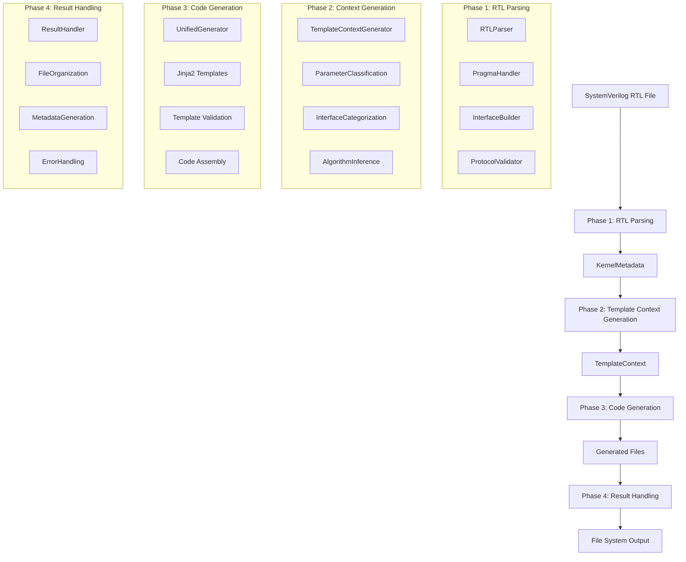

## Phase 1: RTL Parsing & Metadata Extraction

### Component Architecture

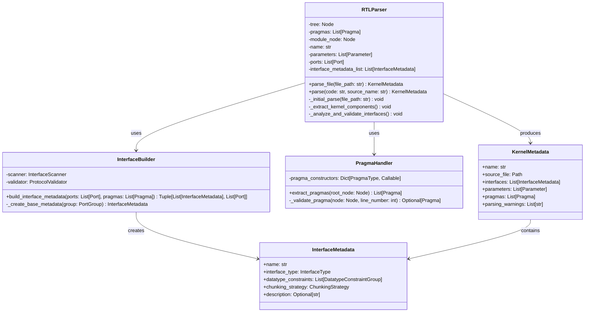

### Pragma Processing Flow

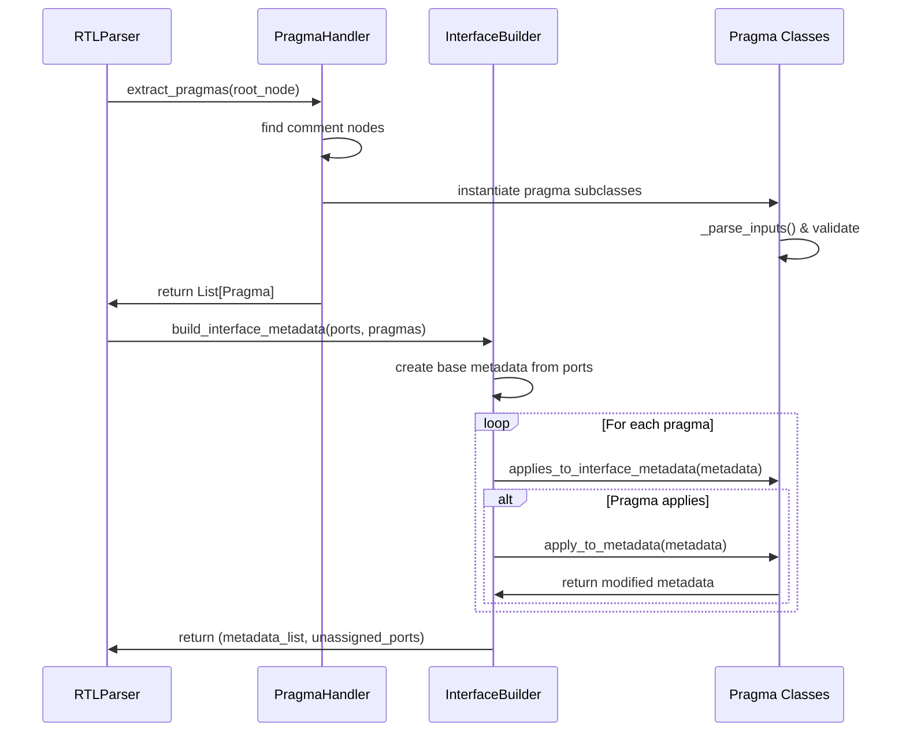

### Key Data Transformations

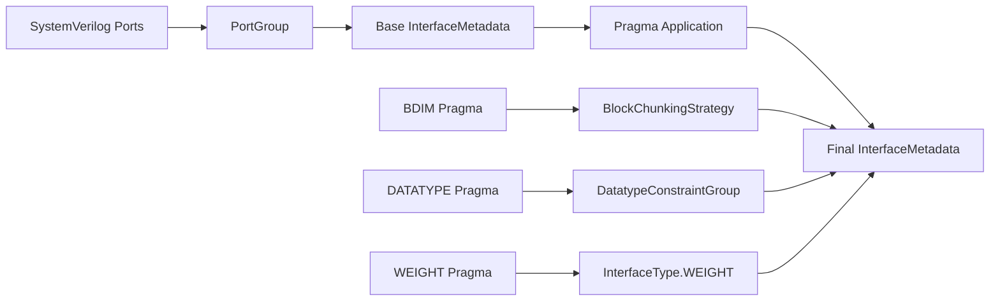

## Phase 2: Template Context Generation

### Core Components

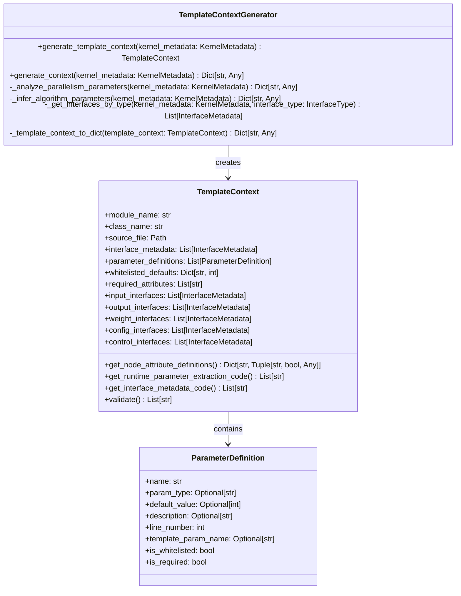

### Parameter Classification System

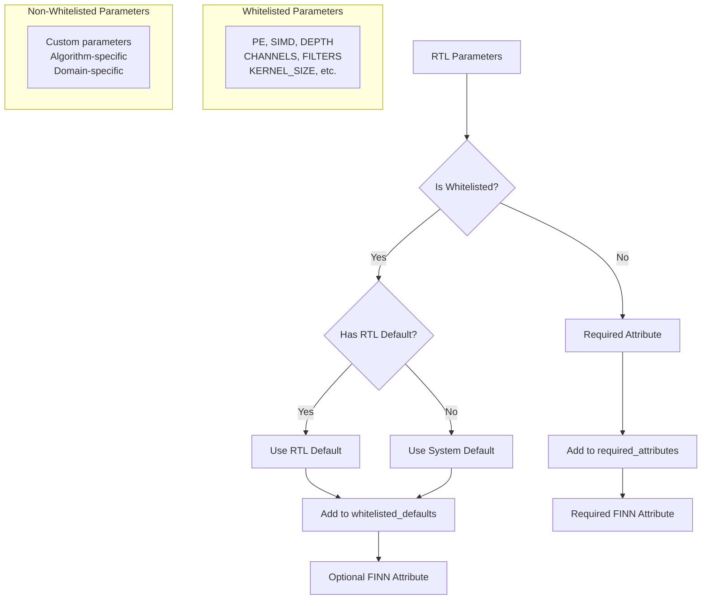

### Template Context Generation Flow

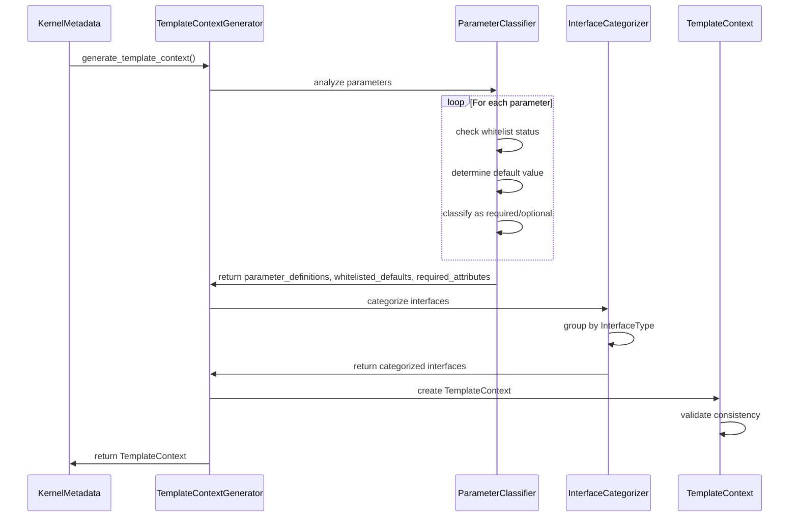

## Phase 3: Code Generation

### UnifiedGenerator Architecture

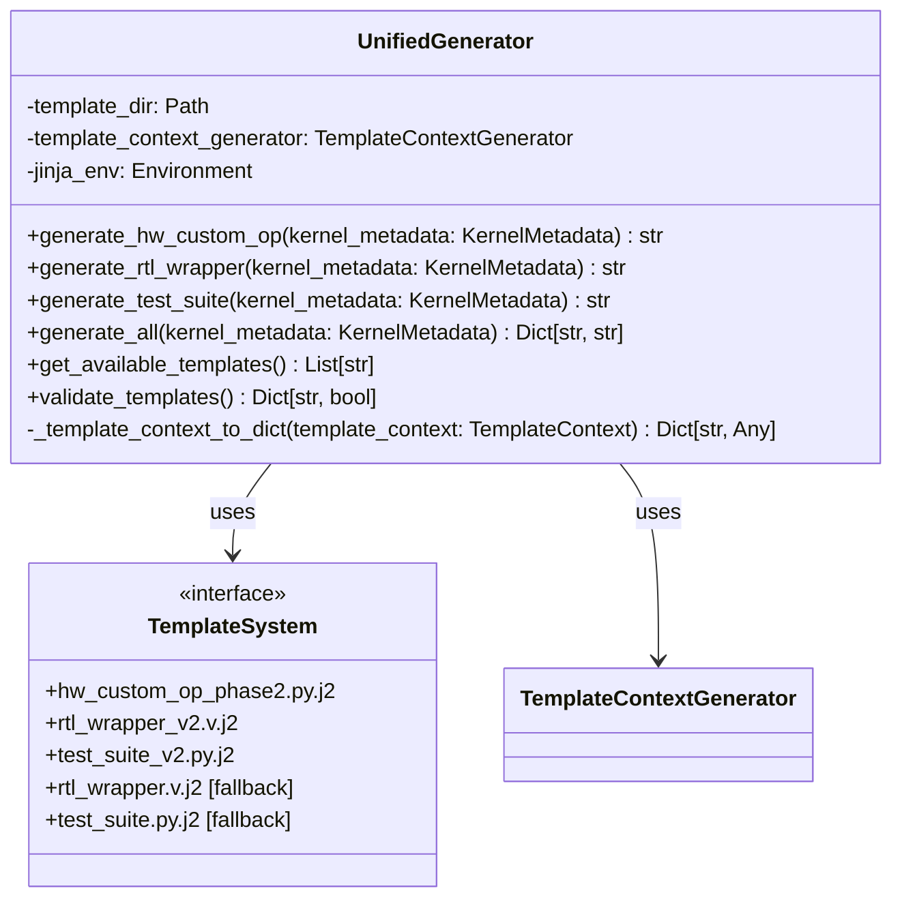

### Template Generation Flow

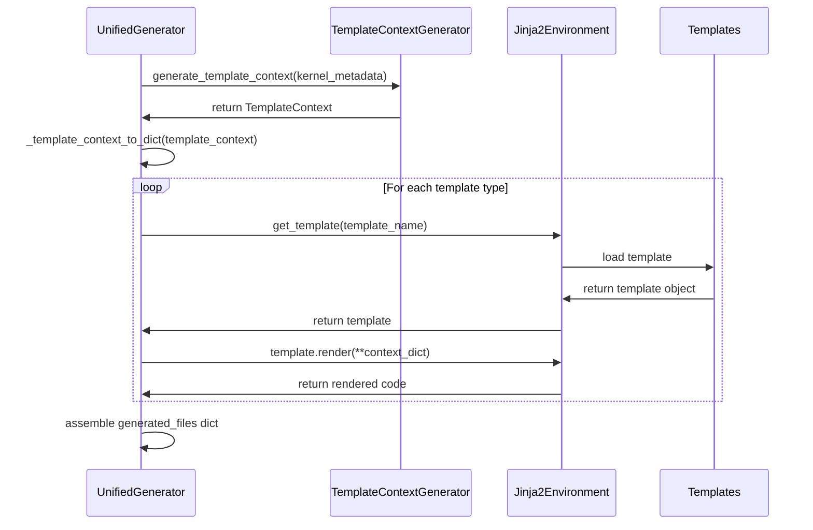

### Generated Files Structure

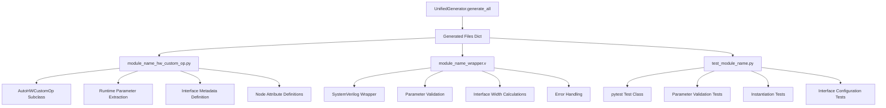

## Phase 4: Result Handling

### ResultHandler Architecture

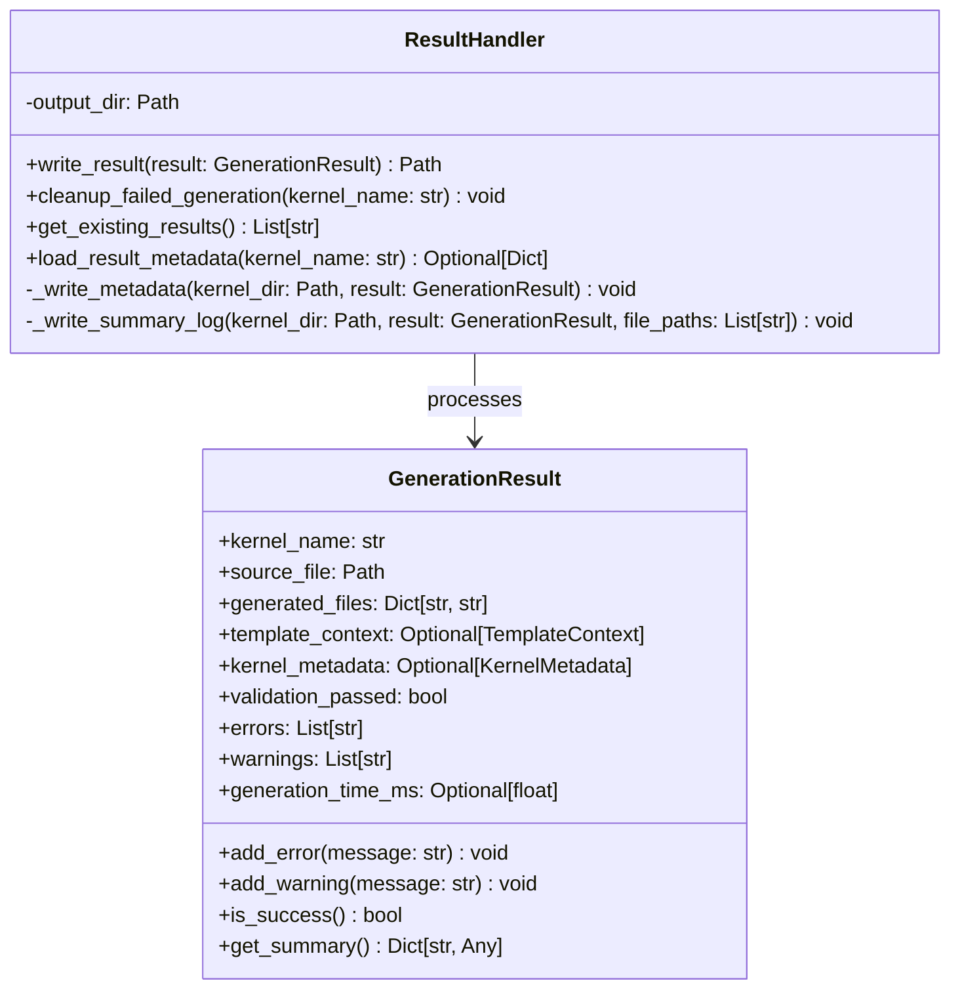

### File Organization Structure

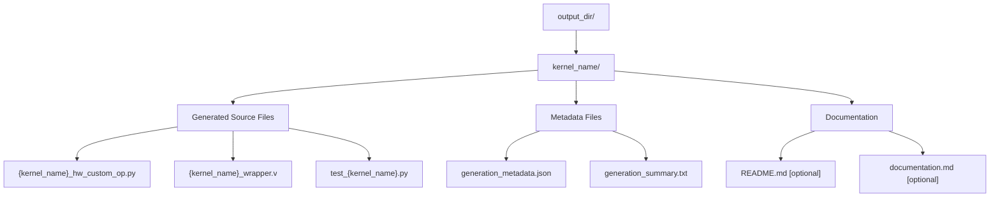

## Complete End-to-End Flow

### Comprehensive System Flow

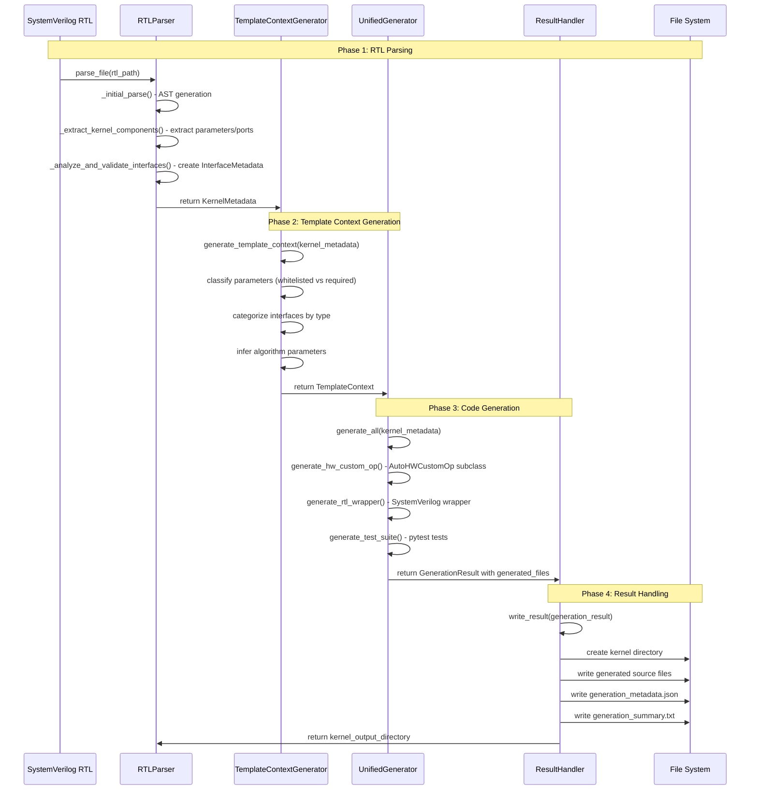

## Key Features & Capabilities

### 1. **Runtime Parameter Extraction**

Generated `AutoHWCustomOp` subclasses extract parameters from ONNX nodes:

```python
# Generated in __init__ method:
self.runtime_parameters = {}
self.runtime_parameters["PE"] = self.get_nodeattr("PE")
self.runtime_parameters["SIMD"] = self.get_nodeattr("SIMD")
# Required parameters fail if not provided by FINN
```

### 2. **Symbolic BDIM Validation**

BDIM pragmas reference RTL parameters and are validated during parsing:

```systemverilog
// @brainsmith bdim input0 [PE]           // Valid: PE is RTL parameter
// @brainsmith bdim weights [SIMD,PE]     // Valid: both are RTL parameters  
// @brainsmith bdim output0 [16]          // ERROR: magic numbers forbidden
```

### 3. **Parameter Whitelist System**

Parameters are classified for FINN integration:

- **Whitelisted** (PE, SIMD, DEPTH, etc.): Can have defaults, become optional ONNX attributes
- **Non-Whitelisted**: Must be provided by FINN, become required ONNX attributes

### 4. **Interface Type System**

Unified interface types with protocol binding:

- `INPUT/OUTPUT/WEIGHT` → Always AXI-Stream
- `CONFIG` → Always AXI-Lite  
- `CONTROL` → Always global signals (clk, rst)

### 5. **Enhanced Error Handling**

Comprehensive validation at each phase:

- **Phase 1**: Syntax validation, pragma validation, parameter reference checking
- **Phase 2**: Parameter classification validation, interface categorization
- **Phase 3**: Template validation, code generation validation
- **Phase 4**: File system validation, metadata consistency

## Performance Characteristics

Based on test analysis:

- **Parsing**: < 3s for complex modules (50+ parameters, 20+ interfaces)
- **Context Generation**: < 1s for parameter classification and interface categorization
- **Code Generation**: < 5s for multi-template generation (3 templates)
- **Total Pipeline**: < 10s end-to-end for complex kernels
- **Memory Usage**: Reasonable growth with module complexity
- **Scalability**: Handles production-scale FPGA kernels efficiently

## Testing Architecture

### Test Organization

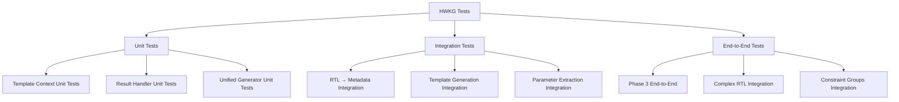

### Test Coverage Areas

1. **RTL Parser Integration**: Complete RTL → `KernelMetadata` pipeline
2. **Template Context Generation**: Parameter classification, interface categorization
3. **Code Generation**: Template rendering, validation, file generation  
4. **Result Handling**: File organization, metadata generation, error handling
5. **End-to-End**: Complete RTL → generated files pipeline with real examples

## Architecture Evolution

### Legacy vs. Current

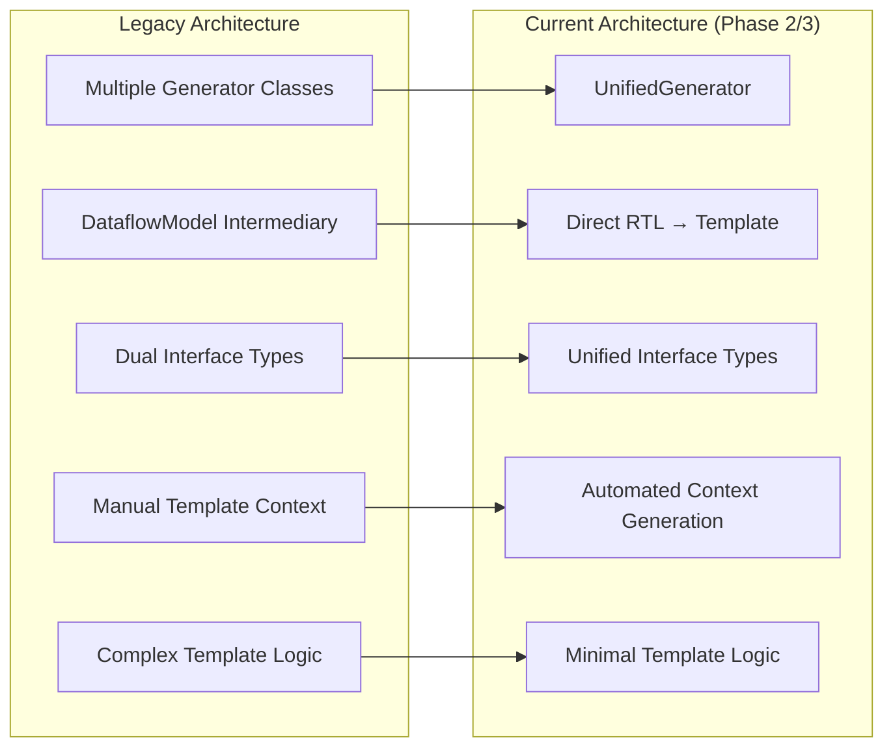

### Architectural Improvements

1. **Unified Generation**: Single `UnifiedGenerator` class replaces multiple generator classes
2. **Performance**: Direct RTL → Template pipeline bypasses `DataflowModel` overhead
3. **Validation**: Comprehensive parameter and pragma validation at parse time
4. **Extensibility**: Template-based approach enables easy extension for new kernel types
5. **Integration**: Seamless FINN integration with proper node attribute handling

## Conclusion

The HWKG represents a sophisticated, well-architected system for transforming custom RTL modules into FINN-compatible components. The 4-phase pipeline provides clear separation of concerns while maintaining high performance and extensibility. The comprehensive test coverage and validation at each phase ensure reliability for production FPGA AI accelerator development.

The architecture successfully bridges the gap between custom hardware implementations and the FINN compilation framework, enabling hardware engineers to leverage their existing RTL while integrating seamlessly with the broader FPGA AI ecosystem.