# BrainSmith Infrastructure Unification Plan

## Overview

This plan consolidates the artificial split between `brainsmith/core` and `brainsmith/infrastructure` into a unified core module that aligns with the "Functions Over Frameworks" philosophy.

## Current Architecture Problems

### Current Directory Structure
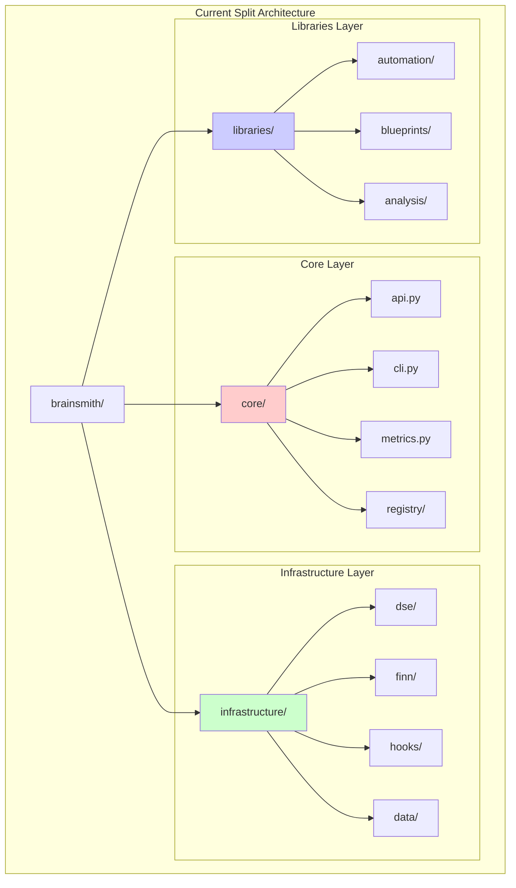

### Current Dependency Nightmare
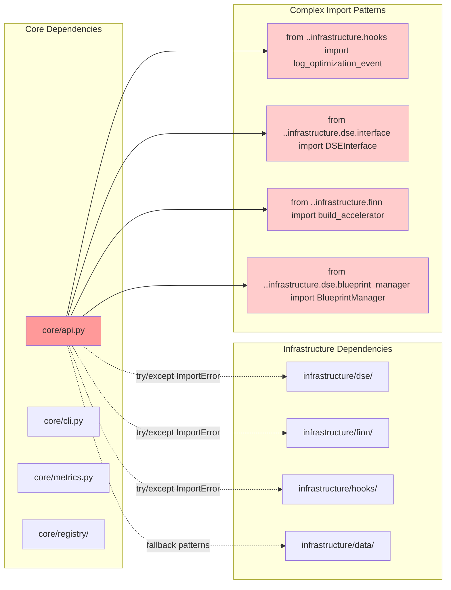

## Proposed Unified Architecture

### New Directory Structure
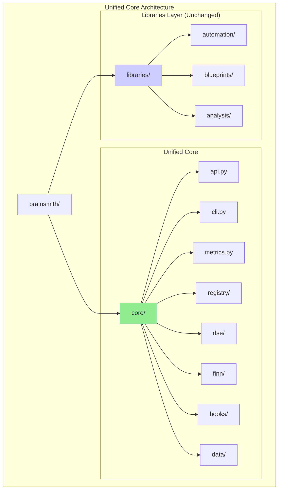

### Clean Import Patterns
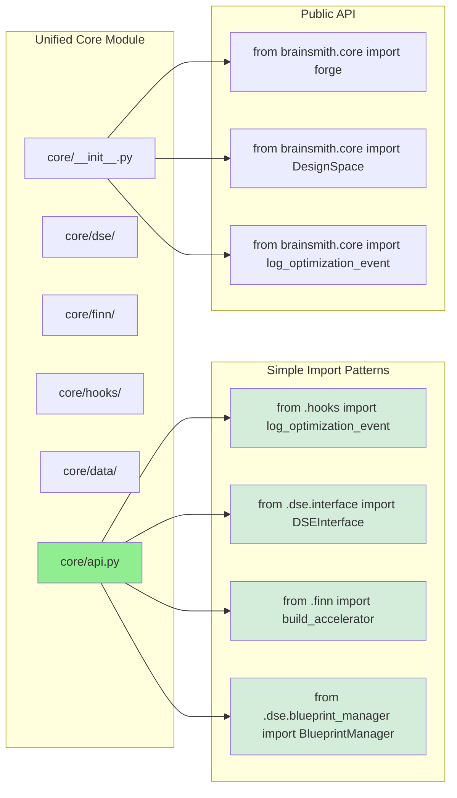

## File Movement Plan

### Phase 1: Infrastructure → Core Migration
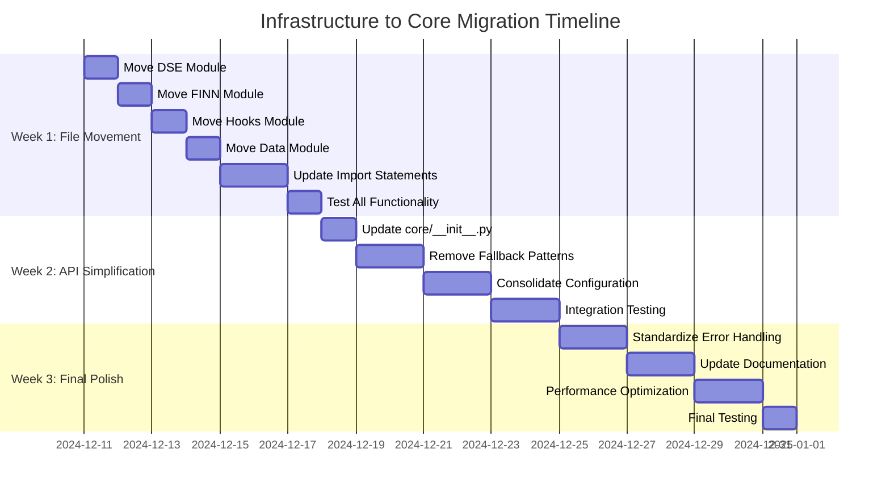

### Detailed File Movement Map
```mermaid
graph LR
    subgraph "Source (infrastructure/)"
        SRC_DSE[dse/]
        SRC_FINN[finn/]
        SRC_HOOKS[hooks/]
        SRC_DATA[data/]
        
        subgraph "DSE Files"
            DSE_INIT[__init__.py]
            DSE_TYPES[types.py]
            DSE_ENGINE[engine.py]
            DSE_INTERFACE[interface.py]
            DSE_HELPERS[helpers.py]
            DSE_BLUEPRINT[blueprint_manager.py]
            DSE_DESIGN[design_space.py]
        end
        
        subgraph "FINN Files"
            FINN_INIT[__init__.py]
            FINN_TYPES[types.py]
            FINN_INTERFACE[interface.py]
            FINN_FINN[finn_interface.py]
        end
        
        subgraph "Hooks Files"
            HOOKS_INIT[__init__.py]
            HOOKS_TYPES[types.py]
            HOOKS_EVENTS[events.py]
            HOOKS_REGISTRY[registry.py]
            HOOKS_PLUGINS[plugins/]
        end
        
        subgraph "Data Files"
            DATA_INIT[__init__.py]
            DATA_TYPES[types.py]
            DATA_COLLECTION[collection.py]
            DATA_EXPORT[export.py]
            DATA_MANAGEMENT[management.py]
        end
        
        SRC_DSE --> DSE_INIT
        SRC_DSE --> DSE_TYPES
        SRC_DSE --> DSE_ENGINE
        SRC_DSE --> DSE_INTERFACE
        SRC_DSE --> DSE_HELPERS
        SRC_DSE --> DSE_BLUEPRINT
        SRC_DSE --> DSE_DESIGN
        
        SRC_FINN --> FINN_INIT
        SRC_FINN --> FINN_TYPES
        SRC_FINN --> FINN_INTERFACE
        SRC_FINN --> FINN_FINN
        
        SRC_HOOKS --> HOOKS_INIT
        SRC_HOOKS --> HOOKS_TYPES
        SRC_HOOKS --> HOOKS_EVENTS
        SRC_HOOKS --> HOOKS_REGISTRY
        SRC_HOOKS --> HOOKS_PLUGINS
        
        SRC_DATA --> DATA_INIT
        SRC_DATA --> DATA_TYPES
        SRC_DATA --> DATA_COLLECTION
        SRC_DATA --> DATA_EXPORT
        SRC_DATA --> DATA_MANAGEMENT
    end
    
    subgraph "Destination (core/)"
        DEST_DSE[dse/]
        DEST_FINN[finn/]
        DEST_HOOKS[hooks/]
        DEST_DATA[data/]
    end
    
    SRC_DSE ==> DEST_DSE
    SRC_FINN ==> DEST_FINN
    SRC_HOOKS ==> DEST_HOOKS
    SRC_DATA ==> DEST_DATA
    
    style SRC_DSE fill:#ffcccc
    style SRC_FINN fill:#ffcccc
    style SRC_HOOKS fill:#ffcccc
    style SRC_DATA fill:#ffcccc
    style DEST_DSE fill:#90EE90
    style DEST_FINN fill:#90EE90
    style DEST_HOOKS fill:#90EE90
    style DEST_DATA fill:#90EE90
```

## Updated Module Dependencies

### Before: Complex Cross-Layer Dependencies
```mermaid
graph TB
    subgraph "Current Complex Dependencies"
        USER[User Code]
        
        subgraph "Core Layer"
            FORGE[forge()]
            CLI[CLI]
            METRICS[Metrics]
        end
        
        subgraph "Infrastructure Layer"
            DSE[DSE Engine]
            FINN[FINN Interface]
            HOOKS[Hooks System]
            DATA[Data Management]
        end
        
        subgraph "Libraries Layer"
            AUTO[Automation]
            BLUE[Blueprints]
            ANALYSIS[Analysis]
        end
        
        USER --> FORGE
        USER --> CLI
        
        FORGE -.->|"try/except"| DSE
        FORGE -.->|"try/except"| FINN
        FORGE -.->|"fallback"| HOOKS
        FORGE -.->|"fallback"| DATA
        
        CLI -.->|"import"| FORGE
        
        AUTO --> DSE
        BLUE --> DSE
        ANALYSIS --> DATA
    end
    
    style FORGE fill:#ff9999
    style DSE fill:#ffcccc
    style FINN fill:#ffcccc
    style HOOKS fill:#ffcccc
    style DATA fill:#ffcccc
```

### After: Clean Unified Dependencies
```mermaid
graph TB
    subgraph "Unified Clean Dependencies"
        USER[User Code]
        
        subgraph "Unified Core"
            FORGE[forge()]
            CLI[CLI]
            METRICS[Metrics]
            DSE[DSE Engine]
            FINN[FINN Interface]
            HOOKS[Hooks System]
            DATA[Data Management]
            REGISTRY[Registry System]
        end
        
        subgraph "Libraries Layer"
            AUTO[Automation]
            BLUE[Blueprints]
            ANALYSIS[Analysis]
        end
        
        USER --> FORGE
        USER --> CLI
        
        FORGE --> DSE
        FORGE --> FINN
        FORGE --> HOOKS
        FORGE --> DATA
        
        CLI --> FORGE
        
        DSE --> REGISTRY
        HOOKS --> REGISTRY
        
        AUTO --> FORGE
        BLUE --> FORGE
        ANALYSIS --> FORGE
    end
    
    style FORGE fill:#90EE90
    style DSE fill:#90EE90
    style FINN fill:#90EE90
    style HOOKS fill:#90EE90
    style DATA fill:#90EE90
```

## API Evolution

### Current Fragmented API
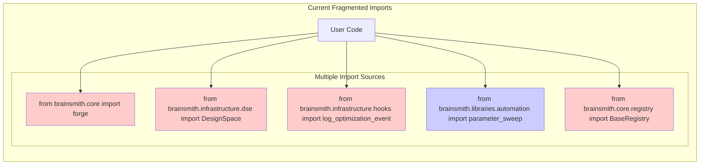

### Proposed Unified API
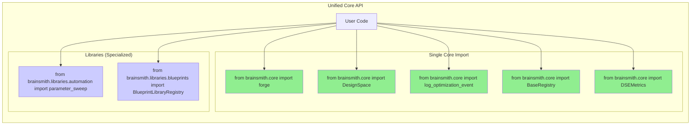

## Updated Core __init__.py Structure

### New Export Strategy
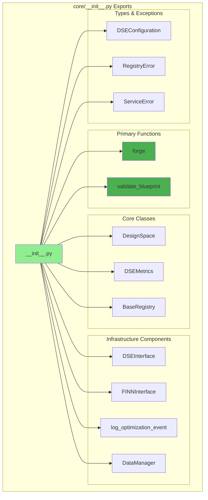

## Implementation Benefits

### Complexity Reduction
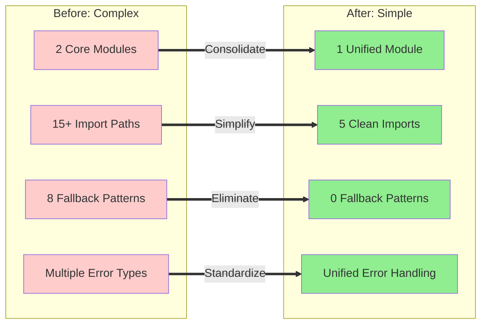

## Success Metrics

### Measurable Improvements
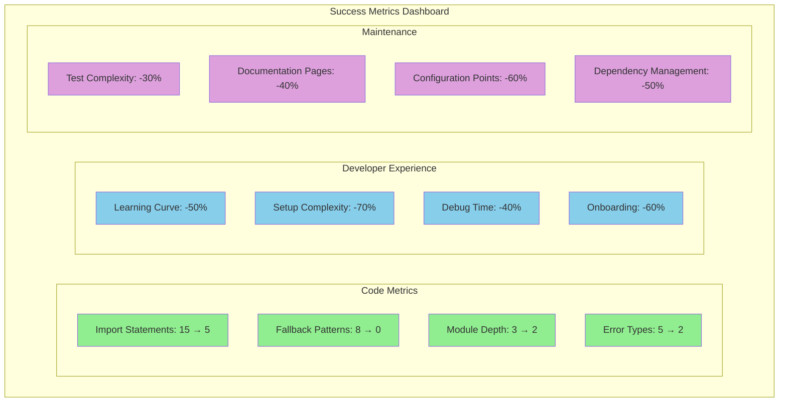

This consolidation eliminates the artificial core/infrastructure split while maintaining all functionality, creating a truly unified core toolchain that aligns with BrainSmith's "Functions Over Frameworks" philosophy.