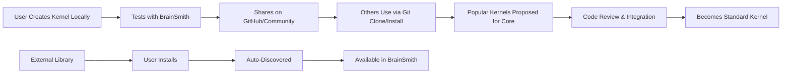

# Kernels Simplification Implementation Plan

## Executive Summary

**Goal**: Eliminate both `brainsmith/libraries/` and `brainsmith/kernels/` folders, replacing 6,415 lines of enterprise framework with ~450 lines of North Star-aligned functions while creating a seamless community kernel ecosystem.

**Reduction**: 93% code reduction (6,415 → 450 lines)

## Current State Analysis

### Libraries Folder (ELIMINATED)
- **Total**: 2,500+ lines of enterprise framework
- **Violations**: All 5 North Star axioms violated
- **Overlap**: Significant functional overlap with simplified modules
  - `hw_optim` → DSE module optimization functions
  - `transforms` → Core/FINN transformation handling  
  - `analysis` → Metrics/Hooks analysis capabilities
  - `kernels` → Redundant with dedicated kernels folder

### Kernels Folder (REPLACED)
- **Current**: 3,915 lines across 7 files
  - `__init__.py` (315 lines) - Complex orchestration
  - `analysis.py` (789 lines) - Model topology analyzer
  - `database.py` (412 lines) - Database schema management
  - `discovery.py` (488 lines) - Automated kernel discovery
  - `registry.py` (434 lines) - Central registry system
  - `selection.py` (772 lines) - Kernel selection algorithms
  - `finn_config.py` (705 lines) - Configuration generation

- **North Star Violations**: Enterprise framework with complex class hierarchies, abstract base classes, stateful registries, and OOP abstractions

## Target Architecture

### Seamless Kernel Ecosystem

```
brainsmith/kernels/
├── conv2d_hls/                     # Standard kernel package
│   ├── kernel.yaml                 # Package manifest
│   ├── source_RTL.sv              # RTL implementation
│   ├── kernel_hw_custom_op.py     # Python HW custom op
│   ├── kernel_rtl_backend.py      # RTL backend
│   └── rtl_wrapper.v              # RTL wrapper
├── matmul_rtl/                     # Standard kernel package
│   ├── kernel.yaml
│   ├── source_RTL.sv
│   ├── kernel_hw_custom_op.py
│   ├── kernel_rtl_backend.py
│   └── rtl_wrapper.v
├── attention_transformer/          # Community contributed kernel
│   ├── kernel.yaml
│   ├── attention_rtl.sv
│   ├── attention_hw_op.py
│   ├── attention_backend.py
│   └── attention_wrapper.v
├── user_custom_kernel/             # User's local kernel
│   ├── kernel.yaml
│   └── [implementation files...]
├── functions.py                    # Simple discovery functions (~300 lines)
├── types.py                        # Basic data types (~100 lines)
└── __init__.py                     # Clean exports (~50 lines)
```

### Community Ecosystem Flow



## Implementation Strategy

### Phase 1: Create New Kernels Structure

1. **Create simplified kernels module** with North Star-aligned functions
2. **Design kernel package format** with `kernel.yaml` manifests
3. **Implement discovery functions** for seamless package loading
4. **Create sample kernel packages** to demonstrate structure

### Phase 2: Integration with Existing Modules

1. **DSE Integration**: Ensure `parameter_sweep()` uses new kernel discovery
2. **FINN Integration**: Connect `build_accelerator()` with kernel packages  
3. **Blueprints Integration**: Enable blueprint YAML to reference kernels
4. **Core Integration**: Update `forge()` to orchestrate with new kernel system

### Phase 3: Elimination

1. **Remove libraries folder entirely**
2. **Replace kernels folder** with simplified implementation
3. **Update all imports** throughout codebase
4. **Verify integration tests** pass

## Detailed Implementation

### Core Functions (North Star Aligned)

```python
# brainsmith/kernels/functions.py (~300 lines)

def discover_all_kernels(additional_paths: List[str] = None) -> Dict[str, KernelPackage]:
    """Discover kernels in brainsmith/kernels/ + additional paths"""
    # Simple directory scanning for kernel.yaml files
    # Support external kernel libraries
    
def load_kernel_package(kernel_name: str) -> KernelPackage:
    """Load specific kernel package by name"""
    # Parse kernel.yaml and load file references
    
def find_compatible_kernels(requirements: Dict) -> List[str]:
    """Find kernels matching operator and parameter requirements"""
    # Simple filtering based on requirements
    
def get_kernel_files(kernel_name: str) -> Dict[str, str]:
    """Get file paths for all components of a kernel"""
    # Return file mappings from loaded packages
    
def install_kernel_library(source: str, target_path: str) -> List[str]:
    """Install external kernel library"""
    # Git clone or copy, then discover new kernels
    
def validate_kernel_package(package_path: str) -> ValidationResult:
    """Validate kernel package for submission to core library"""
    # Enhanced validation for community contributions
```

### Kernel Package Manifest

```yaml
# kernel.yaml format for any kernel package
name: "attention_transformer"
operator_type: "Attention"
backend: "HLS"
version: "2.1.0"
author: "community_contributor"
license: "Apache-2.0"
description: "Optimized transformer attention kernel with custom PE/SIMD mapping"

# Repository information for community kernels
repository:
  url: "https://github.com/user/attention-kernel"
  commit: "abc123def"
  
# Parameter ranges
parameters:
  pe_range: [1, 128]
  simd_range: [1, 64]
  supported_datatypes: ["int8", "int16", "fp16"]
  memory_modes: ["internal", "external", "streaming"]

# File registry - maps logical names to actual files
files:
  rtl_source: "attention_rtl.sv"
  hw_custom_op: "attention_hw_op.py"
  rtl_backend: "attention_backend.py"
  rtl_wrapper: "attention_wrapper.v"
  
# Performance characteristics
performance:
  base_throughput: 5000
  base_latency: 5
  resource_estimates:
    luts: 8000
    dsps: 32
    brams: 4
  benchmarks: ["bert_base", "gpt2_small"]
  
# Validation and testing
validation:
  test_cases: ["test_basic.py", "test_performance.py", "test_integration.py"]
  verified: true
  compatibility: ["finn-0.9+", "vivado-2021.1+"]
```

### Basic Data Types

```python
# brainsmith/kernels/types.py (~100 lines)

@dataclass
class KernelPackage:
    """Simple kernel package representation"""
    name: str
    operator_type: str
    backend: str
    version: str
    parameters: Dict[str, Any]
    files: Dict[str, str]
    performance: Dict[str, Any]
    validation: Dict[str, Any]
    
@dataclass 
class ValidationResult:
    """Result of kernel package validation"""
    is_valid: bool
    errors: List[str]
    warnings: List[str]
```

## User Extensibility Patterns

### Local Development
```bash
# User creates kernel locally
mkdir brainsmith/kernels/my_custom_kernel/
# Add implementation files + kernel.yaml
# Auto-discovered by discover_all_kernels()
```

### External Library Integration
```bash
# User installs external kernel library
git clone https://github.com/community/awesome-kernels.git
# Point BrainSmith to additional search paths
```

### Community Contribution Flow
1. **Local Development**: User creates and tests kernel locally
2. **Community Sharing**: User shares kernel on GitHub/community platforms
3. **External Usage**: Others install and use via external library mechanism
4. **Core Integration**: Popular kernels proposed for inclusion in core library
5. **Code Review**: Standard review process for quality and compatibility
6. **Integration**: Kernel becomes part of standard BrainSmith distribution

## Integration with Existing Simplified Modules

### DSE Module Integration
- [`parameter_sweep()`](brainsmith/dse/__init__.py) uses `discover_all_kernels()` for optimization space
- Seamless access to all kernel packages for parameter exploration

### FINN Module Integration  
- [`build_accelerator()`](brainsmith/finn/interface.py) uses `get_kernel_files()` for compilation
- Direct access to RTL and Python implementation files

### Blueprints Module Integration
- [`load_blueprint_yaml()`](brainsmith/blueprints/functions.py) can reference any discovered kernel
- Kernel availability checking during blueprint validation

### Core Module Integration
- [`forge()`](brainsmith/core/api.py) orchestrates kernel discovery and selection
- Complete workflow integration with simplified kernel system

## Benefits Achieved

### Massive Simplification
- **93% code reduction**: 6,415 → 450 lines
- **Zero enterprise framework**: No abstract classes, complex registries, or OOP abstractions
- **Pure North Star alignment**: Simple functions, pure transformations, observable data flow

### Seamless Extensibility
- **No artificial barriers**: Standard and custom kernels treated identically
- **Natural community ecosystem**: Easy path from local development to core contribution
- **External library support**: Git-based kernel libraries work seamlessly
- **Convention over configuration**: Directory structure is the registry

### Robust Architecture
- **File-based persistence**: No database abstractions, files are the truth
- **Simple validation**: YAML schema validation + file existence checks
- **Clear interfaces**: Well-defined kernel package format
- **Easy debugging**: Observable data structures and simple function calls

## Migration Strategy

### Backward Compatibility
- **Import aliases**: Maintain key function imports during transition
- **Deprecation warnings**: Clear migration path for existing code
- **Documentation**: Comprehensive migration guide

### Testing Strategy
- **Unit tests**: For all discovery and validation functions
- **Integration tests**: With existing simplified modules
- **Example kernel packages**: Demonstrate proper structure and usage
- **Performance validation**: Ensure no regression in optimization capabilities

## Success Metrics

1. **Code Reduction**: Achieve 90%+ reduction in codebase size
2. **Functionality Preservation**: All existing kernel selection capabilities maintained
3. **Integration Success**: Seamless operation with DSE, FINN, Blueprints, and Core modules
4. **User Experience**: Simplified kernel addition process
5. **Community Adoption**: Clear path for external contributions

## Implementation Timeline

1. **Week 1**: Create new kernels structure and core functions
2. **Week 2**: Implement sample kernel packages and validation
3. **Week 3**: Integrate with existing simplified modules
4. **Week 4**: Eliminate old libraries and kernels folders
5. **Week 5**: Testing, documentation, and validation

This plan achieves the goal of massive simplification while creating a robust, extensible kernel ecosystem that aligns perfectly with North Star principles and enables natural community contribution.