# BrainSmith Infrastructure Unification Implementation Plan
## Aligned with North Star Goals & Core Design Axioms

> **North Star**: *"Make FPGA accelerator design as simple as calling a function."*  
> **Promise**: `result = brainsmith.forge('model.onnx', 'blueprint.yaml')`

---

## 🎯 Strategic Alignment with North Star Goals

### Core Problem Analysis
The current `brainsmith/core` ↔ `brainsmith/infrastructure` split **violates our fundamental axioms**:


### Current vs North Star Target State


---

## 🏗️ Three-Phase Implementation Strategy

### Phase 1: Core Unification (Week 1)
**Goal**: Eliminate artificial boundaries while maintaining all functionality


#### 1.1 Directory Restructuring


#### 1.2 Import Pattern Transformation


### Phase 2: Registry Standardization (Week 2) 
**Goal**: Apply successful BaseRegistry pattern universally

```mermaid
graph TB
    subgraph "Registry Inconsistency Problem"
        P1[HooksRegistry: Custom Pattern]
        P2[AutomationRegistry: BaseRegistry Pattern ✓]
        P3[Different Discovery Interfaces]
        P4[Inconsistent Error Handling]
    end
    
    subgraph "Unified Registry Solution"
        S1[HooksRegistry: BaseRegistry Pattern ✓]
        S2[AutomationRegistry: BaseRegistry Pattern ✓]
        S3[Consistent .discover Interface]
        S4[Unified Error Handling]
    end
    
    P1 ==> S1
    P2 ==> S2
    P3 ==> S3
    P4 ==> S4
    
    style S1 fill:#90EE90
    style S2 fill:#90EE90
    style S3 fill:#90EE90
    style S4 fill:#90EE90
```



**Key Issue**: [`HooksRegistry`](brainsmith/infrastructure/hooks/registry.py:68) doesn't follow successful [`BaseRegistry`](brainsmith/libraries/automation/registry.py) pattern (99% success rate)

**Solution**: Standardize all registries to inherit from `BaseRegistry` with unified discovery interface.

### Phase 3: API Simplification (Week 3)
**Goal**: Achieve North Star promise and metrics


---

## 🔧 Detailed Technical Implementation

### Critical File Modifications

#### 1. [`brainsmith/core/api.py`](brainsmith/core/api.py:17-24) Changes
**Problem**: Complex try/except patterns violate "Simplicity Over Sophistication"

```python
# BEFORE (Lines 17-24): Complex fallback pattern
try:
    from ..infrastructure.hooks import log_optimization_event, log_strategy_decision, log_dse_event
    HOOKS_AVAILABLE = True
except ImportError:
    HOOKS_AVAILABLE = False
    log_optimization_event = lambda *args, **kwargs: None
    log_strategy_decision = lambda *args, **kwargs: None
    log_dse_event = lambda *args, **kwargs: None

# AFTER: Direct imports (axiom-aligned)
from .hooks import log_optimization_event, log_strategy_decision, log_dse_event
```

#### 2. [`brainsmith/core/__init__.py`](brainsmith/core/__init__.py:8-15) Updates
**Goal**: Single import location for all core functionality

```python
# Enhanced exports for unified core
from .api import forge, validate_blueprint
from .metrics import DSEMetrics
from .dse.design_space import DesignSpace
from .dse.interface import DSEInterface
from .hooks import log_optimization_event, register_event_handler
from .finn import build_accelerator
from .data import DataManager

__all__ = [
    # Primary function (North Star Promise)
    'forge', 'validate_blueprint',
    # Core classes
    'DesignSpace', 'DSEInterface', 'DSEMetrics',
    # Helper functions (12 total per axioms)
    'log_optimization_event', 'build_accelerator', 'DataManager',
    # Additional helpers...
]
```

#### 3. Registry Standardization
**Issue**: [`HooksRegistry`](brainsmith/infrastructure/hooks/registry.py:68) uses different pattern than successful [`BaseRegistry`](brainsmith/libraries/automation/registry.py)

```python
# BEFORE: Inconsistent pattern
class HooksRegistry:
    def discover_plugins(self, rescan: bool = False) -> Dict[str, PluginInfo]:

# AFTER: Consistent BaseRegistry pattern  
class HooksRegistry(BaseRegistry):
    def discover(self, rescan: bool = False) -> Dict[str, ComponentInfo]:
```

### New Core API Structure


---

## ✅ Success Validation & Metrics

### North Star Compliance Check

```mermaid
graph LR
    subgraph "North Star Metrics"
        M1[Time to First Success: <5min]
        M2[Primary Function: forge]
        M3[Helper Functions: 12]
        M4[Configuration Objects: 0]
        M5[Core Concepts: 3]
    end
    
    subgraph "Implementation Results"
        R1[✓ Single import + forge call]
        R2[✓ One primary function]
        R3[✓ 12 composable helpers]  
        R4[✓ Direct parameter passing]
        R5[✓ Models, blueprints, parameters]
    end
    
    M1 --> R1
    M2 --> R2
    M3 --> R3
    M4 --> R4
    M5 --> R5
    
    style R1 fill:#90EE90
    style R2 fill:#90EE90
    style R3 fill:#90EE90
    style R4 fill:#90EE90
    style R5 fill:#90EE90
```



### Axiom Compliance Dashboard

```mermaid
graph TB
    subgraph "Axiom Compliance Results"
        A1[Simplicity Over Sophistication ✓]
        A2[Functions Over Frameworks ✓]
        A3[Focus Over Feature Creep ✓]
        A4[Hooks Over Implementation ✓]
        A5[Performance Over Purity ✓]
        A6[Documentation Over Discovery ✓]
    end
    
    subgraph "Measurable Improvements"
        I1[Import Paths: 15→1]
        I2[Fallback Patterns: 8→0]
        I3[Module Discovery: Complex→Direct]
        I4[Learning Curve: Hours→Minutes]
        I5[Configuration: Objects→Parameters]
    end
    
    A1 --> I1
    A2 --> I2
    A3 --> I3
    A4 --> I4
    A5 --> I5
    A6 --> I5
    
    style A1 fill:#90EE90
    style A2 fill:#90EE90
    style A3 fill:#90EE90
    style A4 fill:#90EE90
    style A5 fill:#90EE90
    style A6 fill:#90EE90
```



### Final User Experience


---

## 🚫 Anti-Patterns We Will Eliminate

### What We Will NOT Do (Per North Star Goals)

```mermaid
graph LR
    subgraph "Anti-Patterns to Eliminate"
        X1[❌ Backward Compatibility Layers]
        X2[❌ Configuration Objects]
        X3[❌ Plugin Architectures for Core]
        X4[❌ Enterprise Abstractions]
        X5[❌ Custom Analysis vs scipy]
    end
    
    subgraph "Clean Break Principles"
        B1[✓ Force Migration to Better APIs]
        B2[✓ Direct Parameter Passing]
        B3[✓ Built-in Functionality Only]
        B4[✓ Function Composition]
        B5[✓ External Library Integration]
    end
    
    X1 ==> B1
    X2 ==> B2
    X3 ==> B3
    X4 ==> B4
    X5 ==> B5
    
    style B1 fill:#90EE90
    style B2 fill:#90EE90
    style B3 fill:#90EE90
    style B4 fill:#90EE90
    style B5 fill:#90EE90
```



**Clean Refactor Principle**: "When improving APIs, eliminate legacy methods entirely rather than creating backward compatibility layers"

---

## 🎉 End State Vision

### What Success Looks Like


### The Ultimate User Experience

```python
# This is ALL users need to learn (North Star achieved)
import brainsmith.core as bs

# Primary workflow (5 minutes to success)
result = bs.forge('model.onnx', 'blueprint.yaml')
best = bs.find_best_result(result, metric='throughput')

# Advanced workflows (simple composition)
params = {'batch_size': [1, 4, 8], 'frequency': [200, 250, 300]}
swept = bs.parameter_sweep('model.onnx', 'blueprint.yaml', params)
optimized = bs.find_best_result(swept, metric='efficiency')

# External tool integration (hooks over implementation)
import pandas as pd
data = bs.get_analysis_data(swept)
df = pd.DataFrame(data)  # Ready for pandas/scipy/sklearn
```

This implementation plan transforms BrainSmith from a framework users must learn into a set of functions they can immediately use, fully aligned with our North Star vision.