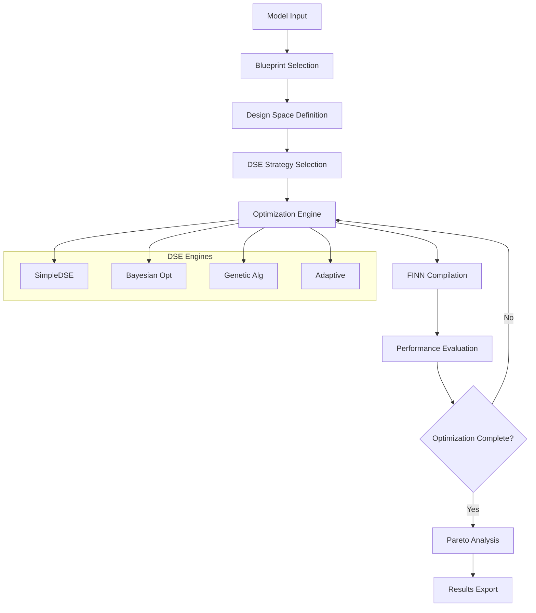

# Brainsmith: Advanced FPGA Accelerator Design Platform

[](https://opensource.org/licenses/MIT)
[](https://www.python.org/downloads/)
[](#testing)

**Brainsmith** is a comprehensive platform for automated FPGA accelerator design and optimization, featuring advanced Design Space Exploration (DSE), multi-objective optimization, and seamless integration with the FINN framework for neural network acceleration.

## 🚀 **Key Features**

### **🎯 Advanced Design Space Exploration**
- **State-of-the-art Algorithms**: Bayesian optimization, genetic algorithms, adaptive sampling
- **Multi-Objective Optimization**: True Pareto optimization with NSGA-II ranking
- **External Framework Integration**: scikit-optimize, Optuna, DEAP, Hyperopt
- **Intelligent Strategy Selection**: Automatic algorithm recommendation based on problem characteristics

### **🔧 Comprehensive FPGA Design Flow**
- **Blueprint-Driven Design**: Extensible architecture templates for rapid prototyping
- **FINN Integration**: Seamless neural network to FPGA compilation
- **Custom Hardware Kernels**: RTL parser and code generation tools
- **Performance Analysis**: Detailed metrics and trade-off analysis

### **📊 Research-Grade Analysis**
- **Pareto Frontier Analysis**: Complete multi-objective trade-off exploration
- **Statistical Analysis**: Comprehensive result analysis with export capabilities
- **Convergence Monitoring**: Real-time optimization progress tracking
- **Visualization Support**: Publication-ready analysis and reporting

---

## 🏗️ **Platform Architecture**

### **Core Components**

```
brainsmith/
├── core/                   # Core platform functionality
│   ├── compiler.py        # Main compilation orchestrator
│   ├── config.py          # Configuration management
│   ├── design_space.py    # Design space definitions
│   ├── finn_interface.py  # FINN framework integration
│   ├── metrics.py         # Performance metrics collection
│   └── result.py          # Result data structures
├── blueprints/            # Design templates and patterns
│   ├── base.py           # Blueprint base classes
│   ├── manager.py        # Blueprint management
│   └── yaml/             # Blueprint configurations
├── dse/                   # Design Space Exploration
│   ├── interface.py      # DSE engine interfaces
│   ├── simple.py         # Built-in optimization algorithms
│   ├── external.py       # External framework adapters
│   ├── analysis.py       # Result analysis capabilities
│   └── strategies.py     # Strategy management system
├── custom_op/             # Custom FPGA operations
├── steps/                 # Compilation step library
└── tools/                 # Development and analysis tools
```

### **Data Flow Architecture**



---

## 🚀 **Quick Start**

### **Installation**

```bash
# Clone the repository
git clone https://github.com/your-org/brainsmith.git
cd brainsmith

# Install dependencies
pip install -r requirements.txt

# Install optional optimization libraries (recommended)
pip install scikit-optimize optuna deap hyperopt

# Install Brainsmith
pip install -e .
```

### **Basic Usage**

```python
import brainsmith

# 1. Simple model optimization
result = brainsmith.optimize_model(
    model_path="bert_model.onnx",
    blueprint_name="bert_extensible",
    max_evaluations=50
)

print(f"Best throughput: {result.best_result.metrics.performance.throughput_ops_sec}")
```

### **Advanced Multi-Objective Optimization**

```python
# 2. Multi-objective design space exploration
result = brainsmith.explore_design_space(
    model_path="bert_model.onnx",
    blueprint_name="bert_extensible",
    max_evaluations=200,
    strategy="genetic",
    objectives=[
        {"name": "performance.throughput_ops_sec", "direction": "maximize"},
        {"name": "hardware.power_consumption", "direction": "minimize"},
        {"name": "hardware.resource_utilization", "direction": "minimize"}
    ]
)

# Extract Pareto frontier
pareto_points = brainsmith.get_pareto_frontier(result)
print(f"Found {len(pareto_points)} Pareto-optimal solutions")

# Comprehensive analysis
analysis = brainsmith.analyze_dse_results(result)
brainsmith.export_analysis(analysis, "optimization_results.json")
```

### **Automatic Strategy Selection**

```python
# 3. Intelligent optimization with automatic strategy selection
strategy = brainsmith.recommend_strategy(
    blueprint_name="bert_extensible",
    max_evaluations=100,
    n_objectives=2
)

result = brainsmith.explore_design_space(
    model_path="bert_model.onnx",
    blueprint_name="bert_extensible",
    strategy=strategy,  # Automatically selected
    max_evaluations=100
)
```

---

## 📚 **Core Concepts**

### **Blueprints**
Blueprints define reusable design templates with parameterizable configurations:

```python
# List available blueprints
blueprints = brainsmith.list_blueprints()
print(blueprints)  # ['bert_extensible', 'bert', 'custom_transformer']

# Get blueprint details
blueprint = brainsmith.get_blueprint("bert_extensible")
design_space = blueprint.get_design_space()
recommended_params = blueprint.get_recommended_parameters()
```

### **Design Spaces**
Design spaces define the parameter search space for optimization:

```python
# Load design space from blueprint
design_space = brainsmith.load_design_space("bert_extensible")

# Sample design space
samples = brainsmith.sample_design_space(
    design_space,
    n_samples=20,
    strategy="latin_hypercube"
)
```

### **Optimization Strategies**
Multiple optimization algorithms are available with automatic selection:

```python
# Available strategies
strategies = brainsmith.list_available_strategies()
for name, info in strategies.items():
    print(f"{name}: {info['description']}")

# Strategy categories:
# - Built-in: random, latin_hypercube, sobol, adaptive
# - External: bayesian, genetic, optuna, hyperopt
```

---

## 🎯 **Advanced Features**

### **Multi-Objective Optimization**

Brainsmith supports sophisticated multi-objective optimization with Pareto frontier analysis:

```python
# Define multiple objectives with weights
objectives = [
    brainsmith.DSEObjective("performance.throughput_ops_sec", "maximize", weight=1.0),
    brainsmith.DSEObjective("hardware.power_consumption", "minimize", weight=0.8),
    brainsmith.DSEObjective("hardware.lut_utilization", "minimize", weight=0.6)
]

# Run multi-objective optimization
result = brainsmith.explore_design_space(
    model_path="model.onnx",
    blueprint_name="bert_extensible",
    objectives=objectives,
    strategy="genetic",
    max_evaluations=300
)

# Analyze trade-offs
from brainsmith.dse.analysis import ParetoAnalyzer
analyzer = ParetoAnalyzer(objectives)
pareto_points = analyzer.compute_pareto_frontier(result.results)
trade_offs = analyzer.analyze_trade_offs(pareto_points)
```

### **External Framework Integration**

Seamlessly integrate with leading optimization libraries:

```python
# Bayesian optimization with scikit-optimize
result = brainsmith.explore_design_space(
    model_path="model.onnx",
    blueprint_name="bert_extensible",
    strategy="bayesian",
    acquisition_function="EI",
    n_initial_points=20
)

# Advanced hyperparameter optimization with Optuna
result = brainsmith.explore_design_space(
    model_path="model.onnx",
    blueprint_name="bert_extensible",
    strategy="optuna",
    n_trials=200,
    direction="maximize"
)
```

### **Comprehensive Analysis**

Generate publication-ready analysis and reports:

```python
# Complete analysis workflow
result = brainsmith.explore_design_space(...)
analysis = brainsmith.analyze_dse_results(result)

# Analysis includes:
# - Statistical summaries (mean, std, percentiles)
# - Pareto frontier analysis
# - Parameter sensitivity analysis
# - Convergence analysis
# - Trade-off analysis

# Export for external tools
brainsmith.export_analysis(analysis, "results.json")

# Generate human-readable report
report = brainsmith.generate_analysis_report(result)
print(report)
```

---

## 🔧 **Configuration and Customization**

### **Custom Blueprints**

Create custom design templates:

```python
from brainsmith.blueprints import Blueprint, ParameterDefinition, ParameterType

class CustomBlueprint(Blueprint):
    def __init__(self):
        super().__init__("custom_design")
        
        # Define parameters
        self.add_parameter(ParameterDefinition(
            "batch_size", ParameterType.INTEGER, range_values=[1, 64]
        ))
        self.add_parameter(ParameterDefinition(
            "precision", ParameterType.CATEGORICAL, values=["INT8", "INT16", "FP16"]
        ))
    
    def get_recommended_parameters(self):
        return {"batch_size": 32, "precision": "INT8"}

# Register blueprint
brainsmith.register_blueprint("custom", CustomBlueprint())
```

### **Custom DSE Strategies**

Extend the platform with custom optimization algorithms:

```python
from brainsmith.dse import DSEEngine

class CustomDSEEngine(DSEEngine):
    def __init__(self, name, config):
        super().__init__(name, config)
        # Initialize custom algorithm
    
    def suggest_next_points(self, n_points=1):
        # Implement custom point suggestion logic
        return points
    
    def update_with_result(self, design_point, result):
        # Update algorithm with evaluation result
        super().update_with_result(design_point, result)

# Register custom engine
brainsmith.register_dse_engine("custom_algo", CustomDSEEngine)
```

### **Configuration Management**

Use predefined configurations for common scenarios:

```python
from brainsmith.dse.strategies import COMMON_CONFIGS

# Available configurations:
# - quick_exploration: Fast 20-evaluation exploration
# - balanced_optimization: 100-evaluation adaptive optimization
# - thorough_analysis: 500-evaluation comprehensive search
# - multi_objective_fpga: Multi-objective genetic optimization

config = COMMON_CONFIGS["balanced_optimization"]
result = brainsmith.explore_design_space(
    model_path="model.onnx",
    blueprint_name="bert_extensible",
    config=config
)
```

---

## 📊 **Performance and Scaling**

### **Optimization Performance**

Brainsmith is designed for efficient large-scale optimization:

- **Adaptive Algorithms**: Learn parameter importance and focus search
- **Parallel Evaluation**: Support for parallel design point evaluation
- **Early Stopping**: Convergence detection to avoid unnecessary evaluations
- **Incremental Analysis**: Real-time progress monitoring and analysis

### **Memory and Compute Efficiency**

- **Streaming Results**: Process results without storing all intermediate data
- **Configurable Precision**: Trade accuracy for speed in analysis
- **Resource Monitoring**: Track memory and compute usage during optimization
- **Graceful Degradation**: Fallback strategies when external libraries unavailable

### **Scalability Guidelines**

| Problem Size | Recommended Strategy | Max Evaluations | Expected Time |
|-------------|---------------------|-----------------|---------------|
| Small (≤5 params) | Bayesian | 50-100 | Minutes |
| Medium (6-15 params) | Adaptive/LHS | 100-300 | Hours |
| Large (16+ params) | Genetic/Sobol | 300-1000 | Hours-Days |
| Multi-objective | Genetic/NSGA-II | 200-500 | Hours |

---

## 🧪 **Testing and Validation**

### **Comprehensive Test Suite**

Run the complete test suite to validate installation:

```bash
# Run all tests with detailed reporting
python run_all_tests.py

# Run specific test categories
python -m unittest tests.unit.test_dse_interface
python -m unittest tests.integration.test_complete_dse_workflow

# Performance benchmarking
python tests/performance/benchmark_optimization.py
```

### **Test Coverage**

The test suite includes:
- **Unit Tests**: Individual component validation (100+ test cases)
- **Integration Tests**: End-to-end workflow validation
- **Performance Tests**: Scalability and efficiency validation
- **Regression Tests**: Ensure backward compatibility

### **Validation Workflow**

```python
# Validate platform installation
import brainsmith

# Check component availability
print("Available strategies:", brainsmith.list_available_strategies())
print("Available blueprints:", brainsmith.list_blueprints())

# Run quick validation
result = brainsmith.validate_installation()
if result.success:
    print("✅ Brainsmith installation validated successfully!")
else:
    print("❌ Installation issues:", result.errors)
```

---

## 📖 **API Reference**

### **High-Level Interface**

```python
# Core optimization functions
brainsmith.optimize_model(model_path, blueprint_name, **kwargs)
brainsmith.explore_design_space(model_path, blueprint_name, **kwargs)
brainsmith.build_model(model_path, blueprint_name, parameters)

# Analysis and utility functions
brainsmith.analyze_dse_results(dse_result)
brainsmith.get_pareto_frontier(dse_result)
brainsmith.recommend_strategy(**problem_characteristics)
brainsmith.sample_design_space(design_space, n_samples, strategy)

# Discovery functions
brainsmith.list_blueprints()
brainsmith.list_available_strategies()
brainsmith.get_blueprint(name)
brainsmith.load_design_space(blueprint_name)
```

### **Advanced DSE Interface**

```python
from brainsmith.dse import (
    DSEConfiguration, DSEObjective, OptimizationObjective,
    SimpleDSEEngine, ExternalDSEAdapter, create_dse_engine
)

# Create custom DSE configuration
config = DSEConfiguration(
    max_evaluations=200,
    objectives=[
        DSEObjective("throughput", OptimizationObjective.MAXIMIZE),
        DSEObjective("power", OptimizationObjective.MINIMIZE)
    ],
    strategy="bayesian",
    convergence_threshold=0.001
)

# Create and run DSE engine
engine = create_dse_engine("bayesian", config)
engine.initialize(design_space)

# Optimization loop
for iteration in range(config.max_evaluations):
    points = engine.suggest_next_points(1)
    for point in points:
        result = brainsmith.build_model(model_path, blueprint_name, point.parameters)
        engine.update_with_result(point, result)
    
    if engine.should_stop():
        break

best_result = engine.get_best_result()
```

---

## 🤝 **Contributing**

### **Development Setup**

```bash
# Clone repository
git clone https://github.com/your-org/brainsmith.git
cd brainsmith

# Create development environment
python -m venv venv
source venv/bin/activate  # or `venv\Scripts\activate` on Windows

# Install development dependencies
pip install -r requirements.txt
pip install -r requirements-dev.txt

# Install in development mode
pip install -e .

# Run tests
python run_all_tests.py
```

### **Contributing Guidelines**

1. **Code Style**: Follow PEP 8 and use type hints
2. **Testing**: Add tests for all new functionality
3. **Documentation**: Update docs and examples
4. **Performance**: Consider optimization impact and scalability
5. **Compatibility**: Maintain backward compatibility

### **Pull Request Process**

1. Fork the repository
2. Create a feature branch: `git checkout -b feature/amazing-feature`
3. Make changes and add tests
4. Run test suite: `python run_all_tests.py`
5. Commit changes: `git commit -m 'Add amazing feature'`
6. Push to branch: `git push origin feature/amazing-feature`
7. Open a Pull Request

---

## 📄 **License**

This project is licensed under the MIT License - see the [LICENSE](LICENSE) file for details.

---

## 🙏 **Acknowledgments**

- **FINN Framework**: Neural network to FPGA compilation infrastructure
- **Optimization Libraries**: scikit-optimize, Optuna, DEAP, Hyperopt
- **Community**: Contributors and users who make this project possible

---

## 📞 **Support**

- **Documentation**: [docs/](docs/)
- **Issues**: [GitHub Issues](https://github.com/your-org/brainsmith/issues)
- **Discussions**: [GitHub Discussions](https://github.com/your-org/brainsmith/discussions)
- **Email**: brainsmith-support@your-org.com

---

## 🗺️ **Roadmap**

### **Current Version (3.0)**
- ✅ Advanced DSE with external framework integration
- ✅ Multi-objective optimization with Pareto analysis
- ✅ Comprehensive analysis and reporting
- ✅ Blueprint-driven design flow

### **Upcoming Features**
- 🔄 **CLI Interface**: Command-line tools for batch optimization
- 🔄 **Visualization Dashboard**: Interactive optimization monitoring
- 🔄 **Cloud Integration**: Distributed optimization on cloud platforms
- 🔄 **Enhanced FINN Integration**: Complete four-hook architecture

### **Future Vision**
- 🎯 **AI-Driven Optimization**: Machine learning for strategy selection
- 🎯 **Hardware-in-the-Loop**: Real FPGA validation during optimization
- 🎯 **Collaborative Platform**: Multi-user design space exploration
- 🎯 **Industry Integration**: Enterprise-grade deployment tools

---

**Transform your FPGA development workflow with intelligent automation and advanced optimization. Start exploring today! 🚀**

```bash
pip install brainsmith
python -c "import brainsmith; print('Welcome to the future of FPGA design!')"
