# Brainsmith-2 Repository Structure and Workflow Guide

## Table of Contents
1. [Repository Overview](#repository-overview)
2. [High-Level Architecture](#high-level-architecture)
3. [Component Interaction Diagrams](#component-interaction-diagrams)
4. [Detailed Module Structure](#detailed-module-structure)
5. [Data Flow Diagrams](#data-flow-diagrams)
6. [Workflow Sequences](#workflow-sequences)
7. [Development Workflows](#development-workflows)

## Repository Overview

Brainsmith-2 is an open-source platform for FPGA AI accelerators that automates the conversion of PyTorch models to RTL implementations for FPGA deployment using Interface-Wise Dataflow Modeling.

### Repository Structure at a Glance

```
brainsmith-2/
├── 📁 brainsmith/                    # Core framework
│   ├── 📁 dataflow/                  # Interface-wise modeling framework
│   ├── 📁 tools/hw_kernel_gen/       # Hardware kernel generator
│   ├── 📁 custom_op/                 # Custom FPGA operations
│   ├── 📁 hw_kernels/                # Hardware kernel implementations
│   └── 📁 transformation/            # Model transformation utilities
├── 📁 demos/                         # End-to-end demonstrations
├── 📁 examples/                      # Usage examples and tutorials
├── 📁 tests/                         # Comprehensive test suite
├── 📁 docs/                          # Documentation and guides
└── 📁 docker/                        # Containerized development environment
```

## High-Level Architecture

### System Overview Diagram

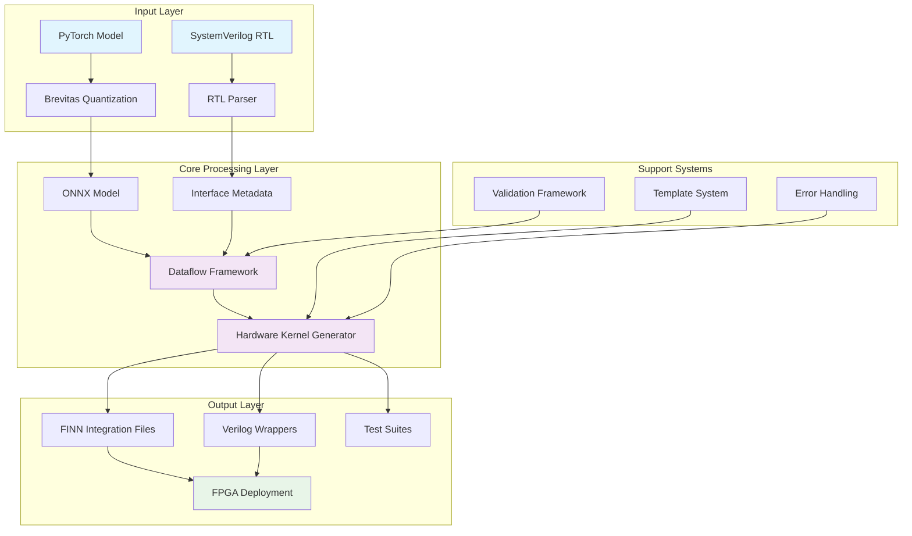

### Technology Stack

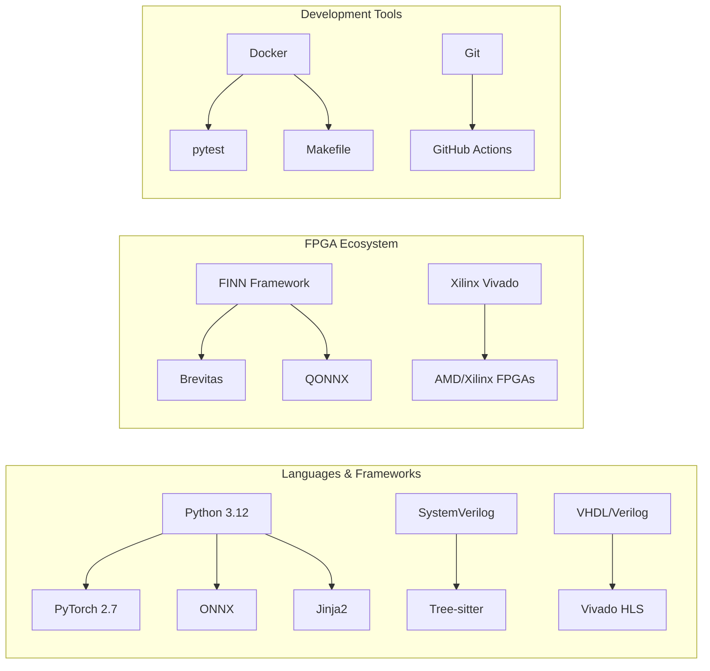

## Component Interaction Diagrams

### Core System Interactions

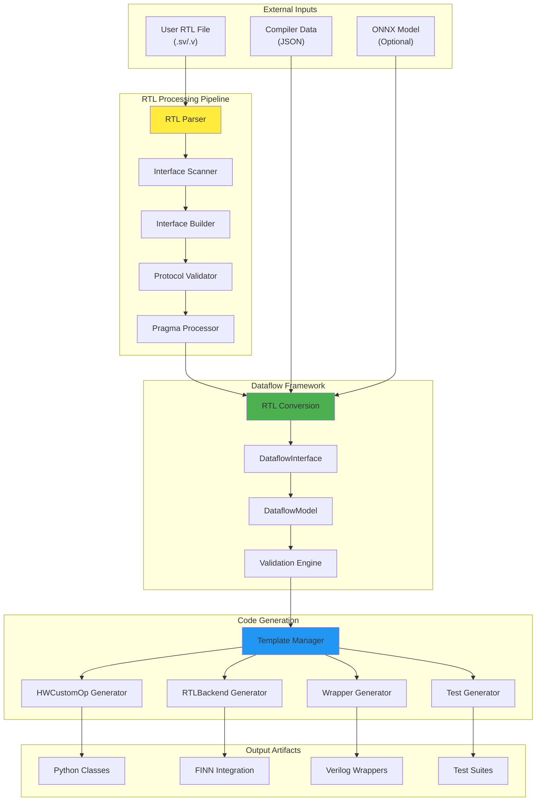

### Dataflow Framework Internal Architecture

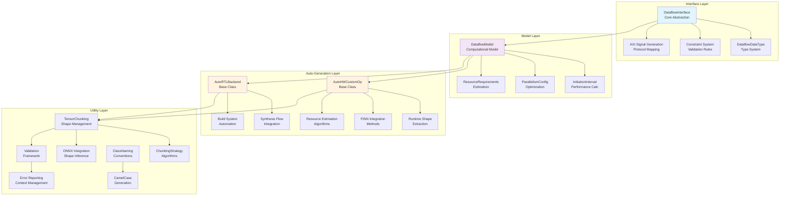

## Detailed Module Structure

### Brainsmith Core Structure

```
brainsmith/
├── 📁 dataflow/                           # Interface-Wise Dataflow Framework
│   ├── 📄 API_REFERENCE.md               # API documentation
│   ├── 📄 README.md                      # Framework overview
│   ├── 📁 core/                          # Core framework components
│   │   ├── 📄 dataflow_interface.py      # ⭐ Core interface abstraction
│   │   ├── 📄 dataflow_model.py          # ⭐ Computational modeling
│   │   ├── 📄 auto_hw_custom_op.py       # ⭐ Generated HWCustomOp base
│   │   ├── 📄 auto_rtl_backend.py        # ⭐ Generated RTLBackend base
│   │   ├── 📄 validation.py              # Constraint validation
│   │   ├── 📄 tensor_chunking.py         # Tensor shape utilities
│   │   ├── 📄 interface_metadata.py      # Metadata containers
│   │   └── 📄 class_naming.py            # Naming conventions
│   ├── 📁 integration/                   # External system integration
│   │   └── 📄 rtl_conversion.py          # RTL → Dataflow conversion
│   └── 📁 examples/                      # Usage examples
│       └── 📄 basic_usage.py             # Framework demonstration
│
├── 📁 tools/hw_kernel_gen/                # Hardware Kernel Generator
│   ├── 📄 README.md                      # HWKG documentation
│   ├── 📄 hkg.py                         # ⭐ Main CLI entry point
│   ├── 📄 errors.py                      # Error handling framework
│   ├── 📁 rtl_parser/                    # SystemVerilog parsing engine
│   │   ├── 📄 README.md                  # Parser documentation
│   │   ├── 📄 parser.py                  # ⭐ Main parsing logic
│   │   ├── 📄 interface_scanner.py       # Interface discovery
│   │   ├── 📄 interface_builder.py       # Interface construction
│   │   ├── 📄 protocol_validator.py      # AXI protocol validation
│   │   ├── 📄 pragma.py                  # Pragma extraction
│   │   ├── 📄 grammar.py                 # Tree-sitter grammar
│   │   └── 📄 sv.so                      # Compiled grammar binary
│   ├── 📁 generators/                    # Code generation engines
│   │   ├── 📄 enhanced_hw_custom_op_generator.py  # ⭐ HWCustomOp generation
│   │   ├── 📄 enhanced_rtl_backend_generator.py   # ⭐ RTLBackend generation
│   │   ├── 📄 hw_custom_op_generator.py           # Legacy generator
│   │   └── 📄 rtl_template_generator.py           # Verilog wrapper gen
│   ├── 📁 templates/                     # Jinja2 template system
│   │   ├── 📄 hw_custom_op_slim.py.j2    # ⭐ Minimal HWCustomOp template
│   │   ├── 📄 rtl_backend.py.j2          # ⭐ RTLBackend template
│   │   ├── 📄 rtl_wrapper.v.j2           # Verilog wrapper template
│   │   ├── 📄 test_suite.py.j2           # Test generation template
│   │   └── 📄 documentation.md.j2        # Documentation template
│   ├── 📁 orchestration/                 # Pipeline coordination
│   │   ├── 📄 pipeline_orchestrator.py   # ⭐ Main pipeline controller
│   │   ├── 📄 generation_workflow.py     # Workflow definitions
│   │   ├── 📄 generator_factory.py       # Generator instantiation
│   │   └── 📄 integration_orchestrator.py # Integration management
│   ├── 📁 analysis/                      # Advanced analysis tools
│   │   ├── 📄 enhanced_interface_analyzer.py  # Interface analysis
│   │   └── 📄 enhanced_pragma_processor.py    # Pragma processing
│   └── 📁 compatibility/                 # Backward compatibility
│       ├── 📄 backward_compatibility.py  # Legacy support
│       └── 📄 legacy_adapter.py          # Legacy system adapters
```

⭐ = Critical components for code review

### Custom Operations Structure

```
custom_op/
├── 📁 fpgadataflow/                      # FPGA-specific dataflow operations
│   ├── 📄 brainsmith_hlsbackend.py      # HLS backend integration
│   ├── 📄 brainsmith_templates.py       # Template utilities
│   ├── 📁 hls/                          # HLS kernel implementations
│   │   ├── 📄 crop_hls.py               # Crop operation HLS
│   │   ├── 📄 hwsoftmax_hls.py          # Softmax operation HLS
│   │   ├── 📄 layernorm_hls.py          # LayerNorm operation HLS
│   │   └── 📄 shuffle_hls.py            # Shuffle operation HLS
│   ├── 📄 crop.py                       # Crop operation
│   ├── 📄 hwsoftmax.py                  # Hardware softmax
│   ├── 📄 layernorm.py                  # Layer normalization
│   └── 📄 shuffle.py                    # Channel shuffle
└── 📁 general/                          # General-purpose operations
    └── 📄 norms.py                      # Normalization operations
```

### Hardware Kernels Structure

```
hw_kernels/
├── 📁 hls/                              # High-Level Synthesis headers
│   ├── 📄 bs_utils.hpp                  # Brainsmith utilities
│   ├── 📄 input_gen.hpp                 # Input generation utilities
│   ├── 📄 layernorm.hpp                 # LayerNorm implementation
│   └── 📄 softmax.hpp                   # Softmax implementation
└── 📁 rtl/                              # RTL module implementations
    └── 📄 README.md                     # RTL documentation
```

## Data Flow Diagrams

### End-to-End Pipeline Data Flow

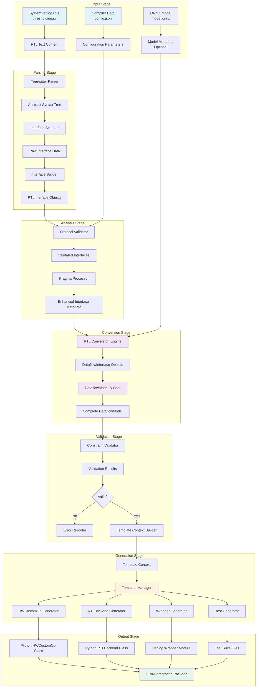

### Interface Processing Detail Flow

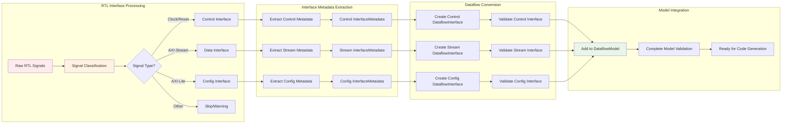

## Workflow Sequences

### HWKG Generation Sequence

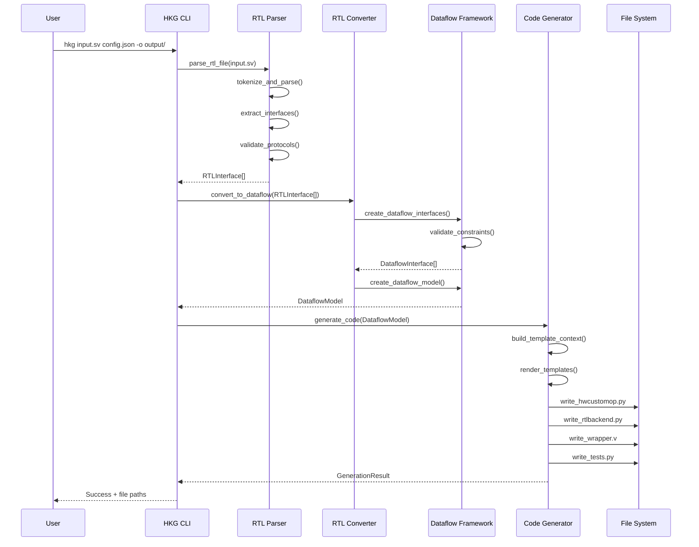

### Dataflow Model Building Sequence

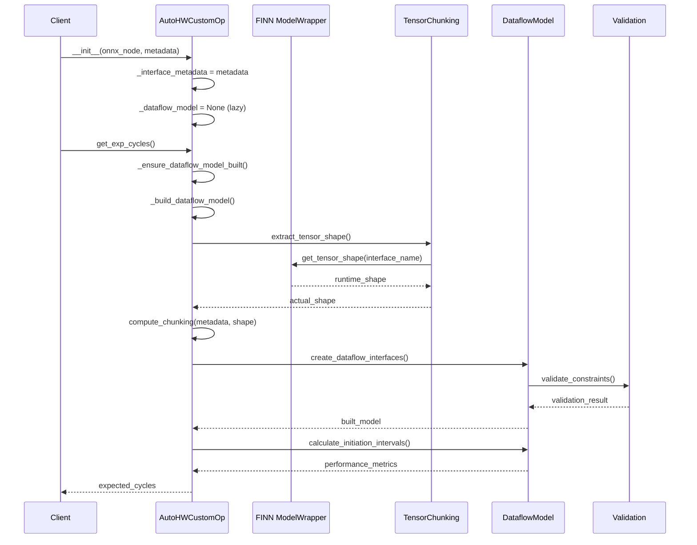

### Error Handling Flow

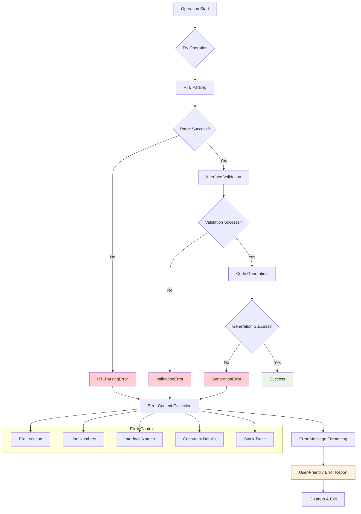

## Development Workflows

### Developer Workflow for Adding New RTL Kernels

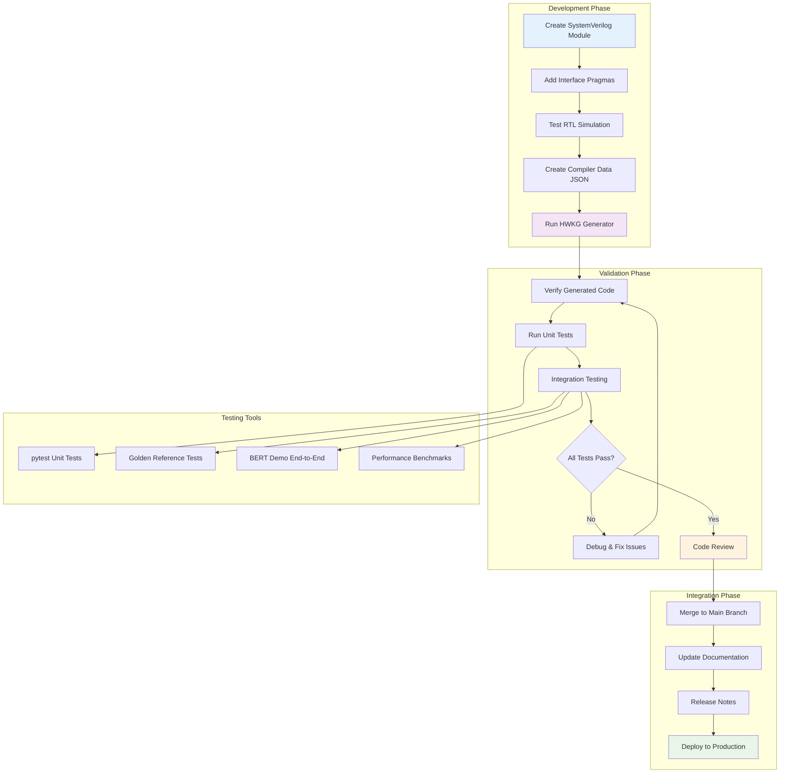

### FINN Integration Workflow

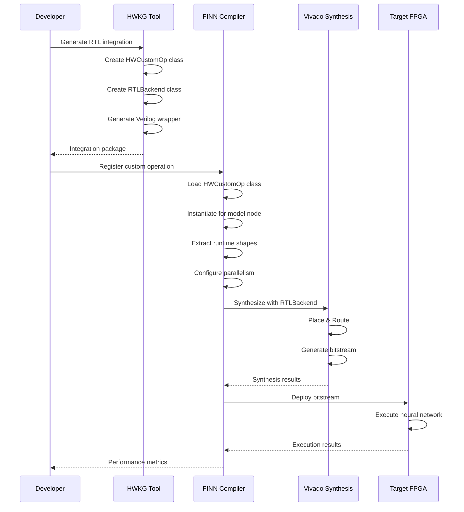

### Testing Pipeline Workflow

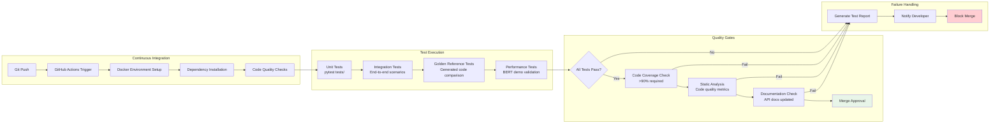

## Summary

This repository implements a sophisticated FPGA acceleration framework with the following key characteristics:

### 🏗️ **Architectural Highlights**
- **Modular Design**: Clear separation between parsing, modeling, and generation
- **Interface-Driven**: Everything flows through standardized interface abstractions
- **Runtime Adaptation**: Dynamic shape extraction eliminates static configuration
- **Base Class Inheritance**: 90% reduction in generated code complexity

### 🔄 **Data Flow Characteristics**
- **Linear Pipeline**: RTL → Parse → Model → Generate → Integrate
- **Validation Gates**: Multiple validation points prevent invalid configurations
- **Error Recovery**: Comprehensive error handling with actionable messages
- **Lazy Initialization**: On-demand model building for performance

### 🛠️ **Development Features**
- **Docker-First**: Consistent development environment
- **Test-Driven**: Comprehensive test coverage with multiple test types
- **Documentation-Rich**: Extensive guides and API documentation
- **CI/CD Ready**: Automated testing and quality gates

The system successfully bridges the gap between low-level RTL hardware and high-level neural network frameworks, providing an automated pathway from SystemVerilog modules to FPGA-deployed neural networks.