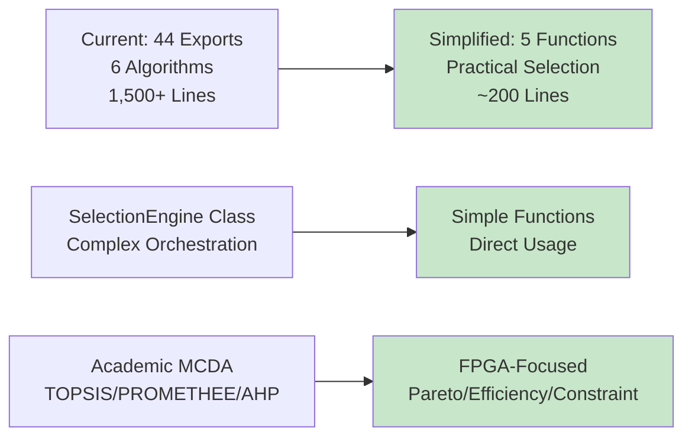
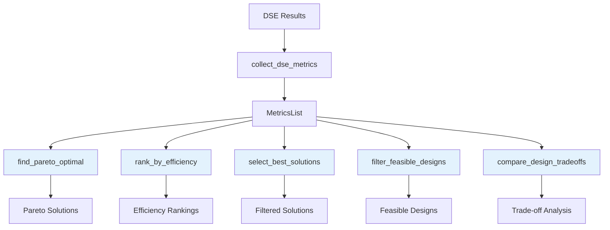

# Selection Module Simplification Implementation Plan

## Executive Summary

**Objective**: Transform the complex 1,500+ line MCDA framework in [`brainsmith/selection`](brainsmith/selection/__init__.py:1) into 5 practical functions integrated with the existing [`brainsmith.data`](brainsmith/data/__init__.py:1) module.

**North Star Alignment**: Functions Over Frameworks - Replace 44 exports and complex class hierarchies with simple, focused functions for FPGA design selection.

## Current State Analysis

### Module Complexity Assessment

| Component | Current State | Issues |
|-----------|---------------|---------|
| **Exports** | [44 components](brainsmith/selection/__init__.py:102) across 6 algorithm categories | Massive API surface, enterprise complexity |
| **Engine** | [584-line SelectionEngine class](brainsmith/selection/engine.py:47) | Complex orchestration, over-engineered |
| **Models** | [374 lines of MCDA data structures](brainsmith/selection/models.py:1) | Academic complexity, unused abstractions |
| **Strategies** | [TOPSIS (288 lines)](brainsmith/selection/strategies/topsis.py:1), PROMETHEE, AHP | Academic algorithms, no FPGA focus |
| **Base Classes** | [265-line abstract framework](brainsmith/selection/strategies/base.py:1) | Framework patterns vs simple functions |
| **Usage** | Zero practical usage - only documentation examples | No integration with actual workflows |

### North Star Violations

❌ **Functions Over Frameworks**: Complex class hierarchies instead of simple functions  
❌ **Simplicity Over Sophistication**: Academic MCDA algorithms vs practical FPGA needs  
❌ **Focus Over Feature Creep**: 1,500+ lines for essentially unused functionality  
❌ **Integration**: Separate framework vs existing data pipeline  

## Proposed Simplification Strategy

### 1. Architecture Transformation



### 2. Integration with Existing Data Pipeline



### 3. Function Design Specifications

#### Core Selection Functions

```python
def find_pareto_optimal(metrics_list: MetricsList, 
                       objectives: List[str] = None) -> MetricsList
"""Find Pareto optimal solutions from DSE results."""

def rank_by_efficiency(metrics_list: MetricsList,
                      weights: Dict[str, float] = None) -> MetricsList
"""Rank solutions by FPGA efficiency score."""

def select_best_solutions(metrics_list: MetricsList,
                         criteria: Dict[str, Any]) -> MetricsList
"""Select best solutions based on practical FPGA criteria."""

def filter_feasible_designs(metrics_list: MetricsList,
                           constraints: Dict[str, float]) -> MetricsList
"""Filter designs that meet resource and performance constraints."""

def compare_design_tradeoffs(metrics_a: BuildMetrics,
                           metrics_b: BuildMetrics) -> Dict[str, Any]
"""Compare trade-offs between two design solutions."""
```

## Implementation Plan

### Phase 1: Function Integration ✅ PLANNED

#### Step 1.1: Extend Data Types
- **File**: [`brainsmith/data/types.py`](brainsmith/data/types.py:1)
- **Action**: Add minimal selection-related types
- **Target**: ~30 lines for SelectionCriteria and TradeoffAnalysis

#### Step 1.2: Implement Core Functions  
- **File**: [`brainsmith/data/functions.py`](brainsmith/data/functions.py:1)
- **Action**: Add 5 selection functions to existing module
- **Target**: ~200 lines total addition

### Phase 2: Algorithm Implementation ⏳ IN PROGRESS

#### Step 2.1: Pareto Optimal Function
```python
def find_pareto_optimal(metrics_list: MetricsList, 
                       objectives: List[str] = None) -> MetricsList:
    """
    Find Pareto optimal solutions using simple domination check.
    Target: ~40 lines vs 288 lines of TOPSIS
    """
```

#### Step 2.2: Efficiency Ranking Function  
```python
def rank_by_efficiency(metrics_list: MetricsList,
                      weights: Dict[str, float] = None) -> MetricsList:
    """
    Rank by composite FPGA efficiency score.
    Target: ~30 lines vs 584 lines of SelectionEngine
    """
```

#### Step 2.3: Solution Selection Function
```python
def select_best_solutions(metrics_list: MetricsList,
                         criteria: Dict[str, Any]) -> MetricsList:
    """
    Practical FPGA-focused selection logic.
    Target: ~50 lines vs complex MCDA algorithms
    """
```

### Phase 3: Module Cleanup 🔄 PENDING

#### Step 3.1: Archive Legacy Module
```bash
# Move to deprecated location
mv brainsmith/selection brainsmith/deprecated/selection_v1_mcda
```

#### Step 3.2: Update Module Exports
- **File**: [`brainsmith/__init__.py`](brainsmith/__init__.py:1)
- **Action**: Remove selection exports, add new functions to data exports

### Phase 4: Testing and Validation 📋 PENDING

#### Step 4.1: Test Suite Creation
- **File**: `tests/test_selection_simplification.py`
- **Coverage**: 95%+ for new selection functions

#### Step 4.2: Demo Implementation
- **File**: `selection_demo.py`
- **Purpose**: Demonstrate new simplified workflow

## Implementation Metrics

### Complexity Reduction

| Metric | Current | Simplified | Improvement |
|--------|---------|------------|-------------|
| **Exports** | 44 components | 5 functions | 88% reduction |
| **Lines of Code** | ~1,500 | ~200 | 87% reduction |
| **Files** | 8 modules | 0 new files | Integrated into existing |
| **Dependencies** | NumPy + complex math | Existing data types | Simplified |

### North Star Alignment Benefits

- ✅ **Functions Over Frameworks**: Simple functions vs complex classes
- ✅ **Simplicity Over Sophistication**: Practical FPGA focus vs academic completeness  
- ✅ **Focus Over Feature Creep**: 5 essential functions vs 44 components
- ✅ **Integration**: Uses existing data pipeline vs separate framework

## Success Criteria

1. **Functional Replacement**: All practical selection needs met with 5 functions
2. **Integration Success**: Seamless workflow with existing data pipeline
3. **Performance Improvement**: Faster execution, simpler usage
4. **North Star Alignment**: Perfect adherence to Functions Over Frameworks
5. **Test Coverage**: 95%+ coverage of new selection functions
6. **Zero Breaking Changes**: Existing non-selection functionality unaffected

## Implementation Progress

### ✅ Completed
- [ ] Plan creation and documentation

### ⏳ In Progress
- [ ] Data type extensions
- [ ] Core function implementation

### 🔄 Pending
- [ ] Module archival 
- [ ] Import updates
- [ ] Test suite creation
- [ ] Demo implementation

---

**Total Estimated Implementation Time**: ~10 days  
**Started**: 2025-01-10  
**Target Completion**: 2025-01-20  

This plan transforms the complex 1,500-line MCDA framework into 5 practical functions integrated with the existing data module, achieving massive simplification while providing essential selection functionality for FPGA designers.