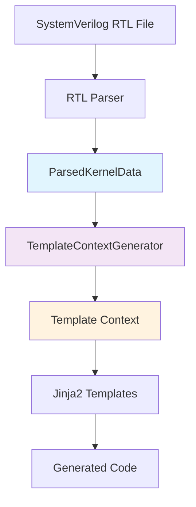
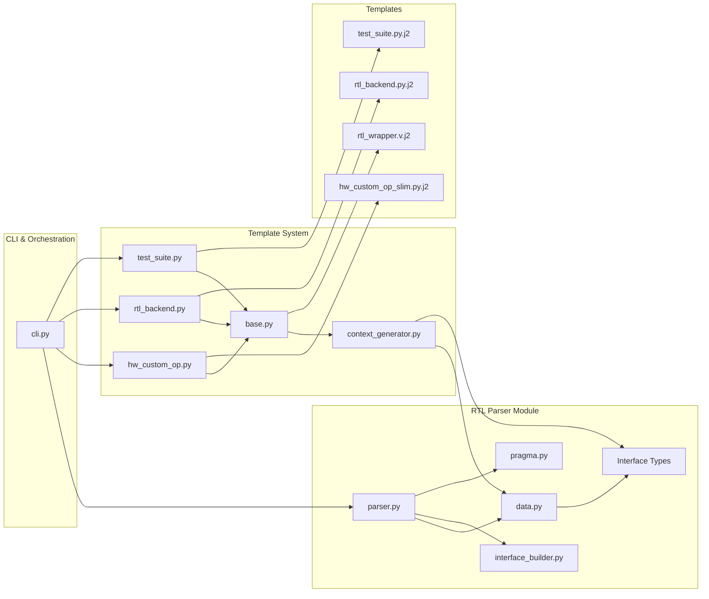

# HWKG Simplified Pipeline Architecture

## Overview: RTL Parser → ParsedKernelData → Template Generation



## Detailed Architecture Flow

### Phase 1: RTL Parsing
```
┌─────────────────────────────────────────────────────────────────┐
│                          RTL Parser                            │
│  brainsmith/tools/hw_kernel_gen/rtl_parser/parser.py          │
├─────────────────────────────────────────────────────────────────┤
│  Input: SystemVerilog file (.sv)                              │
│  Process:                                                      │
│  1. Parse AST using tree-sitter                              │
│  2. Extract module components                                  │
│  3. Build and validate interfaces                             │
│  4. Apply pragmas                                             │
│  Output: ParsedKernelData (simple dataclass)                 │
└─────────────────────────────────────────────────────────────────┘
```

### Phase 2: Data Container
```
┌─────────────────────────────────────────────────────────────────┐
│                      ParsedKernelData                          │
│  brainsmith/tools/hw_kernel_gen/rtl_parser/data.py            │
├─────────────────────────────────────────────────────────────────┤
│  @dataclass (SIMPLE DATA CONTAINER ONLY)                      │
│  Fields:                                                       │
│  • name: str                    # Module name                 │
│  • source_file: Path            # Source RTL file             │
│  • parameters: List[Parameter]  # SystemVerilog parameters   │
│  • interfaces: Dict[str, Interface]  # Validated interfaces  │
│  • pragmas: List[Pragma]        # Parsed pragmas             │
│  • parsing_warnings: List[str]  # Parser warnings            │
│                                                               │
│  NO PROCESSING METHODS - Pure data only                       │
└─────────────────────────────────────────────────────────────────┘
```

### Phase 3: Template Context Generation
```
┌─────────────────────────────────────────────────────────────────┐
│                  TemplateContextGenerator                      │
│  brainsmith/tools/hw_kernel_gen/templates/context_generator.py │
├─────────────────────────────────────────────────────────────────┤
│  static generate_context(parsed_data: ParsedKernelData)       │
│  Processing Logic:                                             │
│  • Class name generation (snake_case → PascalCase)           │
│  • Interface categorization by InterfaceType                  │
│  • Kernel complexity estimation                               │
│  • Kernel type inference                                      │
│  • Template boolean flags                                     │
│  • RTL parameter formatting                                   │
│  • Statistics and metadata                                    │
│  Output: Complete template context dict                       │
└─────────────────────────────────────────────────────────────────┘
```

### Phase 4: Template Generation
```
┌─────────────────────────────────────────────────────────────────┐
│                      Generator Classes                         │
│  brainsmith/tools/hw_kernel_gen/generators/                   │
├─────────────────────────────────────────────────────────────────┤
│  GeneratorBase (base.py)                                      │
│  ├── Uses TemplateContextGenerator                            │
│  ├── Sets up Jinja2 environment                              │
│  └── Handles template rendering                               │
│                                                               │
│  Specific Generators:                                         │
│  ├── HWCustomOpGenerator (hw_custom_op.py)                   │
│  ├── RTLBackendGenerator (rtl_backend.py)                    │
│  └── TestSuiteGenerator (test_suite.py)                      │
└─────────────────────────────────────────────────────────────────┘
```

## File Dependencies Graph



## Data Flow Detailed

### 1. Input Processing
```
SystemVerilog RTL
      ↓
RTLParser.parse_file()
      ↓
• _initial_parse() → AST + module selection
• _extract_kernel_components() → name, parameters, ports
• _analyze_and_validate_interfaces() → validated interfaces
• _apply_pragmas() → enhanced interface metadata
      ↓
ParsedKernelData(
  name="thresholding",
  source_file=Path("thresholding.sv"),
  parameters=[Parameter(name="WIDTH", ...)],
  interfaces={"in0": Interface(...), "out0": Interface(...)},
  pragmas=[BDimPragma(...)],
  parsing_warnings=[]
)
```

### 2. Context Generation
```
ParsedKernelData
      ↓
TemplateContextGenerator.generate_context()
      ↓
{
  "kernel_name": "thresholding",
  "class_name": "Thresholding",
  "interfaces": [Interface(...)],
  "input_interfaces": [Interface(type=INPUT)],
  "output_interfaces": [Interface(type=OUTPUT)],
  "weight_interfaces": [Interface(type=WEIGHT)],
  "rtl_parameters": [{"name": "WIDTH", "template_param_name": "$WIDTH$"}],
  "has_inputs": True,
  "has_outputs": True,
  "kernel_complexity": "low",
  "kernel_type": "threshold",
  "InterfaceType": InterfaceType,
  "dataflow_model_summary": {...}
}
```

### 3. Template Rendering
```
Template Context + Jinja2 Template
      ↓
GeneratorBase.generate()
      ↓
• Load template (hw_custom_op_slim.py.j2)
• Render with context
• Write to output file
      ↓
Generated Python Code:
• thresholding_hwcustomop.py
• thresholding_rtlbackend.py  
• test_thresholding.py
• thresholding_wrapper.v
```

## Key Design Principles

### 1. **Separation of Concerns**
- **ParsedKernelData**: Pure data container (no methods)
- **TemplateContextGenerator**: All template processing logic
- **Generators**: Template-specific enhancements and rendering

### 2. **Single Responsibility**
- Each class has one clear purpose
- No mixing of parsing logic with template logic
- Clean interfaces between components

### 3. **Dependency Direction**
```
RTL Parser → ParsedKernelData ← TemplateContextGenerator ← Generators
```
- Data flows one direction
- No circular dependencies
- Clear ownership of responsibilities

### 4. **Extensibility**
- New generators easily added by extending GeneratorBase
- Template context can be enhanced without touching ParsedKernelData
- New pragma types handled in RTL Parser

## File Locations

```
brainsmith/tools/hw_kernel_gen/
├── rtl_parser/
│   ├── data.py                 # ParsedKernelData + core data structures
│   ├── parser.py               # Main RTL parsing logic
│   ├── interface_builder.py    # Interface validation and building
│   └── pragma.py               # Pragma parsing and application
├── templates/
│   ├── context_generator.py    # Template context generation
│   ├── hw_custom_op_slim.py.j2 # HWCustomOp template
│   ├── rtl_backend.py.j2       # RTLBackend template
│   ├── test_suite.py.j2        # Test suite template
│   └── rtl_wrapper.v.j2        # Verilog wrapper template
├── generators/
│   ├── base.py                 # Base generator class
│   ├── hw_custom_op.py         # HWCustomOp generator
│   ├── rtl_backend.py          # RTLBackend generator
│   └── test_suite.py           # Test suite generator
└── cli.py                      # Command-line interface
```

## Component Responsibilities

### RTL Parser (`rtl_parser/parser.py`)
**Responsibilities:**
- Parse SystemVerilog AST using tree-sitter
- Extract module name, parameters, and ports
- Build and validate interfaces using InterfaceBuilder
- Apply pragmas to enhance interface metadata
- Create ParsedKernelData with all parsed information

**Key Methods:**
- `parse_file()` - Main entry point for file parsing
- `_initial_parse()` - AST generation and module selection
- `_extract_kernel_components()` - Extract name, parameters, ports
- `_analyze_and_validate_interfaces()` - Interface building and validation
- `_apply_pragmas()` - Apply @brainsmith pragmas

### ParsedKernelData (`rtl_parser/data.py`)
**Responsibilities:**
- Store all parsed RTL data in a simple dataclass
- Provide no processing methods - pure data container
- Reuse existing RTL Parser data structures (Parameter, Interface, Pragma)

**Fields:**
- `name: str` - Module name
- `source_file: Path` - Source RTL file path
- `parameters: List[Parameter]` - SystemVerilog parameters
- `interfaces: Dict[str, Interface]` - Validated interfaces
- `pragmas: List[Pragma]` - Parsed pragmas
- `parsing_warnings: List[str]` - Parser warnings

### TemplateContextGenerator (`templates/context_generator.py`)
**Responsibilities:**
- Generate complete template context from ParsedKernelData
- Categorize interfaces by type (INPUT, OUTPUT, WEIGHT, etc.)
- Perform kernel analysis (complexity, type inference)
- Create template-friendly data structures
- Provide all variables that Jinja2 templates expect

**Key Methods:**
- `generate_context()` - Main static method to create template context
- `_get_class_name()` - Convert module name to PascalCase
- `_get_interfaces_by_type()` - Filter interfaces by InterfaceType
- `_estimate_complexity()` - Analyze kernel complexity
- `_infer_kernel_type()` - Infer kernel type from name

### GeneratorBase (`generators/base.py`)
**Responsibilities:**
- Set up Jinja2 template environment
- Use TemplateContextGenerator for context creation
- Handle template rendering and file output
- Provide base functionality for all generators

**Key Methods:**
- `generate()` - Main generation method
- `_setup_jinja_env()` - Configure Jinja2 environment
- `_get_template_context()` - Get enhanced template context
- `_get_output_filename()` - Abstract method for filename generation

### Specific Generators
**HWCustomOpGenerator (`generators/hw_custom_op.py`):**
- Generates FINN HWCustomOp Python classes
- Output: `{module_name}_hwcustomop.py`

**RTLBackendGenerator (`generators/rtl_backend.py`):**
- Generates FINN RTLBackend Python classes
- Output: `{module_name}_rtlbackend.py`

**TestSuiteGenerator (`generators/test_suite.py`):**
- Generates comprehensive test suites
- Output: `test_{module_name}.py`

## Benefits of This Architecture

### 1. **Clean Data Model**
- ParsedKernelData is now a simple, testable data container
- No mixing of parsing logic with template processing
- Clear separation between "what was parsed" vs "how to use it"

### 2. **Centralized Processing**
- All template logic consolidated in TemplateContextGenerator
- No duplication of context generation across generators
- Single source of truth for template variables

### 3. **Template Compatibility**
- All existing Jinja2 templates continue to work unchanged
- Template context provides expected variables and structure
- Easy to enhance context without breaking existing templates

### 4. **Easy Testing**
- Each component can be unit tested independently
- ParsedKernelData can be easily mocked with test data
- Template context generation can be tested without parsing RTL

### 5. **Future-Proof Extensibility**
- New generators easily added by extending GeneratorBase
- Template context can be enhanced without touching ParsedKernelData
- New pragma types handled entirely within RTL Parser
- Additional template variables added in TemplateContextGenerator

## Migration Benefits

This architecture successfully addresses the original requirement:

> **"ParsedKernelData does way too much. It should just be a dataclass containing everything we've determined from RTL Parsing. If more data processing needs to be done, that should either be by the RTL Parser before, or by the Template Generator after."**

**Before:** ParsedKernelData had 15+ processing methods mixed with data storage

**After:** 
- **ParsedKernelData**: Pure dataclass with 6 data fields
- **RTL Parser**: Handles all parsing and pragma application
- **TemplateContextGenerator**: Handles all template processing

This creates a clean, maintainable architecture that separates concerns while preserving all functionality.