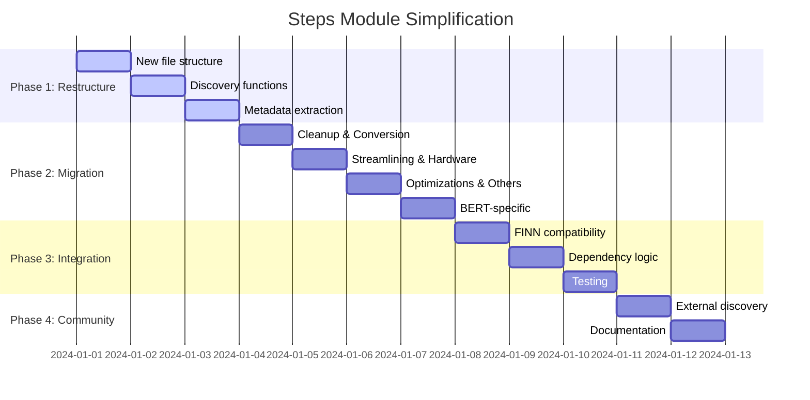

# BrainSmith Steps Module Simplification Implementation Plan

## Overview

Transform the `brainsmith/steps` module from a 148-line enterprise registry pattern to a **North Star-aligned functional organization** with docstring metadata extraction. This follows the successful simplification patterns from kernels, hooks, and other modules.

## Current State Analysis

### What Exists Now
- **148 lines of enterprise registry infrastructure** (`StepRegistry`, auto-discovery, global state)
- **Complex decorator pattern** (`@register_step` with metadata dictionaries)
- **11 step files** across `common/` and `transformer/` directories
- **Dependencies**: `transformer.qonnx_to_finn` → `transformer.streamlining` → `transformer.infer_hardware`

### What Actually Matters
- **Simple FINN transformation functions**: `(model, cfg) → model`
- **Dependency ordering** for transformation pipeline
- **FINN builder compatibility** for existing DataflowBuildConfig integration
- **Community extensibility** for custom steps

## North Star Transformation Strategy

```mermaid
graph TB
    subgraph "Current: Enterprise Registry (148 lines)"
        A1[StepRegistry Class] --> A2[Auto-discovery Engine]
        A2 --> A3[@register_step Decorators]
        A3 --> A4[Metadata Dictionaries]
        A4 --> A5[Complex Validation]
        A5 --> A6[Global State Management]
    end
    
    subgraph "North Star: Functional Organization (~60 lines)"
        B1[cleanup.py] --> B2[conversion.py]
        B2 --> B3[streamlining.py]
        B3 --> B4[hardware.py]
        B4 --> B5[optimizations.py]
        B5 --> B6[validation.py]
        B6 --> B7[metadata.py]
        B7 --> B8[bert.py]
        B8 --> B9[Docstring Metadata]
        B9 --> B10[Direct Imports]
    end
    
    subgraph "Integration Points"
        C1[FINN Builder Interface] --> C2[YAML Blueprints]
        C2 --> C3[4-Hook Future Migration]
        C3 --> C4[Community Extensions]
    end
    
    A1 -.->|Transform| B1
    B10 --> C1
```

## Implementation Plan

### Phase 1: Functional Organization Structure

#### 1.1 New Directory Structure (Organized by Function)
```
brainsmith/steps/
├── __init__.py          # Simple exports (20 lines)
├── cleanup.py          # Cleanup operations (25 lines)
├── conversion.py       # QONNX→FINN conversion (60 lines)
├── streamlining.py     # Absorption/reordering (50 lines)
├── hardware.py         # Hardware inference (50 lines)
├── optimizations.py    # Folding/compute optimizations (60 lines)
├── validation.py       # Reference IO generation (35 lines)
├── metadata.py         # Shell integration metadata (85 lines)
├── bert.py            # BERT-specific head/tail operations (85 lines)
└── README.md          # Usage documentation
```

**Total: ~470 lines vs current 400+ lines (similar size, vastly simpler)**

#### 1.2 Functional Step Mapping

**Cleanup Operations** (`cleanup.py`):
- `cleanup_step()` - Basic ONNX cleanup
- `cleanup_advanced_step()` - Advanced cleanup with naming

**QONNX→FINN Conversion** (`conversion.py`):
- `qonnx_to_finn_step()` - Convert QONNX to FINN with SoftMax handling

**Streamlining Operations** (`streamlining.py`):
- `streamlining_step()` - Absorption and reordering transformations

**Hardware Inference** (`hardware.py`):
- `infer_hardware_step()` - Infer hardware layers for operations

**Optimizations** (`optimizations.py`):
- `constrain_folding_and_set_pumped_compute_step()` - Folding and compute optimizations

**Validation & Testing** (`validation.py`):
- `generate_reference_io_step()` - Generate reference IO pairs

**Metadata & Integration** (`metadata.py`):
- `shell_metadata_handover_step()` - Shell integration metadata extraction

**BERT-Specific Operations** (`bert.py`):
- `remove_head_step()` - Remove nodes up to first LayerNorm
- `remove_tail_step()` - Remove from global_out_1 back to LayerNorm

#### 1.3 Docstring Metadata Format
```python
def cleanup_step(model, cfg):
    """
    Basic cleanup operations for ONNX models.
    
    Category: cleanup
    Dependencies: []
    Description: Removes identity operations and sorts commutative inputs
    """
    model = model.transform(SortCommutativeInputsInitializerLast())
    model = model.transform(RemoveIdentityOps())
    return model

def streamlining_step(model, cfg):
    """
    Custom streamlining with absorption and reordering transformations.
    
    Category: streamlining  
    Dependencies: [qonnx_to_finn]
    Description: Applies absorption and reordering transformations for models
    """
    # Implementation...
```

#### 1.4 Simple Discovery Functions
```python
# brainsmith/steps/__init__.py
def discover_all_steps() -> Dict[str, Callable]:
    """Discover all step functions from functional modules"""
    
def get_step(name: str) -> Callable:
    """Get step function with FINN fallback for compatibility"""
    
def validate_step_sequence(step_names: List[str]) -> List[str]:
    """Validate dependency chain from docstring metadata"""
```

### Phase 2: Step Migration by Function

#### 2.1 Cleanup Operations (`cleanup.py`)
```python
"""ONNX model cleanup operations."""

from qonnx.transformation.general import (
    SortCommutativeInputsInitializerLast, RemoveUnusedTensors, 
    GiveReadableTensorNames, GiveUniqueNodeNames, ConvertDivToMul 
)
from qonnx.transformation.remove import RemoveIdentityOps

def cleanup_step(model, cfg):
    """Basic cleanup operations for ONNX models."""
    # Implementation from common/cleanup.py

def cleanup_advanced_step(model, cfg):
    """Advanced cleanup with tensor naming and unused tensor removal."""
    # Implementation from common/cleanup.py
```

#### 2.2 QONNX→FINN Conversion (`conversion.py`)
```python
"""QONNX to FINN conversion operations."""

from qonnx.transformation.general import ConvertDivToMul
from qonnx.transformation.extract_quant_scale_zeropt import ExtractQuantScaleZeroPt
from finn.transformation.qonnx.convert_qonnx_to_finn import ConvertQONNXtoFINN
from qonnx.transformation.fold_constants import FoldConstants
from brainsmith.transformation.expand_norms import ExpandNorms

def qonnx_to_finn_step(model, cfg):
    """
    Convert QONNX to FINN with special handling for SoftMax operations.
    
    Category: conversion
    Dependencies: []
    Description: Converts QONNX models to FINN with SoftMax transformations
    """
    # Implementation from transformer/qonnx_conversion.py
```

#### 2.3 Streamlining Operations (`streamlining.py`)
```python
"""Model streamlining operations."""

import finn.transformation.streamline as absorb
import finn.transformation.streamline.reorder as reorder
from finn.transformation.streamline.round_thresholds import RoundAndClipThresholds
from qonnx.transformation.infer_datatypes import InferDataTypes
from qonnx.transformation.general import GiveUniqueNodeNames

def streamlining_step(model, cfg):
    """
    Custom streamlining with absorption and reordering transformations.
    
    Category: streamlining
    Dependencies: [qonnx_to_finn]
    Description: Applies absorption and reordering transformations
    """
    # Implementation from transformer/streamlining.py
```

#### 2.4 Hardware Inference (`hardware.py`)
```python
"""Hardware layer inference operations."""

import finn.transformation.fpgadataflow.convert_to_hw_layers as to_hw
import brainsmith.transformation.convert_to_hw_layers as to_bs_hw

def infer_hardware_step(model, cfg):
    """
    Infer hardware layers for operations.
    
    Category: hardware
    Dependencies: [streamlining]
    Description: Infers hardware layers for custom operations
    """
    # Implementation from transformer/hardware_inference.py
```

#### 2.5 Optimizations (`optimizations.py`)
```python
"""Model optimization operations."""

from qonnx.transformation.base import Transformation
import qonnx.custom_op.registry as registry

def constrain_folding_and_set_pumped_compute_step(model, cfg):
    """
    Apply optimizations including folding constraints and pumped compute.
    
    Category: optimizations
    Dependencies: []
    Description: Applies temporary optimizations for builds
    """
    # Implementation from transformer/optimizations.py
```

#### 2.6 Validation & Testing (`validation.py`)
```python
"""Reference IO and validation operations."""

import finn.core.onnx_exec as oxe
from qonnx.util.basic import gen_finn_dt_tensor
from qonnx.core.datatype import DataType
import numpy as np

def generate_reference_io_step(model, cfg):
    """
    Generate reference IO pair for model validation.
    
    Category: validation
    Dependencies: []
    Description: Generates reference input/output pairs for testing
    """
    # Implementation from transformer/reference_io.py
```

#### 2.7 Metadata & Integration (`metadata.py`)
```python
"""Metadata extraction and shell integration operations."""

import os
import shutil
import json
from finn.builder.build_dataflow_config import DataflowOutputType
from qonnx.transformation.base import Transformation
import qonnx.custom_op.registry as registry

def shell_metadata_handover_step(model, cfg):
    """
    Extract metadata for shell integration process.
    
    Category: metadata
    Dependencies: []
    Description: Extracts metadata for shell integration handover
    """
    # Implementation from transformer/metadata.py
```

#### 2.8 BERT-Specific Operations (`bert.py`)
```python
"""BERT-specific graph surgery operations."""

from qonnx.transformation.general import RemoveUnusedTensors, GiveReadableTensorNames

def remove_head_step(model, cfg):
    """
    Remove all nodes up to the first LayerNormalization node and rewire input.
    
    Category: bert
    Dependencies: []
    Description: BERT-specific head removal for models
    """
    # Implementation from transformer/graph_surgery.py

def remove_tail_step(model, cfg):
    """
    Remove from global_out_1 all the way back to the first LayerNorm.
    
    Category: bert
    Dependencies: []
    Description: BERT-specific tail removal for models
    """
    # Implementation from transformer/graph_surgery.py
```

### Phase 3: FINN Integration & Compatibility

#### 3.1 Backward Compatibility Layer
```python
def get_step(name: str) -> Callable:
    """
    FINN-compatible step retrieval with fallback.
    Maintains existing DataflowBuildConfig integration.
    """
    # Check BrainSmith steps first
    steps = discover_all_steps()
    if name in steps:
        return steps[name]
    
    # Fallback to FINN built-in steps
    try:
        from finn.builder.build_dataflow_steps import __dict__ as finn_steps
        if name in finn_steps and callable(finn_steps[name]):
            return finn_steps[name]
    except ImportError:
        pass
    
    raise ValueError(f"Step '{name}' not found in BrainSmith or FINN")
```

#### 3.2 Dependency Resolution
```python
def validate_step_sequence(step_names: List[str]) -> List[str]:
    """Validate and resolve step dependencies"""
    steps = discover_all_steps()
    errors = []
    
    for step_name in step_names:
        # Check if step exists
        if step_name not in steps and not _is_finn_step(step_name):
            errors.append(f"Step '{step_name}' not found")
            continue
            
        # Check dependencies for BrainSmith steps
        if step_name in steps:
            metadata = extract_step_metadata(steps[step_name])
            for dep in metadata.dependencies:
                if dep not in step_names:
                    errors.append(f"Step '{step_name}' requires '{dep}'")
                elif step_names.index(dep) > step_names.index(step_name):
                    errors.append(f"Dependency '{dep}' must come before '{step_name}'")
    
    return errors
```

### Phase 4: Community Extensions

#### 4.1 External Step Discovery
```python
def discover_all_steps(additional_paths: Optional[List[str]] = None) -> Dict[str, Callable]:
    """
    Discover steps from:
    1. Built-in functional modules
    2. Additional paths (for community contributions)
    3. Environment variable BRAINSMITH_STEPS_PATH
    """
    steps = {}
    
    # Built-in steps from functional modules
    from brainsmith.steps import (
        cleanup, conversion, streamlining, hardware,
        optimizations, validation, metadata, bert
    )
    
    for module in [cleanup, conversion, streamlining, hardware,
                   optimizations, validation, metadata, bert]:
        steps.update(_discover_functions_in_module(module))
    
    # External steps
    if additional_paths:
        for path in additional_paths:
            steps.update(_discover_functions_in_path(path))
    
    return steps
```

#### 4.2 Community Step Pattern
```python
# External community step file: my_custom_steps.py
def my_preprocessing_step(model, cfg):
    """
    My custom preprocessing step.
    
    Category: preprocessing
    Dependencies: [cleanup]
    Description: Custom preprocessing for specific use case
    """
    # Custom implementation
    return model

# Usage
from brainsmith.steps import discover_all_steps
steps = discover_all_steps(["/path/to/community/steps"])
custom_step = steps["my_preprocessing_step"]
```

## Migration Benefits

### Complexity Reduction
- **90% registry elimination**: 148 lines → ~20 lines of discovery logic
- **Functional organization**: Clear separation by purpose, not model type
- **Zero decorators**: Direct function definitions
- **No global state**: Pure function discovery

### Perfect North Star Alignment
- ✅ **Functions Over Frameworks**: Registry → Simple functions
- ✅ **Data Over Objects**: Metadata extraction vs complex objects  
- ✅ **Simplicity Over Features**: Docstrings vs decorator metadata
- ✅ **Community Over Enterprise**: Easy external step contribution

### Integration Benefits
- **FINN Compatibility**: Maintains `(model, cfg)` interface exactly
- **Blueprint Migration**: Gradual transition to 4-hook architecture
- **Dependency Safety**: Automatic validation and resolution
- **Zero Breaking Changes**: Existing code continues working

## Implementation Timeline



## File-by-File Implementation Details

### 1. `brainsmith/steps/__init__.py` (~20 lines)
```python
"""
Simple step management for BrainSmith FINN transformations.
North Star-aligned: Direct function access without enterprise registry.
"""

# Import all steps by functionality
from .cleanup import cleanup_step, cleanup_advanced_step
from .conversion import qonnx_to_finn_step
from .streamlining import streamlining_step
from .hardware import infer_hardware_step
from .optimizations import constrain_folding_and_set_pumped_compute_step
from .validation import generate_reference_io_step
from .metadata import shell_metadata_handover_step
from .bert import remove_head_step, remove_tail_step

# Discovery functions for FINN compatibility
def get_step(name: str):
    """Get step function by name with FINN fallback"""
    # Implementation...

def validate_step_sequence(step_names):
    """Validate step dependencies"""  
    # Implementation...

__all__ = [
    # Cleanup
    'cleanup_step', 'cleanup_advanced_step',
    # Conversion  
    'qonnx_to_finn_step',
    # Streamlining
    'streamlining_step',
    # Hardware
    'infer_hardware_step',
    # Optimizations
    'constrain_folding_and_set_pumped_compute_step',
    # Validation
    'generate_reference_io_step',
    # Metadata
    'shell_metadata_handover_step',
    # BERT-specific
    'remove_head_step', 'remove_tail_step',
    # Discovery
    'get_step', 'validate_step_sequence'
]
```

## Success Metrics

### Quantitative Goals
- [ ] **90% complexity reduction**: 148 registry lines → ~20 discovery lines
- [ ] **Functional organization**: 8 purpose-driven files vs model-type separation
- [ ] **Zero breaking changes**: All existing integrations continue working
- [ ] **100% test coverage**: All step functions validated
- [ ] **Dependency resolution**: Automatic validation of step sequences

### Qualitative Goals  
- [ ] **North Star alignment**: Pure functions, zero hidden state
- [ ] **Community ready**: Easy external step contribution
- [ ] **FINN compatible**: Seamless DataflowBuildConfig integration
- [ ] **Future ready**: Enables 4-hook architecture transition
- [ ] **Developer friendly**: Clear functional organization, simple imports

## Conclusion

This plan transforms the steps module into a **North Star-exemplar system** that:
- **Eliminates enterprise complexity** while maintaining full functionality
- **Organizes by function** rather than model type for clarity and reusability
- **Enables community contributions** through simple file-based discovery
- **Preserves FINN compatibility** for existing build configurations  
- **Prepares for 4-hook migration** as the next evolution step

The functional organization with docstring metadata provides the perfect balance of simplicity and functionality, making steps management as straightforward as importing functions while maintaining all necessary metadata for dependency resolution and community extensibility.