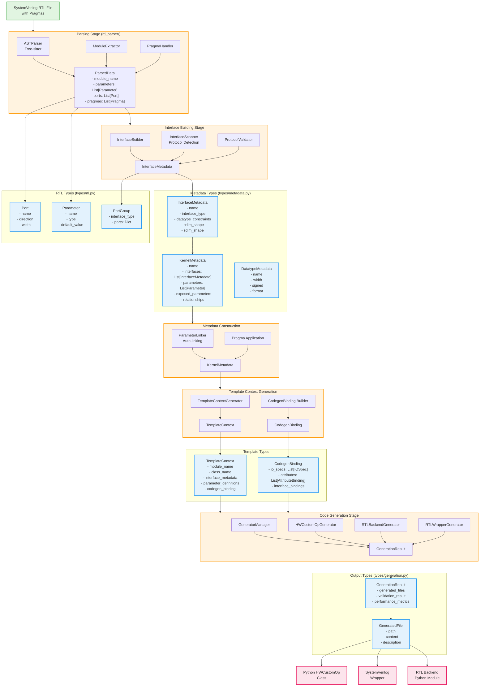

# Kernel Integrator Data Flow Analysis

This document visualizes the data transformation pipeline in the Kernel Integrator, showing how SystemVerilog RTL is progressively abstracted into Python code for FINN integration.

## Data Flow Diagram



## Abstraction Levels

The diagram shows five distinct abstraction levels:

### 1. **RTL Level** (Green)
- **Input**: Raw SystemVerilog source with pragma annotations
- **Types**: `Port`, `Parameter`, `Pragma`
- **Focus**: Hardware-specific details like port widths and directions

### 2. **Protocol Level** (Orange - Interface Building)
- **Process**: Group ports into logical interfaces
- **Types**: `PortGroup`, early `InterfaceMetadata`
- **Focus**: Protocol detection (AXI-Stream, AXI-Lite)

### 3. **Metadata Level** (Orange - Metadata Construction)
- **Process**: Apply pragmas, link parameters
- **Types**: `KernelMetadata`, complete `InterfaceMetadata`
- **Focus**: High-level kernel semantics and relationships

### 4. **Template Level** (Orange - Template Context)
- **Process**: Prepare for code generation
- **Types**: `TemplateContext`, `CodegenBinding`
- **Focus**: Python/C++ bindings and attribute mappings

### 5. **Output Level** (Pink)
- **Process**: Generate final artifacts
- **Types**: `GeneratedFile`, `GenerationResult`
- **Output**: Python HWCustomOp classes, SystemVerilog wrappers

## Key Transformations

1. **Parsing**: SystemVerilog → Structured RTL data
2. **Interface Building**: Individual ports → Grouped interfaces
3. **Metadata Construction**: RTL constructs → Semantic kernel model
4. **Context Generation**: Kernel model → Template-ready bindings
5. **Code Generation**: Templates + Context → Executable code

## Data Type Progression

```
Raw SV → Port/Parameter → PortGroup → InterfaceMetadata → KernelMetadata → TemplateContext → Generated Files
```

Each stage adds semantic information while abstracting away lower-level details, ultimately producing FINN-compatible Python operators from SystemVerilog RTL modules.