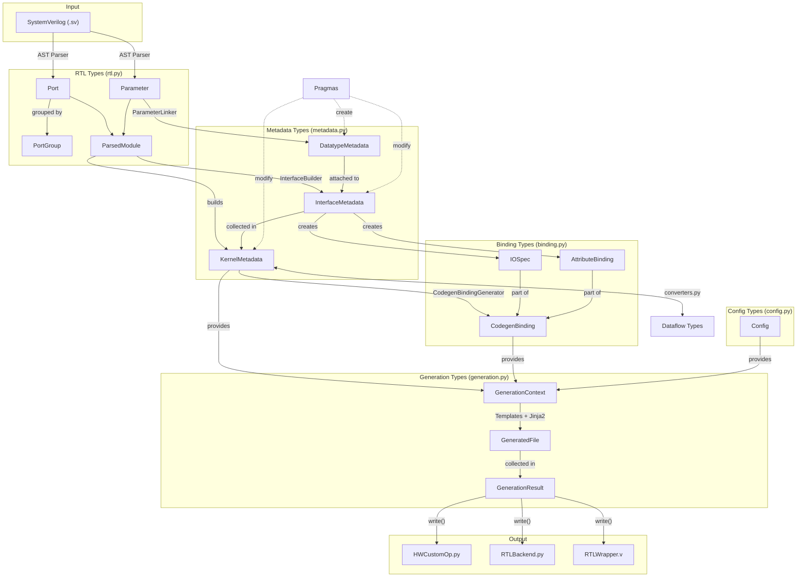

# Kernel Integrator Type Flow Analysis

## Overview

This document analyzes how types flow through the Kernel Integrator system from RTL parsing to code generation. The type system is organized into 5 distinct modules with clear responsibilities and no circular dependencies.

## Type Organization

The types are organized into 5 distinct files:

1. **rtl.py** - Low-level RTL parsing types (Port, Parameter, PortGroup, ParsedModule)
2. **metadata.py** - Semantic kernel representation (KernelMetadata, InterfaceMetadata, DatatypeMetadata)  
3. **binding.py** - Code generation mappings (CodegenBinding, IOSpec, AttributeBinding)
4. **generation.py** - Process tracking (GeneratedFile, GenerationResult, GenerationContext)
5. **config.py** - Configuration management (Config)

## Data Flow Diagram

## Processing Stages

### 1. RTL Parsing
- **Input**: SystemVerilog source code
- **Output**: ParsedModule containing Ports and Parameters
- **Key Components**: AST Parser, Module Extractor

### 2. Interface Building
- **Input**: ParsedModule with raw ports/parameters
- **Output**: KernelMetadata with semantic InterfaceMetadata
- **Key Components**: InterfaceBuilder, ParameterLinker
- **Transformations**: 
  - Groups ports into interfaces (AXI-Stream, AXI-Lite, etc.)
  - Links parameters to interfaces based on naming conventions
  - Applies pragma modifications

### 3. Binding Generation
- **Input**: KernelMetadata
- **Output**: CodegenBinding with IOSpec and AttributeBinding
- **Key Components**: CodegenBindingGenerator
- **Purpose**: Creates a unified specification for code generation

### 4. Code Generation
- **Input**: GenerationContext (metadata + binding + config)
- **Output**: GeneratedFile objects
- **Key Components**: Template engine, Jinja2 templates
- **Results**: HWCustomOp.py, RTLBackend.py, RTLWrapper.v

## Key Transformations

1. **InterfaceBuilder**: Groups ports into interfaces, creates InterfaceMetadata
2. **ParameterLinker**: Links parameters to interfaces based on pragmas/conventions
3. **CodegenBindingGenerator**: Creates unified binding specification from metadata
4. **Template Engine**: Uses binding + metadata to generate code files

## Integration Points

- **Converters module**: Provides bidirectional conversion between kernel_integrator types and dataflow types
- **Templates**: Access types through GenerationContext
- **Pragma system**: Modifies metadata during parsing

## Key Insights

1. **Layer Separation**: The types are organized in clear layers - RTL parsing → Metadata → Binding → Generation
2. **Progressive Enrichment**: Each layer adds semantic information (raw ports → interfaces → codegen bindings)
3. **Clean Interfaces**: Each transformation has clear input/output types with no circular dependencies
4. **Pragma Integration**: Pragmas modify metadata during parsing to influence code generation
5. **Template Context**: All necessary data converges in GenerationContext for template rendering
6. **Bidirectional Conversion**: The converters module enables integration with the broader dataflow system

## Benefits of This Architecture

- **Maintainability**: Clear separation of concerns makes the code easy to understand and modify
- **Testability**: Each layer can be tested independently
- **Extensibility**: New interface types or code generation targets can be added without affecting other layers
- **Type Safety**: Strong typing throughout the pipeline catches errors early
- **No Circular Dependencies**: Clean architecture prevents coupling issues

The architecture achieves a clean separation of concerns where each type has a specific purpose in the pipeline from RTL parsing to code generation.