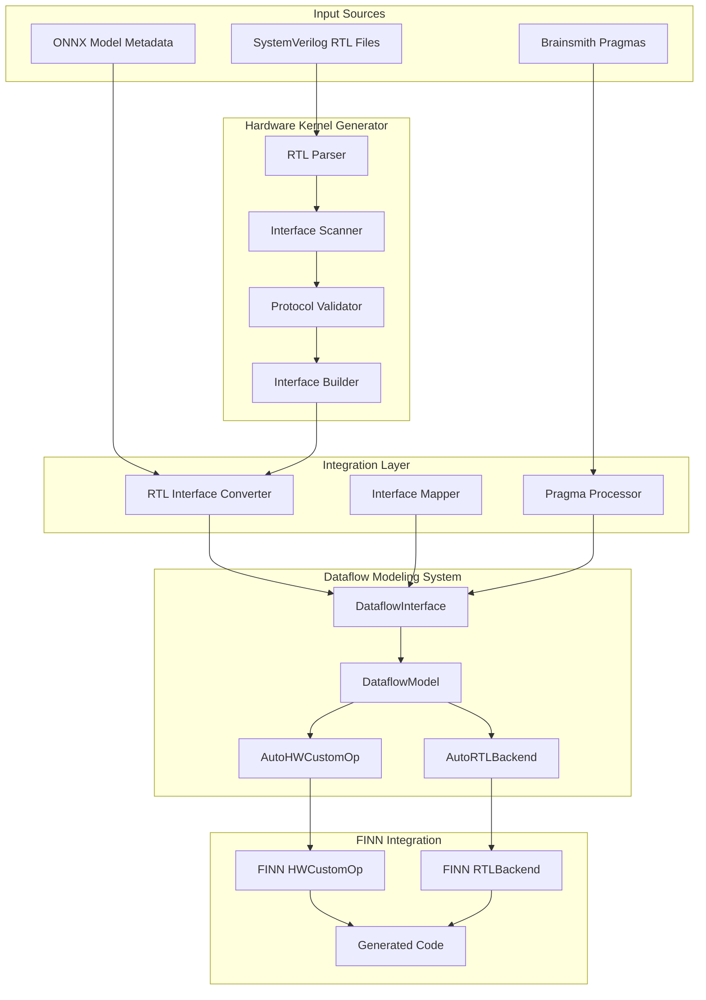
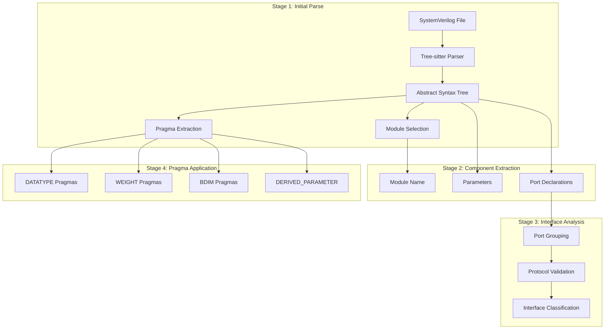
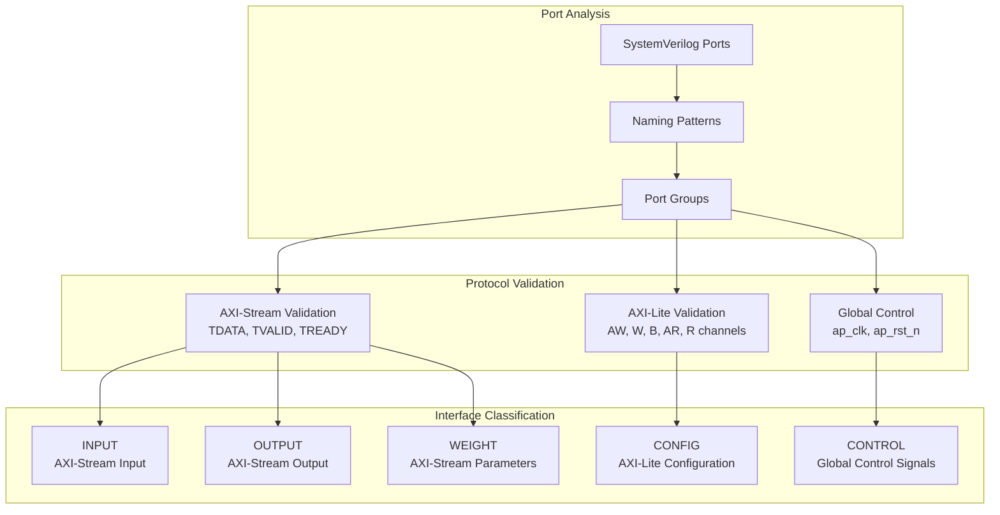
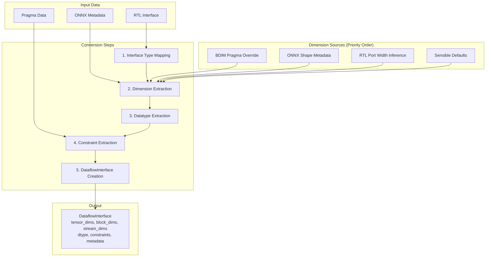
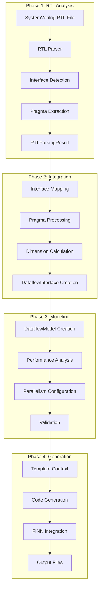
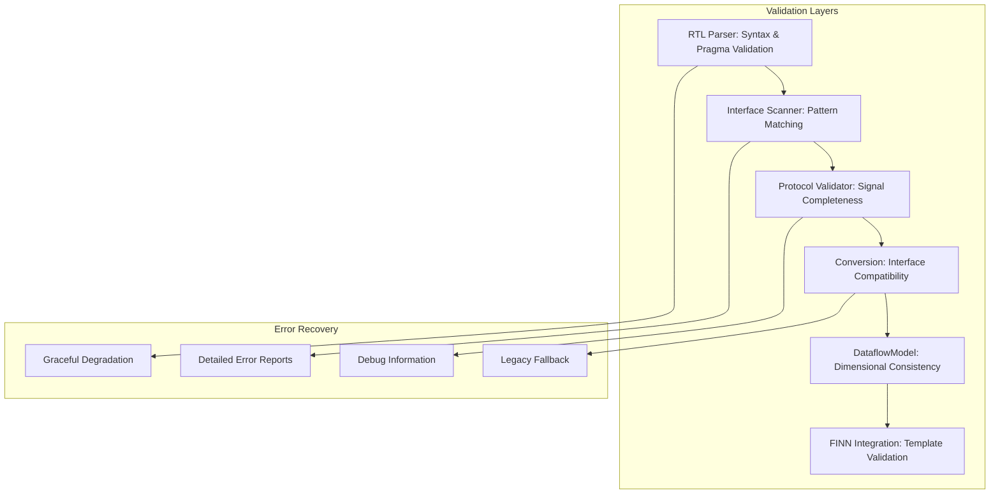

# Brainsmith System Architecture Analysis

## Executive Summary

Brainsmith implements a sophisticated **Interface-Wise Dataflow Modeling** framework that converts PyTorch models to RTL implementations for FPGA deployment. The system consists of two main components: the **Dataflow Modeling System** and the **Hardware Kernel Generator (HKG)**, connected by integration layers that enable seamless RTL-to-FINN conversion.

## System Overview



## Mathematical Foundation: Three-Tier Dimension Hierarchy

The core mathematical foundation follows the relationship:

**tensor_dims → block_dims → stream_dims → element**

```mermaid
graph TB
    subgraph "Mathematical Foundation"
        TD[tensor_dims: Original Shape<br/>[1, 128, 768]]
        BD[block_dims: Processing Chunks<br/>[1, 8, 96]]
        SD[stream_dims: Hardware Parallelism<br/>[1, 1, 8]]
        NB[num_blocks: Computed<br/>[1, 16, 8]]
    end
    
    subgraph "Constraints"
        C1[tensor_dims[i] % block_dims[i] == 0]
        C2[block_dims[i] % stream_dims[i] == 0]
        C3[num_blocks[i] = tensor_dims[i] ÷ block_dims[i]]
    end
    
    TD --> BD
    BD --> SD
    BD --> NB
    TD --> C1
    BD --> C2
    TD --> C3
```

## RTL Parsing Pipeline



## Interface Detection and Classification



## Pragma Processing System

```mermaid
graph TB
    subgraph "Pragma Types"
        BDIM[BDIM: Block Dimensions<br/>@brainsmith BDIM in0 -1 [16]]
        DATATYPE[DATATYPE: Type Constraints<br/>@brainsmith DATATYPE in0 INT,UINT 1 16]
        WEIGHT[WEIGHT: Weight Marking<br/>@brainsmith WEIGHT weights_V]
        TOP[TOP_MODULE: Module Selection<br/>@brainsmith TOP_MODULE my_module]
    end
    
    subgraph "Processing Pipeline"
        Extract[Pragma Extraction]
        Parse[Pragma Parsing]
        Validate[Pragma Validation]
        Apply[Pragma Application]
    end
    
    subgraph "Output Effects"
        ChunkStrat[Chunking Strategies]
        TypeConst[Datatype Constraints]
        InterfaceMeta[Interface Metadata]
        ModSelect[Module Selection]
    end
    
    BDIM --> Extract
    DATATYPE --> Extract
    WEIGHT --> Extract
    TOP --> Extract
    
    Extract --> Parse
    Parse --> Validate
    Validate --> Apply
    
    Apply --> ChunkStrat
    Apply --> TypeConst
    Apply --> InterfaceMeta
    Apply --> ModSelect
```

## RTL to DataflowInterface Conversion



## DataflowModel and Performance Calculations

```mermaid
graph TB
    subgraph "Input Interfaces"
        InputIF[INPUT Interfaces]
        OutputIF[OUTPUT Interfaces]
        WeightIF[WEIGHT Interfaces]
    end
    
    subgraph "DataflowModel"
        IntCollection[Interface Collection]
        Relationships[Interface Relationships]
        Constraints[Mathematical Constraints]
        PerfCalc[Performance Calculations]
    end
    
    subgraph "Performance Metrics"
        cII[cII: Calculation Interval<br/>∏(block_dims[i] / stream_dims[i])]
        eII[eII: Execution Interval<br/>cII * max_weight_cycles]
        Latency[L: Total Latency<br/>eII_bottleneck * num_blocks]
        Bottleneck[Bottleneck Analysis]
    end
    
    subgraph "Parallelism Configuration"
        iPar[iPar: Input Parallelism]
        wPar[wPar: Weight Parallelism]
        StreamUpdate[stream_dims Updates]
    end
    
    InputIF --> IntCollection
    OutputIF --> IntCollection
    WeightIF --> IntCollection
    
    IntCollection --> Relationships
    Relationships --> Constraints
    Constraints --> PerfCalc
    
    PerfCalc --> cII
    PerfCalc --> eII
    PerfCalc --> Latency
    PerfCalc --> Bottleneck
    
    iPar --> StreamUpdate
    wPar --> StreamUpdate
    StreamUpdate --> PerfCalc
```

## Template Generation and FINN Integration

```mermaid
graph TB
    subgraph "Template Generation Paths"
        Path1[Path 1: DataflowModel → Templates<br/>Full Pipeline]
        Path2[Path 2: EnhancedRTLParsingResult → Templates<br/>Direct Generation]
    end
    
    subgraph "Generated Components"
        HWCustomOp[HWCustomOp Class<br/>FINN Integration]
        RTLBackend[RTLBackend Class<br/>RTL Generation]
        VerilogWrapper[Verilog Wrapper<br/>Signal Mapping]
        TestSuite[Test Suite<br/>Validation]
        Documentation[Documentation<br/>README]
    end
    
    subgraph "FINN Integration Features"
        DataTypes[get_input_datatype()]
        FoldedShape[get_folded_shape()]
        ExpCycles[get_exp_cycles()]
        RTLSignals[RTL Signal Mapping]
        ParamFiles[Parameter Files]
    end
    
    Path1 --> HWCustomOp
    Path1 --> RTLBackend
    Path2 --> VerilogWrapper
    Path2 --> TestSuite
    Path2 --> Documentation
    
    HWCustomOp --> DataTypes
    HWCustomOp --> FoldedShape
    HWCustomOp --> ExpCycles
    RTLBackend --> RTLSignals
    RTLBackend --> ParamFiles
```

## Complete End-to-End Workflow



## Key Architectural Strengths

### 1. **Mathematical Rigor**
- Enforced divisibility relationships ensure valid hardware implementations
- Unified performance calculations with bottleneck analysis
- Three-tier dimension hierarchy provides systematic tensor decomposition

### 2. **Separation of Concerns**
- **RTL Analysis**: SystemVerilog parsing and interface detection
- **Dataflow Modeling**: Mathematical modeling and performance analysis
- **Template Generation**: Code generation and FINN integration
- **Integration Layers**: Clean conversion between systems

### 3. **Pragma-Driven Configuration**
- `@brainsmith` pragmas enable fine-grained control
- Systematic conversion from comments to typed objects
- Backward compatibility with legacy formats

### 4. **Performance Optimization**
- Lightweight RTLParsingResult reduces overhead by ~800 lines
- Direct template generation path bypasses DataflowModel when needed
- Template context caching for repeated operations

### 5. **FINN Integration**
- Seamless integration with AMD's FINN framework
- Auto-generated HWCustomOp and RTLBackend classes
- Compatible with existing FINN workflows and optimizations

## Error Handling and Validation



This comprehensive architecture enables Brainsmith to systematically convert SystemVerilog RTL modules with semantic annotations into FINN-compatible hardware accelerators while maintaining mathematical rigor, performance optimization, and extensive validation capabilities.