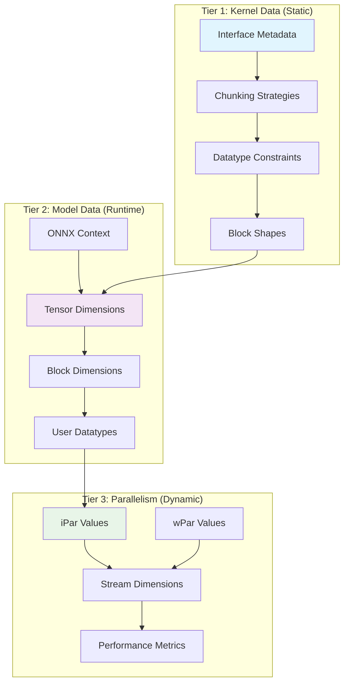
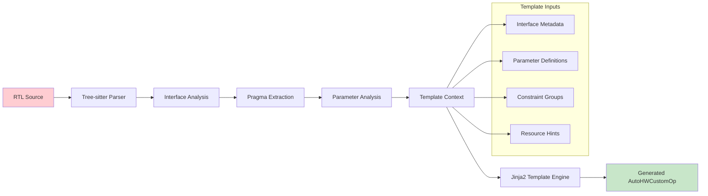
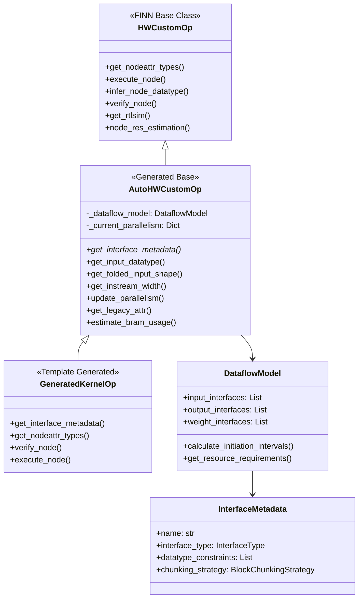
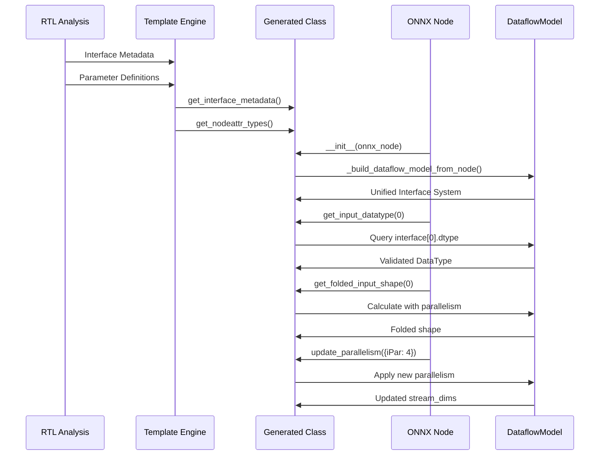
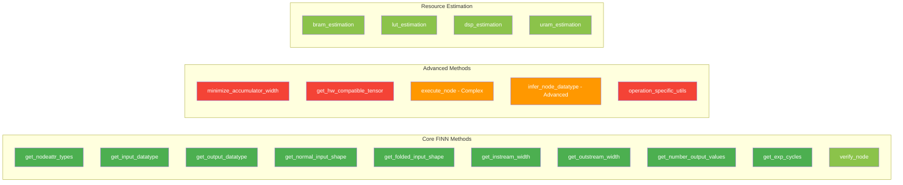
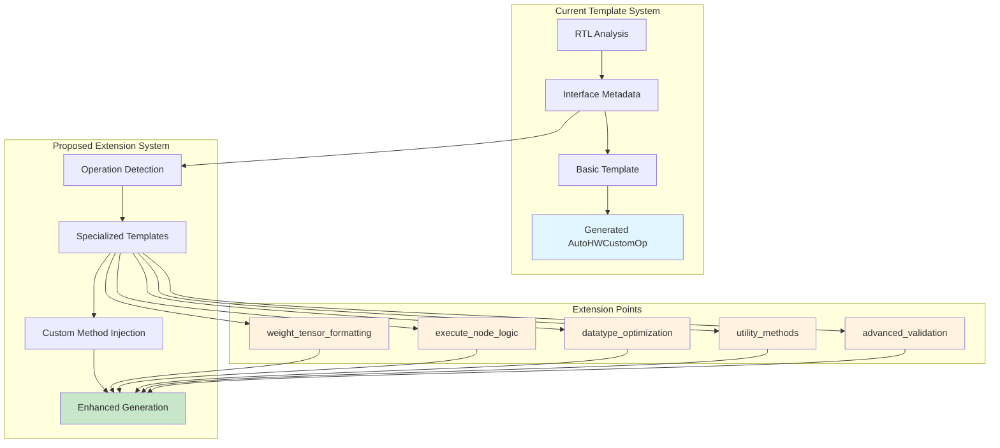

# AutoHWCustomOp Visual Architecture Analysis

## 1. AutoHWCustomOp Three-Tier Architecture



## 2. Template Generation Flow



## 3. Method Coverage Comparison

```mermaid
graph TD
    subgraph "Legacy HWCustomOp (Manual)"
        L1[get_nodeattr_types - 50 lines]
        L2[get_input_datatype - 10 lines]
        L3[get_folded_input_shape - 15 lines]
        L4[get_instream_width - 20 lines]
        L5[minimize_accumulator_width - 30 lines]
        L6[get_hw_compatible_tensor - 40 lines]
        L7[execute_node - 25 lines]
        L8[verify_node - 15 lines]
        L9[calc_tmem - 5 lines]
        
        L1 -.-> L2
        L2 -.-> L3
        L3 -.-> L4
        L4 -.-> L5
        L5 -.-> L6
        L6 -.-> L7
        L7 -.-> L8
        L8 -.-> L9
    end
    
    subgraph "AutoHWCustomOp (Generated)"
        A1[get_nodeattr_types - Template]
        A2[get_input_datatype - Parent Class]
        A3[get_folded_input_shape - DataflowModel]
        A4[get_instream_width - DataflowModel]
        A5[minimize_accumulator_width - MISSING]
        A6[get_hw_compatible_tensor - MISSING]
        A7[execute_node - Basic Template]
        A8[verify_node - Enhanced Parent]
        A9[calc_tmem - MISSING]
        
        A1 --> A2
        A2 --> A3
        A3 --> A4
        A4 --> A5
        A5 --> A6
        A6 --> A7
        A7 --> A8
        A8 --> A9
    end
    
    %% Coverage indicators
    L1 -.->|✅ Covered| A1
    L2 -.->|✅ Covered| A2
    L3 -.->|✅ Covered| A3
    L4 -.->|✅ Covered| A4
    L5 -.->|❌ Missing| A5
    L6 -.->|❌ Missing| A6
    L7 -.->|⚠️ Basic| A7
    L8 -.->|✅ Enhanced| A8
    L9 -.->|❌ Missing| A9
    
    style A1 fill:#c8e6c9
    style A2 fill:#c8e6c9
    style A3 fill:#c8e6c9
    style A4 fill:#c8e6c9
    style A5 fill:#ffcdd2
    style A6 fill:#ffcdd2
    style A7 fill:#fff3e0
    style A8 fill:#c8e6c9
    style A9 fill:#ffcdd2
```



## 4. AutoHWCustomOp Class Structure



## 5. Data Flow Through AutoHWCustomOp



## 6. Coverage Heat Map



**Legend:**
- 🟢 **Full Coverage** - Implemented in AutoHWCustomOp
- 🟡 **Partial Coverage** - Basic implementation, missing advanced features
- 🔴 **Missing** - Not implemented, requires template extensions

## 7. Weight Tensor Processing Gap (Selected Code)

```mermaid
graph TD
    subgraph "Legacy: get_hw_compatible_threshold_tensor"
        L1[Original Threshold Matrix]
        L2[Validate PE Divisibility]
        L3[Handle Unsigned Constraints]
        L4[Interleave Rows Between PEs]
        L5[Reshape to HW Format]
        L6[Return (1, PE, TMEM, steps)]
        
        L1 --> L2
        L2 --> L3
        L3 --> L4
        L4 --> L5
        L5 --> L6
    end
    
    subgraph "AutoHWCustomOp: Current State"
        A1[Weight Interface Definition]
        A2[Basic DataType Validation]
        A3[Generic Shape Calculation]
        A4[❌ No HW Formatting]
        A5[❌ No PE Interleaving]
        A6[❌ No Operation Logic]
        
        A1 --> A2
        A2 --> A3
        A3 --> A4
        A4 --> A5
        A5 --> A6
    end
    
    subgraph "Missing Implementation"
        M1[40+ lines of tensor formatting]
        M2[PE-based memory layout]
        M3[Hardware constraint validation]
        M4[Operation-specific reshaping]
    end
    
    style L1 fill:#e8f5e8
    style L6 fill:#c8e6c9
    style A4 fill:#ffcdd2
    style A5 fill:#ffcdd2
    style A6 fill:#ffcdd2
    style M1 fill:#fff3e0
    style M2 fill:#fff3e0
    style M3 fill:#fff3e0
    style M4 fill:#fff3e0
```

## 8. Template Extension Architecture Proposal



## Summary

The visual analysis reveals that AutoHWCustomOp provides excellent coverage of standard FINN methods through its three-tier architecture and DataflowModel integration. However, critical gaps exist in operation-specific functionality, particularly around weight tensor formatting, advanced execution logic, and utility methods. The template system provides a strong foundation for addressing these gaps through proposed extension points.