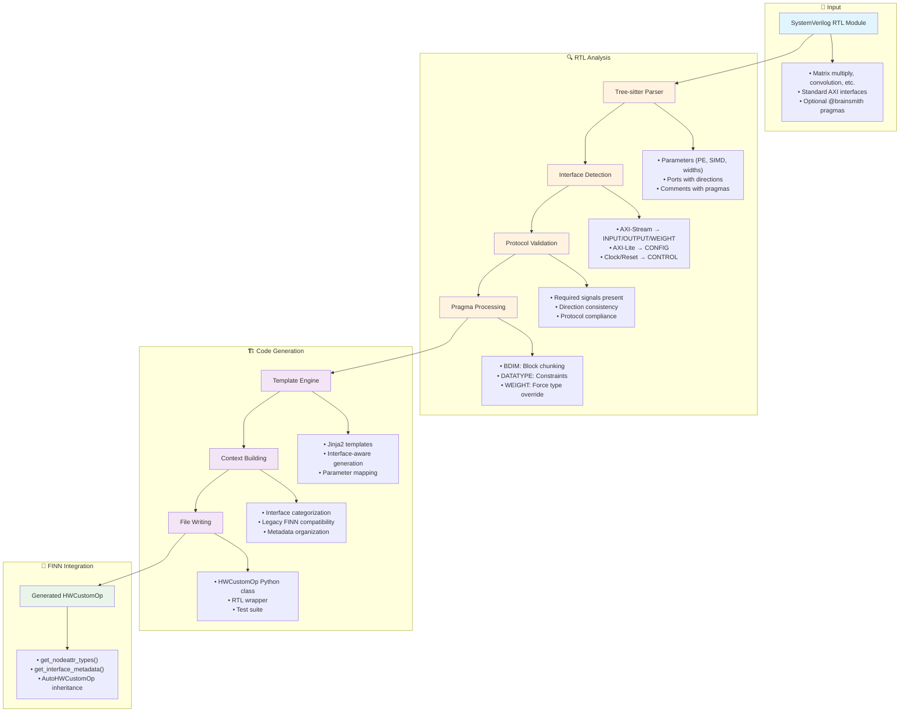
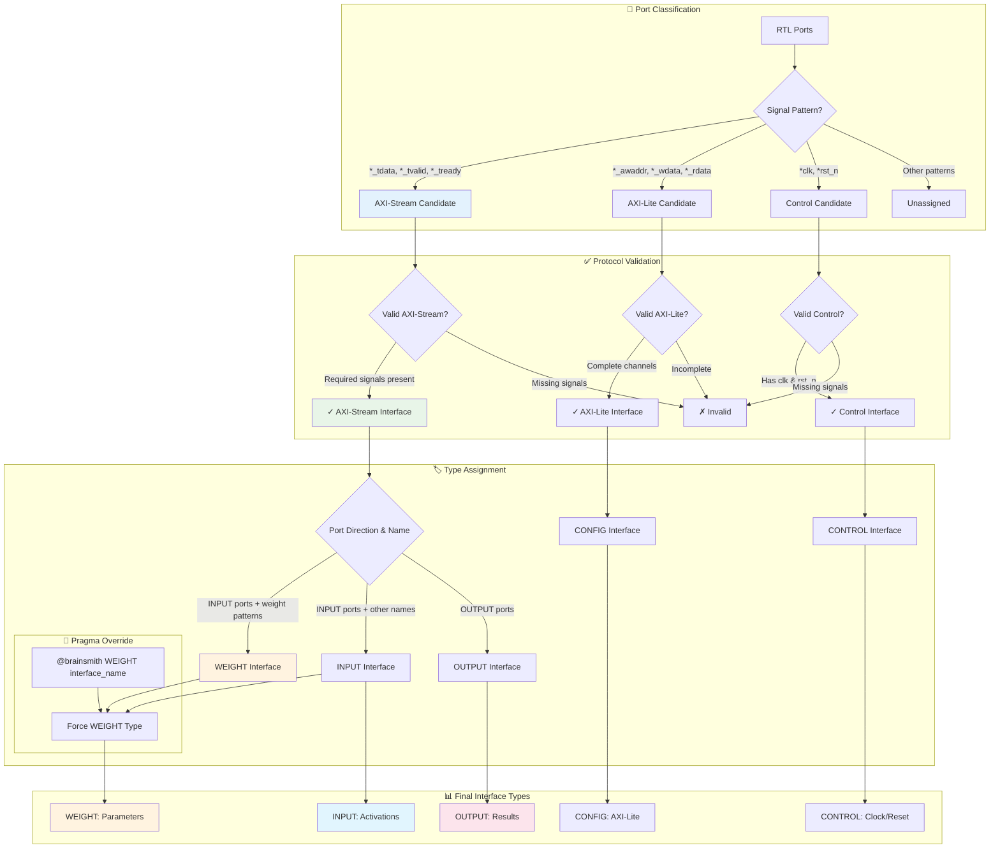
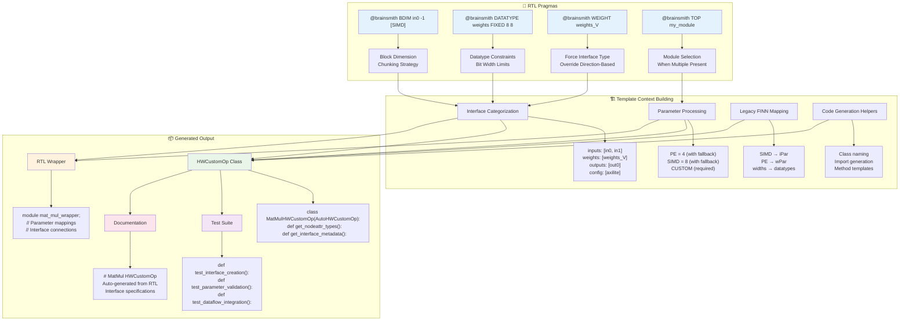
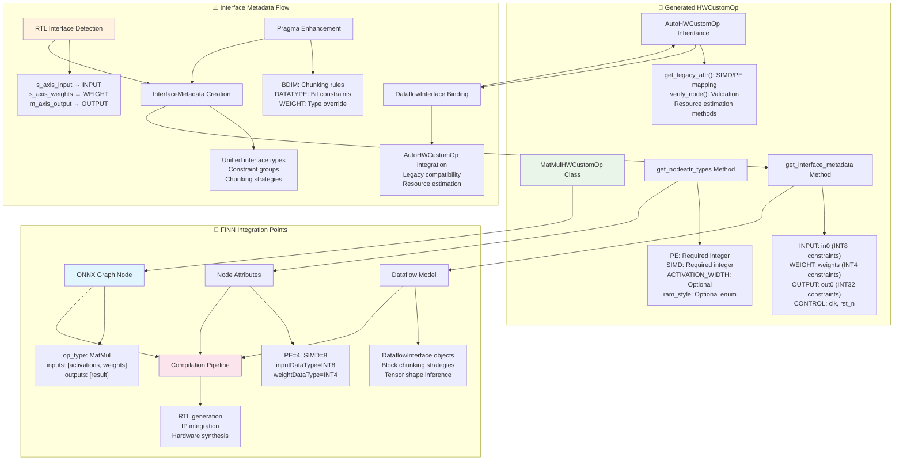
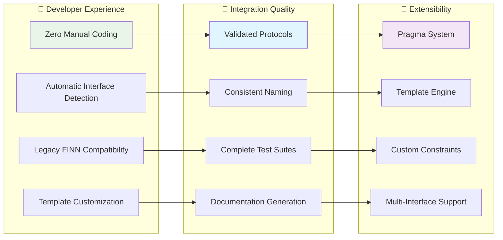

# Hardware Kernel Generator (HKG) - Design Document

## Overview

The Hardware Kernel Generator (HKG) transforms SystemVerilog RTL modules into FINN-compatible HWCustomOp classes with automatic interface detection, datatype constraints, and template-based code generation.

## Complete HKG Workflow

## Interface Detection & Type Assignment

## Pragma System & Template Generation

## FINN Integration Architecture

## Key Benefits for FINN Users

## Usage Summary

1. **Input**: SystemVerilog RTL module with standard AXI interfaces
2. **Command**: `hkg generate my_module.sv output_dir/`
3. **Output**: Complete FINN-compatible HWCustomOp package
4. **Integration**: Drop into FINN compilation pipeline

**Key Features:**
- 🔍 **Automatic Detection**: AXI-Stream, AXI-Lite, and Control interfaces
- 🏷️ **Smart Typing**: Direction-based INPUT/OUTPUT, name-based WEIGHT detection
- 📝 **Pragma Enhancement**: BDIM chunking, DATATYPE constraints, WEIGHT overrides
- 🎯 **FINN Ready**: AutoHWCustomOp inheritance with legacy compatibility
- 📦 **Complete Package**: Python class, RTL wrapper, tests, documentation