# HWKG Template Generation Flow - Detailed Architecture

This document provides clear, organized Mermaid diagrams showing the template generation workflow in the Hardware Kernel Generator (HKG) Phase 4, starting from parsed KernelMetadata through final file generation.

## High-Level Template Generation Flow

## Context Generation Process

## Parallel Generator Execution

## Template Context Data Structure

```mermaid
graph LR
    TC[TemplateContext]
    TC --> Core[Core Info<br/>• module_name<br/>• class_name<br/>• source_file]
    TC --> Intf[Interfaces<br/>• inputs<br/>• weights<br/>• outputs<br/>• control]
    TC --> Param[Parameters<br/>• definitions<br/>• defaults<br/>• required]
    TC --> Help[Helpers<br/>• imports<br/>• attributes<br/>• flags]
    
    style TC fill:#e1f5fe
    style Core fill:#fff3e0
    style Intf fill:#fff3e0
    style Param fill:#fff3e0
    style Help fill:#fff3e0
```

## Template Rendering Detail

## File Writing and Result Aggregation

```mermaid
graph LR
    subgraph "Generation Results"
        GR[Generated Content<br/>• hw_custom_op.py<br/>• wrapper.v<br/>• test_suite.py]
    end
    
    subgraph "KernelIntegrator Processing"
        KI[File Writing<br/>1. Determine output directory<br/>2. Write generated files<br/>3. Create metadata files<br/>4. Track performance metrics]
    end
    
    subgraph "Output Structure"
        OUT[output_dir/kernel_name/<br/>├── kernel_name_hw_custom_op.py<br/>├── kernel_name_wrapper.v<br/>├── test_kernel_name.py<br/>├── generation_metadata.json<br/>└── generation_summary.txt]
    end
    
    GR --> KI
    KI --> OUT
    
    style GR fill:#e1f5fe
    style KI fill:#fff3e0
    style OUT fill:#e8f5e8
```

## Performance Metrics

## Key Phase 4 Improvements Summary

### 🚀 **Modular Architecture Benefits**
- **Extensibility**: Add new generators without core changes
- **Maintainability**: Clean separation of concerns
- **Auto-Discovery**: Zero-configuration generator registration
- **Performance**: 60-65ms generation time maintained

### 🎯 **Template System Enhancements**
- **Unified Context**: Single TemplateContext for all generators
- **Standardized Processing**: context_to_dict() helper method
- **Fallback Support**: Template version compatibility
- **Error Handling**: Graceful degradation and reporting

### 📊 **Data Flow Optimization**
- **Single Parse**: KernelMetadata parsed once
- **Efficient Context**: Full context passed to all generators
- **Minimal Overhead**: Package introspection over file globbing
- **Result Aggregation**: Comprehensive GenerationResult tracking

This architecture provides a robust, extensible foundation for HWKG template generation while maintaining the simplicity and performance of the original system.