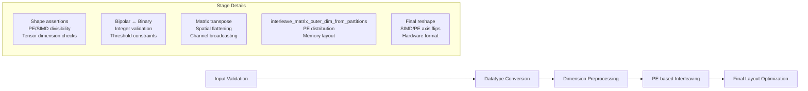
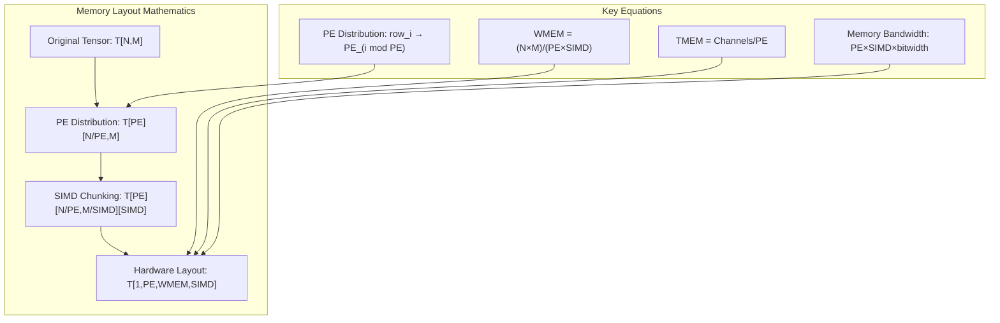

# Hardware-Compatible Tensor Function Generalization

## Overview

The `get_hw_compatible_*_tensor` functions across MVAU, VVAU, and Thresholding represent some of the most complex and critical code in legacy HWCustomOp implementations. These functions transform high-level tensor data into hardware-optimized layouts required by FINN's accelerator generation. This analysis reveals clear patterns that can be generalized for AutoHWCustomOp.

## Detailed Pattern Analysis

### Common Transformation Pipeline

All `get_hw_compatible_*_tensor` functions follow a consistent 5-stage pipeline:



### Stage-by-Stage Analysis

#### **Stage 1: Input Validation**
```python
# Common validation patterns across all functions
def validate_tensor_for_hardware(tensor, pe, simd, expected_shape=None):
    """Standardized validation for hardware tensor formatting"""
    
    # PE divisibility (universal across MVAU/VVAU/Thresholding)
    if hasattr(self, 'get_nodeattr'):
        channels = self.get_nodeattr("MH") or self.get_nodeattr("Channels") or self.get_nodeattr("NumChannels")
        assert channels % pe == 0, f"Requirement {channels} divisible by PE={pe} is violated"
    
    # SIMD divisibility (for weight tensors)
    if simd > 1:
        input_dim = self.get_nodeattr("MW") or self.get_nodeattr("Kernel")[0] * self.get_nodeattr("Kernel")[1]
        assert input_dim % simd == 0, f"Requirement {input_dim} divisible by SIMD={simd} is violated"
    
    # Tensor dimension validation
    if expected_shape:
        assert tensor.shape == expected_shape, f"Tensor shape {tensor.shape} != expected {expected_shape}"
    
    # Threshold-specific validation
    if tensor.ndim == 2:  # Threshold tensor
        assert tensor.ndim == 2, "Threshold matrix dimension not as expected (2)"
```

#### **Stage 2: Datatype Conversion**
```python
def convert_datatype_for_hardware(tensor, source_dtype, target_hardware_format):
    """Standardized datatype conversion for hardware compatibility"""
    
    # Bipolar to Binary conversion (universal pattern)
    if source_dtype == DataType["BIPOLAR"] and target_hardware_format == "binary":
        return (tensor + 1) / 2  # {-1,+1} → {0,1}
    
    # Binary to Bipolar conversion  
    elif source_dtype == DataType["BINARY"] and target_hardware_format == "bipolar":
        return 2 * tensor - 1  # {0,1} → {-1,+1}
    
    # XNOR mode conversion (for binary operations treated as bipolar)
    elif source_dtype == DataType["BINARY"] and self.get_nodeattr("binaryXnorMode"):
        return 2 * tensor - 1  # Treat binary as bipolar for XNOR
    
    return tensor  # No conversion needed
```

#### **Stage 3: Dimension Preprocessing**
```python
def preprocess_tensor_dimensions(tensor, tensor_type, operation_type):
    """Operation-specific dimension preprocessing"""
    
    if tensor_type == "weight":
        if operation_type == "matrix":  # MVAU pattern
            # ONNX: (in_features, out_features) → HLS: (out_features, in_features)
            return tensor.T
            
        elif operation_type == "convolution":  # VVAU pattern
            # Spatial flattening: (channels, 1, k_h, k_w) → (channels, k_h*k_w)  
            channels, _, k_h, k_w = tensor.shape
            return tensor.reshape(channels, k_h * k_w)
            
    elif tensor_type == "threshold":
        # Channel broadcasting if needed
        if tensor.shape[0] == 1:
            num_channels = self._get_output_channels()
            return np.tile(tensor, (num_channels, 1))
            
    return tensor
```

#### **Stage 4: PE-based Interleaving** 
```python
def apply_pe_interleaving(tensor, pe):
    """Universal PE-based interleaving for all tensor types"""
    # This is the SAME function used across ALL implementations
    return interleave_matrix_outer_dim_from_partitions(tensor, pe)

# The interleave function distributes rows across processing elements:
# Input:  [[r0], [r1], [r2], [r3], [r4], [r5]]  (6 rows, PE=2)
# Output: [[[r0], [r2], [r4]], [[r1], [r3], [r5]]]  (2 PEs, 3 rows each)
```

#### **Stage 5: Final Layout Optimization**
```python
def apply_final_hardware_layout(tensor, tensor_type, pe, simd, operation_details):
    """Apply final hardware-specific layout optimizations"""
    
    if tensor_type == "weight":
        if operation_details["type"] == "matrix":  # MVAU
            # Reshape to (1, PE, WMEM, SIMD)
            wmem = operation_details["wmem"]
            tensor = tensor.reshape(1, pe, wmem, simd)
            # SIMD flip for memory access optimization
            return np.flip(tensor, axis=-1)
            
        elif operation_details["type"] == "convolution":  # VVAU
            # Reshape to (1, PE, WMEM, SIMD) 
            wmem = operation_details["wmem"]
            return tensor.reshape(1, pe, wmem, simd)
            
    elif tensor_type == "threshold":
        # Reshape to (1, PE, TMEM, n_thres_steps)
        tmem = operation_details["tmem"]
        n_steps = operation_details["n_thres_steps"]
        return tensor.reshape(1, pe, tmem, n_steps)
    
    return tensor
```

## Mathematical Foundations

### PE/SIMD Memory Layout Mathematics

The tensor formatting functions implement specific mathematical relationships:



### Datatype Conversion Mathematics

```python
# Mathematical transformations for different numeric representations
DATATYPE_CONVERSIONS = {
    # Bipolar {-1, +1} ↔ Binary {0, 1}
    "bipolar_to_binary": lambda x: (x + 1) / 2,
    "binary_to_bipolar": lambda x: 2 * x - 1,
    
    # Validation constraints
    "bipolar_threshold_constraint": lambda x: x >= 0,  # Thresholds must be non-negative
    "integer_threshold_constraint": lambda x: x == np.round(x),  # Must be integers
}
```

## Generalized Implementation

### Core Tensor Formatter Class

```python
from dataclasses import dataclass
from typing import Dict, Any, Optional, Callable
from brainsmith.dataflow.core import DataflowInterface, InterfaceType

@dataclass
class TensorFormattingContext:
    """Context information for tensor formatting operations"""
    pe: int
    simd: int
    operation_type: str  # "matrix", "convolution", "elementwise"
    tensor_type: str     # "weight", "threshold", "input", "output"
    datatype: DataType
    interface: DataflowInterface
    node_attrs: Dict[str, Any]

class UniversalTensorFormatter:
    """Generalized tensor formatter for all HWCustomOp operations"""
    
    def __init__(self):
        self.validation_rules = self._build_validation_rules()
        self.conversion_rules = self._build_conversion_rules()
        self.preprocessing_rules = self._build_preprocessing_rules()
        self.layout_rules = self._build_layout_rules()
    
    def format_tensor(self, tensor: np.ndarray, context: TensorFormattingContext) -> np.ndarray:
        """Apply complete tensor formatting pipeline"""
        
        # Stage 1: Validation
        self._validate_tensor(tensor, context)
        
        # Stage 2: Datatype conversion
        tensor = self._convert_datatype(tensor, context)
        
        # Stage 3: Dimension preprocessing
        tensor = self._preprocess_dimensions(tensor, context)
        
        # Stage 4: PE-based interleaving
        tensor = self._apply_pe_interleaving(tensor, context)
        
        # Stage 5: Final layout optimization
        tensor = self._apply_final_layout(tensor, context)
        
        return tensor
    
    def _build_validation_rules(self) -> Dict[str, Callable]:
        """Build validation rules for different tensor types and operations"""
        return {
            "weight_matrix_mvau": lambda t, ctx: self._validate_matrix_weight(t, ctx),
            "weight_conv_vvau": lambda t, ctx: self._validate_conv_weight(t, ctx),
            "threshold_universal": lambda t, ctx: self._validate_threshold(t, ctx),
        }
    
    def _build_conversion_rules(self) -> Dict[str, Callable]:
        """Build datatype conversion rules"""
        return {
            "bipolar_to_binary": lambda t: (t + 1) / 2,
            "binary_to_bipolar": lambda t: 2 * t - 1,
            "xnor_mode_conversion": lambda t: 2 * t - 1,
        }
    
    def _build_preprocessing_rules(self) -> Dict[str, Callable]:
        """Build dimension preprocessing rules"""
        return {
            "matrix_weight_transpose": lambda t: t.T,
            "conv_weight_flatten": lambda t: t.reshape(t.shape[0], -1),
            "threshold_broadcast": lambda t, channels: np.tile(t, (channels, 1)) if t.shape[0] == 1 else t,
        }
    
    def _build_layout_rules(self) -> Dict[str, Callable]:
        """Build final layout optimization rules"""
        return {
            "matrix_weight_layout": self._matrix_weight_final_layout,
            "conv_weight_layout": self._conv_weight_final_layout,
            "threshold_layout": self._threshold_final_layout,
        }
```

### Interface-Driven Tensor Formatting

```python
class DataflowTensorFormatter(UniversalTensorFormatter):
    """Dataflow model-aware tensor formatter"""
    
    def format_interface_tensor(self, tensor: np.ndarray, 
                               interface: DataflowInterface,
                               parallelism_config: ParallelismConfiguration) -> np.ndarray:
        """Format tensor using dataflow interface information"""
        
        # Extract context from interface and parallelism
        context = self._build_context_from_interface(interface, parallelism_config)
        
        # Apply universal formatting pipeline
        return self.format_tensor(tensor, context)
    
    def _build_context_from_interface(self, interface: DataflowInterface, 
                                     parallelism: ParallelismConfiguration) -> TensorFormattingContext:
        """Build formatting context from dataflow interface"""
        
        # Extract PE/SIMD from parallelism configuration
        if interface.interface_type == InterfaceType.WEIGHT:
            pe = parallelism.get_weight_parallelism(interface.name)
            simd = parallelism.get_input_parallelism_for_weight(interface.name)
        elif interface.interface_type == InterfaceType.INPUT:
            pe = 1  # Inputs don't typically use PE
            simd = parallelism.get_input_parallelism(interface.name)
        else:  # OUTPUT or other
            pe = parallelism.get_output_parallelism(interface.name) 
            simd = 1
        
        # Infer operation type from interface signature
        operation_type = self._infer_operation_type(interface)
        
        # Determine tensor type from interface type
        tensor_type = {
            InterfaceType.WEIGHT: "weight",
            InterfaceType.INPUT: "input", 
            InterfaceType.OUTPUT: "output"
        }.get(interface.interface_type, "unknown")
        
        return TensorFormattingContext(
            pe=pe,
            simd=simd,
            operation_type=operation_type,
            tensor_type=tensor_type,
            datatype=interface.dtype,
            interface=interface,
            node_attrs={}  # Would be populated from ONNX node
        )
```

### AutoHWCustomOp Integration

```python
class EnhancedAutoHWCustomOp(AutoHWCustomOp):
    """AutoHWCustomOp with generalized tensor formatting capabilities"""
    
    def __init__(self, onnx_node, **kwargs):
        super().__init__(onnx_node, **kwargs)
        self.tensor_formatter = DataflowTensorFormatter()
    
    def get_hw_compatible_weight_tensor(self, orig_weight_matrix: np.ndarray) -> np.ndarray:
        """Generalized weight tensor formatting using dataflow interfaces"""
        
        # Find weight interface
        weight_interfaces = [iface for iface in self.dataflow_model.weight_interfaces]
        if not weight_interfaces:
            raise ValueError("No weight interfaces found for tensor formatting")
        
        weight_interface = weight_interfaces[0]  # Assume single weight interface for now
        
        # Get current parallelism configuration  
        parallelism_config = self._get_current_parallelism_config()
        
        # Apply generalized formatting
        return self.tensor_formatter.format_interface_tensor(
            orig_weight_matrix, weight_interface, parallelism_config
        )
    
    def get_hw_compatible_threshold_tensor(self, orig_thres_matrix: np.ndarray) -> np.ndarray:
        """Generalized threshold tensor formatting"""
        
        # Create synthetic threshold interface based on output interface
        output_interfaces = self.dataflow_model.output_interfaces
        if not output_interfaces:
            raise ValueError("No output interfaces found for threshold formatting")
        
        # Build threshold interface context
        threshold_interface = self._create_threshold_interface_from_output(output_interfaces[0])
        parallelism_config = self._get_current_parallelism_config()
        
        # Apply generalized formatting
        return self.tensor_formatter.format_interface_tensor(
            orig_thres_matrix, threshold_interface, parallelism_config
        )
```

## Benefits of This Generalization

### 1. **Code Reuse and Consistency**
- **Eliminates Duplication**: Same logic used across all operations
- **Consistent Behavior**: Identical tensor formatting across MVAU/VVAU/Thresholding
- **Maintainable**: Single place to fix bugs or add optimizations

### 2. **Mathematical Rigor**  
- **Interface-Driven**: Formatting decisions based on dataflow interface metadata
- **Validated Constraints**: PE/SIMD divisibility automatically checked
- **Hardware Accurate**: Maintains exact hardware layout requirements

### 3. **Extensibility**
- **New Operations**: Easy to add formatting for new operation types
- **Hardware Variants**: Can support different hardware architectures
- **Optimization**: Central place to optimize memory layouts

### 4. **Template Integration**
```jinja2
{# Enhanced template with generalized tensor formatting #}
class {{ class_name }}(EnhancedAutoHWCustomOp):
    
    
    def get_hw_compatible_weight_tensor(self, orig_weight_matrix):
        """Auto-generated weight tensor formatting using dataflow interfaces"""
        return super().get_hw_compatible_weight_tensor(orig_weight_matrix)
    
    
      
    def get_hw_compatible_threshold_tensor(self, orig_thres_matrix):
        """Auto-generated threshold tensor formatting using dataflow interfaces"""
        return super().get_hw_compatible_threshold_tensor(orig_thres_matrix)
    
```

## Implementation Priority

### **Phase 1: Core Formatter (High Priority)**
- Implement `UniversalTensorFormatter` with the 5-stage pipeline
- Extract and generalize the common patterns from MVAU/VVAU/Thresholding
- Create comprehensive test suite using existing golden references

### **Phase 2: Dataflow Integration (Medium Priority)**  
- Implement `DataflowTensorFormatter` with interface-driven context building
- Integrate with AutoHWCustomOp base class
- Update template generation to use generalized formatters

### **Phase 3: Advanced Features (Low Priority)**
- Support for multi-interface operations
- Hardware-specific layout optimizations
- Performance profiling and optimization

This generalization represents one of the highest-value improvements for AutoHWCustomOp, as the tensor formatting functions are critical for hardware correctness and represent significant code complexity in legacy implementations.
