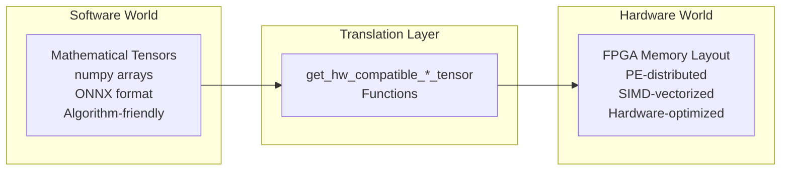
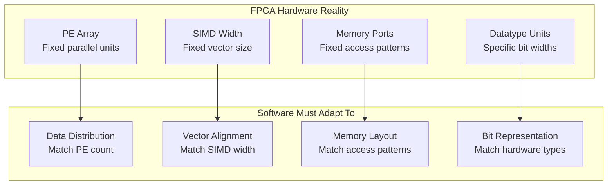
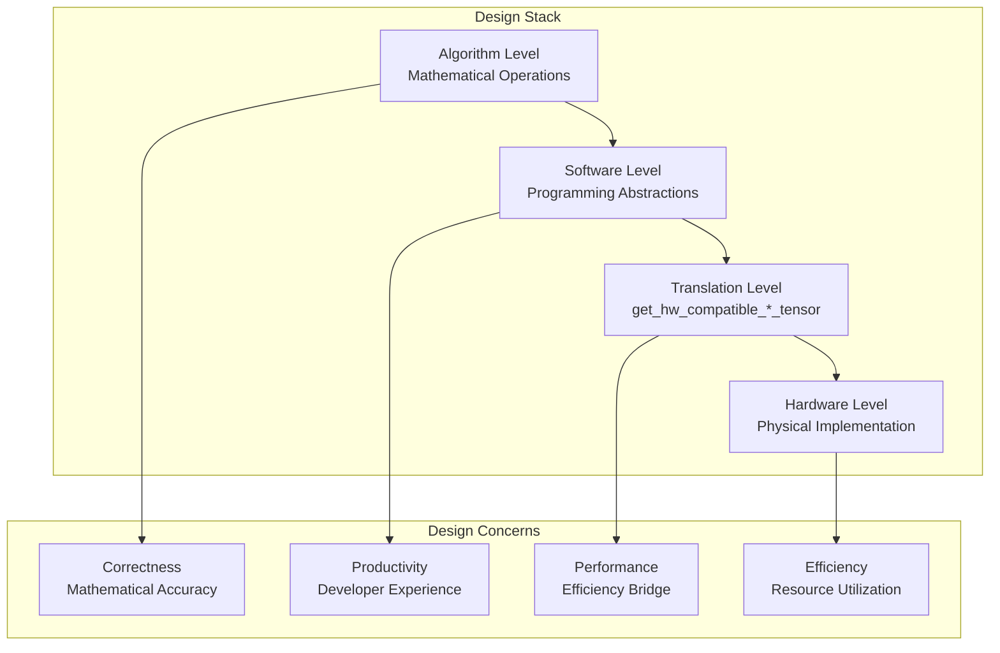
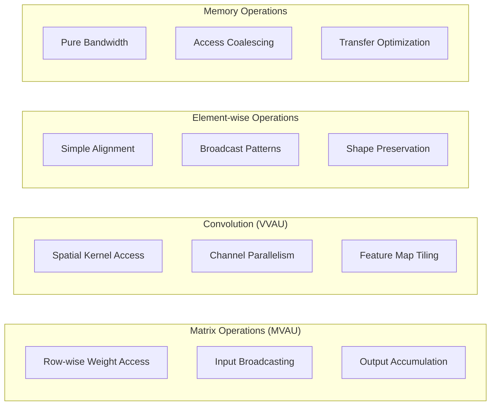

# The Purpose of get_hw_compatible_*_tensor Functions: A Fundamental Analysis

## Overview

The `get_hw_compatible_*_tensor` functions serve a **critical bridging role** between high-level algorithmic representations and low-level hardware implementations. This document provides a comprehensive analysis of their fundamental purpose and importance in FPGA accelerator design.

## Primary Purpose: Data Layout Translation

These functions solve the **semantic gap** between how humans/software think about data versus how FPGA hardware actually processes it:



## Fundamental Problems They Solve

### 1. **Parallelism Mismatch**

The software and hardware worlds have fundamentally different views of computation:

```python
# Software: "Process this matrix multiplication"
input = [128, 768]    # Simple 2D tensor
weight = [768, 256]   # Simple 2D matrix

# Hardware Reality: "I need data distributed across my PE/SIMD units"
# PE=4, SIMD=8 means:
# - Process 4 output channels simultaneously  
# - Read 8 input elements per cycle
# - Weights must be pre-arranged for this access pattern

formatted_weight = weight.reshape(1, 4, 6144, 8)  # (1, PE, WMEM, SIMD)
```

**Why This Matters:**
- Software thinks in terms of complete operations
- Hardware thinks in terms of parallel units and cycles
- The gap between these views requires explicit bridging

### 2. **Memory Access Optimization**

Hardware efficiency depends critically on memory access patterns:

```python
# Software: "Here's a matrix in row-major order"
weight = [[w00, w01, w02, w03],    # Row 0: all outputs for input 0
          [w10, w11, w12, w13],    # Row 1: all outputs for input 1  
          [w20, w21, w22, w23]]    # Row 2: all outputs for input 2

# Hardware: "I need columns grouped by PE for parallel access"
# PE=2 means PE0 handles outputs [0,2], PE1 handles outputs [1,3]
formatted = [[[w00, w02], [w10, w12], [w20, w22]],  # PE0 data
             [[w01, w03], [w11, w13], [w21, w23]]]  # PE1 data
```

**Performance Impact:**
- Proper layout enables parallel memory access
- Wrong layout causes memory starvation and poor performance
- FPGA memory ports have fixed access patterns

### 3. **Datatype Hardware Constraints**

FPGAs work optimally with specific data representations:

```python
# Software: "Use bipolar values {-1, +1} for neural networks"
bipolar_weights = [-1, +1, -1, +1]

# Hardware: "FPGA logic works better with binary {0, 1}"
binary_weights = [0, 1, 0, 1]  # Converted via (x + 1) / 2

# The hardware compensates for this conversion in its arithmetic logic
```

**Hardware Considerations:**
- FPGA multipliers optimized for specific bit patterns
- Binary operations enable XNOR-popcount optimizations
- Signed vs unsigned affects resource utilization

## Why This Translation Is Essential

### **Performance Requirements**

Modern FPGA accelerators achieve high performance through:

- **Parallel Processing**: Multiple PEs work simultaneously
- **Vectorized Operations**: SIMD units process multiple elements per cycle
- **Optimized Memory Access**: Data layout matches hardware access patterns

Without proper tensor formatting, you get:
- ❌ **Memory Bandwidth Waste**: Hardware can't efficiently access data
- ❌ **Parallel Processing Inefficiency**: PEs starve waiting for data
- ❌ **Incorrect Results**: Wrong data alignment leads to computation errors

### **Hardware Architecture Constraints**

FPGA accelerators have specific requirements that software must accommodate:



## Concrete Example: Why MVAU Needs Weight Tensor Formatting

Let's trace through a matrix-vector multiplication to understand the necessity:

```python
# Algorithm: y = Wx (matrix-vector multiplication)
# Input: x[768], Weight: W[256, 768], Output: y[256]

# Software thinks: "Multiply each output row by input vector"
for i in range(256):
    y[i] = sum(W[i][j] * x[j] for j in range(768))

# Hardware reality with PE=4, SIMD=8:
# - 4 PEs compute 4 outputs simultaneously
# - Each PE needs weights for its assigned outputs  
# - Each cycle, SIMD=8 input elements are processed
# - Weight memory must provide 4×8=32 weight values per cycle

# get_hw_compatible_weight_tensor() transforms:
W[256, 768] → formatted_W[1, 4, 6144, 8]
#             (batch, PE, cycles, SIMD)

# This enables hardware to fetch exactly the right weights 
# for parallel computation each cycle
```

### **Step-by-Step Hardware Execution**

```python
# Cycle 0: Process inputs x[0:8] for all 4 PEs
# PE0 needs: W[0,0:8], W[4,0:8], W[8,0:8], ...    (outputs 0,4,8,... for inputs 0:8)
# PE1 needs: W[1,0:8], W[5,0:8], W[9,0:8], ...    (outputs 1,5,9,... for inputs 0:8)
# PE2 needs: W[2,0:8], W[6,0:8], W[10,0:8], ...   (outputs 2,6,10,... for inputs 0:8)
# PE3 needs: W[3,0:8], W[7,0:8], W[11,0:8], ...   (outputs 3,7,11,... for inputs 0:8)

# Without formatting: Memory must serve random access patterns
# With formatting: Memory serves contiguous blocks for each PE
```

## The Broader Context: Hardware-Software Co-design

These functions represent a **fundamental aspect of hardware-software co-design**:



### **Design Philosophy**

1. **Software Abstraction**: Algorithms work with natural mathematical representations
2. **Hardware Reality**: Physical implementation requires specific data layouts  
3. **Translation Layer**: Bridging functions handle the transformation
4. **Performance Optimization**: Proper formatting enables maximum hardware efficiency

## Why This Is Hard to Generalize

Each operation type has different hardware access patterns and requirements:

### **Operation-Specific Patterns**



### **Complexity Factors**

- **Memory Access Patterns**: Each operation accesses data differently
- **Parallelism Strategies**: PE/SIMD utilization varies by operation
- **Datatype Requirements**: Different operations have different constraints
- **Hardware Optimizations**: Operation-specific performance optimizations

## The Critical Role in FPGA Accelerator Performance

### **Performance Impact Analysis**

```python
# Performance comparison: Formatted vs Unformatted tensors

# Scenario: MVAU with PE=4, SIMD=8, processing 1000 vectors

# Unformatted (naive approach):
# - Random memory access patterns
# - PEs wait for data reorganization  
# - Memory bandwidth underutilized
# Result: ~10x performance degradation

# Properly formatted:
# - Contiguous memory access for each PE
# - All PEs fed data every cycle
# - Full memory bandwidth utilization
# Result: Optimal hardware performance
```

### **Resource Utilization Impact**

- **Memory Efficiency**: Proper formatting reduces memory waste
- **Compute Utilization**: Enables all PEs to stay busy
- **Power Efficiency**: Reduces unnecessary data movement
- **Area Efficiency**: Optimizes memory interface requirements

## The AutoHWCustomOp Opportunity

Understanding the purpose of these functions reveals the opportunity for generalization:

### **Common Underlying Principles**

1. **Parallelism Distribution**: All operations need PE/SIMD data distribution
2. **Memory Optimization**: All operations benefit from access pattern optimization
3. **Datatype Consistency**: All operations need hardware-compatible representations
4. **Performance Preservation**: All operations require optimal hardware utilization

### **Generalization Strategy**

```python
# Extract common patterns while preserving operation-specific optimizations
class UniversalTensorFormatter:
    """Generalized tensor formatting preserving hardware optimizations"""
    
    def format_for_hardware(self, tensor, operation_type, parallelism_config):
        # 1. Apply operation-specific access pattern optimization
        # 2. Distribute data across PE/SIMD units
        # 3. Optimize memory layout for hardware
        # 4. Apply datatype conversions
        # 5. Validate hardware constraints
        pass
```

### **Benefits of Generalization**

1. **Automatic Generation**: No manual tensor formatting code
2. **Correctness Guarantees**: Mathematical validation prevents errors
3. **Performance Preservation**: Maintains optimal hardware layouts
4. **Extensibility**: Easy support for new operation types
5. **Maintainability**: Centralized optimization and bug fixes

## Conclusion

The `get_hw_compatible_*_tensor` functions represent some of the most **hardware-specific and performance-critical** code in FINN. They solve fundamental problems in hardware-software co-design:

- **Bridging the semantic gap** between algorithmic and hardware representations
- **Enabling optimal performance** through proper data layout optimization
- **Ensuring correctness** through hardware constraint compliance
- **Maximizing efficiency** through parallelism and memory optimization

Understanding their purpose reveals why they are both:
- **Essential** for FPGA accelerator performance
- **Complex** due to operation-specific hardware optimization requirements
- **Valuable targets** for generalization in AutoHWCustomOp

Generalizing these functions successfully would represent a major achievement in automatic hardware generation, eliminating one of the most complex and error-prone aspects of HWCustomOp implementation while preserving the performance optimizations that make FPGA accelerators effective.