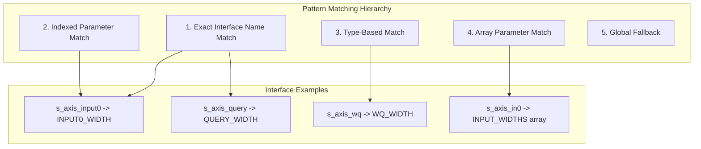
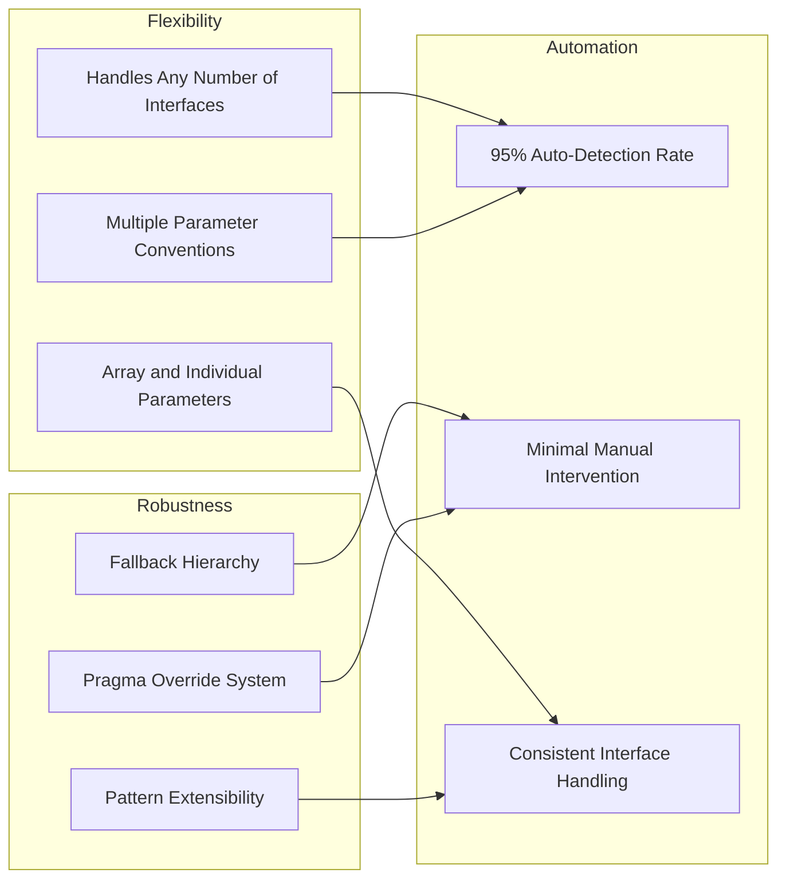

# Multi-Interface Datatype Parameter Mapping Strategy

## Problem Statement Extended

RTL kernels can have multiple interfaces of the same type (e.g., element-wise add with 3 inputs, multi-head attention with multiple weight sets). We need to automatically map datatype parameters to the correct interface instances.

## Multi-Interface Scenarios Analysis

### Scenario 1: Element-wise Operations
```systemverilog
module elementwise_add #(
    int unsigned INPUT0_WIDTH = 8,    // First input precision
    int unsigned INPUT1_WIDTH = 8,    // Second input precision
    int unsigned OUTPUT_WIDTH = 9,    // Output precision
    bit SIGNED_INPUT0 = 1,            // First input signedness
    bit SIGNED_INPUT1 = 1,            // Second input signedness
    int unsigned PE = 4
)(
    // s_axis_input0_*, s_axis_input1_*, m_axis_output_*
);
```

### Scenario 2: Multi-Head Attention
```systemverilog
module multihead_attention #(
    int unsigned QUERY_WIDTH = 8,     // Query input precision
    int unsigned KEY_WIDTH = 8,       // Key input precision  
    int unsigned VALUE_WIDTH = 8,     // Value input precision
    int unsigned WQ_WIDTH = 4,        // Query weight precision
    int unsigned WK_WIDTH = 4,        // Key weight precision
    int unsigned WV_WIDTH = 4,        // Value weight precision
    int unsigned OUTPUT_WIDTH = 16,   // Output precision
    int unsigned NUM_HEADS = 8
)(
    // s_axis_query_*, s_axis_key_*, s_axis_value_*
    // s_axis_wq_*, s_axis_wk_*, s_axis_wv_*
    // m_axis_output_*
);
```

### Scenario 3: Array-Based Parameters
```systemverilog
module multi_input_concat #(
    parameter int INPUT_WIDTHS[4] = '{8, 16, 8, 4},  // Array of input widths
    parameter bit INPUT_SIGNED[4] = '{1, 1, 0, 1},   // Array of signedness
    int unsigned NUM_INPUTS = 4,
    int unsigned PE = 1
)(
    // s_axis_in0_*, s_axis_in1_*, s_axis_in2_*, s_axis_in3_*
    // m_axis_output_*
);
```

## Enhanced Auto-Detection Strategy

### 1. Multi-Interface Pattern Matching



### 2. Enhanced Pattern Categories

#### A. Exact Interface Name Matching
```python
EXACT_NAME_PATTERNS = {
    'width': [
        '{interface_name}_WIDTH',           # query_WIDTH, key_WIDTH
        '{interface_name}_BITS',            # query_BITS, key_BITS
        '{interface_name}WIDTH',            # queryWIDTH (no underscore)
        '{interface_name}BITS',             # queryBITS (no underscore)
    ],
    
    'signed': [
        'SIGNED_{interface_name}',          # SIGNED_query, SIGNED_key
        '{interface_name}_SIGNED',          # query_SIGNED, key_SIGNED
        '{interface_name}SIGNED',           # querySIGNED (no underscore)
    ],
    
    'format': [
        '{interface_name}_FORMAT',          # query_FORMAT
        '{interface_name}_TYPE',            # query_TYPE
    ]
}

# Interface name transformations for matching
def normalize_interface_name(interface_name: str) -> List[str]:
    """Generate possible parameter name variants from interface name"""
    variants = []
    
    # Remove common prefixes/suffixes
    clean_name = interface_name
    for prefix in ['s_axis_', 'm_axis_', 'axis_']:
        clean_name = clean_name.replace(prefix, '')
    for suffix in ['_tdata', '_tvalid', '_tready', '_V']:
        clean_name = clean_name.replace(suffix, '')
    
    variants.extend([
        clean_name,                    # query
        clean_name.upper(),           # QUERY  
        clean_name.lower(),           # query
        clean_name.capitalize(),      # Query
    ])
    
    return variants
```

#### B. Indexed Parameter Matching
```python
INDEXED_PATTERNS = {
    'width': [
        'INPUT{index}_WIDTH',              # INPUT0_WIDTH, INPUT1_WIDTH
        'INPUT_{index}_WIDTH',             # INPUT_0_WIDTH, INPUT_1_WIDTH
        'IN{index}_WIDTH',                 # IN0_WIDTH, IN1_WIDTH
        'WEIGHT{index}_WIDTH',             # WEIGHT0_WIDTH, WEIGHT1_WIDTH
        'W{index}_WIDTH',                  # W0_WIDTH, W1_WIDTH
        'OUTPUT{index}_WIDTH',             # OUTPUT0_WIDTH, OUTPUT1_WIDTH
        'OUT{index}_WIDTH',                # OUT0_WIDTH, OUT1_WIDTH
    ],
    
    'signed': [
        'SIGNED_INPUT{index}',             # SIGNED_INPUT0, SIGNED_INPUT1
        'SIGNED_IN{index}',                # SIGNED_IN0, SIGNED_IN1
        'INPUT{index}_SIGNED',             # INPUT0_SIGNED, INPUT1_SIGNED
        'SIGNED_WEIGHT{index}',            # SIGNED_WEIGHT0, SIGNED_WEIGHT1
        'WEIGHT{index}_SIGNED',            # WEIGHT0_SIGNED, WEIGHT1_SIGNED
    ]
}

def extract_interface_index(interface_name: str) -> Optional[int]:
    """Extract numeric index from interface name"""
    # Pattern: s_axis_input0 -> 0, s_axis_weights_1 -> 1
    import re
    patterns = [
        r'.*?(\d+)$',           # ending with number: input0 -> 0
        r'.*?_(\d+)$',          # ending with _number: input_0 -> 0  
        r'.*?(\d+)_.*',         # number in middle: input0_data -> 0
    ]
    
    for pattern in patterns:
        match = re.search(pattern, interface_name)
        if match:
            return int(match.group(1))
    
    return None
```

#### C. Array Parameter Support
```python
ARRAY_PARAMETER_PATTERNS = {
    'width': [
        'INPUT_WIDTHS',                    # Array: [8, 16, 8, 4]
        'WEIGHT_WIDTHS',                   # Array: [4, 8, 4]
        'OUTPUT_WIDTHS',                   # Array: [32, 16]
        'DATA_WIDTHS',                     # Generic array
        'WIDTHS',                          # Simple array name
    ],
    
    'signed': [
        'INPUT_SIGNED',                    # Array: [1, 0, 1, 1]
        'WEIGHT_SIGNED',                   # Array: [1, 1, 0]
        'SIGNED_MODES',                    # Array: [1, 0, 1]
        'SIGNEDNESS',                      # Array: [1, 1, 0]
    ],
    
    'format': [
        'INPUT_FORMATS',                   # Array: ["INT", "UINT", "FIXED"]
        'DATA_TYPES',                      # Array: ["INT8", "UINT16", "FIXED"]
    ]
}

def match_array_parameter(
    interfaces: List[InterfaceMetadata], 
    parameter: Parameter
) -> List[Tuple[str, int]]:
    """Match array parameter to interfaces by index"""
    
    interface_type = interfaces[0].interface_type.value.lower()
    param_name = parameter.name.upper()
    
    # Check if this is an array parameter for this interface type
    type_arrays = ARRAY_PARAMETER_PATTERNS.get('width', [])
    type_arrays.extend(ARRAY_PARAMETER_PATTERNS.get('signed', []))
    
    for pattern in type_arrays:
        if interface_type.upper() in pattern and param_name == pattern:
            # This parameter applies to all interfaces of this type
            return [(iface.name, idx) for idx, iface in enumerate(interfaces)]
    
    return []
```

### 3. Enhanced Pragma System for Complex Cases

```systemverilog
// Multi-interface pragma syntax options:

// Option 1: Interface-specific pragmas
// @brainsmith DATATYPE_PARAM s_axis_query QUERY_WIDTH width
// @brainsmith DATATYPE_PARAM s_axis_key KEY_WIDTH width
// @brainsmith DATATYPE_PARAM s_axis_value VALUE_WIDTH width

// Option 2: Array parameter pragmas
// @brainsmith DATATYPE_PARAM_ARRAY input INPUT_WIDTHS width
// @brainsmith DATATYPE_PARAM_ARRAY input INPUT_SIGNED signed

// Option 3: Batch pragma for similar interfaces
// @brainsmith DATATYPE_PARAM_PATTERN s_axis_input* INPUT{index}_WIDTH width
// @brainsmith DATATYPE_PARAM_PATTERN s_axis_w* W{interface_suffix}_WIDTH width

// Option 4: Global mapping pragma
// @brainsmith DATATYPE_PARAM_GLOBAL input ACTIVATION_WIDTH width
// @brainsmith DATATYPE_PARAM_GLOBAL weight WEIGHT_WIDTH width
```

### 4. Implementation Algorithm

```python
class MultiInterfaceDatatypeAnalyzer:
    def __init__(self, interfaces: List[InterfaceMetadata], parameters: List[Parameter]):
        self.interfaces = interfaces
        self.parameters = parameters
        self.mappings = {}
    
    def analyze_mappings(self) -> Dict[str, DatatypeParameterMapping]:
        """Analyze parameter mappings for all interfaces"""
        
        # Group interfaces by type
        interface_groups = self._group_interfaces_by_type()
        
        # Analyze each group
        for interface_type, interfaces in interface_groups.items():
            if interface_type == InterfaceType.CONTROL:
                continue
                
            type_mappings = self._analyze_interface_group(interfaces)
            self.mappings.update(type_mappings)
        
        return self.mappings
    
    def _analyze_interface_group(self, interfaces: List[InterfaceMetadata]) -> Dict[str, DatatypeParameterMapping]:
        """Analyze parameter mappings for a group of interfaces of the same type"""
        mappings = {}
        
        for interface in interfaces:
            # Try exact name matching first
            mapping = self._try_exact_name_matching(interface)
            if mapping:
                mappings[interface.name] = mapping
                continue
            
            # Try indexed parameter matching
            mapping = self._try_indexed_matching(interface)
            if mapping:
                mappings[interface.name] = mapping
                continue
            
            # Try array parameter matching
            mapping = self._try_array_matching(interface, interfaces)
            if mapping:
                mappings[interface.name] = mapping
                continue
            
            # Fall back to type-based global matching
            mapping = self._try_global_type_matching(interface)
            if mapping:
                mappings[interface.name] = mapping
        
        return mappings
    
    def _try_exact_name_matching(self, interface: InterfaceMetadata) -> Optional[DatatypeParameterMapping]:
        """Try to find parameters that exactly match interface name patterns"""
        
        name_variants = normalize_interface_name(interface.name)
        
        width_param = None
        signed_param = None
        
        for variant in name_variants:
            # Try width patterns
            for pattern in EXACT_NAME_PATTERNS['width']:
                param_name = pattern.format(interface_name=variant)
                width_param = self._find_parameter(param_name)
                if width_param:
                    break
            
            # Try signed patterns  
            for pattern in EXACT_NAME_PATTERNS['signed']:
                param_name = pattern.format(interface_name=variant)
                signed_param = self._find_parameter(param_name)
                if signed_param:
                    break
            
            if width_param:
                break
        
        if width_param:
            return DatatypeParameterMapping(
                interface_name=interface.name,
                width_parameter=width_param.name,
                signed_parameter=signed_param.name if signed_param else None
            )
        
        return None
    
    def _try_indexed_matching(self, interface: InterfaceMetadata) -> Optional[DatatypeParameterMapping]:
        """Try to find parameters using indexed patterns"""
        
        index = extract_interface_index(interface.name)
        if index is None:
            return None
        
        interface_type = interface.interface_type.value.lower()
        width_param = None
        signed_param = None
        
        # Try indexed width patterns
        for pattern in INDEXED_PATTERNS['width']:
            if interface_type in pattern.lower():
                param_name = pattern.format(index=index)
                width_param = self._find_parameter(param_name)
                if width_param:
                    break
        
        # Try indexed signed patterns
        for pattern in INDEXED_PATTERNS['signed']:
            if interface_type in pattern.lower():
                param_name = pattern.format(index=index)
                signed_param = self._find_parameter(param_name)
                if signed_param:
                    break
        
        if width_param:
            return DatatypeParameterMapping(
                interface_name=interface.name,
                width_parameter=width_param.name,
                signed_parameter=signed_param.name if signed_param else None
            )
        
        return None
    
    def _try_array_matching(self, interface: InterfaceMetadata, all_interfaces: List[InterfaceMetadata]) -> Optional[DatatypeParameterMapping]:
        """Try to find array parameters that apply to this interface"""
        
        interface_type = interface.interface_type.value.lower()
        
        # Find the index of this interface within its type group
        same_type_interfaces = [iface for iface in all_interfaces if iface.interface_type == interface.interface_type]
        try:
            interface_index = same_type_interfaces.index(interface)
        except ValueError:
            return None
        
        width_param = None
        signed_param = None
        
        # Look for array parameters
        for param in self.parameters:
            param_name = param.name.upper()
            
            # Check width arrays
            for pattern in ARRAY_PARAMETER_PATTERNS['width']:
                if interface_type.upper() in pattern and param_name == pattern:
                    width_param = param
                    break
            
            # Check signed arrays
            for pattern in ARRAY_PARAMETER_PATTERNS['signed']:
                if interface_type.upper() in pattern and param_name == pattern:
                    signed_param = param
                    break
        
        if width_param:
            return DatatypeParameterMapping(
                interface_name=interface.name,
                width_parameter=width_param.name,
                signed_parameter=signed_param.name if signed_param else None,
                array_index=interface_index  # Store the array index
            )
        
        return None
```

## Example Multi-Interface Scenarios

### Example 1: Element-wise Add (Indexed Parameters)
```systemverilog
module elementwise_add #(
    int unsigned INPUT0_WIDTH = 8,    // Auto-detected: s_axis_input0
    int unsigned INPUT1_WIDTH = 16,   // Auto-detected: s_axis_input1
    int unsigned OUTPUT_WIDTH = 17,   // Auto-detected: m_axis_output
    bit SIGNED_INPUT0 = 1,            // Auto-detected: s_axis_input0
    bit SIGNED_INPUT1 = 1             // Auto-detected: s_axis_input1
);
```

**Generated Mappings:**
```python
{
    "s_axis_input0": DatatypeParameterMapping(
        interface_name="s_axis_input0",
        width_parameter="INPUT0_WIDTH", 
        signed_parameter="SIGNED_INPUT0"
    ),
    "s_axis_input1": DatatypeParameterMapping(
        interface_name="s_axis_input1",
        width_parameter="INPUT1_WIDTH",
        signed_parameter="SIGNED_INPUT1"  
    ),
    "m_axis_output": DatatypeParameterMapping(
        interface_name="m_axis_output",
        width_parameter="OUTPUT_WIDTH"
    )
}
```

### Example 2: Multi-Head Attention (Named Parameters)
```systemverilog
// @brainsmith DATATYPE_PARAM s_axis_query QUERY_WIDTH width
// @brainsmith DATATYPE_PARAM s_axis_key KEY_WIDTH width
// @brainsmith DATATYPE_PARAM s_axis_value VALUE_WIDTH width
// @brainsmith DATATYPE_PARAM s_axis_wq WQ_WIDTH width  
// @brainsmith DATATYPE_PARAM s_axis_wk WK_WIDTH width
// @brainsmith DATATYPE_PARAM s_axis_wv WV_WIDTH width
module multihead_attention #(
    int unsigned QUERY_WIDTH = 8,     // Pragma-mapped: s_axis_query
    int unsigned KEY_WIDTH = 8,       // Pragma-mapped: s_axis_key
    int unsigned VALUE_WIDTH = 8,     // Pragma-mapped: s_axis_value
    int unsigned WQ_WIDTH = 4,        // Pragma-mapped: s_axis_wq
    int unsigned WK_WIDTH = 4,        // Pragma-mapped: s_axis_wk  
    int unsigned WV_WIDTH = 4         // Pragma-mapped: s_axis_wv
);
```

### Example 3: Array Parameters (Array Matching)
```systemverilog
// @brainsmith DATATYPE_PARAM_ARRAY input INPUT_WIDTHS width
// @brainsmith DATATYPE_PARAM_ARRAY input INPUT_SIGNED signed
module multi_input_concat #(
    parameter int INPUT_WIDTHS[4] = '{8, 16, 8, 4},  // Array for s_axis_in0..3
    parameter bit INPUT_SIGNED[4] = '{1, 1, 0, 1}    // Array for s_axis_in0..3
);
```

**Generated Mappings:**
```python
{
    "s_axis_in0": DatatypeParameterMapping(
        interface_name="s_axis_in0",
        width_parameter="INPUT_WIDTHS",
        signed_parameter="INPUT_SIGNED", 
        array_index=0
    ),
    "s_axis_in1": DatatypeParameterMapping(
        interface_name="s_axis_in1", 
        width_parameter="INPUT_WIDTHS",
        signed_parameter="INPUT_SIGNED",
        array_index=1
    )
    # ... etc for in2, in3
}
```

## Benefits of Multi-Interface Approach



This approach ensures that complex multi-interface kernels can be handled automatically while providing flexibility for edge cases through the pragma system. The hierarchical pattern matching ensures that the most specific patterns are tried first, with sensible fallbacks for cases where auto-detection is insufficient.