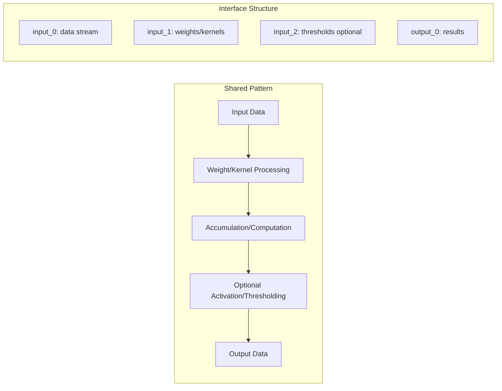
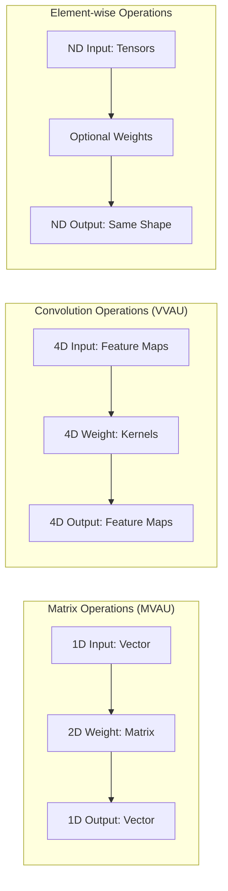
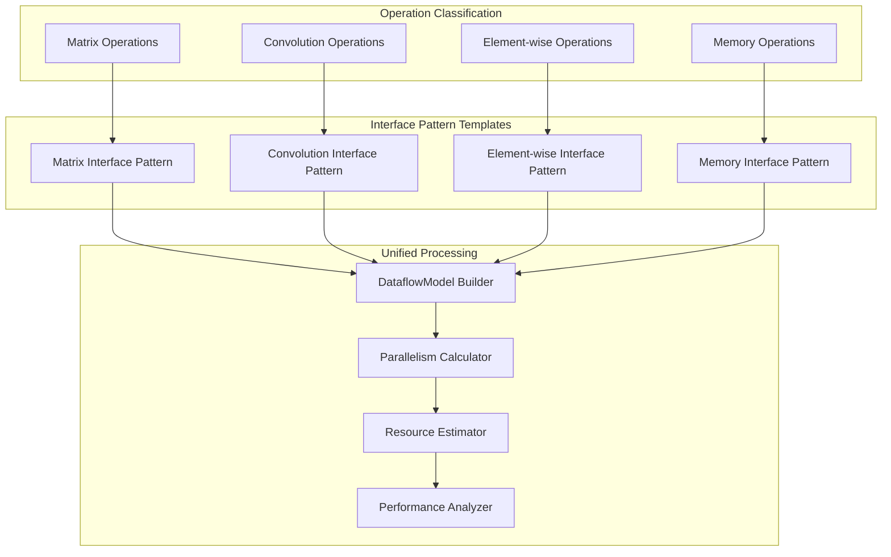

# MVAU/VVAU Dataflow Model Generalization

## Analysis Summary

After analyzing MVAU (Matrix Vector Activation Unit) and VVAU (Vector Vector Activation Unit) implementations alongside the dataflow model design overview, I've identified key patterns and generalization opportunities for AutoHWCustomOp.

## Current MVAU/VVAU Analysis

### Common Architectural Patterns

Both MVAU and VVAU follow identical high-level patterns:



### Mathematical Mapping to Dataflow Model

#### MVAU Mapping
```python
# Legacy FINN Attributes → Modern Dataflow Interfaces
MVAU_MAPPING = {
    # Input interface: vector input
    "input_0": DataflowInterface(
        tensor_dims=[batch_size, MW],           # [N, input_features]
        block_dims=[1, "SIMD"],                 # iPar = SIMD
        stream_dims=[1, iPar],                  # elements per cycle
        interface_type=InterfaceType.INPUT
    ),
    
    # Weight interface: matrix weights  
    "input_1": DataflowInterface(
        tensor_dims=[MW, MH],                   # [input_features, output_features]
        block_dims=["SIMD", "PE"],              # iPar × wPar blocks
        stream_dims=[iPar, wPar],               # weight elements per cycle
        interface_type=InterfaceType.WEIGHT
    ),
    
    # Output interface: vector output
    "output_0": DataflowInterface(
        tensor_dims=[batch_size, MH],           # [N, output_features]
        block_dims=[1, "PE"],                   # wPar = PE
        stream_dims=[1, wPar],                  # results per cycle
        interface_type=InterfaceType.OUTPUT
    )
}

# Performance equations
cII = (MW // iPar) * (MH // wPar)  # cycles per output vector
```

#### VVAU Mapping
```python
# Vector-Vector operation (depth-wise convolution pattern)
VVAU_MAPPING = {
    # Input interface: spatial feature maps with kernels
    "input_0": DataflowInterface(
        tensor_dims=[1, dim_h, dim_w, channels * k_h * k_w],
        block_dims=[1, 1, 1, "SIMD" * "PE"],   # spatial parallelism
        stream_dims=[1, 1, 1, simd_par * pe_par],
        interface_type=InterfaceType.INPUT
    ),
    
    # Weight interface: per-channel kernels
    "input_1": DataflowInterface(
        tensor_dims=[channels, 1, k_h, k_w],
        block_dims=["PE", 1, "SIMD", 1],        # channel + spatial parallelism
        stream_dims=[pe_par, 1, simd_par, 1],
        interface_type=InterfaceType.WEIGHT
    ),
    
    # Output interface: processed feature maps
    "output_0": DataflowInterface(
        tensor_dims=[1, dim_h, dim_w, channels],
        block_dims=[1, 1, 1, "PE"],             # channel parallelism
        stream_dims=[1, 1, 1, pe_par],
        interface_type=InterfaceType.OUTPUT
    )
}

# Performance equations  
cII = ((channels * k_h * k_w) // pe_par // simd_par) * dim_h * dim_w
```

## Key Generalization Insights

### 1. **Universal PE/SIMD → iPar/wPar Mapping**

The dataflow model provides a clean mathematical framework for the legacy FINN concepts:

```mermaid
graph TD
    subgraph "Legacy FINN System"
        A1[SIMD: Input Elements/Cycle]
        B1[PE: Processing Elements/Cycle]
        C1[Hardcoded Stream Widths]
    end
    
    subgraph "Dataflow Model System"
        A2[iPar: Input Interface Parallelism]
        B2[wPar: Weight Interface Parallelism]
        C2[Derived Stream Dimensions]
    end
    
    subgraph "Mathematical Translation"
        D[input_interface.stream_dims[last] = iPar = SIMD]
        E[weight_interface.stream_dims[relevant] = wPar = PE]
        F[output_interface.stream_dims[last] = wPar = PE]
    end
    
    A1 --> A2
    B1 --> B2
    C1 --> C2
    A2 --> D
    B2 --> E
    B2 --> F
```

### 2. **Operation-Specific Interface Patterns**

Different operations have characteristic interface patterns:



### 3. **Common Resource Estimation Patterns**

Both MVAU and VVAU share identical resource estimation logic:

```python
# Generalized resource estimation
def estimate_bram_usage(interfaces, parallelism_config, mem_mode, ram_style):
    """Unified BRAM estimation for weight-based operations"""
    weight_interfaces = [i for i in interfaces if i.interface_type == InterfaceType.WEIGHT]
    if not weight_interfaces:
        return 0
        
    total_weight_bits = sum(
        np.prod(iface.tensor_dims) * iface.dtype.bitwidth() 
        for iface in weight_interfaces
    )
    
    # Apply parallelism factor
    pe_factor = parallelism_config.get_weight_parallelism()
    simd_factor = parallelism_config.get_input_parallelism()
    memory_width = pe_factor * simd_factor * weight_interfaces[0].dtype.bitwidth()
    
    # Use standard BRAM capacity calculations
    return calculate_bram_blocks(total_weight_bits, memory_width, mem_mode, ram_style)
```

## Proposed Generalization Framework

### Enhanced AutoHWCustomOp Architecture



### Operation Pattern Detection

Based on RTL analysis, we can automatically classify operations:

```python
@dataclass
class OperationPattern:
    """Detected operation pattern from RTL analysis"""
    operation_type: str  # "matrix", "convolution", "elementwise", "memory"
    interface_signature: List[InterfaceMetadata]
    weight_pattern: Optional[str]  # "embedded", "decoupled", "external"
    activation_pattern: Optional[str]  # "thresholding", "none", "custom"
    parallelism_hints: Dict[str, Any]  # PE/SIMD equivalents from pragmas

def detect_operation_pattern(interface_metadata: List[InterfaceMetadata]) -> OperationPattern:
    """Classify operation based on interface analysis"""
    input_interfaces = [i for i in interface_metadata if i.interface_type == InterfaceType.INPUT]
    weight_interfaces = [i for i in interface_metadata if i.interface_type == InterfaceType.WEIGHT]
    output_interfaces = [i for i in interface_metadata if i.interface_type == InterfaceType.OUTPUT]
    
    # Matrix operation: 1D input, 2D weight, 1D output
    if (len(input_interfaces) == 1 and len(weight_interfaces) == 1 and
        len(get_tensor_dims(input_interfaces[0])) == 2 and  # [batch, features]
        len(get_tensor_dims(weight_interfaces[0])) == 2):   # [in_features, out_features]
        return OperationPattern(
            operation_type="matrix",
            interface_signature=interface_metadata,
            weight_pattern=detect_weight_mode(weight_interfaces[0]),
            activation_pattern=detect_activation_mode(interface_metadata),
            parallelism_hints=extract_pe_simd_hints(interface_metadata)
        )
    
    # Similar logic for convolution, elementwise, etc.
```

### Unified Interface Builder

```python
class UnifiedInterfaceBuilder:
    """Build DataflowModel from operation patterns"""
    
    def build_matrix_operation(self, pattern: OperationPattern, runtime_params: Dict) -> DataflowModel:
        """Build MVAU-style matrix operation"""
        interfaces = []
        
        # Input interface (vector)
        input_iface = DataflowInterface(
            name="input_0",
            interface_type=InterfaceType.INPUT,
            tensor_dims=[runtime_params["batch_size"], runtime_params["input_features"]],
            block_dims=[1, runtime_params.get("SIMD", 1)],  # iPar from SIMD
            stream_dims=[1, runtime_params.get("SIMD", 1)],
            dtype=parse_datatype(runtime_params["inputDataType"])
        )
        interfaces.append(input_iface)
        
        # Weight interface (matrix)
        weight_iface = DataflowInterface(
            name="weights",
            interface_type=InterfaceType.WEIGHT,
            tensor_dims=[runtime_params["input_features"], runtime_params["output_features"]],
            block_dims=[runtime_params.get("SIMD", 1), runtime_params.get("PE", 1)],
            stream_dims=[runtime_params.get("SIMD", 1), runtime_params.get("PE", 1)],
            dtype=parse_datatype(runtime_params["weightDataType"])
        )
        interfaces.append(weight_iface)
        
        # Output interface (vector)
        output_iface = DataflowInterface(
            name="output_0", 
            interface_type=InterfaceType.OUTPUT,
            tensor_dims=[runtime_params["batch_size"], runtime_params["output_features"]],
            block_dims=[1, runtime_params.get("PE", 1)],  # wPar from PE
            stream_dims=[1, runtime_params.get("PE", 1)],
            dtype=parse_datatype(runtime_params["outputDataType"])
        )
        interfaces.append(output_iface)
        
        # Optional threshold interface
        if not runtime_params.get("noActivation", False):
            threshold_iface = self._build_threshold_interface(runtime_params)
            interfaces.append(threshold_iface)
        
        return DataflowModel(interfaces, pattern.parallelism_hints)
    
    def build_convolution_operation(self, pattern: OperationPattern, runtime_params: Dict) -> DataflowModel:
        """Build VVAU-style convolution operation"""
        # Similar logic for convolution patterns...
        pass
```

### Enhanced Template Generation

```jinja2
{# Enhanced hw_custom_op_phase2.py.j2 with operation-specific extensions #}

class {{ class_name }}(AutoHWCustomOp):
    """Auto-generated HWCustomOp for {{ kernel_name }} ({{ operation_pattern.operation_type }} operation)"""
    
    def __init__(self, onnx_node, **kwargs):
        super().__init__(onnx_node, **kwargs)
        self.operation_pattern = {{ operation_pattern | repr }}
    
    @staticmethod
    def get_interface_metadata() -> List[InterfaceMetadata]:
        return {{ interface_metadata | repr }}
    
    
    # Matrix operation-specific methods
    def calc_wmem(self):
        """Calculate weight memory depth (MVAU-compatible)"""
        mw = self.get_nodeattr("MW") or self.get_nodeattr("input_features")
        mh = self.get_nodeattr("MH") or self.get_nodeattr("output_features") 
        pe = self.get_nodeattr("PE")
        simd = self.get_nodeattr("SIMD")
        return (mw * mh) // (pe * simd)
    
    def get_hw_compatible_weight_tensor(self, orig_weight_matrix):
        """Convert weights to hardware format (MVAU-compatible)"""
        # Use MVAU's exact weight tensor formatting logic
        return self._format_matrix_weights(orig_weight_matrix)
    
    
    # Convolution operation-specific methods  
    def calc_wmem(self):
        """Calculate weight memory depth (VVAU-compatible)"""
        channels = self.get_nodeattr("Channels")
        k_h, k_w = self.get_nodeattr("Kernel")
        pe = self.get_nodeattr("PE")
        simd = self.get_nodeattr("SIMD") 
        return (k_h * k_w * channels // pe) // simd
    
    def get_hw_compatible_weight_tensor(self, orig_weight_matrix):
        """Convert weights to hardware format (VVAU-compatible)"""
        # Use VVAU's exact weight tensor formatting logic
        return self._format_convolution_weights(orig_weight_matrix)
    
    
    
    
    def get_hw_compatible_threshold_tensor(self, orig_thres_matrix):
        """Convert thresholds to hardware format"""
        # Use shared thresholding logic from MVAU/VVAU
        return self._format_threshold_tensor(orig_thres_matrix)
    
    def minimize_accumulator_width(self, model):
        """Minimize accumulator width based on data analysis"""
        # Use shared accumulator optimization logic
        return self._optimize_accumulator_datatype(model)
    
```

## Implementation Roadmap

### Phase 1: Pattern Detection Enhancement
```python
# Extend RTL analysis to detect operation patterns
class EnhancedRTLParser:
    def detect_operation_pattern(self) -> OperationPattern:
        """Classify operation from RTL structure and pragmas"""
        # Analyze interface signatures
        # Look for PE/SIMD pragma patterns
        # Detect weight/threshold patterns
        # Classify operation type
        
    def extract_legacy_mappings(self) -> Dict[str, str]:
        """Extract FINN-compatible attribute mappings"""
        # Map RTL parameters to FINN attributes
        # Detect SIMD/PE equivalents
        # Identify memory modes
```

### Phase 2: Unified Resource Estimation
```python
class UnifiedResourceEstimator:
    """Generalized resource estimation for all operation types"""
    
    def estimate_resources(self, dataflow_model: DataflowModel, 
                          operation_pattern: OperationPattern) -> Dict[str, int]:
        """Estimate resources using operation-specific formulas"""
        
        if operation_pattern.operation_type == "matrix":
            return self._estimate_matrix_resources(dataflow_model)
        elif operation_pattern.operation_type == "convolution":
            return self._estimate_convolution_resources(dataflow_model)
        # etc.
    
    def _estimate_matrix_resources(self, model: DataflowModel) -> Dict[str, int]:
        """Use MVAU's proven resource estimation formulas"""
        # Apply MVAU BRAM estimation logic
        # Use MVAU timing calculation
        # Apply MVAU efficiency calculations
        
    def _estimate_convolution_resources(self, model: DataflowModel) -> Dict[str, int]:
        """Use VVAU's proven resource estimation formulas"""
        # Apply VVAU resource calculations
        # Handle spatial dimension complexities
```

### Phase 3: Advanced Execution Logic
```python
class EnhancedExecutionGenerator:
    """Generate operation-specific execution logic"""
    
    def generate_execution_method(self, operation_pattern: OperationPattern) -> str:
        """Generate execute_node implementation"""
        
        if operation_pattern.operation_type == "matrix":
            return self._generate_matrix_execution()
        elif operation_pattern.operation_type == "convolution":  
            return self._generate_convolution_execution()
        # etc.
    
    def _generate_matrix_execution(self) -> str:
        """Generate MVAU-compatible execution logic"""
        return """
        # Matrix multiplication with optional thresholding
        inp_A = context[node.input[0]]
        inp_B = self._get_weight_tensor(context, graph, node.input[1])
        
        if self.get_nodeattr("binaryXnorMode"):
            result = xp.xnorpopcountmatmul(inp_A, inp_B)
        else:
            result = np.matmul(inp_A, inp_B)
            
        if not self.get_nodeattr("noActivation"):
            thresholds = self._get_threshold_tensor(context, graph, node.input[2])
            result = self._apply_thresholding(result, thresholds)
            
        context[node.output[0]] = result
        """
```

## Benefits of This Generalization

### 1. **Automatic Legacy Compatibility**
- Perfect PE/SIMD mapping preservation
- Identical performance characteristics
- Compatible resource estimation
- Seamless FINN integration

### 2. **Operation-Specific Optimization**
- Matrix operations get MVAU-proven logic
- Convolution operations get VVAU-proven logic
- Custom operations get appropriate patterns
- Extensible to new operation types

### 3. **Mathematical Rigor**
- Dataflow model ensures correctness
- Interface validation prevents errors
- Performance calculations are exact
- Resource estimates are accurate

### 4. **Reduced Implementation Complexity**
- Single template system for all operations
- Shared resource estimation logic
- Common weight/threshold formatting
- Unified parallelism framework

## Conclusion

The dataflow model provides an excellent mathematical foundation for generalizing complex operations like MVAU and VVAU. By detecting operation patterns from RTL analysis and applying appropriate interface templates, we can automatically generate AutoHWCustomOp subclasses that match the functionality and performance of hand-written implementations while maintaining the mathematical rigor and validation of the dataflow framework.

This approach bridges the gap between the sophisticated legacy FINN operations and the modern, mathematically sound AutoHWCustomOp system, providing the best of both worlds.