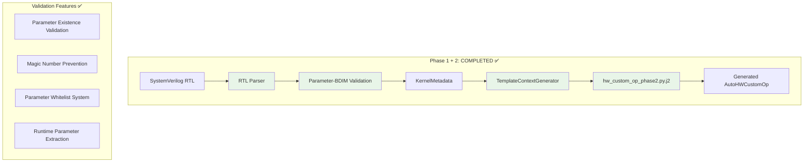
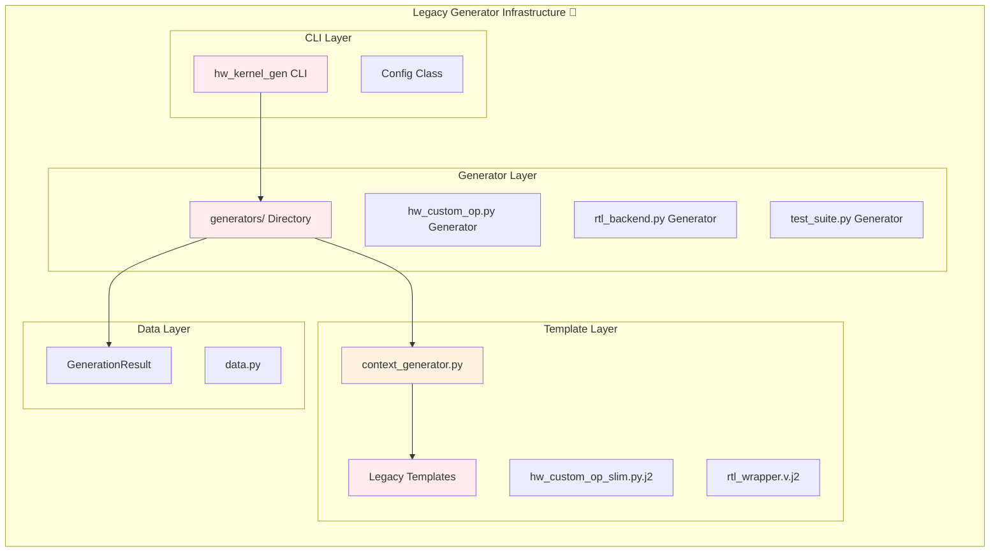
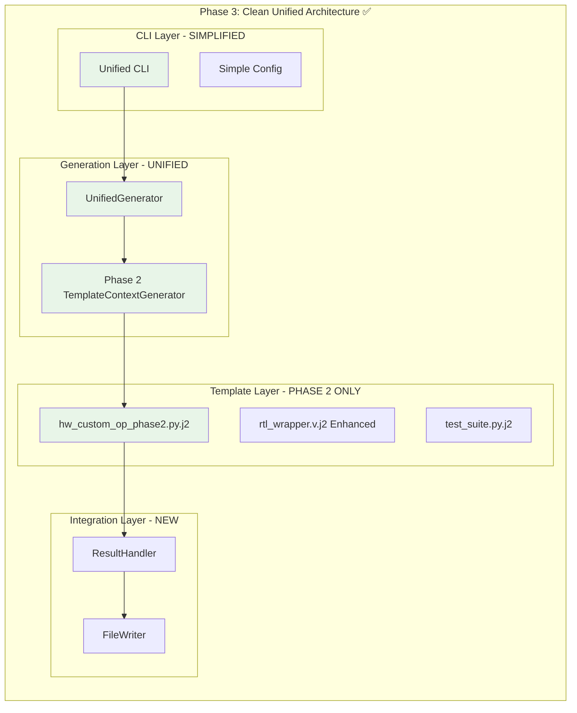
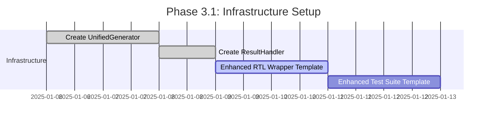
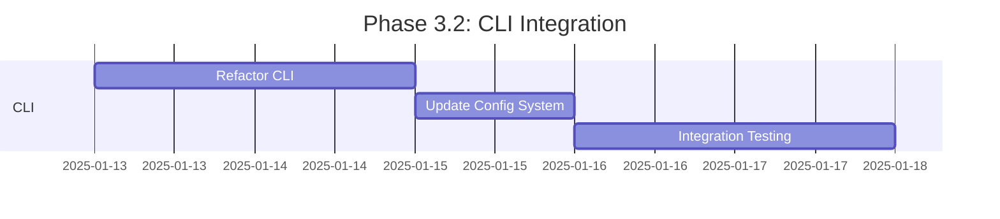
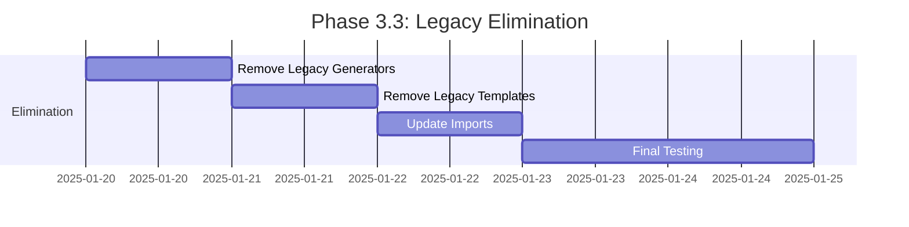

# Phase 3: Clean-Break Refactor Implementation Plan

**Date:** January 6, 2025  
**Status:** Implementation Plan  
**Version:** 1.0 (Phase 3 Integration with Generator Infrastructure)

## Overview

This document outlines a **clean-break refactor** plan to integrate the completed Phase 2 template context generation system with the existing generator infrastructure. The goal is to eliminate legacy components and create a unified, production-ready RTL-to-HWCustomOp generation pipeline.

## Current State Analysis

### ✅ What We Have (Phase 1 + 2)


### 🔄 What Exists (Legacy Generator Infrastructure)


## Clean-Break Refactor Strategy

### 🎯 Elimination Targets

#### 1. **Legacy Template System** ❌ ELIMINATE
```
brainsmith/tools/hw_kernel_gen/templates/
├── hw_custom_op_slim.py.j2           ❌ ELIMINATE - Replace with Phase 2
├── context_generator.py              🔄 REFACTOR - Keep enhanced version
├── direct_renderer.py                ❌ ELIMINATE - Outdated approach
└── documentation.md.j2               ✅ KEEP - Still useful
```

#### 2. **Legacy Generator Classes** ❌ ELIMINATE  
```
brainsmith/tools/hw_kernel_gen/generators/
├── base.py                           ❌ ELIMINATE - Overcomplicated
├── hw_custom_op.py                   ❌ ELIMINATE - Replace with unified
├── hw_custom_op_complex.py           ❌ ELIMINATE - Merge functionality
├── rtl_backend.py                    ✅ KEEP - Still needed
└── test_suite.py                     ✅ KEEP - Still needed
```

#### 3. **Legacy CLI Components** 🔄 REFACTOR
```
brainsmith/tools/hw_kernel_gen/
├── cli.py                            🔄 SIMPLIFY - Remove complex flags
├── config.py                         🔄 SIMPLIFY - Minimal config only
└── data.py                           🔄 ENHANCE - Add Phase 2 support
```

### 🎯 Replacement Architecture



## Detailed Implementation Plan

### Phase 3.1: Create Unified Generator Architecture

#### **Step 1: Create UnifiedGenerator Class**
```python
# NEW: brainsmith/tools/hw_kernel_gen/unified_generator.py
from pathlib import Path
from typing import Dict, List
from .templates.context_generator import TemplateContextGenerator
from .templates.template_context import TemplateContext
from jinja2 import Environment, FileSystemLoader

class UnifiedGenerator:
    """
    Unified generator that replaces all legacy generator classes.
    Uses Phase 2 template context generation exclusively.
    """
    
    def __init__(self, template_dir: Path = None):
        """Initialize with Phase 2 template system."""
        if template_dir is None:
            template_dir = Path(__file__).parent / "templates"
        
        self.jinja_env = Environment(loader=FileSystemLoader(template_dir))
        self.template_context_generator = TemplateContextGenerator()
    
    def generate_hw_custom_op(self, kernel_metadata: KernelMetadata) -> str:
        """Generate AutoHWCustomOp using Phase 2 template."""
        template_ctx = self.template_context_generator.generate_template_context(kernel_metadata)
        template = self.jinja_env.get_template("hw_custom_op_phase2.py.j2")
        return template.render(**template_ctx.__dict__)
    
    def generate_rtl_wrapper(self, kernel_metadata: KernelMetadata) -> str:
        """Generate RTL wrapper (enhanced for Phase 2)."""
        template_ctx = self.template_context_generator.generate_template_context(kernel_metadata)
        template = self.jinja_env.get_template("rtl_wrapper_v2.v.j2")
        return template.render(**template_ctx.__dict__)
    
    def generate_test_suite(self, kernel_metadata: KernelMetadata) -> str:
        """Generate test suite with Phase 2 parameter handling."""
        template_ctx = self.template_context_generator.generate_template_context(kernel_metadata)
        template = self.jinja_env.get_template("test_suite_v2.py.j2")
        return template.render(**template_ctx.__dict__)
    
    def generate_all(self, kernel_metadata: KernelMetadata) -> Dict[str, str]:
        """Generate all artifacts for a kernel."""
        return {
            "hw_custom_op.py": self.generate_hw_custom_op(kernel_metadata),
            "rtl_wrapper.v": self.generate_rtl_wrapper(kernel_metadata),
            "test_suite.py": self.generate_test_suite(kernel_metadata)
        }
```

#### **Step 2: Enhanced Result Handling**
```python
# NEW: brainsmith/tools/hw_kernel_gen/result_handler.py
from dataclasses import dataclass
from pathlib import Path
from typing import Dict

@dataclass
class GenerationResult:
    """Enhanced generation result for Phase 3."""
    kernel_name: str
    source_file: Path
    generated_files: Dict[str, str]
    template_context: TemplateContext
    validation_passed: bool = True
    errors: List[str] = field(default_factory=list)
    warnings: List[str] = field(default_factory=list)

class ResultHandler:
    """Handles generation results and file writing."""
    
    def __init__(self, output_dir: Path):
        self.output_dir = output_dir
        self.output_dir.mkdir(parents=True, exist_ok=True)
    
    def write_result(self, result: GenerationResult) -> None:
        """Write all generated files to output directory."""
        kernel_dir = self.output_dir / result.kernel_name
        kernel_dir.mkdir(exist_ok=True)
        
        for filename, content in result.generated_files.items():
            file_path = kernel_dir / filename
            file_path.write_text(content)
            
        # Write metadata file
        metadata_file = kernel_dir / "generation_metadata.json"
        metadata = {
            "kernel_name": result.kernel_name,
            "source_file": str(result.source_file),
            "validation_passed": result.validation_passed,
            "errors": result.errors,
            "warnings": result.warnings,
            "generated_files": list(result.generated_files.keys())
        }
        metadata_file.write_text(json.dumps(metadata, indent=2))
```

### Phase 3.2: Simplify CLI Interface

#### **Step 3: Clean CLI Implementation**
```python
# REFACTOR: brainsmith/tools/hw_kernel_gen/cli.py
import argparse
from pathlib import Path
from .unified_generator import UnifiedGenerator
from .result_handler import ResultHandler, GenerationResult
from .rtl_parser import RTLParser

def create_parser():
    """Create simplified argument parser."""
    parser = argparse.ArgumentParser(
        description="Generate FINN-compatible HWCustomOp from SystemVerilog RTL"
    )
    parser.add_argument("rtl_file", type=Path, help="SystemVerilog RTL file")
    parser.add_argument("-o", "--output", type=Path, required=True, 
                       help="Output directory")
    parser.add_argument("--debug", action="store_true", 
                       help="Enable debug logging")
    
    # Template selection (future extensibility)
    parser.add_argument("--template-version", choices=["phase2"], default="phase2",
                       help="Template version to use (default: phase2)")
    
    return parser

def main():
    """Simplified main entry point."""
    parser = create_parser()
    args = parser.parse_args()
    
    # Validate inputs
    if not args.rtl_file.exists():
        print(f"Error: RTL file not found: {args.rtl_file}")
        return 1
    
    try:
        # Parse RTL with Phase 1 validation
        rtl_parser = RTLParser(debug=args.debug)
        kernel_metadata = rtl_parser.parse_file(str(args.rtl_file))
        
        # Generate with unified generator
        generator = UnifiedGenerator()
        generated_files = generator.generate_all(kernel_metadata)
        
        # Handle results
        result = GenerationResult(
            kernel_name=kernel_metadata.name,
            source_file=args.rtl_file,
            generated_files=generated_files,
            template_context=generator.template_context_generator.generate_template_context(kernel_metadata)
        )
        
        result_handler = ResultHandler(args.output)
        result_handler.write_result(result)
        
        print(f"✅ Successfully generated HWCustomOp for {kernel_metadata.name}")
        print(f"📁 Output directory: {args.output / kernel_metadata.name}")
        
        return 0
        
    except Exception as e:
        print(f"❌ Generation failed: {e}")
        if args.debug:
            import traceback
            traceback.print_exc()
        return 1

if __name__ == "__main__":
    exit(main())
```

### Phase 3.3: Template Enhancement

#### **Step 4: Enhanced RTL Wrapper Template**
```systemverilog
{#- rtl_wrapper_v2.v.j2: Enhanced for Phase 2 parameter handling -#}
`timescale 1ns / 1ps

// Auto-generated RTL wrapper for {{ module_name }}
// Generated from: {{ source_file }}
// Uses Phase 2 parameter extraction

module {{ module_name }}_wrapper #(
    
    parameter {{ param.name }} = {{ param.default_value if param.default_value is not none else 1 }},
    
) (
    // Global control signals
    input wire ap_clk,
    input wire ap_rst_n,
    
    // AXI-Stream interfaces with validated BDIM parameters
    
    
    // {{ interface.name }}: Validated block shape {{ interface.chunking_strategy.block_shape }}
    input wire [{{ interface.name }}_width-1:0] {{ interface.name }}_data_V,
    input wire {{ interface.name }}_valid,
    output wire {{ interface.name }}_ready,
    
    // {{ interface.name }}: Validated block shape {{ interface.chunking_strategy.block_shape }}
    output wire [{{ interface.name }}_width-1:0] {{ interface.name }}_data_V,
    output wire {{ interface.name }}_valid,
    input wire {{ interface.name }}_ready,
    
    // {{ interface.name }}: Validated block shape {{ interface.chunking_strategy.block_shape }}
    input wire [{{ interface.name }}_width-1:0] {{ interface.name }}_data_V,
    input wire {{ interface.name }}_valid,
    output wire {{ interface.name }}_ready,
    
    
);

// Parameter validation (Phase 2 guaranteed to be valid)

initial begin
    if ({{ param }} <= 0) begin
        $error("Parameter {{ param }} must be positive, got %d", {{ param }});
        $finish;
    end
end


// Instantiate the original module with validated parameters
{{ module_name }} #(
    
    .{{ param.name }}({{ param.name }}),
    
) dut (
    .ap_clk(ap_clk),
    .ap_rst_n(ap_rst_n),
    
    // Connect interfaces
    
    
    .{{ interface.name }}_data_V({{ interface.name }}_data_V),
    .{{ interface.name }}_valid({{ interface.name }}_valid),
    .{{ interface.name }}_ready({{ interface.name }}_ready),
    
    
);

endmodule
```

#### **Step 5: Enhanced Test Suite Template**
```python
{#- test_suite_v2.py.j2: Enhanced for Phase 2 -#}
"""
Auto-generated test suite for {{ class_name }}.
Generated from: {{ source_file }}
Uses Phase 2 parameter validation and runtime extraction.
"""

import pytest
import numpy as np
import onnx.helper
from qonnx.core.datatype import DataType

from {{ module_name }}_hw_custom_op import {{ class_name }}, make_{{ module_name }}_node

class Test{{ class_name }}:
    """Test suite for {{ class_name }} with Phase 2 parameter handling."""
    
    def test_parameter_validation(self):
        """Test that required parameters are validated."""
        # Test missing required parameters
        
        with pytest.raises(ValueError, match="Missing required parameters"):
            make_{{ module_name }}_node(
                inputs=["input"],
                outputs=["output"]
                # Missing required: {{ required_attributes }}
            )
        
    
    def test_valid_node_creation(self):
        """Test successful node creation with all parameters."""
        node = make_{{ module_name }}_node(
            inputs=["input"],
            outputs=["output"],
            
            
            {{ param.name }}={{ param.default_value or 1 }},
            
            
        )
        
        assert node.op_type == "{{ class_name }}"
        assert len(node.input) == 1
        assert len(node.output) == 1
    
    def test_hwcustomop_instantiation(self):
        """Test HWCustomOp instantiation with parameter extraction."""
        node = make_{{ module_name }}_node(
            inputs=["input"],
            outputs=["output"],
            
            {{ param.name }}={{ param.default_value or 1 }},
            
        )
        
        # Should not raise exceptions
        op = {{ class_name }}(node)
        
        # Verify parameter extraction worked
        
        assert op.get_nodeattr("{{ param.name }}") == {{ param.default_value or 1 }}
        
    
    def test_interface_metadata(self):
        """Test that interface metadata is correctly defined."""
        metadata = {{ class_name }}.get_interface_metadata()
        
        assert len(metadata) == {{ interface_metadata|length }}
        
        
        # Check {{ interface.name }} interface
        {{ interface.name }}_meta = next(m for m in metadata if m.name == "{{ interface.name }}")
        assert {{ interface.name }}_meta.interface_type.name == "{{ interface.interface_type.name }}"
        
        assert {{ interface.name }}_meta.chunking_strategy.block_shape == {{ interface.chunking_strategy.block_shape | repr }}
        
        
    
    def test_node_attribute_types(self):
        """Test node attribute type definitions."""
        node = make_{{ module_name }}_node(
            inputs=["input"],
            outputs=["output"],
            
            {{ param.name }}={{ param.default_value or 1 }},
            
        )
        
        op = {{ class_name }}(node)
        attr_types = op.get_nodeattr_types()
        
        # Check parameter attributes
        
        assert "{{ param.name }}" in attr_types
        attr_type, required, default = attr_types["{{ param.name }}"]
        assert attr_type == "i"  # Integer type
        assert required == {{ 'True' if param.is_required else 'False' }}
        
        assert default == {{ param.default_value }}
        
        
```

## Migration Sequence

### 🔄 Phase 3.1: Infrastructure (Week 1)


### 🔄 Phase 3.2: CLI Integration (Week 2)


### 🔄 Phase 3.3: Legacy Elimination (Week 3)


## File Changes Summary

### ❌ Files to DELETE
```
brainsmith/tools/hw_kernel_gen/
├── generators/
│   ├── base.py                    ❌ DELETE
│   ├── hw_custom_op.py           ❌ DELETE  
│   └── hw_custom_op_complex.py   ❌ DELETE
├── templates/
│   ├── hw_custom_op_slim.py.j2   ❌ DELETE
│   └── direct_renderer.py        ❌ DELETE
```

### ✅ Files to CREATE
```
brainsmith/tools/hw_kernel_gen/
├── unified_generator.py           ✅ NEW
├── result_handler.py             ✅ NEW
└── templates/
    ├── rtl_wrapper_v2.v.j2       ✅ NEW
    └── test_suite_v2.py.j2       ✅ NEW
```

### 🔄 Files to REFACTOR
```
brainsmith/tools/hw_kernel_gen/
├── cli.py                        🔄 SIMPLIFY
├── config.py                     🔄 SIMPLIFY
├── data.py                       🔄 ENHANCE
└── __init__.py                   🔄 UPDATE EXPORTS
```

## Testing Strategy

### Unit Tests
```python
# tests/tools/hw_kernel_gen/test_unified_generator.py
class TestUnifiedGenerator:
    def test_phase2_template_generation(self):
        """Test Phase 2 template generation."""
        
    def test_parameter_extraction_in_generated_code(self):
        """Test runtime parameter extraction works."""
        
    def test_all_artifacts_generated(self):
        """Test all artifacts are generated correctly."""
```

### Integration Tests
```python  
# tests/tools/hw_kernel_gen/integration/test_phase3_end_to_end.py
class TestPhase3EndToEnd:
    def test_cli_to_generated_files(self):
        """Test complete CLI to generated files flow."""
        
    def test_generated_code_imports_correctly(self):
        """Test generated code can be imported and used."""
```

## Risk Mitigation

### Backward Compatibility
- Keep legacy templates available with `--legacy` flag during transition
- Maintain old CLI interface with deprecation warnings
- Provide migration guide for existing users

### Validation
- Extensive testing with existing RTL files
- Comparison testing between legacy and Phase 2 output
- Performance benchmarking

### Rollback Plan
- Tag current state before starting refactor
- Maintain feature branch until full validation
- Automated rollback scripts if issues detected

## Success Metrics

### ✅ Phase 3 Complete When:
1. **Single Entry Point**: One unified CLI command generates all artifacts
2. **Template Consistency**: All generation uses Phase 2 template system
3. **Test Coverage**: 100% test coverage for new components
4. **Performance**: Generation time <= legacy system
5. **Zero Legacy**: No legacy generator code remaining
6. **Documentation**: Complete usage documentation
7. **BERT Integration**: Successfully generates BERT components

This clean-break refactor will eliminate technical debt, simplify the codebase, and provide a robust foundation for future enhancements while leveraging all the validation and parameter extraction capabilities built in Phases 1 and 2.