# RTL to AutoHWCustomOp Template Generation Flow

**Date:** January 6, 2025  
**Status:** Complete Design with Implementation  
**Version:** 2.0 (Post BDIM Pragma Redesign)

## Overview

This document describes the complete end-to-end flow from SystemVerilog RTL modules to generated AutoHWCustomOp templates in the Brainsmith Hardware Kernel Generator. The flow includes RTL parsing, pragma processing, interface metadata generation, block chunking strategy application, parameter resolution, and template generation.

## Architecture Overview


## Detailed Flow Stages

### Stage 1: RTL Parsing and Interface Extraction


**Key Data Structures:**

```python
# Raw interface data from RTL parsing
@dataclass
class RawInterfaceData:
    name: str                    # "in0_V_data_V"
    direction: str              # "input" | "output" 
    width: int                  # Signal width in bits
    interface_type: str         # "axi_stream" | "axi_lite"
    protocol_signals: Dict[str, Any]  # TDATA, TVALID, TREADY, etc.
```

### Stage 2: Pragma Processing and Application


**BDIM Pragma Processing:**

```python
# New BDIM pragma format (parameter names only)
"@brainsmith bdim in0_V_data_V [PE] RINDEX=0"
"@brainsmith bdim weights_V [SIMD,PE] RINDEX=1" 
"@brainsmith bdim out0_V [CHANNELS,:] RINDEX=0"

# Parsed BDIM pragma data
@dataclass
class BDimPragmaData:
    interface_name: str         # "in0_V_data_V"
    block_shape: List[str]      # ["PE"] or ["SIMD", "PE"] or ["CHANNELS", ":"]
    rindex: int                 # 0, 1, 2, etc.
    
# Resulting block chunking strategy
class BlockChunkingStrategy:
    def compute_chunking(self, tensor_shape: List[int], interface_name: str) -> Tuple[List[int], List[Union[int, str]]]:
        # Returns: (tensor_dims, block_dims)
        # tensor_dims = [1, 128, 128, 256]  # Original tensor shape
        # block_dims = [1, 128, "SIMD", "PE"]  # Symbolic parameters preserved
```

### Stage 3: Interface Metadata Generation


**Interface Metadata Structure:**

```python
@dataclass
class InterfaceMetadata:
    name: str                           # "in0_V_data_V"
    interface_type: InterfaceType       # INPUT, OUTPUT, WEIGHT, CONFIG
    allowed_datatypes: List[DataTypeConstraint]  # UINT8, INT16, etc.
    chunking_strategy: BlockChunkingStrategy     # BDIM pragma strategy
    default_layout: Optional[str]       # AXI layout information
    description: Optional[str]          # Human-readable description
    
    def get_default_datatype(self) -> Optional[DataTypeConstraint]:
        return self.allowed_datatypes[0] if self.allowed_datatypes else None
```

### Stage 4: Parameter Resolution and DataflowModel Creation


**Parameter Resolution Algorithm:**

```python
def _resolve_block_dimensions(self, block_dims: List[Union[int, str]], 
                              interface_name: str, tensor_shape: List[int]) -> List[int]:
    """Convert symbolic parameters to concrete integers."""
    resolved = []
    for i, dim in enumerate(block_dims):
        if isinstance(dim, int):
            resolved.append(dim)  # Already concrete
        elif isinstance(dim, str):
            if dim == ":":
                # Full dimension - use corresponding tensor dimension
                resolved.append(tensor_shape[i] if i < len(tensor_shape) else 1)
            elif dim in self._runtime_parameters:
                # Parameter name - resolve to concrete value
                resolved.append(self._runtime_parameters[dim])
            else:
                # Missing parameter handling
                if not self._runtime_parameters:
                    resolved.append(1)  # Default when no runtime params
                else:
                    raise ValueError(f"Parameter '{dim}' not found in runtime_parameters")
    return resolved
```

### Stage 5: Template Context Generation


**Template Context Structure:**

```python
@dataclass
class TemplateContext:
    # Core components
    auto_hw_custom_op: AutoHWCustomOp           # Concrete dataflow model
    dataflow_model: DataflowModel               # Always contains integers
    
    # Parameter contexts
    runtime_parameters: Dict[str, int]          # Concrete values: {"PE": 8, "SIMD": 4}
    symbolic_parameters: Dict[str, str]         # Template placeholders: {"PE": "${PE}$"}
    
    # Interface configurations  
    interface_configs: Dict[str, Dict]          # Per-interface configuration
    stream_widths: Dict[str, int]              # Calculated stream widths
    parallelism_bounds: Dict[str, ParallelismBounds]  # Valid parallelism ranges
    
    # Class generation metadata
    class_name: str                            # "MyAcceleratorHWCustomOp"
    module_name: str                           # "my_accelerator"
    base_imports: List[str]                    # Required imports
    
    # Resource estimation
    resource_estimates: Dict[str, Any]         # BRAM, LUT, DSP estimates
```

### Stage 6: Code Generation and Template Processing


## Key Parameter Flow Examples

### Example 1: Simple PE Parameter

```mermaid
graph TD
    subgraph "RTL Input"
        RTL1["module simple_pe(...);<br/>// @brainsmith bdim in0_V [PE]<br/>input [31:0] in0_V_data_V;"]
    end
    
    subgraph "Pragma Processing"
        BDIM1["BDimPragma:<br/>interface: 'in0_V'<br/>block_shape: ['PE']<br/>rindex: 0"]
    end
    
    subgraph "Chunking Strategy"
        CHUNK1["BlockChunkingStrategy:<br/>block_shape: ['PE']<br/>compute_chunking() →<br/>([1,128,128,256], [1,128,128,'PE'])"]
    end
    
    subgraph "Parameter Resolution"
        RESOLVE1["runtime_parameters: {'PE': 8}<br/>_resolve_block_dimensions() →<br/>[1,128,128,8]"]
    end
    
    subgraph "Template Context"
        CONTEXT1["symbolic_parameters: {'PE': '${PE}$'}<br/>runtime_parameters: {'PE': 8}<br/>dataflow_model.block_dims: [1,128,128,8]"]
    end
    
    RTL1 --> BDIM1
    BDIM1 --> CHUNK1
    CHUNK1 --> RESOLVE1
    RESOLVE1 --> CONTEXT1
    
    style RTL1 fill:#e1f5fe
    style CONTEXT1 fill:#e8f5e8
```



### Example 2: Multi-Parameter with Colon

```mermaid
graph TD
    subgraph "RTL Input"
        RTL2["module multi_param(...);<br/>// @brainsmith bdim weights_V [SIMD,:,PE] RINDEX=1<br/>input [127:0] weights_V_data_V;"]
    end
    
    subgraph "Pragma Processing"
        BDIM2["BDimPragma:<br/>interface: 'weights_V'<br/>block_shape: ['SIMD',':','PE']<br/>rindex: 1"]
    end
    
    subgraph "Chunking Strategy"
        CHUNK2["tensor_shape: [1,128,128,256]<br/>block_shape at positions [0,1,2]:<br/>block_dims: ['SIMD',128,'PE',256]"]
    end
    
    subgraph "Parameter Resolution"
        RESOLVE2["runtime_parameters: {'SIMD': 4, 'PE': 8}<br/>':' → tensor_shape[1] = 128<br/>final: [4,128,8,256]"]
    end
    
    subgraph "Template Context"
        CONTEXT2["symbolic: {'SIMD': '${SIMD}$', 'PE': '${PE}$'}<br/>concrete: [4,128,8,256]<br/>templates use symbolic for generation"]
    end
    
    RTL2 --> BDIM2
    BDIM2 --> CHUNK2
    CHUNK2 --> RESOLVE2
    RESOLVE2 --> CONTEXT2
    
    style RTL2 fill:#e1f5fe
    style CONTEXT2 fill:#e8f5e8
```



## Data Flow Summary

### Complete Parameter Journey


## Architecture Benefits

### 1. Separation of Concerns

- **RTL Parsing**: Pure SystemVerilog analysis without parameter resolution
- **Pragma Processing**: Symbolic parameter extraction and validation
- **Parameter Resolution**: Bridge between symbolic and concrete representations
- **Template Generation**: Uses both symbolic (for code gen) and concrete (for modeling)

### 2. Flexibility and Extensibility

- **Parameter System**: Easy to add new parameter types and validation rules
- **Template System**: Jinja2 templates can access both symbolic and concrete contexts
- **Backend Support**: Works with any FINN-compatible backend

### 3. Error Handling and Validation


## Implementation Status

### ✅ Completed Components

1. **RTL Parser**: Tree-sitter based SystemVerilog parsing
2. **BDIM Pragma System**: New parameter-only format with validation
3. **Block Chunking Strategy**: Symbolic parameter preservation
4. **Parameter Resolution Bridge**: AutoHWCustomOp integration
5. **Template Context Generation**: Dual symbolic/concrete context
6. **Test Coverage**: Comprehensive test suite (44 tests passing)

### 🔄 Integration Points

1. **Template Generator Integration**: Runtime parameter extraction from module parameters
2. **FINN Backend Integration**: AutoHWCustomOp instantiation with resolved parameters
3. **CLI Integration**: Parameter override support in command-line interface

## Usage Examples

### CLI Usage

```bash
# Parse RTL and show interface analysis
python -m brainsmith.tools.hw_kernel_gen.cli parse my_accelerator.sv

# Generate templates with parameter overrides
python -m brainsmith.tools.hw_kernel_gen.cli generate my_accelerator.sv compiler_data.json \
    -o output_dir \
    --param PE=8 --param SIMD=4 --param CHANNELS=32
```

### Programmatic Usage

```python
# Create AutoHWCustomOp with parameter resolution
from brainsmith.dataflow.core.auto_hw_custom_op import AutoHWCustomOp

auto_op = AutoHWCustomOp(
    onnx_node=onnx_node,
    interface_metadata=parsed_metadata,
    runtime_parameters={"PE": 8, "SIMD": 4, "CHANNELS": 32}
)

# DataflowModel contains only concrete integers
assert auto_op.dataflow_model.input_interfaces[0].block_dims == [1, 128, 4, 8]

# Generate template context for code generation
context = TemplateContextGenerator.generate_context(
    kernel_metadata=kernel_meta,
    parameter_overrides={"PE": 8, "SIMD": 4}
)

# Templates access both symbolic and concrete representations
template_code = template.render(context)
```

This design provides a robust, extensible framework for RTL-to-template generation with proper parameter handling, clear separation of concerns, and comprehensive error handling throughout the pipeline.