# RTL to AutoHWCustomOp Subclass Generation Flow

**Date:** January 6, 2025  
**Status:** Complete Design - Corrected Understanding  
**Version:** 2.1 (Template Generator Creates Code, Not Instances)

## Overview

This document describes the complete end-to-end flow from SystemVerilog RTL modules to **generated AutoHWCustomOp subclass source code** in the Brainsmith Hardware Kernel Generator. The flow includes RTL parsing, pragma processing, parameter validation, template generation of **source code**, and runtime instantiation by FINN.

## Architecture Overview


## Detailed Flow Stages

### Stage 1: RTL Parsing and Parameter Extraction


**Parameter Extraction:**

```python
@dataclass
class ParameterDefinition:
    name: str              # "PE", "SIMD", "CHANNELS"
    default_value: Optional[int]  # Only for whitelisted parameters
    description: Optional[str]    # From comments
    line_number: int       # For error reporting

# Example RTL with parameter pragmas:
"""
module my_accelerator #(
    parameter PE = 8,           // Whitelisted - has default
    parameter SIMD = 4,         // Whitelisted - has default  
    parameter CHANNELS          // No default - must be provided by FINN
) (
    // @brainsmith bdim in0_V [PE] RINDEX=0
    input [31:0] in0_V_data_V,
    // @brainsmith bdim weights_V [SIMD,CHANNELS] RINDEX=0
    input [127:0] weights_V_data_V
);
"""
```

### Stage 2: Parameter-BDIM Validation (In BDimPragma)


**BDimPragma Validation Implementation:**

```python
# In BDimPragma._parse_inputs() - Add parameter validation
def _parse_inputs(self) -> Dict:
    # ... existing parsing logic ...
    
    # NEW: Validate that all parameter names exist in module parameters
    # This requires access to module parameter list during pragma parsing
    module_parameters = self._get_module_parameters()  # Need to implement
    
    for element in block_shape:
        if isinstance(element, str) and element != ":":
            # This is a parameter name - validate it exists
            if element not in module_parameters:
                raise PragmaError(
                    f"BDIM pragma references unknown parameter '{element}'. "
                    f"Available parameters: {list(module_parameters.keys())}"
                )
    
    return {
        "interface_name": interface_name,
        "block_shape": block_shape,  # Still symbolic
        "rindex": rindex
    }

# Template generation applies defaults (not RTL parser)
WHITELISTED_DEFAULTS = {"PE", "SIMD", "PARALLEL", "WIDTH"}

def apply_defaults_during_template_generation(parameters: List[Parameter]) -> Dict[str, int]:
    """Apply defaults only during template generation phase."""
    defaults = {}
    for param in parameters:
        if param.name in WHITELISTED_DEFAULTS:
            defaults[param.name] = param.default_value or 1  # Use RTL default or fallback
    return defaults
```

### Stage 3: Template Context Generation (Code Generation Time)


**Template Context for Code Generation:**

```python
@dataclass
class TemplateContext:
    # Class generation
    class_name: str                           # "MyAcceleratorHWCustomOp"
    module_name: str                          # "my_accelerator"
    base_imports: List[str]                   # Required imports
    
    # Static interface metadata (with symbolic BDIM)
    interface_metadata: List[InterfaceMetadata]  # Contains symbolic block shapes
    
    # Parameter definitions
    parameter_definitions: List[ParameterDefinition]  # All module parameters
    whitelisted_defaults: Dict[str, int]             # {"PE": 1, "SIMD": 1}
    required_attributes: List[str]                   # Parameters without defaults
    
    # No runtime values - those come from FINN at instantiation time!
    # symbolic_parameters are just parameter names for template placeholders
    
    def get_node_attribute_definitions(self) -> Dict[str, Tuple[str, bool, Any]]:
        """Generate FINN node attribute definitions."""
        attrs = {}
        for param in self.parameter_definitions:
            if param.name in self.whitelisted_defaults:
                # Has default
                attrs[param.name] = ("i", False, self.whitelisted_defaults[param.name])
            else:
                # Required attribute
                attrs[param.name] = ("i", True, None)  # Required, no default
        return attrs
```

### Stage 4: Generated Subclass Code Structure


**Generated Code Template:**

```python
# Template: hw_custom_op.py.j2
class {{ class_name }}(AutoHWCustomOp):
    """Auto-generated HWCustomOp for {{ module_name }}."""
    
    def __init__(self, onnx_node, **kwargs):
        # FINN will extract and set node attributes for us
        # We just need to collect them into runtime_parameters dict
        runtime_parameters = {}
        
        runtime_parameters["{{ param.name }}"] = self.get_nodeattr("{{ param.name }}")
        
        
        # Call parent with static metadata and runtime parameters
        super().__init__(
            onnx_node=onnx_node,
            interface_metadata=self.get_interface_metadata(),
            runtime_parameters=runtime_parameters,
            **kwargs
        )
    
    @staticmethod
    def get_interface_metadata() -> List[InterfaceMetadata]:
        """Return static interface metadata with symbolic BDIM shapes."""
        return [
            
            InterfaceMetadata(
                name="{{ interface.name }}",
                interface_type=InterfaceType.{{ interface.interface_type.name }},
                allowed_datatypes={{ interface.allowed_datatypes | repr }},
                chunking_strategy=BlockChunkingStrategy(
                    block_shape={{ interface.chunking_strategy.block_shape | repr }},  # Symbolic!
                    rindex={{ interface.chunking_strategy.rindex }}
                )
            ),
            
        ]
    
    def get_nodeattr_types(self) -> Dict[str, Tuple[str, bool, Any]]:
        """Define ONNX node attributes for all module parameters."""
        attrs = {}
        
        
        attrs["{{ param.name }}"] = ("i", False, {{ whitelisted_defaults[param.name] }})  # Optional with default
        
        attrs["{{ param.name }}"] = ("i", True, None)  # Required
        
        
        
        # Add base class attributes
        attrs.update(super().get_enhanced_nodeattr_types())
        return attrs
    
    # Note: _extract_runtime_parameters_from_onnx method removed
    # FINN handles attribute extraction and setting automatically
    # We just collect them in __init__ using get_nodeattr()
```

### Stage 5: Runtime Flow (FINN Integration)

```mermaid
sequenceDiagram
    participant FINN as FINN Framework
    participant Helper as onnx.helper
    participant Subclass as Generated Subclass
    participant AutoOp as AutoHWCustomOp
    participant Resolver as Parameter Resolver
    participant Dataflow as DataflowModel
    
    FINN->>Helper: make_node("MyAccelerator", inputs, outputs, **attrs)
    Note over Helper: attrs = {"PE": 8, "SIMD": 4, "CHANNELS": 32}
    Helper-->>FINN: onnx_node
    
    FINN->>Subclass: MyAcceleratorHWCustomOp(onnx_node)
    Note over FINN,Subclass: FINN has already set node attributes: PE=8, SIMD=4, CHANNELS=32
    Subclass->>Subclass: Collect runtime_parameters using get_nodeattr()
    Note over Subclass: runtime_params = {"PE": 8, "SIMD": 4, "CHANNELS": 32}
    
    Subclass->>Subclass: get_interface_metadata()
    Note over Subclass: Returns static metadata with symbolic BDIM shapes
    
    Subclass->>AutoOp: super().__init__(onnx_node, metadata, runtime_params)
    AutoOp->>AutoOp: _build_dataflow_model_with_defaults()
    
    loop For each interface
        AutoOp->>AutoOp: _apply_chunking_strategy(metadata, tensor_shape)
        AutoOp->>Resolver: _resolve_block_dimensions(symbolic_dims, runtime_params)
        Note over Resolver: Convert ["PE", "SIMD"] → [8, 4] using runtime_params
        Resolver-->>AutoOp: concrete_block_dims
    end
    
    AutoOp->>Dataflow: DataflowModel(concrete_interfaces)
    Dataflow-->>AutoOp: Concrete DataflowModel
    AutoOp-->>Subclass: Fully initialized instance
    Subclass-->>FINN: Ready for inference
```



### Stage 6: Parameter Resolution Examples

#### Example 1: Whitelisted Parameter with Default


#### Example 2: Required Parameter (No Default)


#### Example 3: Validation Error Case


## Key Design Principles

### 1. **Template Generation Time vs Runtime Separation**


### 2. **Parameter Validation Rules**

```python
class ParameterValidationRules:
    """Validation rules applied during template generation."""
    
    @staticmethod
    def validate_bdim_parameter_exists(bdim_param: str, module_params: List[str]) -> bool:
        """BDIM parameter must exist in module parameter definitions."""
        return bdim_param in module_params or bdim_param == ":"
    
    @staticmethod 
    def validate_default_whitelist(param_name: str, has_default: bool) -> bool:
        """Only whitelisted parameters can have default values."""
        if has_default:
            return param_name in WHITELISTED_DEFAULTS
        return True
    
    @staticmethod
    def validate_required_attributes(params: List[ParameterDefinition]) -> List[str]:
        """Parameters without defaults become required ONNX attributes."""
        return [p.name for p in params if p.default_value is None]
```

### 3. **Generated Code Characteristics**

- **Static Interface Metadata**: Contains symbolic BDIM shapes, never concrete values
- **Dynamic Parameter Resolution**: Happens at runtime from ONNX node attributes
- **Case Sensitive Attributes**: Parameter names preserved exactly as in RTL
- **Comprehensive Validation**: Both template-time and runtime validation
- **FINN Integration**: Perfect compatibility with `onnx.helper.make_node` workflow

## Implementation Status

### ✅ Completed (Correctly Implemented)
1. **BDIM Pragma System**: Symbolic parameter preservation
2. **Parameter Resolution Bridge**: Runtime resolution in AutoHWCustomOp
3. **Block Chunking Strategy**: Symbolic to concrete conversion
4. **Validation Framework**: Parameter-BDIM link validation

### 🔄 Needs Updates (Based on Corrected Understanding)
1. **Template Context Generation**: Remove concrete parameter values
2. **Generated Code Templates**: Focus on subclass generation
3. **Parameter Extraction**: From ONNX node attributes at runtime
4. **Whitelist Configuration**: Define approved default parameters

### 📋 Integration Requirements
1. **Parameter Whitelist**: Define `WHITELISTED_DEFAULTS = {"PE", "SIMD", ...}`
2. **Validation Integration**: Apply parameter-BDIM validation during pragma processing
3. **Template Updates**: Generate code that extracts runtime parameters from ONNX
4. **FINN Compatibility**: Ensure generated subclasses work with `onnx.helper.make_node`

## Usage Examples

### CLI Usage (Template Generation)
```bash
# Generate subclass code (no parameter values needed)
python -m brainsmith.tools.hw_kernel_gen.cli generate my_accelerator.sv compiler_data.json \
    -o output_dir
    
# Generated files:
# - my_accelerator_hw_custom_op.py (subclass code)
# - my_accelerator_rtl_backend.py 
# - my_accelerator_wrapper.sv
```

### FINN Usage (Runtime)
```python
# FINN creates ONNX node with parameter values
node = onnx.helper.make_node(
    "MyAccelerator",
    inputs=["input"],
    outputs=["output"], 
    PE=8,           # Case sensitive parameter
    SIMD=4,         # Case sensitive parameter  
    CHANNELS=64     # Required parameter
)

# FINN instantiates the generated subclass
op = MyAcceleratorHWCustomOp(node)
# Parameter resolution happens automatically in __init__
```

This corrected design shows the proper separation between template generation (static code generation) and runtime (FINN instantiation with concrete parameter values), with robust parameter validation ensuring that symbolic BDIM shapes can always be resolved at runtime.