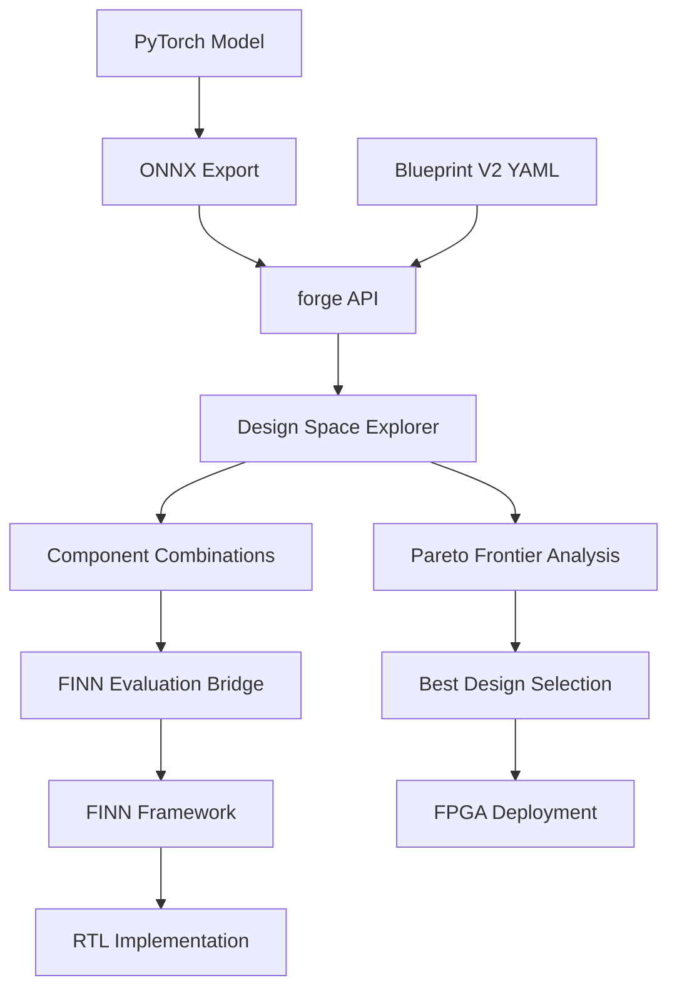
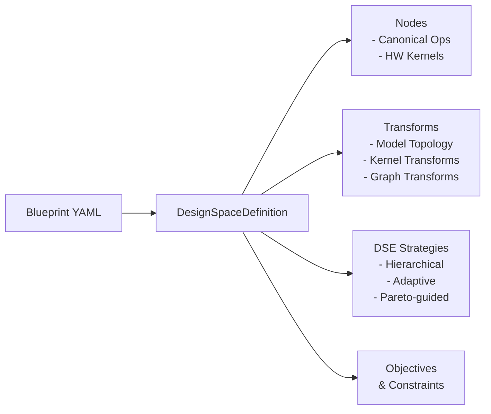
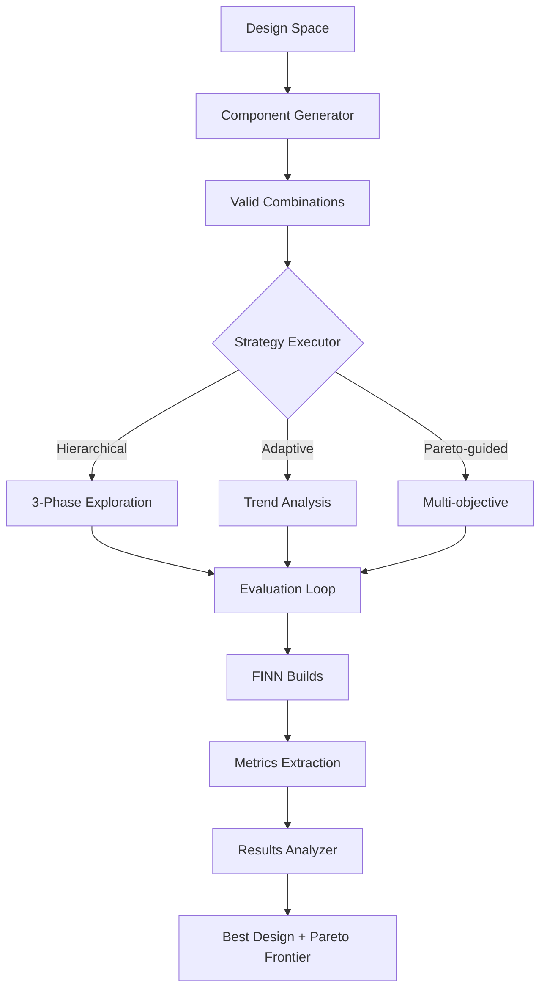
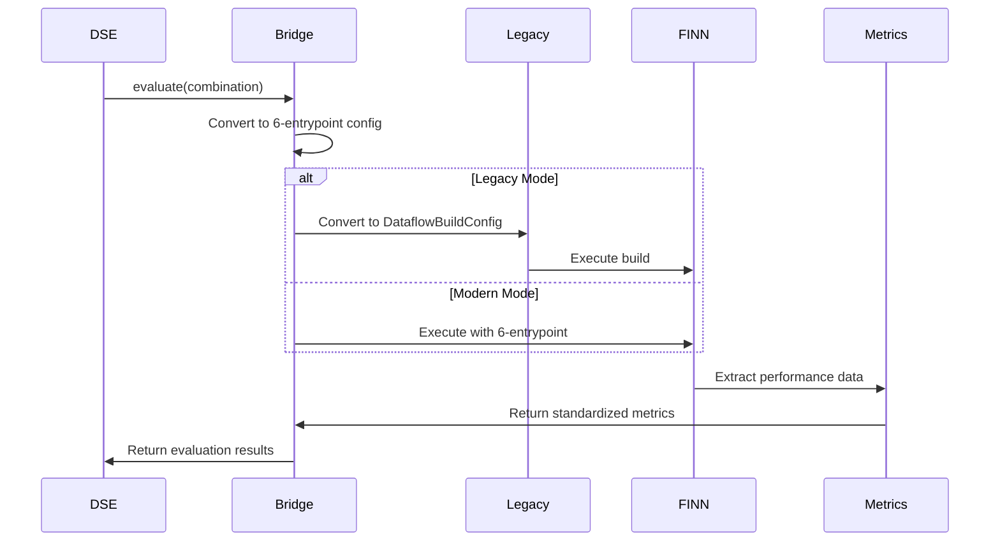
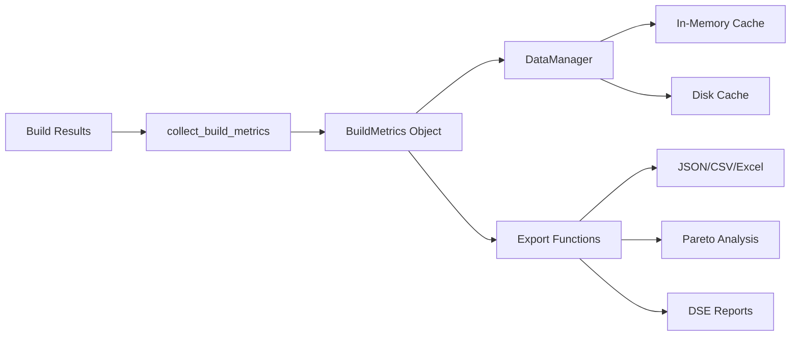
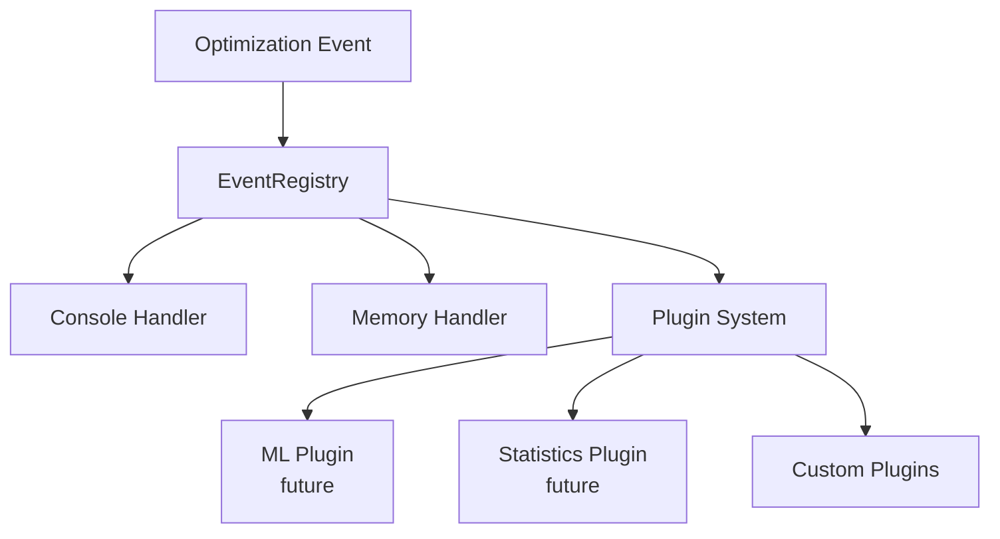

# BrainSmith Core Design Document

## Overview

BrainSmith Core is the heart of an open-source platform for FPGA AI accelerators, developed collaboratively by Microsoft and AMD. It converts PyTorch models to RTL implementations for FPGA deployment using a sophisticated Design Space Exploration (DSE) framework.

## Architecture Philosophy

The Core follows a "Functions Over Frameworks" philosophy:
- **North Star Promise**: `result = brainsmith.core.forge('model.onnx', 'blueprint.yaml')`
- **Essential Functions**: forge + 12 helpers + 3 classes for complete FPGA workflow
- **Simplicity First**: Remove academic bloat, keep practical features

## High-Level Architecture



## Core Components

### 1. API Layer (`api.py`)

The main entry point providing the `forge()` function:

```python
def forge(
    model_path: str,
    blueprint_path: str,
    objectives: Optional[Dict[str, Any]] = None,
    constraints: Optional[Dict[str, Any]] = None,
    target_device: Optional[str] = None,
    output_dir: Optional[str] = None,
    dse_config: Optional[Dict[str, Any]] = None
) -> Dict[str, Any]
```

**Process Flow**:
1. Load and validate Blueprint V2 configuration
2. Apply runtime overrides (objectives, constraints, device)
3. Create DSE configuration
4. Execute design space exploration with FINN
5. Return best design, Pareto frontier, and build artifacts

### 2. Blueprint Configuration System



**Key Features**:
- **Inheritance**: Blueprints can inherit from base configurations
- **Exploration Rules**: Define required, optional, mutually exclusive components
- **Multi-Strategy DSE**: Different strategies for different optimization goals
- **FINN Integration**: Direct mapping to FINN configuration

Example Blueprint:
```yaml
name: bert_ultra_small_v2
version: 2.0
base_blueprint: blueprints/transformer_base.yaml

nodes:
  canonical_ops:
    available:
      - operation: Dense
        configurations:
          activation_bits: [8, 16]
          weight_bits: [4, 8]
  hw_kernels:
    available:
      - kernel: RTL_Dense_v2
        parameters:
          simd: [4, 8, 16]
          pe: [1, 2, 4]

objectives:
  - name: throughput
    type: maximize
    weight: 0.6
  - name: resource_efficiency
    type: maximize
    weight: 0.4
```

### 3. Design Space Exploration (DSE)



**Component Combination System**:
- Represents specific configurations across 6 FINN entrypoints
- Validates combinations against exploration rules
- Generates unique IDs for caching

**Exploration Strategies**:

1. **Hierarchical** (Default for large spaces):
   - Phase 1: Kernel selection
   - Phase 2: Transform selection
   - Phase 3: Fine-tuning parameters

2. **Adaptive** (Balances exploration/exploitation):
   - Analyzes performance trends
   - Adjusts sampling based on promising regions
   - Uses Gaussian Process regression for prediction

3. **Pareto-guided** (Multi-objective optimization):
   - Focuses on Pareto frontier expansion
   - Balances multiple objectives (throughput, resources, power)

### 4. FINN Integration Bridge



**Key Components**:
- **FINNEvaluationBridge**: Main interface for DSE
- **LegacyConversionLayer**: Handles FINN DataflowBuildConfig
- **MetricsExtractor**: Standardizes metrics from FINN results
- **ConfigBuilder**: Translates blueprint to FINN parameters

### 5. Data Management System



**Data Types**:
- **PerformanceData**: Throughput, latency, frequency
- **ResourceData**: LUT, DSP, BRAM utilization
- **QualityData**: Accuracy, precision, numerical stability
- **BuildData**: Success/failure, timing, warnings

**Key Functions**:
- `collect_build_metrics()`: Extract metrics from any build result
- `export_dse_analysis()`: Complete DSE analysis package
- `compare_results()`: Compare two designs
- `filter_data()`: Filter by performance/resource criteria

### 6. Hooks and Extensibility



**Event Types**:
- DSE start/complete/failed
- Build evaluation results
- Pareto frontier updates
- Best design improvements

**Plugin System**:
- Simple `HooksPlugin` protocol
- Auto-discovery via registry
- Extensible without core modifications

## Practical Usage Examples

### Basic FPGA Accelerator Generation
```python
import brainsmith.core

# Simple usage - let blueprint control everything
result = brainsmith.core.forge(
    'bert_model.onnx',
    'blueprints/bert_ultra_small_v2.yaml'
)

print(f"Best design throughput: {result['best_design']['metrics']['throughput']} ops/sec")
print(f"Resource utilization: {result['best_design']['metrics']['lut_utilization']}% LUTs")
```

### Advanced DSE with Custom Objectives
```python
# Override blueprint objectives for specific optimization
result = brainsmith.core.forge(
    'model.onnx',
    'blueprint.yaml',
    objectives={
        'throughput': {'weight': 0.8, 'type': 'maximize'},
        'power': {'weight': 0.2, 'type': 'minimize'}
    },
    constraints={
        'max_lut_utilization': 80,
        'target_frequency_mhz': 250
    },
    target_device='xcvu9p',
    dse_config={
        'max_evaluations': 100,
        'parallel_evaluations': 4,
        'strategy': 'adaptive'
    }
)

# Export comprehensive analysis
brainsmith.core.export_results(
    result['raw_data']['performance_data'],
    './analysis',
    formats=['excel', 'json']
)
```

### Batch Processing Multiple Models
```python
# Process multiple models with parameter sweep
results = brainsmith.core.parameter_sweep(
    models=['bert_tiny.onnx', 'bert_small.onnx'],
    blueprint='blueprint.yaml',
    param_ranges={
        'simd': [4, 8, 16],
        'pe': [1, 2, 4]
    }
)

# Find best configuration across all models
best = brainsmith.core.find_best(
    results,
    metric='efficiency_score',
    constraints={'max_power': 10.0}
)
```

## Performance Characteristics

- **DSE Speed**: ~50-100 evaluations typical for good results
- **Caching**: 10-100x speedup for repeated evaluations
- **Parallel Evaluation**: Linear scaling up to 4-8 parallel builds
- **Memory Usage**: ~1GB for typical DSE run with 100 evaluations

## Future Extensibility

The architecture supports future enhancements without core modifications:

1. **New Exploration Strategies**: Implement `ExplorationStrategy` protocol
2. **Custom Metrics**: Add to `MetricsExtractor`
3. **Analysis Plugins**: Implement `HooksPlugin` for ML/statistics
4. **New Hardware Targets**: Update FINN integration bridge

## Summary

BrainSmith Core provides a clean, function-focused API for FPGA AI accelerator development. The architecture balances simplicity with power, enabling both quick prototyping and sophisticated optimization workflows. The Blueprint V2 system offers declarative configuration, while the DSE framework automates the complex process of finding optimal hardware implementations.