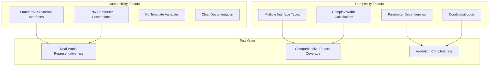
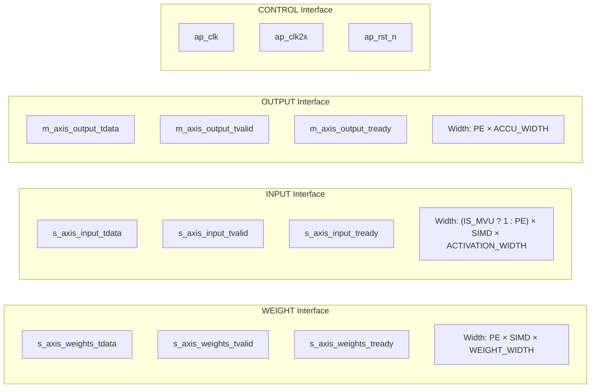
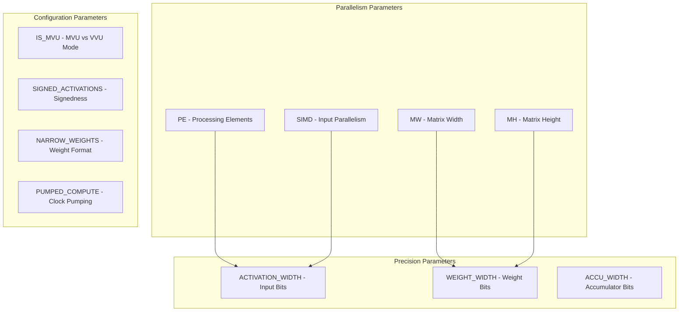
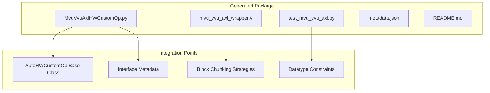
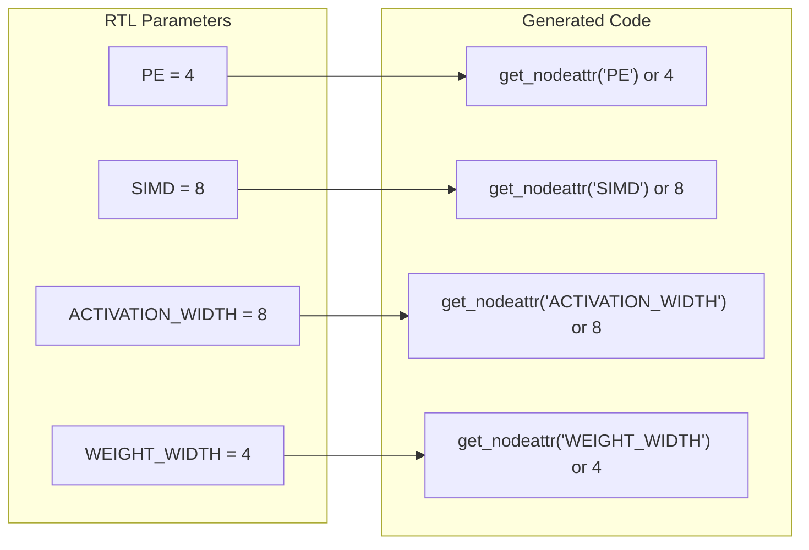
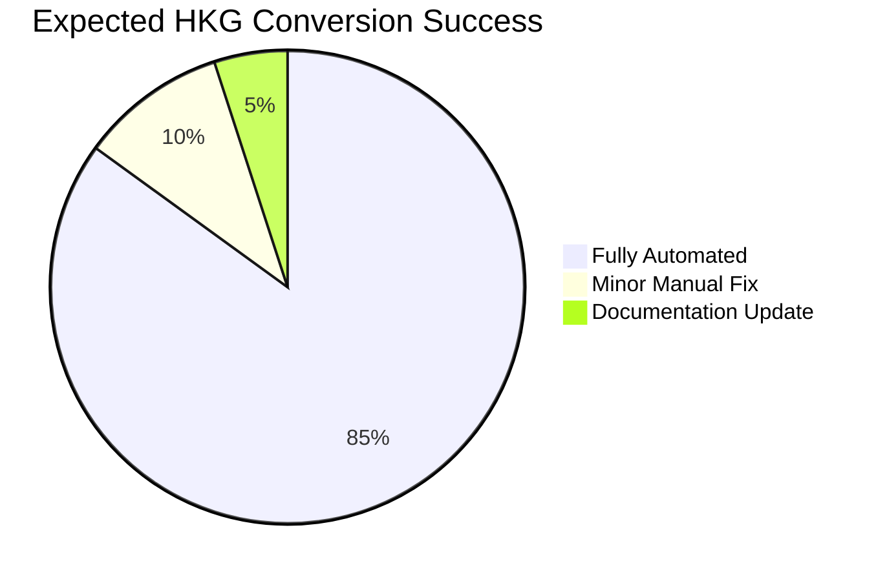

# MVU VVU AXI Conversion Analysis

## Recommended Test Case: `mvu_vvu_axi.sv`

### Why This is the Ideal HKG Test Case



## Interface Analysis

### 1. **Three Distinct Interface Types**



**HKG Translation:**
- `s_axis_weights_*` → `InterfaceType.WEIGHT`
- `s_axis_input_*` → `InterfaceType.INPUT`  
- `m_axis_output_*` → `InterfaceType.OUTPUT`
- `ap_clk`, `ap_rst_n` → `InterfaceType.CONTROL`

### 2. **Complex Width Calculations**

```systemverilog
// Tests HKG's expression evaluation capabilities
localparam int unsigned WEIGHT_STREAM_WIDTH    = PE * SIMD * WEIGHT_WIDTH;
localparam int unsigned WEIGHT_STREAM_WIDTH_BA = (WEIGHT_STREAM_WIDTH + 7)/8 * 8;
localparam int unsigned INPUT_STREAM_WIDTH     = (IS_MVU ? 1 : PE) * SIMD * ACTIVATION_WIDTH;
localparam int unsigned OUTPUT_STREAM_WIDTH    = PE*ACCU_WIDTH;
```

**HKG Challenge:** Must handle complex arithmetic expressions and conditional width calculations.

## Parameter Analysis

### Core Parameters for Dataflow Modeling



### Expected HKG-Generated Nodeattrs

```python
def get_nodeattr_types(self):
    my_attrs = super().get_nodeattr_types()
    my_attrs.update({
        # Core parallelism - maps to legacy FINN
        "PE": ("i", True, 0),
        "SIMD": ("i", True, 0),
        
        # Matrix dimensions
        "MW": ("i", True, 0),  # Matrix width
        "MH": ("i", True, 0),  # Matrix height
        
        # Precision control
        "ACTIVATION_WIDTH": ("i", False, 8),
        "WEIGHT_WIDTH": ("i", False, 8), 
        "ACCU_WIDTH": ("i", False, 32),
        
        # Configuration flags
        "IS_MVU": ("i", False, 1, {0, 1}),
        "SIGNED_ACTIVATIONS": ("i", False, 0, {0, 1}),
        "NARROW_WEIGHTS": ("i", False, 0, {0, 1}),
        
        # Datatypes (interface-specific)
        "s_axis_weights_dtype": ("s", True, ""),
        "s_axis_input_dtype": ("s", True, ""),
        "m_axis_output_dtype": ("s", True, ""),
        
        # Memory configuration (since it has weights)
        "ram_style": ("s", False, "auto", {"auto", "block", "distributed", "ultra"})
    })
    return my_attrs
```

## Expected HKG Output Structure

### Generated Files



### Core Generated Methods

```python
class MvuVvuAxiHWCustomOp(AutoHWCustomOp):
    def get_interface_metadata(self):
        return [
            InterfaceMetadata(
                name="s_axis_weights",
                interface_type=InterfaceType.WEIGHT,
                datatype_constraints=[
                    DatatypeConstraintGroup("INT", 1, 8),
                    DatatypeConstraintGroup("UINT", 1, 8)
                ],
                chunking_strategy=BlockChunkingStrategy(
                    block_shape=["PE", "SIMD"], rindex=2
                )
            ),
            InterfaceMetadata(
                name="s_axis_input", 
                interface_type=InterfaceType.INPUT,
                datatype_constraints=[
                    DatatypeConstraintGroup("INT", 1, 9),
                    DatatypeConstraintGroup("UINT", 1, 8)
                ],
                chunking_strategy=BlockChunkingStrategy(
                    block_shape=[":", "SIMD"], rindex=1
                )
            ),
            InterfaceMetadata(
                name="m_axis_output",
                interface_type=InterfaceType.OUTPUT,
                datatype_constraints=[
                    DatatypeConstraintGroup("INT", 16, 64)
                ],
                chunking_strategy=BlockChunkingStrategy(
                    block_shape=[":", "PE"], rindex=1
                )
            )
        ]
```

## Test Validation Criteria

### 1. **Parameter Extraction Accuracy**



### 2. **Interface Recognition Success**

```bash
✅ Weight interface: s_axis_weights_* → WEIGHT type
✅ Input interface: s_axis_input_* → INPUT type  
✅ Output interface: m_axis_output_* → OUTPUT type
✅ Control signals: ap_clk, ap_rst_n → CONTROL type
```

### 3. **Width Calculation Handling**

```systemverilog
// Should be correctly parsed as localparam expressions
WEIGHT_STREAM_WIDTH_BA = (WEIGHT_STREAM_WIDTH + 7)/8 * 8
INPUT_STREAM_WIDTH_BA = (INPUT_STREAM_WIDTH + 7)/8 * 8  
OUTPUT_STREAM_WIDTH_BA = (OUTPUT_STREAM_WIDTH + 7)/8 * 8
```

### 4. **Legacy Compatibility**

```python
def get_legacy_attr(self):
    return {
        "SIMD": 8,  # From s_axis_input parallelism
        "PE": 4,    # From s_axis_weights/m_axis_output parallelism
        "inputDataType": "INT8",   # From s_axis_input dtype
        "weightDataType": "INT4",  # From s_axis_weights dtype
        "outputDataType": "INT32"  # From m_axis_output dtype
    }
```

## Expected Challenges and Solutions

### Challenge 1: Complex Width Expressions
**Issue**: `(IS_MVU ? 1 : PE) * SIMD * ACTIVATION_WIDTH`
**Solution**: HKG must evaluate conditional expressions during parsing

### Challenge 2: Parameter Dependencies
**Issue**: Stream widths depend on multiple parameters
**Solution**: HKG must track parameter relationships

### Challenge 3: Multiple Clock Domains
**Issue**: `ap_clk` and `ap_clk2x` both present
**Solution**: HKG should group all control signals correctly

## Success Metrics



**Target Outcomes:**
- ✅ All interfaces correctly identified and classified
- ✅ All parameters extracted with proper defaults
- ✅ Generated code compiles without errors
- ✅ Legacy compatibility maintained
- ✅ Integration with dataflow modeling system works

## Next Steps

1. **Run HKG on mvu_vvu_axi.sv**
2. **Validate generated interface metadata**
3. **Test parameter extraction accuracy**  
4. **Verify legacy compatibility layer**
5. **Compare performance with hand-written equivalent**

This conversion will serve as the gold standard for validating HKG's capability to handle real-world FINN RTL modules.