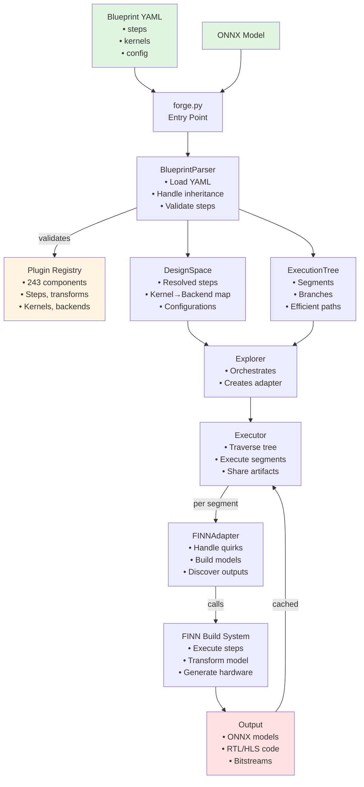
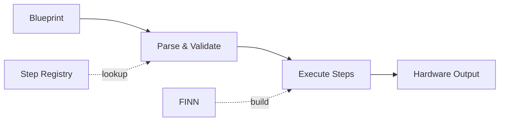

# BrainSmith Core Workflow Diagram

## Visual Flow Representation



## Component Interactions

### 1. Plugin Registry Usage
```
Blueprint Step Name → Registry Lookup → Step Function → Execution
         "cleanup" → has_step() ✓    → cleanup_step() → FINN
```

### 2. Tree Segmentation Example
```
Root
├─[cleanup, streamline]          # Segment 1 (shared prefix)
│  ├─[quantize_int8] → end       # Branch 1
│  └─[quantize_int4] → end       # Branch 2
└─[optimize_aggressive] → end     # Segment 2
```

### 3. Artifact Sharing
```
Parent Segment Output → Copy to Children → Continue Execution
    segment_1/output → segment_1/branch_1/
                     → segment_1/branch_2/
```

## Data Flow Summary

| Phase | Input | Process | Output | Used? |
|-------|-------|---------|--------|-------|
| Parse | YAML | Inheritance, validation | DesignSpace + Tree | ✅ |
| Build | DesignSpace | Create segments | ExecutionTree | ✅ |
| Execute | Tree + Model | FINN builds | Hardware models | ✅ |
| Registry | Plugin names | Lookup/validate | Classes/functions | Partial |

## Key Insights from Workflow

### ✅ What Works Well
1. **Clean API**: Simple forge() entry point
2. **Efficient Execution**: Segment-based prefix sharing
3. **Isolated Integration**: FINN quirks contained
4. **Flexible Structure**: Supports complex branching

### ⚠️ What's Overengineered  
1. **Plugin System**: 243 registered, <20 used
2. **Metadata**: Complex queries never used
3. **Namespacing**: Framework prefixes unused
4. **Statistics**: Calculated but not leveraged

### ❌ What's Missing
1. **Default Pipelines**: Must specify every step
2. **Progress Tracking**: Only print statements
3. **Kernel Inference**: Special case with no implementation
4. **Result Analysis**: No performance metrics

## Simplified Ideal Workflow



The current workflow is functionally complete but could be 50% simpler by removing unused features and focusing on the actual usage patterns.