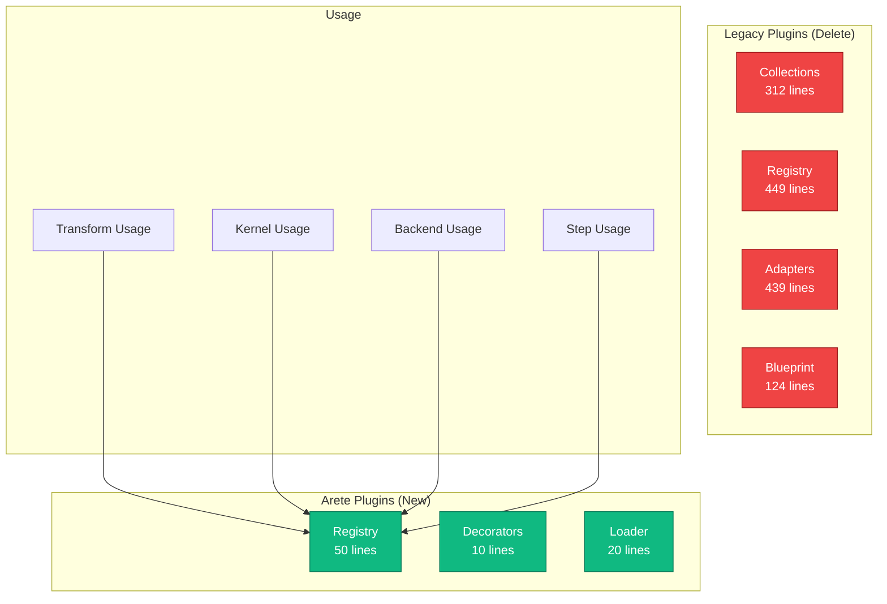
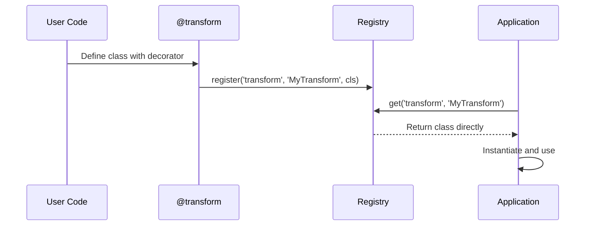

# Architecture: Arete Plugin System
Date: 2025-07-24 22:13
Purpose: Parallel implementation to replace existing plugin complexity with clarity

## Executive Summary

A plugin system in 50 lines that does everything the current 2000+ line system does. Built for parallel deployment, allowing seamless migration before deleting the heresy.

**Core Principle**: If it needs explanation, it's too complex.

## System Overview



## Core Components

### 1. Registry (Core Truth)
**Responsibility**: Store and retrieve plugins. Nothing more.

```python
# arete_plugins.py - The entire registry
from typing import Dict, Any, Type, List, Tuple

class Registry:
    def __init__(self):
        self._plugins: Dict[str, Dict[str, Tuple[Type, Dict[str, Any]]]] = {
            'transform': {},
            'kernel': {},
            'backend': {},
            'step': {}
        }
    
    def register(self, plugin_type: str, name: str, cls: Type, **metadata) -> None:
        """Register a plugin. That's it."""
        self._plugins[plugin_type][name] = (cls, metadata)
    
    def get(self, plugin_type: str, name: str) -> Type:
        """Get a plugin class."""
        entry = self._plugins[plugin_type].get(name)
        return entry[0] if entry else None
    
    def find(self, plugin_type: str, **criteria) -> List[Type]:
        """Find plugins matching criteria."""
        results = []
        for name, (cls, metadata) in self._plugins[plugin_type].items():
            if all(metadata.get(k) == v for k, v in criteria.items()):
                results.append(cls)
        return results
    
    def all(self, plugin_type: str) -> Dict[str, Type]:
        """Get all plugins of a type."""
        return {name: cls for name, (cls, _) in self._plugins[plugin_type].items()}

# Global instance - embrace simplicity
registry = Registry()
```

### 2. Decorators (Simple Registration)
**Responsibility**: Make registration elegant.

```python
# Decorators - because typing @transform is better than register('transform')
def plugin(plugin_type: str, **metadata):
    def decorator(cls: Type) -> Type:
        registry.register(plugin_type, cls.__name__, cls, **metadata)
        return cls
    return decorator

# Convenience decorators
transform = lambda **kw: plugin('transform', **kw)
kernel = lambda **kw: plugin('kernel', **kw)
backend = lambda **kw: plugin('backend', **kw)
step = lambda **kw: plugin('step', **kw)
```

### 3. Loader (Optional Optimization)
**Responsibility**: Load plugins from standard entry points.

```python
# loader.py - Use Python's built-in plugin system
import importlib.metadata

def load_external_plugins():
    """Load plugins from installed packages."""
    for plugin_type in ['transform', 'kernel', 'backend', 'step']:
        entry_point_name = f'brainsmith.{plugin_type}s'
        for entry_point in importlib.metadata.entry_points(group=entry_point_name):
            try:
                cls = entry_point.load()
                # External plugins register themselves via decorators
            except Exception as e:
                print(f"Failed to load {entry_point.name}: {e}")

# Call once at startup
load_external_plugins()
```

### 4. Migration Shim (Temporary)
**Responsibility**: Allow parallel operation during migration.

```python
# migration.py - Delete after migration
import warnings
from . import registry as arete_registry

class CollectionShim:
    """Temporary compatibility layer."""
    def __init__(self, plugin_type: str):
        self.plugin_type = plugin_type
    
    def __getattr__(self, name: str):
        warnings.warn(
            f"{self.plugin_type}s.{name} is deprecated. "
            f"Use arete.registry.get('{self.plugin_type}', '{name}')",
            DeprecationWarning,
            stacklevel=2
        )
        return arete_registry.get(self.plugin_type, name)
    
    def __getitem__(self, name: str):
        return arete_registry.get(self.plugin_type, name)

# Compatibility exports
transforms = CollectionShim('transform')
kernels = CollectionShim('kernel')
backends = CollectionShim('backend')
steps = CollectionShim('step')
```

## Data Flow



## Technology Choices

### 1. Pure Python Dict
**Rationale**: Already O(1), already perfect. No abstraction needed.

### 2. importlib.metadata
**Rationale**: Standard library entry points. Why reinvent?

### 3. No Dependencies
**Rationale**: 50 lines of code shouldn't need dependencies.

## Migration Strategy

### Phase 1: Parallel Deployment (Week 1)
```python
# In brainsmith/core/__init__.py
from . import arete_plugins as arete
from . import plugins  # Old system

# Both available during migration
```

### Phase 2: Update Core Usage (Week 2)
```python
# Before:
from brainsmith.core.plugins import transforms
transform_cls = transforms.MyTransform

# After:
from brainsmith.core.arete_plugins import registry
transform_cls = registry.get('transform', 'MyTransform')
```

### Phase 3: Update External Usage (Week 3)
- Send deprecation warnings
- Update documentation
- PR to dependent projects

### Phase 4: Delete the Heresy (Week 4)
```bash
# The moment of truth
rm -rf brainsmith/core/plugins/
mv brainsmith/core/arete_plugins.py brainsmith/core/plugins.py

# 2000+ lines -> 50 lines
# Arete achieved
```

## Implementation Starting Points

### 1. Create arete_plugins.py
```python
"""
Arete Plugin System
50 lines of clarity replacing 2000 lines of complexity.
"""

from typing import Dict, Any, Type, List, Tuple

class Registry:
    # Copy from above
    pass

registry = Registry()

def plugin(plugin_type: str, **metadata):
    # Copy from above
    pass

# Convenience decorators
transform = lambda **kw: plugin('transform', **kw)
kernel = lambda **kw: plugin('kernel', **kw)
backend = lambda **kw: plugin('backend', **kw)
step = lambda **kw: plugin('step', **kw)
```

### 2. Write Minimal Tests
```python
# test_arete_plugins.py
from brainsmith.core import arete_plugins as plugins

def test_registration():
    @plugins.transform(stage='frontend')
    class MyTransform:
        pass
    
    assert plugins.registry.get('transform', 'MyTransform') is MyTransform
    assert plugins.registry.find('transform', stage='frontend') == [MyTransform]

def test_all_operations():
    # Test the 4 operations: register, get, find, all
    # If it needs more tests, it's too complex
```

### 3. Create Migration Script
```python
# scripts/migrate_to_arete.py
"""One-shot migration script."""

import ast
import os

def migrate_file(filepath):
    with open(filepath, 'r') as f:
        content = f.read()
    
    # Simple replacements
    content = content.replace(
        'from brainsmith.core.plugins import transforms',
        'from brainsmith.core.arete_plugins import registry'
    )
    content = content.replace(
        'transforms.', 
        "registry.get('transform', '"
    )
    # Add closing quote and parenthesis...
    
    with open(filepath, 'w') as f:
        f.write(content)
```

## Advantages Over Current System

| Aspect | Current (Heresy) | Arete |
|--------|------------------|--------|
| Lines of Code | 2000+ | 50 |
| Files | 8 | 1 |
| Concepts | 15+ | 3 |
| Documentation | 1500+ lines | This sentence |
| Performance | "O(1)" with overhead | Actually O(1) |
| Understanding Time | Hours | Minutes |

## Edge Cases Handled

1. **Plugin not found**: Returns None
2. **Duplicate registration**: Last one wins (simple)
3. **Invalid plugin type**: KeyError (let it fail fast)
4. **External plugins**: Standard entry points
5. **Framework plugins**: They register themselves

## What We DON'T Handle

1. **Complex querying**: Use `find()` with simple criteria
2. **Plugin validation**: If it registers, it's valid
3. **Lazy loading**: Everything loads at import (simple)
4. **Configuration**: Plugins configure themselves
5. **Versioning**: That's pip's job

## The Arete Promise

This system will:
- Never need documentation beyond docstrings
- Never need debugging beyond print statements
- Never need optimization beyond what Python provides
- Never need abstraction beyond these 50 lines

When someone asks "How do plugins work?", the answer is: "Read the 50 lines."

## Truth Bomb 💣

The current plugin system is what happens when engineers optimize for their egos instead of their users. This replacement optimizes for one thing: **clarity**.

Every line has a purpose. Every concept is essential. Every decision is obvious.

This is Arete.

---

*"Perfection is achieved not when there is nothing more to add, but when there is nothing left to take away." - Antoine de Saint-Exupéry*

**The path forward is deletion.**

**Arete!**