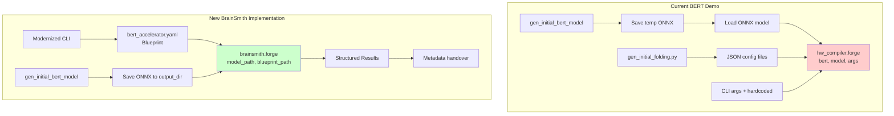
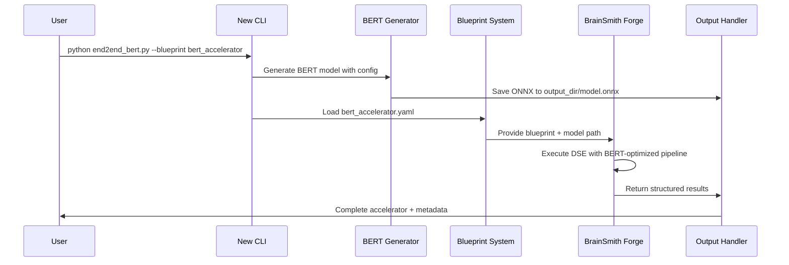

# 🎯 BERT Demo Conversion Plan: Legacy to Modern BrainSmith

**Objective**: Convert the BERT demo from the old `brainsmith.core.hw_compiler.forge` to the new streamlined `brainsmith.forge` API, focusing on fully utilizing the new toolchain as a stress test.

---

## 📊 Current State Analysis

### Old Implementation Issues
- Uses deprecated `brainsmith.core.hw_compiler.forge('bert', model, args)`
- Complex argument passing with hardcoded values scattered throughout
- Manual JSON folding configuration files
- Environment variable dependencies (`BSMITH_BUILD_DIR`)
- No clear separation between model generation and compilation

### New Implementation Benefits
- Clean `brainsmith.forge(model_path, blueprint_path)` API
- YAML blueprint system with structured parameters
- Built-in design space exploration capabilities
- Simplified output handling
- Registry-driven component system

---

## 🗺️ Conversion Architecture



---

## 📋 Detailed Implementation Plan

### **Phase 1: Blueprint Creation**

#### 1. Create `bert_accelerator.yaml` Blueprint
- Convert JSON folding parameters to YAML structure
- Add BERT-specific model characteristics
- Include performance targets and constraints
- Map CLI arguments to blueprint parameters

#### 2. Blueprint Structure Design
```yaml
name: "bert_accelerator"
description: "BERT transformer accelerator with attention mechanisms"
category: "transformers"
version: "1.0"

model_type: "bert"
target_platform: "zynq_ultrascale"
optimization_level: "advanced"

parameters:
  bert_config:
    description: "BERT model architecture parameters"
    hidden_size:
      range: [256, 384, 512, 768]
      default: 384
      description: "Hidden layer dimension"
    num_layers:
      range: [1, 3, 6, 12]
      default: 3
      description: "Number of transformer layers"
    num_attention_heads:
      range: [8, 12, 16]
      default: 12
      description: "Number of attention heads"
    intermediate_size:
      range: [512, 1536, 3072]
      default: 1536
      description: "Feed-forward intermediate size"
    sequence_length:
      range: [64, 128, 256, 512]
      default: 128
      description: "Maximum sequence length"
  
  folding_factors:
    description: "FINN folding configuration for BERT layers"
    mvau_pe:
      range: [4, 8, 16, 32]
      default: 8
      description: "Processing elements for MVAU layers"
    mvau_simd:
      range: [12, 24, 48]
      default: 12
      description: "SIMD width for MVAU layers"
    attention_pe:
      range: [8, 16, 32]
      default: 16
      description: "PE for attention mechanisms"
    other_pe:
      range: [1, 2, 4]
      default: 1
      description: "PE for auxiliary operations"
  
  quantization:
    description: "Quantization settings"
    weight_width:
      range: [4, 8]
      default: 8
      description: "Weight quantization bit width"
    activation_width:
      range: [4, 8]
      default: 8
      description: "Activation quantization bit width"
  
  optimization:
    description: "Performance optimization targets"
    target_fps:
      range: [1000, 3000, 5000]
      default: 3000
      description: "Target frames per second"
    clock_period_ns:
      range: [3.33, 5.0, 10.0]
      default: 5.0
      description: "Target clock period"

# Fixed configuration
fpga_part: "xczu7ev-ffvc1156-2-e"
board: "V80"
enable_zynq_ps: true
verification_steps: ["cppsim", "rtlsim"]

# Expected model characteristics
expected_model:
  input_shape: [1, sequence_length]
  architecture: "bert_base"
  layers:
    - type: "embedding"
      name: "embeddings"
    - type: "transformer_block"
      name: "encoder_layers"
      count: num_layers
    - type: "pooler"
      name: "pooler"

# Performance targets
targets:
  throughput_fps: target_fps
  power_budget_w: 15.0
  accuracy_drop_max: 0.05
  latency_ms_max: 20.0

# Optimization constraints
constraints:
  min_throughput_fps: 500
  max_power_w: 25.0
  max_latency_ms: 50.0
  resource_utilization_max:
    lut: 0.8
    dsp: 0.7
    bram: 0.6
```

### **Phase 2: Core API Conversion**

#### 1. Replace hw_compiler.forge() Call
```python
# OLD:
from brainsmith.core.hw_compiler import forge
forge('bert', model, args)

# NEW:
import brainsmith
result = brainsmith.forge(
    model_path=model_path,
    blueprint_path=blueprint_path,
    objectives={'throughput': {'direction': 'maximize', 'target': args.fps}},
    constraints={'target_frequency': 1000/args.clk},
    target_device=args.board,
    output_dir=output_dir
)
```

#### 2. Argument Restructuring
```python
def main(args):
    # Generate BERT model
    model_path = generate_bert_model(args)
    
    # Setup blueprint path
    blueprint_path = get_blueprint_path('bert_accelerator')
    
    # Configure objectives and constraints
    objectives = {
        'throughput': {
            'direction': 'maximize',
            'target': args.fps,
            'weight': 1.0
        }
    }
    
    constraints = {
        'target_frequency': 1000 / args.clk,  # Convert ns to MHz
        'max_power': 25.0,
        'max_latency_ms': 50.0
    }
    
    # Execute forge with new API
    result = brainsmith.forge(
        model_path=model_path,
        blueprint_path=blueprint_path,
        objectives=objectives,
        constraints=constraints,
        target_device=args.board,
        output_dir=args.output_dir
    )
    
    # Handle results
    handle_forge_results(result, args)
```

### **Phase 3: Model Generation Modernization**

#### 1. Streamline BERT Model Generation
```python
def generate_bert_model(args, output_dir: str) -> str:
    """Generate BERT model directly to output directory"""
    model_path = os.path.join(output_dir, "bert_model.onnx")
    
    # Generate model with configuration
    gen_initial_bert_model(
        outfile=model_path,
        hidden_size=args.hidden_size,
        num_hidden_layers=args.num_hidden_layers,
        num_attention_heads=args.num_attention_heads,
        intermediate_size=args.intermediate_size,
        bitwidth=args.bitwidth,
        seqlen=args.seqlen
    )
    
    return model_path
```

#### 2. Remove JSON Config Dependencies
- Eliminate `gen_initial_folding.py` script
- Move folding logic into blueprint parameters
- Enable dynamic parameter generation through DSE

### **Phase 4: Output Handling Modernization**

#### 1. Replace Environment Variables
```python
def handle_forge_results(result: Dict[str, Any], args) -> None:
    """Handle forge results with structured output"""
    
    # Access structured results
    if result.get('dataflow_core'):
        dataflow_core = result['dataflow_core']
        
        # Extract metadata
        metadata = {
            'num_layers': args.num_hidden_layers,
            'hidden_size': args.hidden_size,
            'sequence_length': args.seqlen,
            'target_fps': args.fps,
            'build_status': 'success'
        }
        
        # Save metadata to output
        if 'output_dir' in result:
            metadata_path = os.path.join(result['output_dir'], 'bert_metadata.json')
            with open(metadata_path, 'w') as f:
                json.dump(metadata, f, indent=4)
    
    # Log performance metrics
    if result.get('metrics'):
        metrics = result['metrics']
        print(f"Performance: {metrics.get('performance', {})}")
        print(f"Resources: {metrics.get('resources', {})}")
```

### **Phase 5: CLI Interface Modernization**

#### 1. New CLI Structure
```python
def create_argument_parser():
    parser = argparse.ArgumentParser(description='Modern BERT BrainSmith Demo')
    
    # Essential BERT model parameters
    parser.add_argument('--blueprint', default='bert_accelerator',
                       help='Blueprint name for BERT accelerator')
    parser.add_argument('--output-dir', required=True,
                       help='Output directory for results')
    
    # BERT model configuration
    bert_group = parser.add_argument_group('BERT Model Configuration')
    bert_group.add_argument('--hidden-size', type=int, default=384,
                           help='BERT hidden size')
    bert_group.add_argument('--num-layers', type=int, default=3,
                           help='Number of BERT layers')
    bert_group.add_argument('--num-heads', type=int, default=12,
                           help='Number of attention heads')
    bert_group.add_argument('--intermediate-size', type=int, default=1536,
                           help='Feed-forward intermediate size')
    bert_group.add_argument('--sequence-length', type=int, default=128,
                           help='Maximum sequence length')
    
    # Optimization parameters
    opt_group = parser.add_argument_group('Optimization Configuration')
    opt_group.add_argument('--target-fps', type=int, default=3000,
                          help='Target throughput in FPS')
    opt_group.add_argument('--clock-period', type=float, default=5.0,
                          help='Target clock period in ns')
    opt_group.add_argument('--board', default='V80',
                          help='Target FPGA board')
    
    # Advanced options
    adv_group = parser.add_argument_group('Advanced Options')
    adv_group.add_argument('--enable-dse', action='store_true',
                          help='Enable design space exploration')
    adv_group.add_argument('--max-evaluations', type=int, default=50,
                          help='Maximum DSE evaluations')
    
    return parser
```

#### 2. Usage Examples
```bash
# Basic BERT accelerator generation
python end2end_bert.py --output-dir ./bert_output

# Custom BERT configuration
python end2end_bert.py \
    --output-dir ./bert_custom \
    --num-layers 6 \
    --hidden-size 512 \
    --target-fps 5000

# Advanced DSE exploration
python end2end_bert.py \
    --output-dir ./bert_dse \
    --enable-dse \
    --max-evaluations 100 \
    --board V80
```

---

## 🔧 Implementation Steps



### **Step 1: Create BERT Blueprint** (2-3 hours)
- [ ] Analyze existing JSON configs to extract parameter ranges
- [ ] Design bert_accelerator.yaml with BERT-specific optimizations
- [ ] Add to `brainsmith/libraries/blueprints/transformers/`
- [ ] Register in blueprints registry

### **Step 2: Modernize Model Generation** (2-3 hours)
- [ ] Update `gen_initial_bert_model()` function
- [ ] Remove temporary file handling
- [ ] Integrate with blueprint parameter system
- [ ] Add validation for BERT model characteristics

### **Step 3: Replace Core API Call** (3-4 hours)
- [ ] Replace `hw_compiler.forge()` with `brainsmith.forge()`
- [ ] Map old arguments to new parameter structure
- [ ] Handle objectives and constraints mapping
- [ ] Test basic functionality

### **Step 4: Modernize CLI and Output** (2-3 hours)
- [ ] Redesign command-line interface
- [ ] Remove environment variable dependencies
- [ ] Implement structured output handling
- [ ] Update metadata handover mechanism

### **Step 5: Testing and Validation** (3-4 hours)
- [ ] Test with different BERT configurations
- [ ] Validate against existing Makefile recipes
- [ ] Performance comparison with old implementation
- [ ] Documentation updates

---

## 📈 Success Criteria

### Functional Requirements
1. **API Compliance**: Fully utilizes new `brainsmith.forge()` API
2. **Blueprint Integration**: Uses YAML blueprint system for configuration
3. **Modernized Interface**: Clean CLI without legacy dependencies
4. **Structured Output**: Uses forge() output_dir parameter instead of environment variables

### Performance Requirements
1. **Functional Equivalence**: Produces equivalent results to old system
2. **DSE Capability**: Demonstrates design space exploration for BERT
3. **Performance**: At least equivalent performance to legacy implementation

### Code Quality Requirements
1. **Maintainability**: Clean, documented code following new BrainSmith patterns
2. **Extensibility**: Template for other transformer model demos
3. **Validation**: Comprehensive testing of new functionality

---

## 🎯 Expected Outcomes

### Immediate Benefits
- **Clean Architecture**: Elimination of legacy dependencies and complexity
- **Modern API Usage**: Full demonstration of new BrainSmith capabilities
- **Simplified Configuration**: YAML blueprint system replacing JSON configs
- **Better Maintainability**: Structured code following current best practices

### Long-term Benefits
- **Template for Transformers**: Reusable pattern for other transformer models
- **System Validation**: Stress test of new BrainSmith architecture
- **Documentation**: Reference implementation for complex model conversion
- **Performance Baseline**: Benchmark for future transformer accelerator work

### Technical Deliverables
1. **bert_accelerator.yaml**: Comprehensive blueprint for BERT models
2. **Modernized end2end_bert.py**: Updated demo using new API
3. **Documentation**: Conversion guide and usage examples
4. **Test Suite**: Validation tests for new implementation
5. **Performance Comparison**: Benchmarks vs legacy implementation

---

## 🚀 Next Steps

1. **Review Plan**: Validate approach and requirements
2. **Blueprint Design**: Finalize BERT blueprint structure
3. **Implementation**: Execute conversion steps
4. **Testing**: Comprehensive validation
5. **Documentation**: Update guides and examples

This conversion will serve as both a modernization of the BERT demo and a comprehensive stress test of the new BrainSmith toolchain, ensuring it can handle complex transformer architectures with sophisticated optimization requirements.