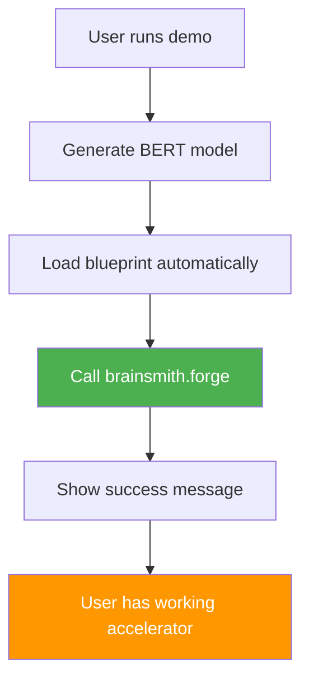

# BERT Demo Simplification Plan - Focus on forge() Showcase

## 🎯 Vision
Transform the BERT demo to showcase the **simple power of `brainsmith.forge()`** without complex DSE concepts, making it an accessible entry point for users.

## 📊 Current vs Target State

| Aspect | Current Implementation | Target Simplified |
|--------|----------------------|-------------------|
| **Core Focus** | DSE exploration with forge() | **Simple forge() showcase** |
| **CLI Complexity** | 3 argument groups, DSE options | **2 groups: Model + Basic opts** |
| **API Usage** | Complex objectives/constraints | **Minimal parameters** |
| **Documentation** | DSE-heavy architecture docs | **"Hello World" style guide** |
| **Output** | Performance metrics emphasis | **"It works!" confirmation** |

## 🛠️ Implementation Changes

### 1. **Simplify CLI Interface**

**Remove DSE-Focused Arguments:**
```python
# REMOVE these from create_argument_parser():
adv_group.add_argument('--enable-dse', action='store_true')
adv_group.add_argument('--max-evaluations', type=int, default=50)
```

**Streamline to Essential Groups:**
```python
def create_argument_parser():
    parser = argparse.ArgumentParser(description='BERT Accelerator Demo - Powered by brainsmith.forge()')
    
    # Essential parameters (keep simple)
    parser.add_argument('--output-dir', required=True, help='Output directory')
    
    # BERT model configuration (simplified)
    bert_group = parser.add_argument_group('BERT Model')
    bert_group.add_argument('--hidden-size', type=int, default=384, help='BERT hidden size')
    bert_group.add_argument('--num-layers', type=int, default=3, help='Number of layers')
    bert_group.add_argument('--sequence-length', type=int, default=128, help='Max sequence length')
    
    # Basic options (minimal)
    basic_group = parser.add_argument_group('Basic Options') 
    basic_group.add_argument('--board', default='V80', help='Target FPGA board')
    basic_group.add_argument('--show-metrics', action='store_true', help='Show performance metrics')
    
    return parser
```

### 2. **Simplify forge() Call**

**Current Complex Usage:**
```python
# Current: Complex objectives/constraints
objectives = {
    'throughput': {
        'direction': 'maximize',
        'target': args.target_fps,
        'weight': 1.0
    }
}

constraints = {
    'target_frequency': 1000 / args.clock_period,
    'max_power': 25.0,
    'max_latency_ms': 50.0
}

result = brainsmith.forge(
    model_path=model_path,
    blueprint_path=blueprint_path,
    objectives=objectives,
    constraints=constraints,
    target_device=args.board,
    output_dir=args.output_dir
)
```

**Target Simple Usage:**
```python
# Target: Minimal, clean call
print("🚀 Generating BERT accelerator with brainsmith.forge()...")

result = brainsmith.forge(
    model_path=model_path,
    blueprint_path=blueprint_path,
    target_device=args.board,
    output_dir=args.output_dir
)

print("✅ BERT accelerator generated successfully!")
```

### 3. **Simplify Result Handling**

**Focus on "Success" Rather Than Metrics:**
```python
def handle_forge_results(result: dict, args) -> None:
    """Simple success-focused result handling"""
    print("📦 Processing results...")
    
    if result.get('dataflow_core'):
        print("✅ BERT accelerator generated successfully!")
        print(f"📁 Results saved to: {args.output_dir}")
        
        # Optional: Show basic info if requested
        if args.show_metrics and result.get('metrics'):
            metrics = result['metrics']
            if 'performance' in metrics:
                perf = metrics['performance']
                print(f"⚡ Throughput: {perf.get('throughput_ops_sec', 0):.0f} ops/sec")
            if 'resources' in metrics:
                res = metrics['resources']
                print(f"🏗️  Resource usage: {res.get('lut_utilization', 0):.0%} LUTs")
    else:
        print("❌ Accelerator generation failed")
        
    print(f"\n🎉 Demo complete! Check {args.output_dir} for your BERT accelerator.")
```

### 4. **Update Documentation**

**Transform DEMO_ARCHITECTURE.md:**
- Remove DSE-focused sections
- Emphasize "How easy it is to use forge()"
- Add "Getting Started in 30 seconds" section
- Focus on blueprint + model → accelerator flow

**New Documentation Structure:**
```markdown
# 🚀 BERT Accelerator Demo - Simple and Powerful

## 30-Second Quick Start
```bash
python end2end_bert.py --output-dir ./my_bert_accelerator
```

## What This Demo Shows
- How **one function call** (`brainsmith.forge()`) creates FPGA accelerators
- How blueprints make BERT acceleration accessible
- How modern AI models become optimized hardware

## Core Demo Flow
Model Generation → Blueprint Selection → forge() → Accelerator Ready!
```

### 5. **Clean Up Legacy Files**

**Remove/Deprecate:**
- `gen_initial_folding.py` (legacy, complex)
- Complex Makefile recipes
- DSE-focused test cases

**Keep Simple:**
- `end2end_bert.py` (simplified)
- `test_modern_bert.py` (basic functionality tests)
- `README.md` (updated for simplicity)

## 🎯 Success Criteria

### **User Experience Goals:**
1. **"Wow Factor"**: User sees accelerator generated with minimal effort
2. **"It Just Works"**: No complex configuration needed
3. **"I Understand"**: Clear what happened and what they got

### **Technical Goals:**
1. **Simple CLI**: ≤ 8 total arguments, 2 groups max
2. **Clean API**: forge() call with ≤ 4 parameters
3. **Fast Demo**: Complete run in < 5 minutes
4. **Clear Output**: Obvious success/failure indication

## 📋 Implementation Checklist

### **Phase 1: Core Simplification**
- [ ] Remove DSE arguments from CLI parser
- [ ] Simplify forge() call to minimal parameters
- [ ] Update result handling to focus on success
- [ ] Test basic functionality

### **Phase 2: Documentation Update**
- [ ] Rewrite DEMO_ARCHITECTURE.md for simplicity
- [ ] Update README.md with 30-second start
- [ ] Remove DSE references from all docs
- [ ] Add clear "What you get" section

### **Phase 3: Cleanup & Polish**
- [ ] Remove/archive legacy folding generation
- [ ] Simplify Makefile to basic targets
- [ ] Update test suite for new focus
- [ ] Validate end-to-end demo flow

## 🎨 Demo Flow Visualization



## 📝 Key Messages

1. **"One function does it all"** - forge() is powerful and simple
2. **"Blueprints make it easy"** - No need to understand complex parameters
3. **"From model to accelerator"** - Complete end-to-end flow
4. **"FPGA acceleration accessible"** - No hardware expertise required

This plan transforms the demo from a DSE showcase into a **"Hello World for FPGA acceleration"** - demonstrating the power and simplicity of the modern BrainSmith approach.