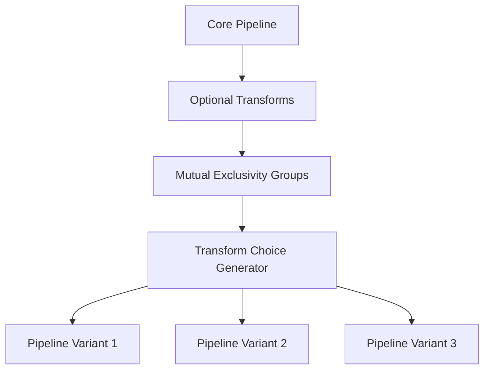

# Blueprint Kernel & Transform Selection Enhancement Plan

## 🎯 **Objective**

Design an addition to Blueprints and DesignSpace to provide robust but simple support for specifying which Kernels and Transforms should be available in the design space for DSE exploration.

## 📋 **Requirements Summary**

Based on requirements analysis:
- **Kernels**: Specify exact kernels by name, with mutual exclusivity creating different design points
- **Transforms**: Specify exact transforms with ordering, support mutual exclusivity, optional transforms (test with/without)
- **Integration**: List available options in DesignSpace for DSE exploration
- **Default**: No specification means use FINN's standard pool

## 🏗️ **Architecture Overview**


## 📝 **Detailed Implementation Plan**

### **Phase 1: Blueprint Schema Extension**

#### 1.1 Add Kernel Selection Schema
```yaml
# New blueprint section
kernels:
  # Pool of available kernels
  available:
    - "conv2d_hls"
    - "matmul_rtl" 
    - "conv2d_rtl"  # Alternative to conv2d_hls
  
  # Mutual exclusivity groups
  mutually_exclusive:
    - ["conv2d_hls", "conv2d_rtl"]  # Choose one
  
  # Optional: operation type mappings for validation
  operation_mappings:
    "Convolution": ["conv2d_hls", "conv2d_rtl"]
    "MatMul": ["matmul_rtl"]
```

#### 1.2 Add Transform Selection Schema
```yaml
# New blueprint section  
transforms:
  # Core transform pipeline (always applied)
  core_pipeline:
    - "cleanup"
    - "qonnx_to_finn" 
    - "streamlining"
    
  # Optional transforms (test with/without)
  optional:
    - "cleanup_advanced"
    - "remove_head"
    
  # Mutually exclusive transform groups
  mutually_exclusive:
    - ["infer_hardware", "constrain_folding_and_set_pumped_compute"]
    
  # Future: Hook-specific pipelines (prepared for 4-hooks)
  hooks:
    preprocessing: []
    transformation: []
    optimization: []
    generation: []
```

### **Phase 2: DesignSpace Enhancement**

#### 2.1 New Data Structures in `design_space.py`
```python
@dataclass
class KernelSelection:
    """Represents a kernel selection configuration"""
    available_kernels: List[str]
    mutually_exclusive_groups: List[List[str]]
    operation_mappings: Dict[str, List[str]]
    
@dataclass
class TransformSelection:
    """Represents a transform pipeline configuration"""
    core_pipeline: List[str]
    optional_transforms: List[str]
    mutually_exclusive_groups: List[List[str]]
    hooks: Dict[str, List[str]]  # Future 4-hooks support
```

#### 2.2 Enhanced DesignSpace Class
```python
class DesignSpace:
    def __init__(self, name: str = "default"):
        # Existing attributes
        self.name = name
        self.parameters = {}
        self.design_points = []
        self.blueprint_config = {}
        
        # New attributes
        self.kernel_selection: Optional[KernelSelection] = None
        self.transform_selection: Optional[TransformSelection] = None
        self.kernel_choices: List[str] = []  # Generated from kernel_selection
        self.transform_choices: List[List[str]] = []  # Generated pipeline variants
```

### **Phase 3: Choice Enumeration Logic**

#### 3.1 Kernel Choice Generation


**Algorithm:**
1. Start with all available kernels
2. For each mutual exclusivity group, generate all valid combinations
3. Create Cartesian product of all group combinations
4. Each result becomes a "kernel_choice" parameter in ParameterSpace

#### 3.2 Transform Choice Generation


**Algorithm:**
1. Start with core pipeline
2. Generate all combinations of optional transforms (include/exclude)
3. For each mutual exclusivity group, generate all valid choices
4. Create ordered pipeline variants
5. Each variant becomes a "transform_pipeline" parameter

#### 3.3 Choice Enumeration Implementation
```python
def _enumerate_kernel_choices(self, kernel_selection: KernelSelection) -> List[List[str]]:
    """Generate all valid kernel choice combinations."""
    available = kernel_selection.available_kernels
    exclusive_groups = kernel_selection.mutually_exclusive_groups
    
    # Start with all available kernels
    base_choice = set(available)
    
    # Handle mutual exclusivity
    choices = []
    if not exclusive_groups:
        choices = [list(base_choice)]
    else:
        # Generate combinations for each exclusivity group
        group_combinations = []
        for group in exclusive_groups:
            group_combinations.append(group)
        
        # Create Cartesian product
        import itertools
        for combination in itertools.product(*group_combinations):
            choice = base_choice.copy()
            # Remove excluded kernels
            for group in exclusive_groups:
                selected = next(k for k in combination if k in group)
                for kernel in group:
                    if kernel != selected:
                        choice.discard(kernel)
            choices.append(list(choice))
    
    return choices

def _enumerate_transform_choices(self, transform_selection: TransformSelection) -> List[List[str]]:
    """Generate all valid transform pipeline variants."""
    core = transform_selection.core_pipeline
    optional = transform_selection.optional_transforms
    exclusive_groups = transform_selection.mutually_exclusive_groups
    
    variants = []
    
    # Generate optional combinations (2^n combinations)
    import itertools
    for r in range(len(optional) + 1):
        for optional_combo in itertools.combinations(optional, r):
            # Generate exclusive group combinations
            if not exclusive_groups:
                pipeline = core + list(optional_combo)
                variants.append(pipeline)
            else:
                for exclusive_combo in itertools.product(*exclusive_groups):
                    pipeline = core + list(optional_combo) + list(exclusive_combo)
                    variants.append(pipeline)
    
    return variants
```

### **Phase 4: ParameterSpace Integration**

#### 4.1 Enhanced `to_parameter_space()` Method
```python
def to_parameter_space(self) -> Dict[str, List[Any]]:
    """Convert DesignSpace to DSE ParameterSpace format with kernel/transform options."""
    parameter_space = {}
    
    # Existing parameter processing
    for param_name, param_def in self.parameters.items():
        if param_def.type == 'categorical' and param_def.values:
            parameter_space[param_name] = param_def.values
        elif param_def.type in ['integer', 'float', 'continuous']:
            if param_def.range_min is not None and param_def.range_max is not None:
                if param_def.type == 'integer':
                    parameter_space[param_name] = list(range(
                        int(param_def.range_min),
                        int(param_def.range_max) + 1
                    ))
                else:
                    step = (param_def.range_max - param_def.range_min) / 10
                    values = []
                    current = param_def.range_min
                    while current <= param_def.range_max:
                        values.append(current)
                        current += step
                    parameter_space[param_name] = values
            else:
                parameter_space[param_name] = [param_def.default] if param_def.default is not None else [0]
        elif param_def.type == 'boolean':
            parameter_space[param_name] = [True, False]
        else:
            parameter_space[param_name] = [param_def.default] if param_def.default is not None else [None]
    
    # Add kernel choices if specified
    if self.kernel_choices:
        parameter_space['kernel_selection'] = self.kernel_choices
    
    # Add transform pipeline choices if specified  
    if self.transform_choices:
        parameter_space['transform_pipeline'] = self.transform_choices
        
    return parameter_space
```

#### 4.2 Enhanced Blueprint Processing
```python
def _extract_kernel_transform_selections(self, blueprint_data: Dict[str, Any]) -> Tuple[Optional[KernelSelection], Optional[TransformSelection]]:
    """Extract kernel and transform selections from blueprint."""
    kernel_selection = None
    transform_selection = None
    
    # Process kernels section
    if 'kernels' in blueprint_data:
        kernels_config = blueprint_data['kernels']
        kernel_selection = KernelSelection(
            available_kernels=kernels_config.get('available', []),
            mutually_exclusive_groups=kernels_config.get('mutually_exclusive', []),
            operation_mappings=kernels_config.get('operation_mappings', {})
        )
    
    # Process transforms section
    if 'transforms' in blueprint_data:
        transforms_config = blueprint_data['transforms']
        transform_selection = TransformSelection(
            core_pipeline=transforms_config.get('core_pipeline', []),
            optional_transforms=transforms_config.get('optional', []),
            mutually_exclusive_groups=transforms_config.get('mutually_exclusive', []),
            hooks=transforms_config.get('hooks', {})
        )
    
    return kernel_selection, transform_selection
```

#### 4.3 Design Point Configuration Format
```python
# Example generated design point
{
    # Traditional parameters
    'bert_config.hidden_size': 384,
    'folding_factors.mvau_pe': 8,
    
    # New kernel/transform selections
    'kernel_selection': ['conv2d_hls', 'matmul_rtl'],
    'transform_pipeline': ['cleanup', 'qonnx_to_finn', 'streamlining', 'infer_hardware']
}
```

### **Phase 5: Validation & Registry Integration**

#### 5.1 Blueprint Validation
```python
def _validate_kernel_availability(self, kernel_names: List[str]) -> List[str]:
    """Validate kernels against registry and return errors."""
    from brainsmith.libraries.kernels import list_kernels
    available = list_kernels()
    errors = []
    for kernel in kernel_names:
        if kernel not in available:
            errors.append(f"Kernel '{kernel}' not found in registry. Available: {', '.join(available)}")
    return errors

def _validate_transform_availability(self, transform_names: List[str]) -> List[str]:
    """Validate transforms against registry and return errors."""
    from brainsmith.libraries.transforms import list_transforms
    available = list_transforms()
    errors = []
    for transform in transform_names:
        if transform not in available:
            errors.append(f"Transform '{transform}' not found in registry. Available: {', '.join(available)}")
    return errors

def validate_kernel_transform_selections(self) -> Tuple[bool, List[str]]:
    """Validate kernel and transform selections against registries."""
    errors = []
    
    if self.kernel_selection:
        kernel_errors = self._validate_kernel_availability(self.kernel_selection.available_kernels)
        errors.extend(kernel_errors)
        
        # Validate mutual exclusivity groups
        for group in self.kernel_selection.mutually_exclusive_groups:
            group_errors = self._validate_kernel_availability(group)
            errors.extend(group_errors)
    
    if self.transform_selection:
        all_transforms = (
            self.transform_selection.core_pipeline +
            self.transform_selection.optional_transforms +
            [t for group in self.transform_selection.mutually_exclusive_groups for t in group]
        )
        transform_errors = self._validate_transform_availability(all_transforms)
        errors.extend(transform_errors)
    
    return len(errors) == 0, errors
```

#### 5.2 Enhanced DesignSpace Validation
```python
def validate(self) -> Tuple[bool, List[str]]:
    """Validate design space configuration including kernel/transform selections."""
    errors = []
    
    # Existing parameter validation
    if not self.parameters:
        errors.append("Design space has no parameters defined")
    
    for param_name, param_def in self.parameters.items():
        if param_def.type == 'categorical' and not param_def.values:
            errors.append(f"Categorical parameter {param_name} has no values")
        elif param_def.type in ['integer', 'float', 'continuous']:
            if param_def.range_min is not None and param_def.range_max is not None:
                if param_def.range_min >= param_def.range_max:
                    errors.append(f"Parameter {param_name} has invalid range")
    
    # New kernel/transform validation
    kt_valid, kt_errors = self.validate_kernel_transform_selections()
    errors.extend(kt_errors)
    
    return len(errors) == 0, errors
```

## 🔄 **Example Usage Flow**

### Enhanced BERT Blueprint
```yaml
name: "bert_accelerator_enhanced"
description: "BERT accelerator with kernel and transform selection"

# New sections for kernel/transform selection
kernels:
  available: 
    - "matmul_rtl"
    - "conv2d_hls"
    - "conv2d_rtl"
  mutually_exclusive:
    - ["conv2d_hls", "conv2d_rtl"]  # Choose one convolution implementation
  
transforms:
  core_pipeline: 
    - "cleanup"
    - "qonnx_to_finn"
    - "streamlining"
  optional: 
    - "remove_head"
    - "remove_tail"
  mutually_exclusive:
    - ["infer_hardware", "constrain_folding_and_set_pumped_compute"]

# Existing parameters section unchanged
parameters:
  bert_config:
    description: "BERT model architecture configuration"
    hidden_size:
      range: [256, 384, 512]
      default: 384
    num_layers:
      range: [1, 3, 6]
      default: 3
  
  folding_factors:
    description: "FINN folding parameters"
    mvau_pe:
      range: [4, 8, 16]
      default: 8
```

### Generated Parameter Space
```python
{
    # Traditional parameters
    'bert_config.hidden_size': [256, 384, 512],
    'bert_config.num_layers': [1, 3, 6],
    'folding_factors.mvau_pe': [4, 8, 16],
    
    # New kernel/transform parameters
    'kernel_selection': [
        ['matmul_rtl', 'conv2d_hls'],  # Choice 1: HLS convolution
        ['matmul_rtl', 'conv2d_rtl']   # Choice 2: RTL convolution
    ],
    'transform_pipeline': [
        # Core pipeline + optional combinations + exclusive choices
        ['cleanup', 'qonnx_to_finn', 'streamlining', 'infer_hardware'],
        ['cleanup', 'qonnx_to_finn', 'streamlining', 'constrain_folding_and_set_pumped_compute'],
        ['cleanup', 'qonnx_to_finn', 'streamlining', 'remove_head', 'infer_hardware'],
        ['cleanup', 'qonnx_to_finn', 'streamlining', 'remove_tail', 'infer_hardware'],
        ['cleanup', 'qonnx_to_finn', 'streamlining', 'remove_head', 'remove_tail', 'infer_hardware'],
        ['cleanup', 'qonnx_to_finn', 'streamlining', 'remove_head', 'constrain_folding_and_set_pumped_compute'],
        ['cleanup', 'qonnx_to_finn', 'streamlining', 'remove_tail', 'constrain_folding_and_set_pumped_compute'],
        ['cleanup', 'qonnx_to_finn', 'streamlining', 'remove_head', 'remove_tail', 'constrain_folding_and_set_pumped_compute']
    ]
}
```

### Design Point Examples
```python
# Design Point 1
{
    'bert_config.hidden_size': 384,
    'bert_config.num_layers': 3,
    'folding_factors.mvau_pe': 8,
    'kernel_selection': ['matmul_rtl', 'conv2d_hls'],
    'transform_pipeline': ['cleanup', 'qonnx_to_finn', 'streamlining', 'infer_hardware']
}

# Design Point 2 (different kernel choice)
{
    'bert_config.hidden_size': 512,
    'bert_config.num_layers': 6,
    'folding_factors.mvau_pe': 16,
    'kernel_selection': ['matmul_rtl', 'conv2d_rtl'],
    'transform_pipeline': ['cleanup', 'qonnx_to_finn', 'streamlining', 'remove_head', 'constrain_folding_and_set_pumped_compute']
}
```

## 📁 **Implementation Files**

### Files to Modify:

#### 1. `brainsmith/core/dse/design_space.py`
**Changes:**
- Add `KernelSelection` and `TransformSelection` dataclasses
- Enhance `DesignSpace` class with kernel/transform attributes
- Add choice enumeration methods (`_enumerate_kernel_choices`, `_enumerate_transform_choices`)
- Update `from_blueprint_data()` to process kernel/transform sections
- Update `to_parameter_space()` to include kernel/transform parameters
- Add validation methods for kernel/transform selections

#### 2. `brainsmith/core/dse/types.py`
**Changes:**
- Add imports for new dataclasses from design_space
- Update `__all__` exports to include kernel/transform types
- Consider adding kernel/transform-specific DSE configuration options if needed

#### 3. Blueprint YAML files
**Changes:**
- Add example `kernels` and `transforms` sections to existing blueprints
- Update `bert_accelerator.yaml`, `cnn_accelerator.yaml` with new sections
- Create comprehensive examples showing various mutual exclusivity scenarios

### Files to Create:

#### 1. `brainsmith/core/dse/kernel_transform_selection.py`
**Purpose:** Centralized logic for kernel/transform choice enumeration and validation
```python
"""
Kernel and Transform Selection Logic for Design Space Exploration

This module provides utilities for processing kernel and transform selections
from blueprints and generating all valid combinations for DSE exploration.
"""

from typing import List, Dict, Tuple, Set
import itertools
from dataclasses import dataclass

@dataclass
class KernelSelection:
    # ... (as defined above)

@dataclass 
class TransformSelection:
    # ... (as defined above)

def enumerate_kernel_combinations(kernel_selection: KernelSelection) -> List[List[str]]:
    """Generate all valid kernel combinations considering mutual exclusivity."""
    # Implementation details...

def enumerate_transform_pipelines(transform_selection: TransformSelection) -> List[List[str]]:
    """Generate all valid transform pipeline variants."""
    # Implementation details...

def validate_kernel_selection(kernel_selection: KernelSelection) -> Tuple[bool, List[str]]:
    """Validate kernel selection against registry."""
    # Implementation details...

def validate_transform_selection(transform_selection: TransformSelection) -> Tuple[bool, List[str]]:
    """Validate transform selection against registry.""" 
    # Implementation details...
```

## 🧪 **Testing Strategy**

### Unit Tests

#### 1. Choice Enumeration Tests (`test_kernel_transform_enumeration.py`)
```python
def test_kernel_choice_enumeration_no_exclusivity():
    """Test kernel enumeration with no mutual exclusivity."""
    
def test_kernel_choice_enumeration_with_exclusivity():
    """Test kernel enumeration with mutual exclusivity groups."""
    
def test_transform_pipeline_enumeration():
    """Test transform pipeline generation with optional and exclusive transforms."""
    
def test_complex_mutual_exclusivity():
    """Test complex scenarios with multiple exclusivity groups."""
```

#### 2. Validation Tests (`test_kernel_transform_validation.py`)
```python
def test_kernel_registry_validation():
    """Test validation against kernel registry."""
    
def test_transform_registry_validation():
    """Test validation against transform registry."""
    
def test_invalid_kernel_names():
    """Test handling of non-existent kernels."""
    
def test_invalid_transform_names():
    """Test handling of non-existent transforms."""
```

### Integration Tests

#### 1. DesignSpace Integration (`test_designspace_kernel_transform.py`)
```python
def test_blueprint_with_kernel_selection():
    """Test DesignSpace creation from blueprint with kernel selection."""
    
def test_blueprint_with_transform_selection():
    """Test DesignSpace creation from blueprint with transform selection."""
    
def test_parameter_space_generation():
    """Test ParameterSpace generation includes kernel/transform parameters."""
    
def test_backward_compatibility():
    """Test that blueprints without kernel/transform sections still work."""
```

#### 2. End-to-End DSE Tests (`test_dse_kernel_transform_integration.py`)
```python
def test_dse_with_kernel_choices():
    """Test DSE exploration with different kernel selections."""
    
def test_dse_with_transform_choices():
    """Test DSE exploration with different transform pipelines."""
    
def test_design_point_generation():
    """Test that generated design points include kernel/transform configurations."""
```

### Blueprint Tests

#### 1. Enhanced Blueprint Parsing (`test_enhanced_blueprint_parsing.py`)
```python
def test_parse_kernels_section():
    """Test parsing of kernels section from blueprint."""
    
def test_parse_transforms_section():
    """Test parsing of transforms section from blueprint."""
    
def test_blueprint_validation():
    """Test blueprint validation with kernel/transform sections."""
```

## 🚀 **Migration Path**

### Backward Compatibility Strategy

#### 1. **Graceful Degradation**
- Existing blueprints without `kernels`/`transforms` sections continue to work unchanged
- No `kernel_selection` or `transform_pipeline` parameters added to ParameterSpace when sections are missing
- Default behavior maintains current FINN kernel/transform selection

#### 2. **Incremental Adoption**
```python
# Phase 1: Blueprint authors can add kernels section only
kernels:
  available: ["conv2d_hls", "matmul_rtl"]

# Phase 2: Add transforms section  
transforms:
  core_pipeline: ["cleanup", "streamlining"]

# Phase 3: Add mutual exclusivity and optional transforms
kernels:
  available: ["conv2d_hls", "conv2d_rtl", "matmul_rtl"] 
  mutually_exclusive: [["conv2d_hls", "conv2d_rtl"]]
  
transforms:
  core_pipeline: ["cleanup", "streamlining"]
  optional: ["remove_head"]
  mutually_exclusive: [["infer_hardware", "constrain_folding_and_set_pumped_compute"]]
```

#### 3. **Version Detection**
```python
def _detect_blueprint_version(self, blueprint_data: Dict[str, Any]) -> str:
    """Detect blueprint version based on available sections."""
    if 'kernels' in blueprint_data or 'transforms' in blueprint_data:
        return "2.0"  # Enhanced version
    return "1.0"     # Legacy version
```

### Upgrade Path for Existing Blueprints

#### 1. **Automated Migration Tool**
```python
def migrate_blueprint_to_v2(blueprint_path: str) -> str:
    """Migrate legacy blueprint to v2 with kernel/transform sections."""
    # Add empty kernels/transforms sections with comments
    # Suggest commonly used kernels/transforms based on model type
```

#### 2. **Blueprint Template Updates**
- Update existing blueprint templates to include new sections
- Provide commented examples showing optional usage
- Add migration guides in blueprint documentation

### Future 4-Hooks Preparation

#### 1. **Hook-Specific Transform Pipelines**
```yaml
transforms:
  # Current single pipeline (backward compatible)
  core_pipeline: ["cleanup", "streamlining"]
  
  # Future 4-hooks structure (prepared but not used yet)
  hooks:
    preprocessing: ["cleanup", "qonnx_to_finn"]
    transformation: ["streamlining"] 
    optimization: ["infer_hardware"]
    generation: ["shell_metadata_handover"]
```

#### 2. **Migration Strategy for 4-Hooks**
- Current `core_pipeline` can be automatically distributed across hooks
- New `hooks` structure takes precedence when 4-hooks system is ready
- Validation ensures transforms are compatible with their assigned hooks

## 📊 **Expected Impact**

### Benefits
1. **Precise Control**: Blueprint authors can specify exact kernels/transforms for their use case
2. **DSE Coverage**: Explore different kernel/transform combinations as part of design space
3. **Validation**: Early detection of missing kernels/transforms
4. **Future-Ready**: Prepared for 4-hooks architecture transition
5. **Backward Compatible**: Existing workflows unaffected

### Complexity Trade-offs
1. **Blueprint Complexity**: Optional sections add complexity but remain simple for basic use
2. **Choice Explosion**: Mutual exclusivity and optional transforms can create many combinations
3. **Validation Overhead**: Additional validation steps during DesignSpace creation

### Performance Considerations
1. **Choice Enumeration**: Efficient algorithms needed for large mutual exclusivity groups
2. **Memory Usage**: Large numbers of transform pipeline variants may consume memory
3. **DSE Time**: More design points mean longer exploration time

## 🎯 **Success Criteria**

### Functional Requirements
- [ ] Blueprint authors can specify kernels by name
- [ ] Blueprint authors can specify transform pipelines with ordering
- [ ] Mutual exclusivity creates separate design points
- [ ] Optional transforms create include/exclude variants
- [ ] Registry validation catches missing kernels/transforms
- [ ] Backward compatibility maintained

### Quality Requirements  
- [ ] Comprehensive test coverage (>90%)
- [ ] Clear error messages for validation failures
- [ ] Performance acceptable for typical blueprint sizes
- [ ] Documentation and examples provided
- [ ] Migration path defined for existing blueprints

### Integration Requirements
- [ ] ParameterSpace includes kernel/transform parameters when specified
- [ ] DSE engines can explore kernel/transform combinations
- [ ] Design points contain kernel/transform configurations
- [ ] Future 4-hooks architecture supported

---

This comprehensive plan provides a robust foundation for kernel and transform selection in BrainSmith's design space exploration, addressing immediate needs while preparing for future architectural evolution.