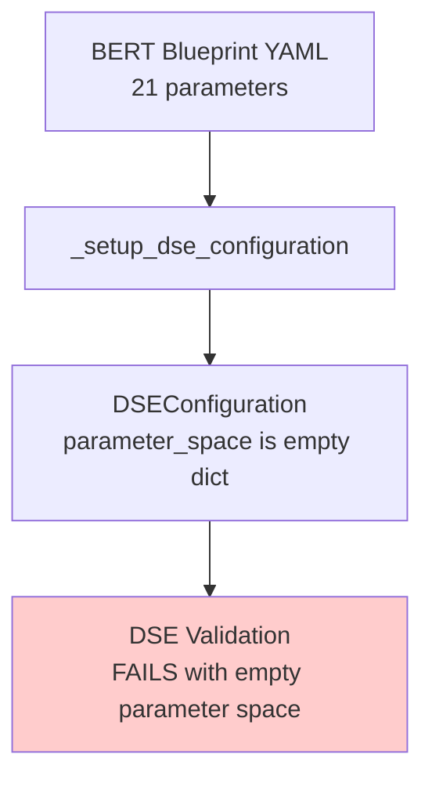
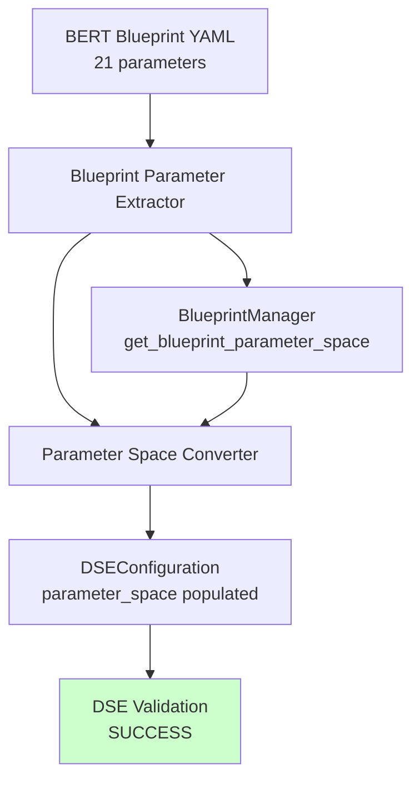
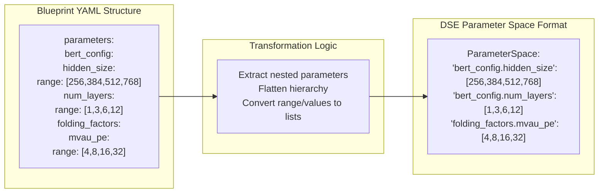
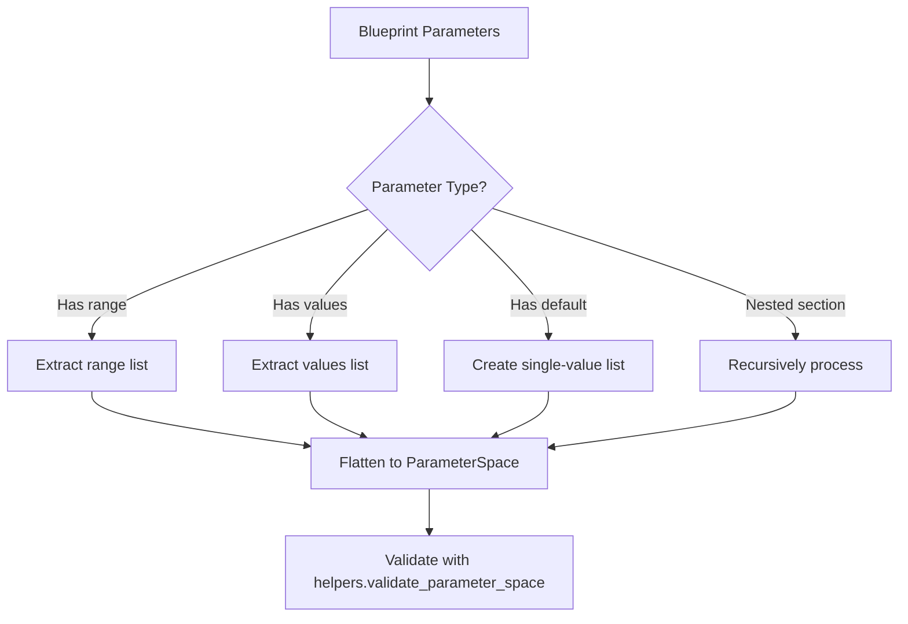
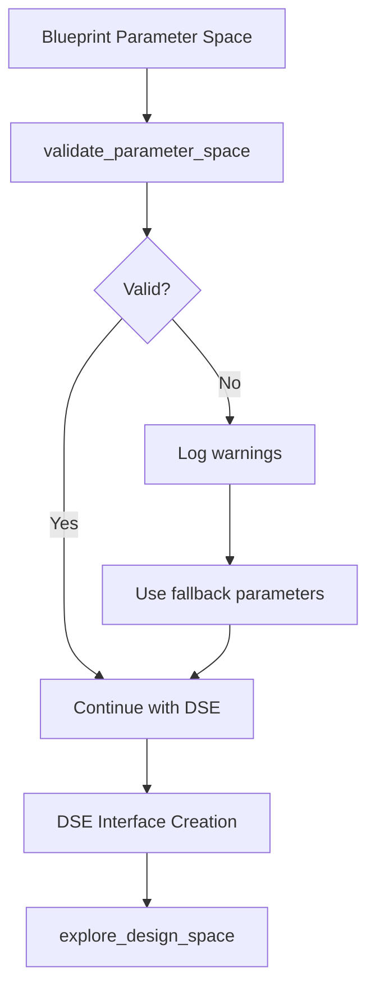

# 🎯 Blueprint Parameter Space Integration Plan

## 📊 Current State Analysis

**Problem**: The `_setup_dse_configuration()` function in `api.py` hardcodes `parameter_space={}`, causing DSE validation to fail with "Parameter space is empty".

**Root Cause**: Blueprint parameters (21 available in BERT blueprint) are not being extracted and converted to DSE-compatible format.

## 🏗️ System Architecture & Data Flow

### Current Broken Flow



### Proposed Fixed Flow



## 🔄 Parameter Transformation Pipeline



## 📋 Detailed Implementation Plan

### Phase 1: Blueprint Parameter Extraction Enhancement

#### 1. Update `_setup_dse_configuration()` in `api.py`
- Replace hardcoded `parameter_space={}`
- Integrate with `BlueprintManager.get_blueprint_parameter_space()`
- Handle nested parameter sections (bert_config, folding_factors, etc.)

#### 2. Enhance `BlueprintManager.get_blueprint_parameter_space()`
- Add support for nested parameter sections
- Handle both `range` and `values` parameter definitions
- Flatten hierarchical structure for DSE compatibility

### Phase 2: Parameter Space Conversion Logic



### Phase 3: Integration Points

1. **API Integration**: `brainsmith.forge()` → `_setup_dse_configuration()` → `BlueprintManager`
2. **DSE Validation**: Parameter space must pass `validate_parameter_space()` check
3. **Sampling Strategy**: Automatic strategy selection based on parameter space size

## 🛠️ Technical Implementation Details

### 1. Enhanced Parameter Extraction Logic

```python
def extract_blueprint_parameters(blueprint_data: Dict[str, Any]) -> ParameterSpace:
    """Extract and flatten blueprint parameters into DSE-compatible format."""
    parameter_space = {}
    
    if 'parameters' in blueprint_data:
        for section_name, section_data in blueprint_data['parameters'].items():
            if isinstance(section_data, dict) and 'description' in section_data:
                # Process nested parameter section
                for param_name, param_def in section_data.items():
                    if param_name != 'description':
                        param_space_key = f"{section_name}.{param_name}"
                        parameter_space[param_space_key] = extract_parameter_values(param_def)
            else:
                # Direct parameter definition
                parameter_space[section_name] = extract_parameter_values(section_data)
    
    return parameter_space

def extract_parameter_values(param_def: Dict[str, Any]) -> List[Any]:
    """Extract parameter values from definition."""
    if isinstance(param_def, dict):
        if 'range' in param_def:
            return param_def['range']
        elif 'values' in param_def:
            return param_def['values']
        elif 'default' in param_def:
            return [param_def['default']]
    return [param_def]
```

### 2. Updated DSE Configuration Setup

```python
def _setup_dse_configuration(blueprint_data, objectives, constraints, target_device):
    """Setup DSE configuration with proper parameter space extraction."""
    # Extract parameter space from blueprint
    parameter_space = extract_blueprint_parameters(blueprint_data)
    
    # Validate parameter space
    is_valid, errors = validate_parameter_space(parameter_space)
    if not is_valid:
        logger.warning(f"Parameter space validation issues: {errors}")
        # Continue with warning rather than failing completely
    
    return DSEConfiguration(
        parameter_space=parameter_space,  # NOW POPULATED!
        objectives=dse_objectives,
        constraints=dse_constraints,
        blueprint_path=None
    )
```

### 3. Parameter Space Validation Flow



## 🧪 Testing Strategy

### Unit Tests
1. Test parameter extraction from BERT blueprint
2. Test nested parameter section handling  
3. Test parameter space validation
4. Test DSE configuration creation

### Integration Tests
1. End-to-end BERT demo execution
2. Parameter space size validation
3. DSE sampling strategy selection

## 📊 Expected Parameter Space Transformation

### BERT Blueprint Input (21 parameters across 5 sections)
```yaml
parameters:
  bert_config:
    description: "BERT model architecture configuration"
    hidden_size:
      range: [256, 384, 512, 768]
      default: 384
    num_layers:
      range: [1, 3, 6, 12]
      default: 3
  folding_factors:
    description: "FINN folding parameters"
    mvau_pe:
      range: [4, 8, 16, 32]
      default: 8
  memory_config:
    description: "Memory architecture settings"
    mvau_mem_mode:
      values: ["internal_default", "internal_decoupled", "external"]
      default: "internal_decoupled"
```

### Expected DSE Parameter Space Output
```python
parameter_space = {
    'bert_config.hidden_size': [256, 384, 512, 768],
    'bert_config.num_layers': [1, 3, 6, 12],
    'bert_config.num_attention_heads': [8, 12, 16],
    'bert_config.intermediate_size': [512, 1536, 3072],
    'bert_config.sequence_length': [64, 128, 256, 512],
    'folding_factors.mvau_pe': [4, 8, 16, 32],
    'folding_factors.mvau_simd': [12, 24, 48],
    'folding_factors.ff_pe_multiplier': [1, 2],
    'folding_factors.ff_simd_multiplier': [1, 2],
    'folding_factors.aux_pe': [1, 2, 4],
    'folding_factors.aux_simd': [1, 2, 4],
    'folding_factors.dynmvu_pe': [4, 8, 16],
    'folding_factors.dynmvu_simd_divisor': [3, 4],
    'memory_config.mvau_mem_mode': ["internal_default", "internal_decoupled", "external"],
    'memory_config.dynmvu_mem_mode': ["external"],
    'memory_config.ram_style': ["auto", "block", "distributed"],
    'memory_config.runtime_writeable_weights': [0, 1],
    'quantization.weight_width': [4, 8],
    'quantization.activation_width': [4, 8],
    'optimization.target_fps': [1000, 3000, 5000],
    'optimization.clock_period_ns': [3.33, 5.0, 10.0]
}
```

## 🎯 Expected Outcomes

### Before Fix
- `parameter_space = {}` (empty)
- DSE validation fails: "Parameter space is empty"
- BERT demo crashes at DSE stage

### After Fix
- `parameter_space = {21 parameters}` (populated)
- DSE validation passes
- BERT demo proceeds to actual design space exploration
- Parameter combinations: ~4.2 billion possible (will use sampling)

## 📈 Implementation Priorities

1. **High Priority**: Fix `_setup_dse_configuration()` parameter extraction
2. **Medium Priority**: Enhance `BlueprintManager` for nested parameters  
3. **Low Priority**: Add parameter space optimization and validation improvements

## 🔧 Implementation Files to Modify

1. **`brainsmith/core/api.py`**
   - Function: `_setup_dse_configuration()`
   - Change: Replace `parameter_space={}` with proper extraction

2. **`brainsmith/core/dse/blueprint_manager.py`**  
   - Function: `get_blueprint_parameter_space()`
   - Change: Add nested parameter section handling

3. **New helper functions**
   - `extract_blueprint_parameters()`
   - `extract_parameter_values()`

## 🧭 Success Criteria

✅ **BERT demo runs without "Parameter space is empty" error**  
✅ **DSE validation passes with populated parameter space**  
✅ **21 parameters correctly extracted from blueprint**  
✅ **Parameter space size calculated correctly**  
✅ **Sampling strategy automatically selected based on space size**

---

**Next Steps**: Upon approval, implement the parameter extraction logic and integrate with the DSE configuration setup.