# Interface-Wise Dataflow Modeling: Mathematical Framework

## Introduction

Interface-Wise Dataflow Modeling is Brainsmith's mathematical framework for accurately and robustly representing computational nodes in dataflow accelerators. This document focuses on the core mathematical principles that enable precise modeling of hardware operations through their interface characteristics.

## Dataflow Node Representation

A dataflow accelerator node is completely characterized by its interfaces and their mathematical relationships:

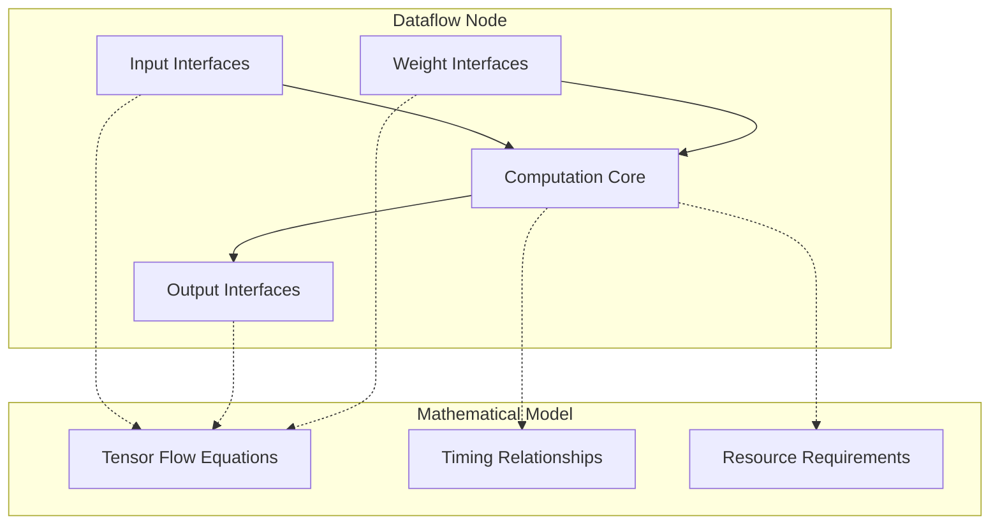

## Mathematical Foundation

### Interface-Wise Decomposition

Every dataflow node is mathematically decomposed into its constituent interfaces, each representing a distinct data flow:

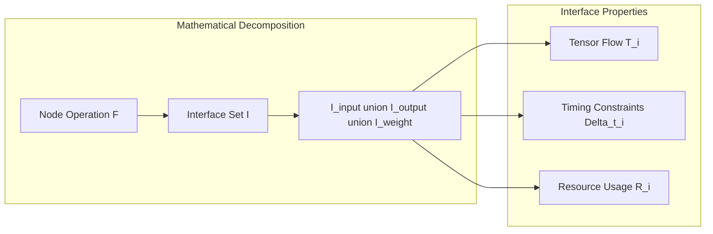

**Key Principle**: `Node Behavior = ∑(Interface Behaviors + Interface Interactions)`

### Tensor Flow Mathematics

Each interface represents a structured tensor flow with four mathematical levels:

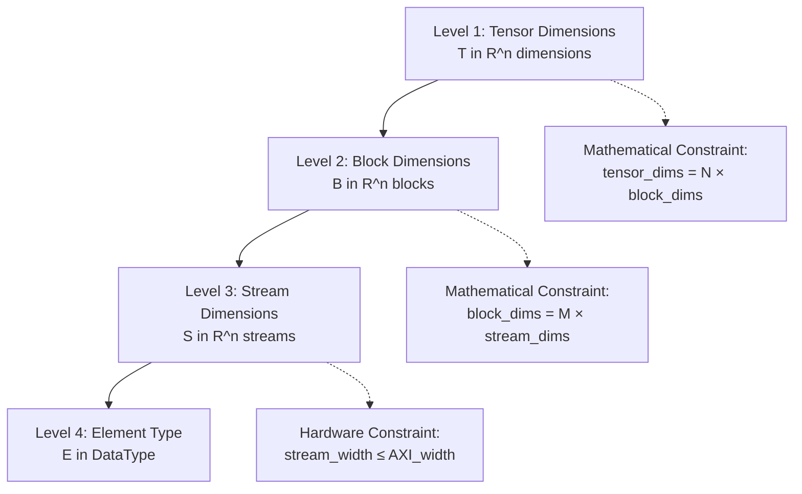

**Fundamental Axioms:**
1. **Completeness**: `tensor_dims[i] = num_blocks[i] × block_dims[i]`
2. **Streamability**: `block_dims[i] = num_cycles[i] × stream_dims[i]`
3. **Hardware Feasibility**: `stream_width = stream_dims[0] × datatype.bitwidth()`

## Interface Mathematical Model

### DataflowInterface: Complete Mathematical Specification

Each interface is a mathematical object with complete tensor flow specification:

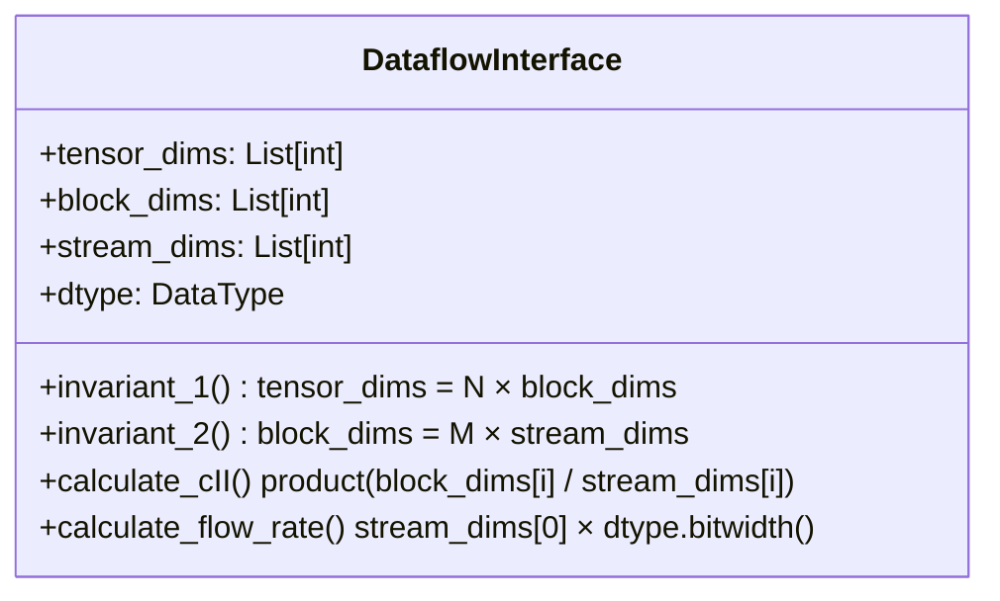

**Mathematical Properties:**
- **Tensor Conservation**: Total elements preserved across all levels
- **Block Alignment**: All dimensions evenly divisible 
- **Stream Feasibility**: Hardware can process stream_dims elements per cycle
- **Timing Predictability**: cII (Calculation Initiation Interval) deterministically calculated

### Interface Timing Mathematics

Each interface has precisely defined timing characteristics:

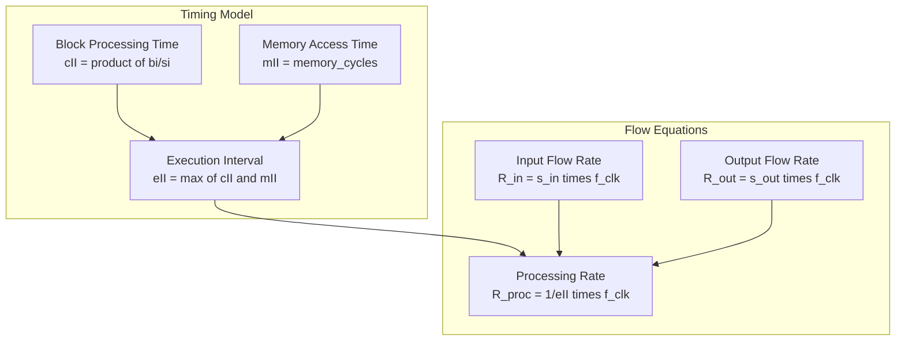

**Key Equations:**
- `cII = ∏ᵢ(block_dims[i] / stream_dims[i])` (cycles per block)
- `throughput = stream_dims[0] / cII` (elements per cycle)
- `bandwidth = throughput × dtype.bitwidth()` (bits per cycle)

## Node-Level Mathematical Model

### DataflowModel: Multi-Interface System

A dataflow node is represented as a system of mathematically related interfaces:

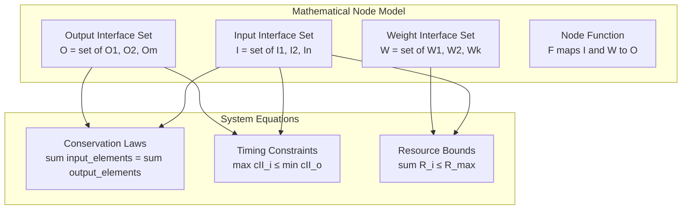

**Mathematical Invariants:**
1. **Data Conservation**: `∑elements_in = ∑elements_out` (for non-reducing operations)
2. **Temporal Consistency**: All interfaces must have compatible timing
3. **Resource Feasibility**: Total resource usage must be implementable

### Parallelism Mathematics

Parallelism parameters define the interface relationships and system performance:

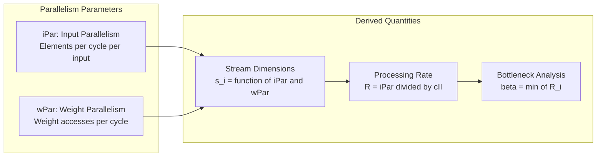

**Parallelism Equations:**
- `stream_dims[0] = iPar` for input interfaces
- `stream_dims[0] = wPar × scaling_factor` for weight interfaces  
- `stream_dims[0] = min(input_parallelism, weight_parallelism)` for outputs
- `node_throughput = bottleneck_interface.throughput`

## Performance Analysis Framework

### Initiation Interval Mathematics

The framework calculates precise performance metrics through mathematical analysis:

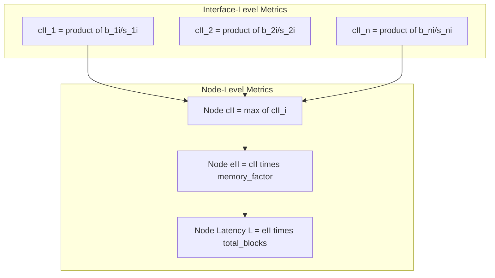

**Performance Equations:**
- `cII_interface = ∏ᵢ(block_dims[i] / stream_dims[i])` (cycles per block per interface)
- `cII_node = max(cII_interface for all interfaces)` (node bottleneck)
- `throughput_node = 1 / cII_node` (blocks per cycle)
- `latency_total = cII_node × total_num_blocks` (total inference cycles)

### Mathematical Validation Framework

The system ensures mathematical correctness through comprehensive validation:

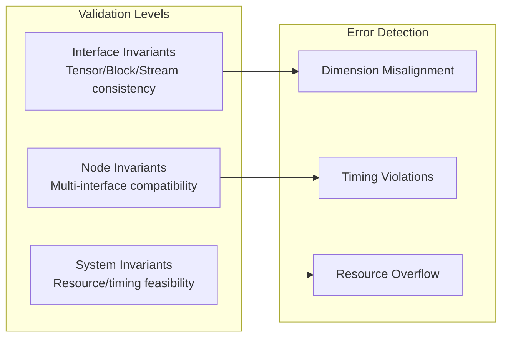

**Validation Rules:**
1. `∀i: tensor_dims[i] % block_dims[i] == 0` (perfect chunking)
2. `∀i: block_dims[i] % stream_dims[i] == 0` (perfect streaming)  
3. `∀interfaces: compatible_timing(cII_values)` (temporal consistency)
4. `total_resources ≤ available_resources` (resource feasibility)

## Robustness and Accuracy Properties

### Mathematical Soundness

The framework ensures robust node representation through mathematical foundations:

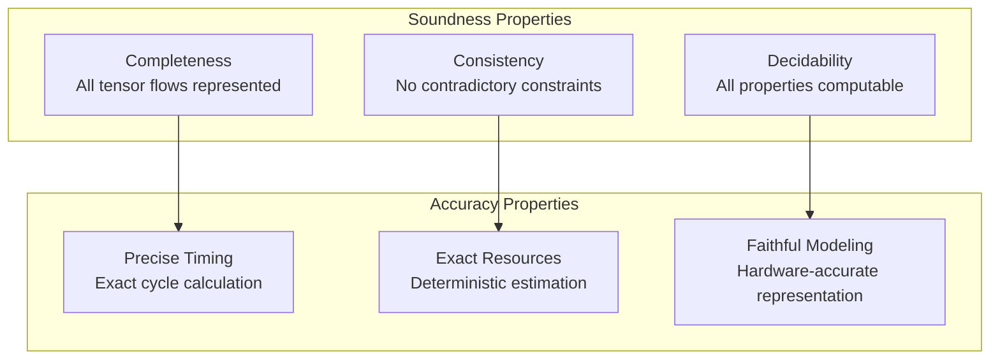

**Robustness Guarantees:**
1. **No Invalid Configurations**: Mathematical constraints prevent impossible tensor chunking
2. **Deterministic Behavior**: Same inputs always produce same outputs
3. **Composability**: Multiple nodes can be reliably composed into graphs
4. **Hardware Fidelity**: Model accurately reflects actual hardware behavior

### Error Prevention Through Mathematics

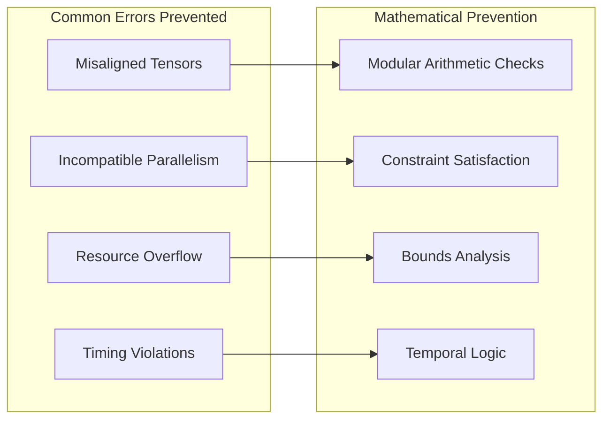

## Case Study: Matrix Multiplication Node

### Legacy vs Modern Parallelism Systems

The matrix multiplication node demonstrates the evolution from FINN's legacy PE/SIMD system to Brainsmith's modern iPar/wPar framework:

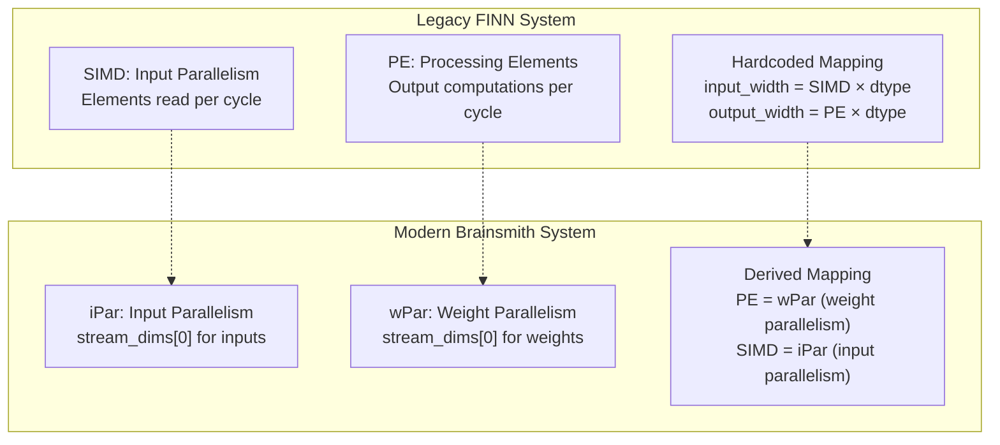

### Interface Mathematical Specification

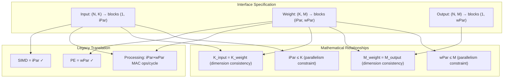

### Parallelism Mapping Mathematics

**Legacy FINN Attributes → Modern Interface Properties:**

| Legacy Attribute | Modern Equivalent | Mathematical Relationship |
|------------------|-------------------|---------------------------|
| `SIMD` | `iPar` | `input_interface.stream_dims[0] = iPar` |
| `PE` | `wPar` | `weight_interface.stream_dims[0] = wPar` |
| `inputDataType` | `input_interface.dtype` | Direct datatype mapping |
| `weightDataType` | `weight_interface.dtype` | Direct datatype mapping |
| `outputDataType` | `output_interface.dtype` | Direct datatype mapping |

**Performance Model Translation:**
- **Legacy**: `cII = (K/SIMD) × (M/PE)` cycles per output block
- **Modern**: `cII = (K/iPar) × (M/wPar)` cycles per output block
- **Equivalence**: When `SIMD = iPar` and `PE = wPar`, performance is identical

### Concrete Example: BERT Matrix Multiplication

**Problem**: Multiply input `[128, 768]` with weight `[768, 256]` to get output `[128, 256]`

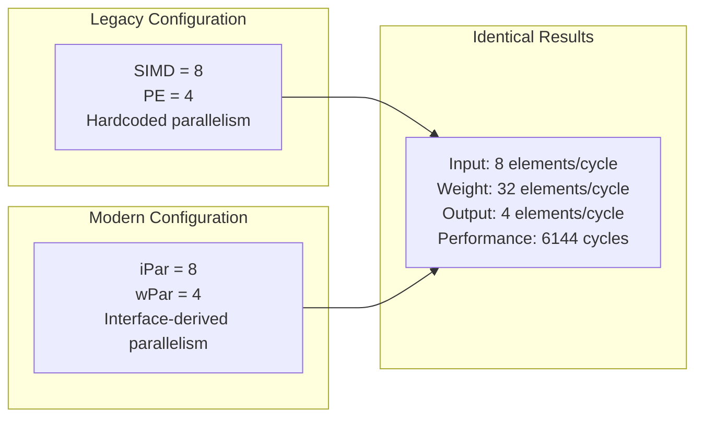

**Mathematical Model:**
- `input_elements_per_cycle = iPar = 8` (replaces SIMD)
- `weight_elements_per_cycle = iPar × wPar = 32` (derived from interface relationships)
- `output_elements_per_cycle = wPar = 4` (replaces PE) 
- `cII = (768/8) × (256/4) = 96 × 64 = 6144` cycles per [128,256] output
- `total_latency = cII × 1 = 6144` cycles for complete matrix (batch=1)

**Key Advantages of Modern System:**
1. **Mathematical Consistency**: iPar/wPar derived from interface mathematics, not hardcoded
2. **Flexible Mapping**: Can handle complex multi-interface operations systematically  
3. **Validation**: Mathematical constraints prevent invalid parallelism configurations
4. **Composability**: Interface-wise modeling enables reliable multi-node composition

### Validation and Accuracy

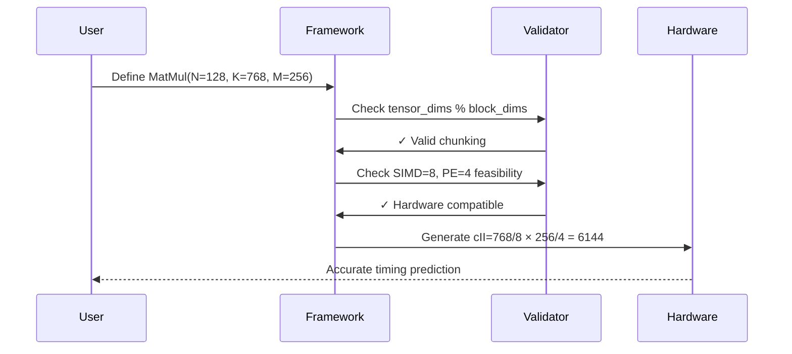

## Conclusion

Interface-Wise Dataflow Modeling provides a mathematically rigorous framework for accurately and robustly representing computational nodes in dataflow accelerators. The framework's key contributions are:

### Mathematical Foundation
- **Complete Specification**: Every interface fully characterized by tensor flow mathematics
- **Invariant Enforcement**: Mathematical constraints prevent invalid configurations  
- **Deterministic Calculation**: Precise timing and resource predictions
- **Compositional Properties**: Nodes can be reliably combined into larger systems

### Robustness Properties  
- **Error Prevention**: Mathematical validation catches problems early
- **Hardware Fidelity**: Accurate representation of actual hardware behavior
- **Scalable Validation**: Constraint checking scales to complex operations
- **Predictable Performance**: Timing calculations match hardware reality

### Accuracy Benefits
- **Exact Metrics**: No approximation in core calculations
- **Resource Precision**: Deterministic memory and compute requirements
- **Timing Accuracy**: Cycle-accurate performance prediction
- **Interface Completeness**: All data flows explicitly modeled

This mathematical framework enables reliable, automatic generation of hardware accelerator nodes with guaranteed correctness and predictable performance, forming the foundation for robust dataflow accelerator design and optimization.