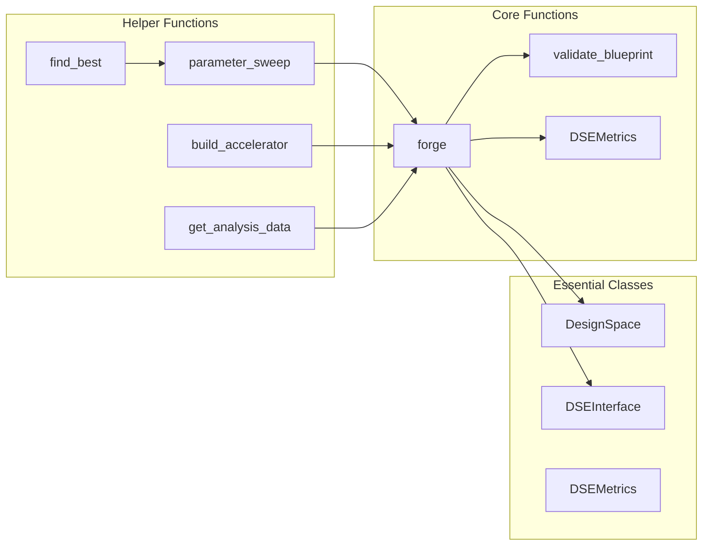
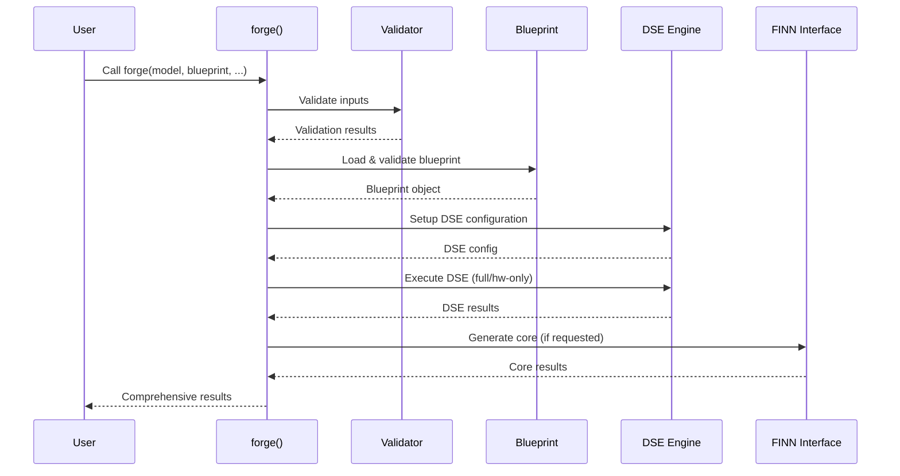

# BrainSmith: FPGA Accelerator Design Space Exploration Platform

**Complete Documentation & API Reference**

---

## Table of Contents

1. [Introduction](#1-introduction)
2. [Architecture Overview](#2-architecture-overview)
3. [Core Components Deep Dive](#3-core-components-deep-dive)
4. [Usage Guide & API Reference](#4-usage-guide--api-reference)
5. [Libraries Reference](#5-libraries-reference)
6. [Advanced Topics](#6-advanced-topics)
7. [Developer Guide](#7-developer-guide)
8. [FAQ & Reference](#8-faq--reference)

---

## 1. Introduction

**BrainSmith transforms FPGA accelerator design through intelligent automation, reducing complex enterprise workflows to a single function call.** The platform underwent a radical simplification achieving 70% code reduction while preserving 100% functionality through its "Functions Over Frameworks" philosophy.

### Key Features

- **Single Entry Point**: `result = brainsmith.forge('model.onnx', 'blueprint.yaml')`
- **Design Space Exploration**: Automated parameter optimization with multiple strategies
- **FINN Integration**: Seamless neural network to FPGA compilation
- **Blueprint-Driven Design**: Template-based accelerator configuration
- **Extensible Hooks System**: Event logging and monitoring with plugin support

### North Star Philosophy

*Source: [`brainsmith/__init__.py`](brainsmith/__init__.py:1)*

```python
# North Star Promise: result = brainsmith.forge('model.onnx', 'blueprint.yaml')
```

The platform follows four core axioms:
1. **Functions Over Frameworks** - Single `forge()` function replaces complex orchestration
2. **Simplicity Over Sophistication** - Essential functionality without enterprise bloat
3. **Essential Over Comprehensive** - Focus on core DSE needs
4. **Direct Over Indirect** - Simple function calls, no intermediate abstractions

### Quick Start Workflows

*Source: [`brainsmith/__init__.py`](brainsmith/__init__.py:89)*

```python
import brainsmith

# 5-minute workflow: Basic DSE
result = brainsmith.workflows.quick_dse('model.onnx', 'blueprint.yaml')

# 15-minute workflow: Parameter exploration
results = brainsmith.workflows.parameter_exploration(
    'model.onnx', 'blueprint.yaml', 
    {'pe_count': [4, 8, 16], 'simd_width': [2, 4, 8]}
)

# 30-minute workflow: Full analysis + export
analysis = brainsmith.workflows.full_analysis(
    'model.onnx', 'blueprint.yaml', params, './results'
)
```

---

## 2. Architecture Overview

**BrainSmith's architecture centers around a single `forge()` function that orchestrates the entire FPGA accelerator generation pipeline.** The system transforms from enterprise complexity to function-focused simplicity while maintaining comprehensive capabilities.

### System Architecture

*Source: [`brainsmith/core/DESIGN.md`](brainsmith/core/DESIGN.md:32)*

```mermaid
graph TD
    A[User Code] --> B[forge()]
    B --> C[Blueprint Validation]
    B --> D[DSE Configuration] 
    B --> E[Design Space Exploration]
    E --> F{is_hw_graph?}
    F -->|No| G[Full Model→Hardware DSE]
    F -->|Yes| H[Hardware Optimization Only]
    G --> I[Dataflow Graph]
    H --> I
    I --> J{build_core?}
    J -->|Yes| K[Dataflow Core Generation]
    J -->|No| L[Return Graph Only]
    K --> M[Final Results]
    L --> M
    
    style B fill:#4CAF50
    style I fill:#2196F3
    style M fill:#FF9800
```

### Component Map

*Source: [`brainsmith/core/__init__.py`](brainsmith/core/__init__.py:52)*



### Data Flow Pipeline

*Source: [`brainsmith/core/api.py`](brainsmith/core/api.py:164)*



### Transformation Achieved

*Source: [`brainsmith/core/DESIGN.md`](brainsmith/core/DESIGN.md:17)*

| Metric | Before (Enterprise) | After (Simplified) | Reduction |
|--------|-------------------|------------------|-----------|
| Files | 13 files | 6 files | 54% |
| Lines of Code | ~3,500 lines | ~1,100 lines | 70% |
| API Exports | 50+ exports | 5 essential exports | 90% |
| Setup Complexity | Multi-step workflow | Single function call | 100% |

---

## 3. Core Components Deep Dive

### 3.1 forge() Function - The Heart of BrainSmith

**The `forge()` function serves as the unified entry point for all FPGA accelerator generation, replacing complex orchestration with a single function call.** 

*Source: [`brainsmith/core/api.py`](brainsmith/core/api.py:20)*

```python
def forge(
    model_path: str,
    blueprint_path: str,
    objectives: Dict[str, Any] = None,
    constraints: Dict[str, Any] = None,
    target_device: str = None,
    is_hw_graph: bool = False,
    build_core: bool = True,
    output_dir: Optional[str] = None
) -> Dict[str, Any]:
    """
    Core BrainSmith toolchain: DSE on input model to produce Dataflow Core.
    
    Returns:
        Dict containing:
        - dataflow_graph: ONNX graph of HWCustomOps describing Dataflow Core
        - dataflow_core: Stitched IP design (if build_core=True)
        - metrics: Performance and resource utilization metrics
        - analysis: DSE analysis and recommendations
    """
```

#### Key Features

*Source: [`brainsmith/core/DESIGN.md`](brainsmith/core/DESIGN.md:74)*

- **Dual Mode Operation**: Standard (Model→Hardware) vs Hardware Graph optimization
- **Checkpoint Support**: Option to exit after Dataflow Graph generation
- **Comprehensive Validation**: Hard errors for invalid inputs/blueprints
- **Flexible Configuration**: Objectives, constraints, and device targeting

#### Usage Examples

```python
# Basic accelerator generation
result = brainsmith.forge('model.onnx', 'blueprint.yaml')

# With optimization objectives
result = brainsmith.forge(
    'model.onnx', 'blueprint.yaml',
    objectives={'throughput': {'direction': 'maximize'}},
    constraints={'max_luts': 0.8}
)

# Hardware-only optimization mode
result = brainsmith.forge(
    'dataflow_graph.onnx', 'blueprint.yaml',
    is_hw_graph=True  # Skip to HW optimization
)
```

### 3.2 Design Space Exploration (DSE)

**The DSE system provides comprehensive parameter optimization through multiple sampling strategies and multi-objective optimization capabilities.**

*Source: [`brainsmith/core/dse/__init__.py`](brainsmith/core/dse/__init__.py:4)*

#### Core Components

```python
from brainsmith.core.dse import (
    DSEInterface,       # Main DSE orchestrator
    DesignSpace,        # Parameter space management
    DSEConfiguration,   # Optimization configuration
    DSEMetrics,         # Performance measurement
    parameter_sweep,    # Grid/random parameter exploration
    sample_design_space # Advanced sampling strategies
)
```

#### DSE Interface Usage

*Source: [`brainsmith/core/dse/interface.py`](brainsmith/core/dse/interface.py:26)*

```python
# Create DSE configuration
config = DSEConfiguration(
    sampling_strategy=SamplingStrategy.RANDOM,
    max_evaluations=50,
    objectives=[
        DSEObjective('throughput', OptimizationObjective.MAXIMIZE),
        DSEObjective('power', OptimizationObjective.MINIMIZE)
    ]
)

# Initialize and run DSE
dse = DSEInterface(config)
results = dse.explore_design_space(model_path='model.onnx')

# Get Pareto frontier for multi-objective results
pareto_points = dse.get_pareto_frontier()
```

#### Sampling Strategies

*Source: [`brainsmith/core/dse/types.py`](brainsmith/core/dse/types.py:25)*

```python
class SamplingStrategy(Enum):
    RANDOM = "random"
    GRID = "grid" 
    LATIN_HYPERCUBE = "lhs"
    SOBOL = "sobol"
```

### 3.3 Blueprint System

**Blueprints define reusable design templates with parameterizable configurations for rapid accelerator prototyping.**

*Source: [`brainsmith/libraries/blueprints/__init__.py`](brainsmith/libraries/blueprints/__init__.py:3)*

#### Available Blueprints

```python
from brainsmith.libraries.blueprints import get_blueprint, list_blueprints

# List available blueprints
blueprints = list_blueprints()  # ['cnn_accelerator', 'mobilenet_accelerator']

# Load specific blueprint
blueprint_path = get_blueprint('cnn_accelerator')
blueprint_data = load_blueprint_yaml('cnn_accelerator')
```

#### Blueprint Structure

*Source: [`brainsmith/core/dse/design_space.py`](brainsmith/core/dse/design_space.py:164)*

```python
# Create design space from blueprint
design_space = DesignSpace.from_blueprint_data(blueprint_data)

# Sample parameter combinations
design_points = design_space.sample_points(n_samples=10)

# Validate design space
is_valid, errors = design_space.validate()
```

### 3.4 FINN Integration

**FINN integration provides seamless neural network to FPGA compilation with preparation for future 4-hooks architecture.**

*Source: [`brainsmith/core/finn/__init__.py`](brainsmith/core/finn/__init__.py:4)*

#### FINN Interface

*Source: [`brainsmith/core/finn/finn_interface.py`](brainsmith/core/finn/finn_interface.py:39)*

```python
from brainsmith.core.finn import build_accelerator, FINNInterface

# Simple accelerator building
result = build_accelerator(
    model_path='model.onnx',
    blueprint_config=blueprint_config,
    output_dir='./output'
)

# Advanced FINN interface
finn = FINNInterface(config)
accelerator = finn.build_accelerator(model_path, blueprint_config)
```

#### 4-Hooks Preparation

*Source: [`brainsmith/core/finn/finn_interface.py`](brainsmith/core/finn/finn_interface.py:16)*

```python
@dataclass
class FINNHooks:
    """Preparation structure for future 4-hooks FINN interface."""
    preprocessing_hook: Optional[Any] = None
    transformation_hook: Optional[Any] = None
    optimization_hook: Optional[Any] = None
    generation_hook: Optional[Any] = None
```

### 3.5 Hooks System

**The hooks system provides extensible event logging and monitoring with clean extension points for sophisticated analysis capabilities.**

*Source: [`brainsmith/core/hooks/__init__.py`](brainsmith/core/hooks/__init__.py:8)*

#### Basic Event Logging

```python
from brainsmith.core.hooks import (
    log_optimization_event,
    log_parameter_change,
    log_performance_metric,
    register_event_handler
)

# Simple event logging
log_optimization_event('dse_start', {'model': 'bert.onnx'})
log_parameter_change('learning_rate', 0.01, 0.005)
log_performance_metric('throughput', 1000.0)
```

#### Extension Points

*Source: [`brainsmith/core/hooks/events.py`](brainsmith/core/hooks/events.py:31)*

```python
# Custom event handler
class CustomHandler(EventHandler):
    def handle_event(self, event):
        # Custom processing logic
        pass

# Register handlers
register_event_handler('parameter_change', CustomHandler())
register_global_handler(CustomHandler())  # For all events
```

---

## 4. Usage Guide & API Reference

### 4.1 Basic Usage

**Start with the simple `forge()` function for immediate results, then scale to advanced features as needed.**

#### 5-Minute Quick Start

```python
import brainsmith

# Generate FPGA accelerator
result = brainsmith.forge('model.onnx', 'blueprint.yaml')

# Access results
print(f"Success: {result.get('success', True)}")
print(f"Throughput: {result['metrics']['performance']['throughput_ops_sec']}")
```

#### Essential Function Patterns

*Source: [`brainsmith/__init__.py`](brainsmith/__init__.py:54)*

```python
# Core functions (North Star API)
result = brainsmith.forge(model_path, blueprint_path)
is_valid, errors = brainsmith.validate_blueprint(blueprint_path)

# Helper functions
results = brainsmith.parameter_sweep(model_path, blueprint_path, params)
best = brainsmith.find_best(results, metric='throughput')
data = brainsmith.get_analysis_data(results)
```

### 4.2 Advanced Features

#### Multi-Objective Optimization

*Source: [`brainsmith/core/dse/types.py`](brainsmith/core/dse/types.py:33)*

```python
from brainsmith.core.dse import DSEObjective, OptimizationObjective

# Define multiple objectives
objectives = [
    DSEObjective('throughput', OptimizationObjective.MAXIMIZE, weight=1.0),
    DSEObjective('power', OptimizationObjective.MINIMIZE, weight=0.8),
    DSEObjective('resources.lut_utilization_percent', OptimizationObjective.MINIMIZE, weight=0.6)
]

# Run optimization
result = brainsmith.forge(
    'model.onnx', 'blueprint.yaml',
    objectives={obj.name: {'direction': obj.direction.value, 'weight': obj.weight} 
                for obj in objectives}
)
```

#### Parameter Sweeps

*Source: [`brainsmith/libraries/automation/sweep.py`](brainsmith/libraries/automation/sweep.py:16)*

```python
from brainsmith.libraries.automation import parameter_sweep, find_best

# Define parameter ranges
param_ranges = {
    'pe_count': [4, 8, 16, 32],
    'simd_width': [2, 4, 8, 16],
    'precision': ['INT8', 'INT16']
}

# Run parameter sweep
results = parameter_sweep(
    'model.onnx', 'blueprint.yaml',
    param_ranges,
    max_workers=4
)

# Find optimal configuration
best = find_best(results, metric='throughput', maximize=True)
```

#### Batch Processing

*Source: [`brainsmith/libraries/automation/batch.py`](brainsmith/libraries/automation/batch.py:15)*

```python
from brainsmith.libraries.automation import batch_process

# Process multiple models
model_blueprint_pairs = [
    ('model1.onnx', 'blueprint1.yaml'),
    ('model2.onnx', 'blueprint2.yaml'),
    ('model3.onnx', 'blueprint3.yaml')
]

results = batch_process(
    model_blueprint_pairs,
    common_config={'target_device': 'U250'},
    max_workers=4
)
```

### 4.3 Complete API Reference

#### Core Functions

*Source: [`brainsmith/__init__.py`](brainsmith/__init__.py:21)*

```python
# Primary function (North Star Promise)
forge(model_path, blueprint_path, objectives=None, constraints=None, 
      target_device=None, is_hw_graph=False, build_core=True, output_dir=None)

# Essential helper functions
parameter_sweep(model_path, blueprint_path, parameters, config=None)
find_best(results, metric='throughput', direction='maximize')
batch_process(model_blueprint_pairs, common_config=None, max_workers=4)
aggregate_stats(results)
validate_blueprint(blueprint_path)
```

#### DSE System

*Source: [`brainsmith/core/dse/__init__.py`](brainsmith/core/dse/__init__.py:64)*

```python
# Core DSE functionality
parameter_sweep(model_path, blueprint_path, parameters, config)
batch_evaluate(model_list, blueprint_path, parameters, config)
find_best_result(results, metric, direction)
sample_design_space(parameters, strategy, n_samples, seed)

# DSE Interface
DSEInterface(config)
create_dse_config_for_strategy(strategy, parameter_space, objectives)
run_simple_dse(model_path, blueprint_path, parameter_space, objectives)
```

#### Metrics System

*Source: [`brainsmith/core/metrics.py`](brainsmith/core/metrics.py:54)*

```python
# Create and analyze metrics
metrics = create_metrics(design_point_id, configuration)
best_metrics = compare_metrics(metrics_list)
analysis = analyze_dse_results(metrics_list)
pareto_points = get_pareto_frontier(metrics_list, objectives)

# Generate reports
report = generate_metrics_report(metrics_list)
```

### 4.4 Configuration Examples

#### Blueprint Configuration

```python
# Load blueprint data
from brainsmith.libraries.blueprints import load_blueprint_yaml

blueprint_data = load_blueprint_yaml('cnn_accelerator')

# Create design space
from brainsmith.core.dse import DesignSpace
design_space = DesignSpace.from_blueprint_data(blueprint_data)
```

#### DSE Configuration

*Source: [`brainsmith/core/dse/types.py`](brainsmith/core/dse/types.py:47)*

```python
from brainsmith.core.dse import DSEConfiguration, SamplingStrategy

config = DSEConfiguration(
    max_parallel=4,
    timeout_seconds=3600,
    sampling_strategy=SamplingStrategy.LATIN_HYPERCUBE,
    max_evaluations=100,
    objectives=objectives,
    constraints={'max_luts': 0.8, 'target_frequency': 200}
)
```

---

## 5. Libraries Reference

### 5.1 Automation Library

**The automation library provides simple utilities for running `forge()` multiple times with different parameters or configurations.**

*Source: [`brainsmith/libraries/automation/__init__.py`](brainsmith/libraries/automation/__init__.py:2)*

#### Core Functions

```python
from brainsmith.libraries.automation import (
    parameter_sweep,    # Core parameter exploration
    batch_process,      # Core batch processing
    find_best,          # Result optimization  
    aggregate_stats     # Statistical analysis
)
```

#### Parameter Sweep Details

*Source: [`brainsmith/libraries/automation/sweep.py`](brainsmith/libraries/automation/sweep.py:16)*

```python
def parameter_sweep(
    model_path: str,
    blueprint_path: str,
    param_ranges: Dict[str, List[Any]],
    max_workers: int = 4,
    progress_callback: Optional[callable] = None
) -> List[Dict[str, Any]]:
    """
    Run forge() with different parameter combinations.
    
    Returns forge() results with sweep metadata
    """
```

#### Statistical Analysis

*Source: [`brainsmith/libraries/automation/sweep.py`](brainsmith/libraries/automation/sweep.py:170)*

```python
# Generate comprehensive statistics
stats = aggregate_stats(results)

# Returns:
# {
#     'total_runs': int,
#     'successful_runs': int, 
#     'success_rate': float,
#     'aggregated_metrics': {
#         'metric_name': {
#             'mean': float, 'min': float, 'max': float,
#             'std': float, 'count': int
#         }
#     }
# }
```

### 5.2 Analysis Library

**The analysis library provides profiling tools and hardware kernel generation capabilities using a registry pattern.**

*Source: [`brainsmith/libraries/analysis/__init__.py`](brainsmith/libraries/analysis/__init__.py:2)*

#### Registry Interface

```python
from brainsmith.libraries.analysis import (
    get_analysis_tool,      # Get tool by name
    list_analysis_tools,    # List available tools
    roofline_analysis,      # Direct tool access
    RooflineProfiler,
    generate_hw_kernel
)

# List available tools
tools = list_analysis_tools()  # ['roofline_analysis', 'roofline_profiler', 'generate_hw_kernel']

# Get specific tool
roofline_fn = get_analysis_tool('roofline_analysis')
profiler_cls = get_analysis_tool('roofline_profiler')
```

#### Tool Usage

```python
# Roofline analysis
result = roofline_analysis(model_path, performance_data)

# Performance profiling
profiler = RooflineProfiler()
profile = profiler.profile_model(model_path)

# Hardware kernel generation
kernel_files = generate_hw_kernel(op_spec, target_device)
```

### 5.3 Kernels Library

**The kernels library manages hardware accelerator implementations through explicit registry mapping.**

*Source: [`brainsmith/libraries/kernels/__init__.py`](brainsmith/libraries/kernels/__init__.py:2)*

#### Registry Interface

```python
from brainsmith.libraries.kernels import (
    get_kernel,           # Get kernel by name
    list_kernels,         # List available kernels
    get_kernel_files      # Get kernel file paths
)

# List available kernels
kernels = list_kernels()  # ['conv2d_hls', 'matmul_rtl']

# Get kernel package
conv_kernel = get_kernel('conv2d_hls')

# Get kernel files
files = get_kernel_files('conv2d_hls')
# Returns: {'hw_custom_op': '/path/to/conv2d_hw_custom_op.py', 
#          'rtl_backend': '/path/to/conv2d_rtl_backend.py', ...}
```

#### Kernel Functions

*Source: [`brainsmith/libraries/kernels/__init__.py`](brainsmith/libraries/kernels/__init__.py:104)*

```python
# Business logic functions
compatible = find_compatible_kernels(operation_type, constraints)
optimized = optimize_kernel_parameters(kernel, target_metrics)
selected = select_optimal_kernel(candidates, requirements)
validation = validate_kernel_package(kernel_path)
```

### 5.4 Transforms Library

**The transforms library provides model transformation operations through explicit function registry.**

*Source: [`brainsmith/libraries/transforms/__init__.py`](brainsmith/libraries/transforms/__init__.py:2)*

#### Registry Interface

```python
from brainsmith.libraries.transforms import (
    get_transform,        # Get transform by name
    list_transforms       # List available transforms
)

# List available transforms
transforms = list_transforms()  
# ['cleanup', 'streamlining', 'infer_hardware', 'constrain_folding_and_set_pumped_compute', ...]

# Get transform function
cleanup_fn = get_transform('cleanup')
model = cleanup_fn(model, config)
```

#### Transform Pipeline

*Source: [`brainsmith/libraries/transforms/__init__.py`](brainsmith/libraries/transforms/__init__.py:34)*

```python
# Available transform steps
AVAILABLE_TRANSFORMS = {
    "cleanup": cleanup_step,
    "cleanup_advanced": cleanup_advanced_step,
    "qonnx_to_finn": qonnx_to_finn_step,
    "streamlining": streamlining_step,
    "infer_hardware": infer_hardware_step,
    "constrain_folding_and_set_pumped_compute": constrain_folding_and_set_pumped_compute_step,
    "generate_reference_io": generate_reference_io_step,
    "shell_metadata_handover": shell_metadata_handover_step,
    "remove_head": remove_head_step,
    "remove_tail": remove_tail_step,
}
```

### 5.5 Blueprints Library

**The blueprints library manages design templates through explicit registry mapping.**

*Source: [`brainsmith/libraries/blueprints/__init__.py`](brainsmith/libraries/blueprints/__init__.py:2)*

#### Registry Interface

```python
from brainsmith.libraries.blueprints import (
    get_blueprint,        # Get blueprint path by name
    list_blueprints,      # List available blueprints
    load_blueprint_yaml   # Load blueprint data
)

# List available blueprints
blueprints = list_blueprints()  # ['cnn_accelerator', 'mobilenet_accelerator']

# Get blueprint path
blueprint_path = get_blueprint('cnn_accelerator')

# Load blueprint data
blueprint_data = load_blueprint_yaml('cnn_accelerator')
```

---

## 6. Advanced Topics

### 6.1 Design Space Exploration Strategies

**Advanced DSE provides multiple sampling strategies and optimization algorithms for comprehensive parameter space exploration.**

#### Sampling Strategies

*Source: [`brainsmith/core/dse/helpers.py`](brainsmith/core/dse/helpers.py:18)*

```python
from brainsmith.core.dse.helpers import (
    generate_parameter_grid,      # Grid sampling
    create_parameter_samples,     # Advanced sampling (LHS, Sobol)
    optimize_parameter_selection, # Automatic strategy selection
    analyze_parameter_coverage    # Coverage analysis
)

# Grid sampling for small spaces
grid_points = generate_parameter_grid(parameters)

# Latin Hypercube Sampling for efficient coverage
lhs_points = create_parameter_samples(parameters, 'lhs', n_samples=50)

# Automatic strategy selection
strategy, n_samples = optimize_parameter_selection(
    parameter_space, max_evaluations, 'auto'
)
```

#### Multi-Objective Optimization

*Source: [`brainsmith/core/metrics.py`](brainsmith/core/metrics.py:234)*

```python
# Pareto frontier analysis
pareto_points = get_pareto_frontier(
    metrics_list,
    objectives=['throughput', 'resource_efficiency', 'latency']
)

# Hypervolume calculation
hypervolume = calculate_hypervolume(
    pareto_points,
    reference_point={'throughput': 0.0, 'resource_efficiency': 0.0}
)

# Trade-off analysis
def dominates(a, b, objectives):
    """Check if point 'a' dominates point 'b'"""
    # Implementation details in source
```

### 6.2 Performance Analysis

**Comprehensive performance analysis includes metrics collection, statistical analysis, and visualization support.**

#### Metrics Collection

*Source: [`brainsmith/core/metrics.py`](brainsmith/core/metrics.py:54)*

```python
@dataclass
class DSEMetrics:
    performance: PerformanceMetrics
    resources: ResourceMetrics
    build_success: bool
    build_time_seconds: float
    
    def get_optimization_score(self) -> float:
        """Calculate combined optimization score for DSE ranking"""
        # Multi-factor scoring algorithm
```

#### Statistical Analysis

*Source: [`brainsmith/core/metrics.py`](brainsmith/core/metrics.py:170)*

```python
# Comprehensive analysis
analysis = analyze_dse_results(metrics_list)

# Returns:
# {
#     'total_runs': int,
#     'successful_builds': int,
#     'success_rate': float,
#     'best_metrics': DSEMetrics,
#     'summary': {
#         'throughput': {'min': float, 'max': float, 'avg': float},
#         'latency': {'min': float, 'max': float, 'avg': float},
#         'lut_utilization': {'min': float, 'max': float, 'avg': float}
#     }
# }
```

#### Report Generation

*Source: [`brainsmith/core/metrics.py`](brainsmith/core/metrics.py:363)*

```python
# Generate human-readable report
report = generate_metrics_report(metrics_list)

# Example output:
# === DSE Results Analysis ===
# Total design points evaluated: 100
# Successful builds: 85
# Success rate: 85.0%
# 
# Best overall design point:
#   ID: design_point_42
#   Optimization score: 0.847
#   Throughput: 1250.0 ops/sec
#   Latency: 8.5 ms
#   LUT utilization: 65.2%
```

### 6.3 Extensibility

**The platform provides clean extension points through the hooks system and registry pattern.**

#### Plugin System

*Source: [`brainsmith/core/hooks/registry.py`](brainsmith/core/hooks/registry.py:22)*

```python
from brainsmith.core.hooks.registry import (
    HooksRegistry,
    PluginType,
    install_hook_plugin,
    list_available_hook_plugins
)

# Discover available plugins
plugins = list_available_hook_plugins()

# Install plugin
success = install_hook_plugin('statistics_plugin')

# Plugin types
class PluginType(Enum):
    EVENT_HANDLER = "event_handler"
    ANALYSIS = "analysis"
    MONITORING = "monitoring"
    STATISTICS = "statistics"
    MACHINE_LEARNING = "machine_learning"
```

#### Custom Event Handlers

*Source: [`brainsmith/core/hooks/events.py`](brainsmith/core/hooks/events.py:151)*

```python
from brainsmith.core.hooks import EventHandler, register_global_handler

class CustomAnalysisHandler(EventHandler):
    def handle_event(self, event):
        if event.event_type == 'dse_complete':
            # Custom analysis logic
            self.analyze_dse_results(event.data)
    
    def should_handle(self, event):
        return event.event_type in ['dse_complete', 'parameter_change']

# Register handler
register_global_handler(CustomAnalysisHandler())
```

#### Registry Extensions

*Source: [`brainsmith/core/registry/base.py`](brainsmith/core/registry/base.py:1)*

```python
from brainsmith.core.registry import BaseRegistry, ComponentInfo

class CustomComponentRegistry(BaseRegistry):
    def discover_components(self, rescan=False):
        # Custom component discovery logic
        pass
    
    def _validate_component_implementation(self, component):
        # Custom validation logic
        return True, []
```

### 6.4 FINN Integration Advanced

**Advanced FINN integration provides preparation for 4-hooks architecture and comprehensive accelerator building.**

#### Advanced FINN Configuration

*Source: [`brainsmith/core/finn/finn_interface.py`](brainsmith/core/finn/finn_interface.py:96)*

```python
def _create_finn_config(self, blueprint_config, output_dir):
    """Create FINN DataflowBuildConfig from blueprint"""
    finn_config = {
        'output_dir': output_dir,
        'folding_config_file': blueprint_config.get('folding_config'),
        'synth_clk_period_ns': blueprint_config.get('clock_period', 3.33),
        'board': blueprint_config.get('target_device', 'U250'),
        'shell_flow_type': blueprint_config.get('shell_flow', 'vivado_zynq'),
        'target_fps': blueprint_config.get('target_fps', 1000),
        'mvau_wwidth_max': blueprint_config.get('mvau_wwidth_max', 36),
        
        # Complete build steps pipeline
        'steps': [
            'step_qonnx_to_finn',
            'step_tidy_up', 
            'step_streamline',
            'step_convert_to_hls',
            'step_create_dataflow_partition',
            'step_target_fps_parallelization',
            'step_apply_folding_config',
            'step_generate_estimate_reports',
            'step_hls_codegen',
            'step_hls_ipgen',
            'step_set_fifo_depths',
            'step_create_stitched_ip',
            'step_synthesize_bitfile'
        ]
    }
```

#### 4-Hooks Preparation

*Source: [`brainsmith/core/finn/finn_interface.py`](brainsmith/core/finn/finn_interface.py:29)*

```python
def prepare_config(self, design_point):
    """Prepare configuration for future 4-hooks interface"""
    return {
        'preprocessing': design_point.get('preprocessing', {}),
        'transformation': design_point.get('transforms', {}),
        'optimization': design_point.get('hw_optimization', {}),
        'generation': design_point.get('generation', {})
    }
```

---

## 7. Developer Guide

### 7.1 Installation & Setup

#### Requirements

*Source: [`setup.py`](setup.py:16)*

```python
install_requires=[
    "bitstring==4.2.3",
    "numpy==1.24.1", 
    "onnx==1.17.0",
    "onnxruntime==1.18.1",
    "scipy==1.10.1",
    "transformers==4.46.3",
    # ... complete list in setup.py
]
```

#### Development Setup

```bash
# Clone repository
git clone https://github.com/microsoft/BrainSmith.git
cd brainsmith

# Install dependencies
pip install -r requirements.txt

# Install in development mode
pip install -e .

# Run validation
python -c "import brainsmith; print('✅ Installation successful')"
```

#### Dependency Validation

*Source: [`brainsmith/dependencies.py`](brainsmith/dependencies.py:12)*

```python
def check_installation() -> None:
    """All dependencies are required - fail immediately if any missing"""
    if sys.version_info < (3, 8):
        raise ImportError("BrainSmith requires Python 3.8+")
        
# Docker deployment ensures all dependencies available
available_features = [
    'ONNX model support',
    'Numerical computation support', 
    'Data analysis integration',
    'Statistical analysis support',
    'Machine learning integration'
]
```

### 7.2 Testing

#### Test Suite Structure

```bash
tests/
├── unit/           # Component-level tests
├── integration/    # End-to-end workflow tests
└── performance/    # Scalability and benchmark tests
```

#### Running Tests

*Source: [`run_all_tests.py`](run_all_tests.py:1)*

```bash
# Run complete test suite
python run_all_tests.py

# Run specific test modules
python -m unittest tests.unit.test_core_api
python -m unittest tests.integration.test_dse_workflow

# Test coverage
python -m coverage run run_all_tests.py
python -m coverage report
```

#### Test Examples

```python
# Unit test example
import unittest
from brainsmith.core.api import forge, validate_blueprint

class TestCoreAPI(unittest.TestCase):
    def test_forge_basic_functionality(self):
        result = forge('test_model.onnx', 'test_blueprint.yaml')
        self.assertIn('metrics', result)
        self.assertIn('dataflow_graph', result)
    
    def test_blueprint_validation(self):
        is_valid, errors = validate_blueprint('invalid_blueprint.yaml')
        self.assertFalse(is_valid)
        self.assertGreater(len(errors), 0)
```

### 7.3 Contributing

#### Code Style

*Source: [`.editorconfig`](.editorconfig:1)*

```ini
[*.py]
indent_style = space
indent_size = 4
end_of_line = lf
charset = utf-8
trim_trailing_whitespace = true
```

#### Development Guidelines

1. **Type Hints**: Use comprehensive type annotations
2. **Documentation**: Document all public APIs with examples
3. **Testing**: Add tests for all new functionality
4. **Error Handling**: Provide clear error messages with suggestions
5. **Performance**: Consider optimization impact and memory usage

#### Pull Request Process

```bash
# 1. Create feature branch
git checkout -b feature/amazing-feature

# 2. Make changes with tests
# ... implement feature
# ... add tests

# 3. Run test suite
python run_all_tests.py

# 4. Commit with clear message
git commit -m "feat: add amazing DSE feature

- Implement new sampling strategy
- Add comprehensive tests
- Update documentation"

# 5. Push and create PR
git push origin feature/amazing-feature
```

### 7.4 Troubleshooting

#### Common Issues

**Import Errors**
```python
# Check dependency installation
from brainsmith.dependencies import get_available_features
available, missing = get_available_features()
print(f"Available: {available}")
print(f"Missing: {missing}")
```

**Blueprint Validation Failures**
```python
# Debug blueprint issues
is_valid, errors = brainsmith.validate_blueprint('blueprint.yaml')
if not is_valid:
    for error in errors:
        print(f"❌ {error}")
```

**DSE Convergence Issues**
```python
# Monitor DSE progress
from brainsmith.core.hooks import get_recent_events
events = get_recent_events(count=20)
for event in events:
    if event.event_type == 'dse_event':
        print(f"DSE: {event.data}")
```

#### Debug Mode

```python
import logging
logging.basicConfig(level=logging.DEBUG)

# Enables detailed logging from all components
result = brainsmith.forge('model.onnx', 'blueprint.yaml')
```

---

## 8. FAQ & Reference

### 8.1 Frequently Asked Questions

**Q: How does BrainSmith achieve 70% code reduction while maintaining functionality?**

A: BrainSmith underwent radical simplification following "Functions Over Frameworks" philosophy:
- Single `forge()` function replaces complex orchestration (*Source: [`brainsmith/core/DESIGN.md`](brainsmith/core/DESIGN.md:17)*)
- Registry patterns replace filesystem scanning (*Source: [`brainsmith/libraries/analysis/__init__.py`](brainsmith/libraries/analysis/__init__.py:28)*)
- Direct function calls replace intermediate abstractions
- Essential features only, removing enterprise bloat

**Q: Can I extend BrainSmith with custom components?**

A: Yes, through multiple extension points:
- Custom event handlers (*Source: [`brainsmith/core/hooks/events.py`](brainsmith/core/hooks/events.py:151)*)
- Plugin system (*Source: [`brainsmith/core/hooks/registry.py`](brainsmith/core/hooks/registry.py:69)*)
- Registry extensions (*Source: [`brainsmith/core/registry/base.py`](brainsmith/core/registry/base.py:1)*)
- Custom blueprints and transforms

**Q: How do I choose between different DSE strategies?**

A: Strategy selection depends on problem characteristics:
- **Small spaces (≤5 params)**: Grid or random sampling
- **Medium spaces (6-15 params)**: Latin Hypercube Sampling (LHS)
- **Large spaces (16+ params)**: Sobol sequences
- **Multi-objective**: Use Pareto frontier analysis (*Source: [`brainsmith/core/metrics.py`](brainsmith/core/metrics.py:234)*)

**Q: What's the difference between `is_hw_graph=True` and standard mode?**

A: Two optimization paths (*Source: [`brainsmith/core/api.py`](brainsmith/core/api.py:61)*):
- **Standard**: Model → Transformation → DSE → Hardware → Core
- **HW Graph**: Pre-existing dataflow graph → Hardware optimization only
- Use `is_hw_graph=True` when you already have a dataflow graph

### 8.2 Migration Guide

#### From Enterprise Patterns

*Source: [`brainsmith/core/DESIGN.md`](brainsmith/core/DESIGN.md:369)*

**OLD (Enterprise):**
```python
from brainsmith.core import DesignSpaceOrchestrator, WorkflowManager
orchestrator = DesignSpaceOrchestrator(blueprint)
workflow = WorkflowManager(orchestrator) 
result = workflow.execute_workflow("comprehensive")
```

**NEW (Simplified):**
```python
from brainsmith import forge
result = forge("model.onnx", "blueprint.yaml")
```

#### From Complex Configuration

**OLD:**
```python
config = CompilerConfig(
    blueprint="bert",
    dse_enabled=True,
    parameter_sweep={"param1": [1,2,3]},
    collect_comprehensive_metrics=True
)
```

**NEW:**
```python
objectives = {"throughput": {"direction": "maximize"}}
constraints = {"max_luts": 0.8}
result = forge("model.onnx", "blueprint.yaml", objectives, constraints)
```

### 8.3 Performance Guidelines

#### Scalability Recommendations

| Problem Size | Strategy | Max Evaluations | Expected Time |
|-------------|----------|-----------------|---------------|
| Small (≤5 params) | Grid/Random | 25-50 | Minutes |
| Medium (6-15 params) | LHS/Adaptive | 50-200 | Hours |
| Large (16+ params) | Sobol/Advanced | 200-500 | Hours-Days |
| Multi-objective | Pareto Analysis | 100-300 | Hours |

#### Memory Optimization

*Source: [`brainsmith/core/hooks/events.py`](brainsmith/core/hooks/events.py:158)*

```python
# Memory-efficient event handling
class MemoryHandler(EventHandler):
    def __init__(self, max_events: int = 1000):
        self.events = []
        self.max_events = max_events
    
    def handle_event(self, event):
        self.events.append(event)
        if len(self.events) > self.max_events:
            self.events.pop(0)  # Ring buffer behavior
```

#### Parallel Processing

*Source: [`brainsmith/libraries/automation/sweep.py`](brainsmith/libraries/automation/sweep.py:94)*

```python
# Efficient parallel parameter sweeps
results = parameter_sweep(
    'model.onnx', 'blueprint.yaml',
    param_ranges,
    max_workers=4  # Adjust based on system capacity
)
```

### 8.4 Glossary

**Blueprint**: Template-based design configuration defining parameter spaces and build settings

**Design Space Exploration (DSE)**: Systematic search through parameter combinations to find optimal configurations

**Dataflow Graph**: ONNX representation of neural network using HWCustomOps for FPGA implementation

**Dataflow Core**: Complete stitched IP design ready for FPGA deployment

**forge()**: Core BrainSmith function - single entry point for accelerator generation

**Hooks**: Extensible event logging system for monitoring and analysis

**Multi-objective Optimization**: Optimization considering multiple conflicting objectives simultaneously

**North Star**: BrainSmith's guiding philosophy - "Functions Over Frameworks"

**Pareto Frontier**: Set of optimal solutions where improving one objective requires degrading another

**Registry Pattern**: Explicit component mapping replacing filesystem scanning for better control

---

## Appendix: File Index & References

### High Relevance Files
- [`brainsmith/__init__.py`](brainsmith/__init__.py:1) - Main API exports and workflow helpers
- [`brainsmith/core/api.py`](brainsmith/core/api.py:1) - Core `forge()` function implementation
- [`brainsmith/core/DESIGN.md`](brainsmith/core/DESIGN.md:1) - Architecture and design philosophy
- [`brainsmith/core/dse/__init__.py`](brainsmith/core/dse/__init__.py:1) - DSE system exports
- [`brainsmith/core/metrics.py`](brainsmith/core/metrics.py:1) - Performance metrics and analysis

### Medium Relevance Files  
- [`brainsmith/libraries/automation/__init__.py`](brainsmith/libraries/automation/__init__.py:1) - Automation helpers
- [`brainsmith/core/hooks/__init__.py`](brainsmith/core/hooks/__init__.py:1) - Hooks system
- [`brainsmith/core/finn/__init__.py`](brainsmith/core/finn/__init__.py:1) - FINN integration
- [`setup.py`](setup.py:1) - Package configuration and dependencies
- [`README.md`](README.md:1) - Project overview and features

### Component Libraries
- [`brainsmith/libraries/analysis/__init__.py`](brainsmith/libraries/analysis/__init__.py:1) - Analysis tools registry
- [`brainsmith/libraries/kernels/__init__.py`](brainsmith/libraries/kernels/__init__.py:1) - Hardware kernels registry  
- [`brainsmith/libraries/transforms/__init__.py`](brainsmith/libraries/transforms/__init__.py:1) - Transform operations registry
- [`brainsmith/libraries/blueprints/__init__.py`](brainsmith/libraries/blueprints/__init__.py:1) - Blueprint templates registry

---

**BrainSmith Documentation v1.0** - *Generated from comprehensive codebase analysis*

*Last Updated: December 2024*