# Brainsmith Core: Complete DSE v3 Architecture

## Executive Summary

This document provides comprehensive architectural documentation for the complete Brainsmith DSE v3 system, encompassing Phase 1 (Design Space Constructor), Phase 2 (Design Space Explorer), and Phase 3 (Build Runner). Together, these phases form a complete toolchain that transforms ONNX models and Blueprint specifications into optimal FPGA implementations, from design space definition through systematic exploration to actual hardware compilation.

## Table of Contents

1. [System Overview](#system-overview)
2. [Complete System Architecture](#complete-system-architecture)
3. [End-to-End Data Flow](#end-to-end-data-flow)
4. [Phase Integration](#phase-integration)
5. [Component Interaction](#component-interaction)
6. [Backend System Architecture](#backend-system-architecture)
7. [Plugin Registry Integration](#plugin-registry-integration)
8. [API Reference](#api-reference)
9. [Performance Characteristics](#performance-characteristics)
10. [Extension Points](#extension-points)
11. [Error Handling](#error-handling)
12. [Best Practices](#best-practices)

## System Overview

The complete Brainsmith DSE v3 system provides an end-to-end solution for FPGA AI accelerator development, from design space specification through systematic exploration to actual hardware compilation and deployment.

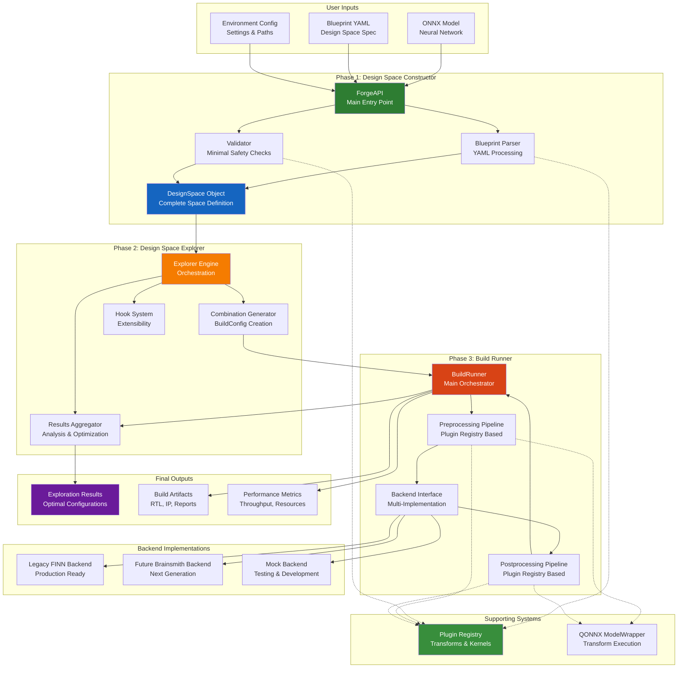

## Complete System Architecture

### Core Principles

1. **Clean Phase Boundaries**: Each phase has clear inputs, outputs, and responsibilities
2. **Self-Contained Configurations**: BuildConfigs include all execution information (model path, transforms, etc.)
3. **Plugin Registry Integration**: Direct O(1) access to transforms and kernels throughout the system
4. **Backend Abstraction**: Multiple FPGA toolchains supported through clean interface
5. **Perfect Code Implementation**: Technical debt eliminated, real transform execution
6. **Extensible Design**: Hook system and plugin architecture enable customization
7. **Fail-Fast Validation**: Errors caught early prevent expensive downstream failures

### Component Responsibilities

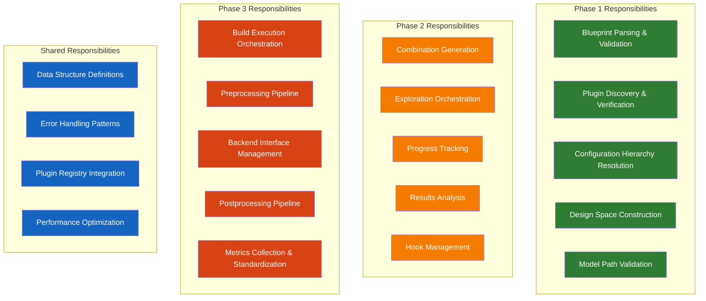

## End-to-End Data Flow

### Complete Workflow

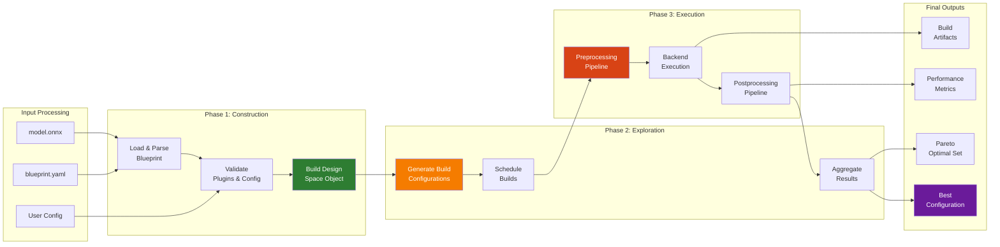

### Data Structure Evolution

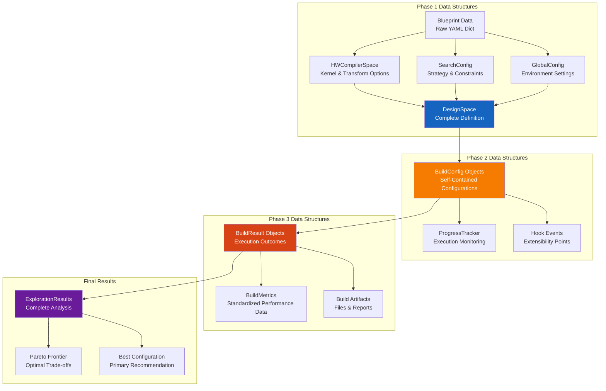

## Phase Integration

### Critical Integration Points

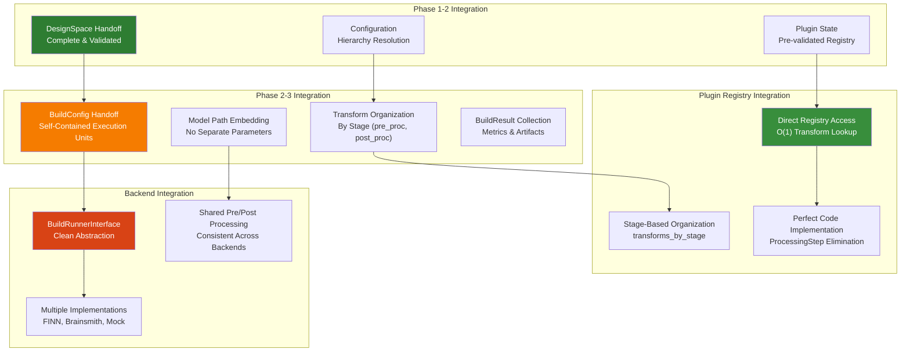

### BuildConfig Self-Containment

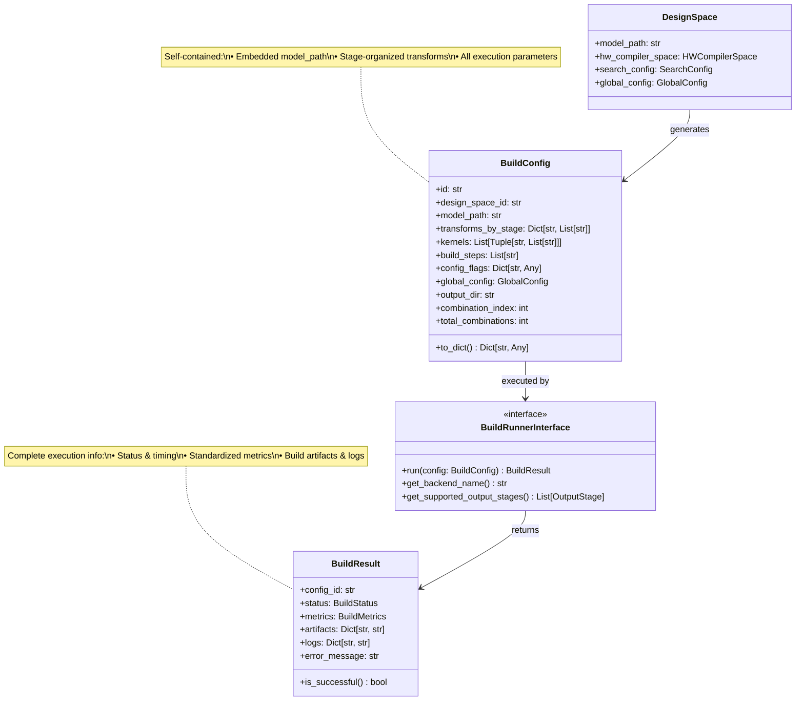

## Component Interaction

### Plugin System Integration

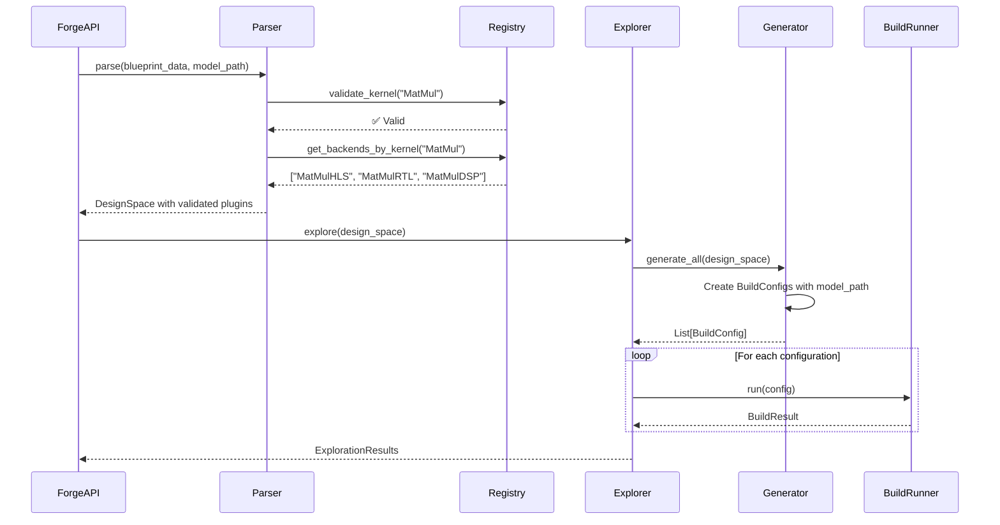

### Hook System Architecture

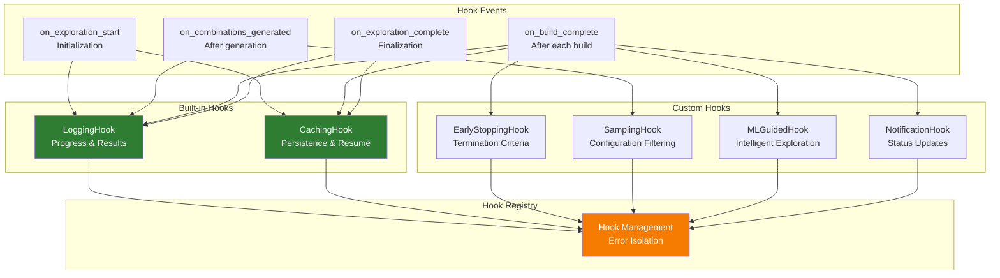

## Backend System Architecture

The multi-backend architecture enables Phase 3 to support different FPGA compilation toolchains through a clean, unified interface.

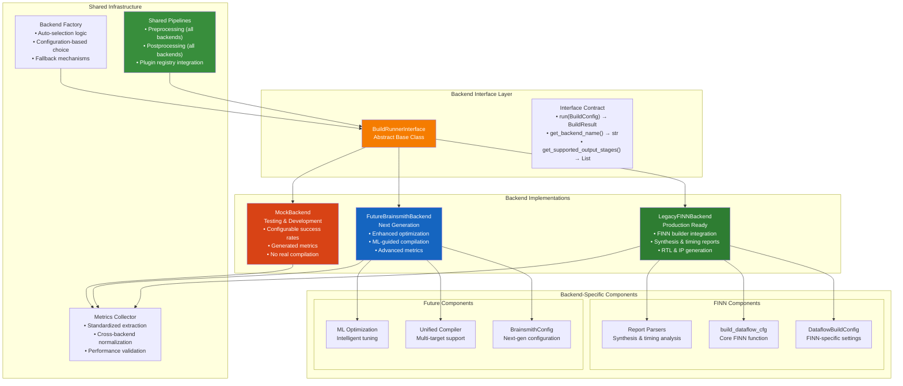

### Backend Selection Strategy

```mermaid
flowchart TB
    START[Backend Selection Request]
    
    AUTO{Auto Selection?}
    EXPLICIT{Explicit Backend Type?}
    
    CHECK_FINN[Check FINN Availability]
    FINN_AVAILABLE{FINN Import Success?}
    
    USE_FINN[Use Legacy FINN Backend]
    USE_FUTURE[Use Future Brainsmith Backend]
    USE_MOCK[Use Mock Backend]
    
    LEGACY_TYPE{Type == "legacy_finn"?}
    FUTURE_TYPE{Type == "future_brainsmith"?}
    MOCK_TYPE{Type == "mock"?}
    
    ERROR[Raise ValueError<br/>Unknown backend type]
    
    START --> AUTO
    AUTO -->|Yes| CHECK_FINN
    AUTO -->|No| EXPLICIT
    
    CHECK_FINN --> FINN_AVAILABLE
    FINN_AVAILABLE -->|Yes| USE_FINN
    FINN_AVAILABLE -->|No| USE_FUTURE
    
    EXPLICIT --> LEGACY_TYPE
    LEGACY_TYPE -->|Yes| USE_FINN
    LEGACY_TYPE -->|No| FUTURE_TYPE
    
    FUTURE_TYPE -->|Yes| USE_FUTURE
    FUTURE_TYPE -->|No| MOCK_TYPE
    
    MOCK_TYPE -->|Yes| USE_MOCK
    MOCK_TYPE -->|No| ERROR
    
    style USE_FINN fill:#2e7d32,color:#fff
    style USE_FUTURE fill:#1565c0,color:#fff
    style USE_MOCK fill:#d84315,color:#fff
    style ERROR fill:#c62828,color:#fff
```

## Plugin Registry Integration

Phase 3 demonstrates Perfect Code principles through direct plugin registry integration, eliminating technical debt and achieving O(1) performance.

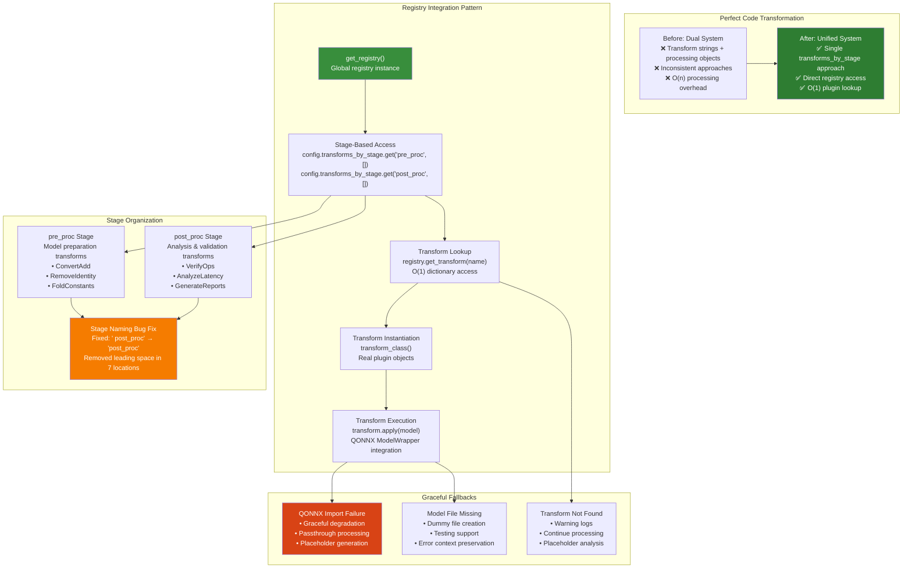

### Perfect Code Implementation Details

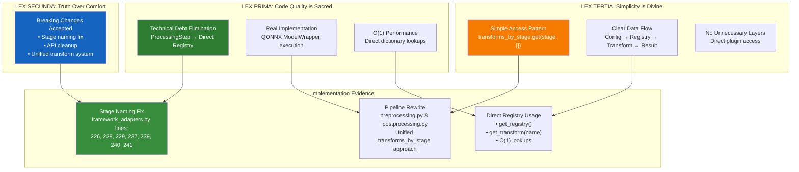

## API Reference

### Core APIs

#### Phase 1: Design Space Constructor

```python
# Simple usage
from brainsmith.core.phase1 import forge

design_space = forge(
    model_path="model.onnx",
    blueprint_path="blueprint.yaml"
)

# Advanced usage with optimization
from brainsmith.core.phase1 import ForgeAPI

api = ForgeAPI(verbose=True)
design_space = api.forge_optimized(
    model_path="model.onnx",
    blueprint_path="blueprint.yaml",
    optimize_plugins=True
)
```

#### Phase 2: Design Space Explorer

```python
# Simple exploration
from brainsmith.core.phase2 import explore, MockBuildRunner

results = explore(
    design_space=design_space,
    build_runner_factory=lambda: MockBuildRunner(success_rate=0.8)
)

# Advanced exploration with hooks
from brainsmith.core.phase2 import ExplorerEngine, LoggingHook, CachingHook

hooks = [
    LoggingHook(log_level="INFO", log_file="exploration.log"),
    CachingHook(cache_dir=".cache")
]

explorer = ExplorerEngine(
    build_runner_factory=create_finn_runner,
    hooks=hooks
)

results = explorer.explore(
    design_space=design_space,
    resume_from="dse_abc12345_config_00050"
)
```

#### Phase 3: Build Runner

```python
# Direct build execution
from brainsmith.core.phase3 import create_build_runner_factory, BuildRunner
from brainsmith.core.phase2.data_structures import BuildConfig

# Create build runner with specific backend
factory = create_build_runner_factory("legacy_finn")
build_runner = factory()

# Execute single build
config = BuildConfig(
    id="config_001",
    model_path="model.onnx",
    transforms_by_stage={
        "pre_proc": ["ConvertAdd", "RemoveIdentity"],
        "post_proc": ["VerifyOps", "AnalyzeLatency"]
    },
    output_dir="/tmp/build_001"
)

result = build_runner.run(config)
print(f"Build status: {result.status}")
if result.metrics:
    print(f"Throughput: {result.metrics.throughput} inf/sec")

# Custom backend implementation
from brainsmith.core.phase3 import BuildRunnerInterface, BuildResult, BuildStatus

class CustomBackend(BuildRunnerInterface):
    def run(self, config: BuildConfig) -> BuildResult:
        result = BuildResult(config_id=config.id)
        # Custom build logic here
        result.complete(BuildStatus.SUCCESS)
        return result
    
    def get_backend_name(self) -> str:
        return "Custom FPGA Backend"
    
    def get_supported_output_stages(self) -> List[OutputStage]:
        return [OutputStage.RTL, OutputStage.STITCHED_IP]
```

#### Complete End-to-End Workflow (Recommended)

```python
# Complete DSE v3 workflow
from brainsmith.core.phase1 import forge
from brainsmith.core.phase2 import explore
from brainsmith.core.phase3 import create_build_runner_factory

# Phase 1: Construct design space
design_space = forge("model.onnx", "blueprint.yaml")
print(f"Design space: {design_space.get_total_combinations()} configurations")

# Phase 2: Explore design space
build_runner_factory = create_build_runner_factory("auto")
results = explore(
    design_space=design_space,
    build_runner_factory=build_runner_factory,
    hooks=[LoggingHook(), CachingHook()]
)

# Results analysis
print(f"Best configuration: {results.best_config.id}")
print(f"Pareto optimal: {len(results.pareto_optimal)} configs")

# Detailed metrics from Phase 3 execution
for config, result in results.get_top_n_configs(5):
    print(f"{config.id}:")
    print(f"  Throughput: {result.metrics.throughput:.2f} inf/sec")
    print(f"  LUT Utilization: {result.metrics.lut_utilization:.1%}")
    print(f"  Build Duration: {result.duration_seconds:.1f}s")

# Access build artifacts
best_result = results.get_successful_results()[0]
print(f"Build artifacts: {list(best_result.artifacts.keys())}")
print(f"RTL path: {best_result.artifacts.get('rtl')}")
```

### Data Structure Reference

#### Key Data Structures

```python
@dataclass
class DesignSpace:
    model_path: str                    # Validated ONNX model path
    hw_compiler_space: HWCompilerSpace # Hardware configuration options
    search_config: SearchConfig         # Exploration strategy
    global_config: GlobalConfig         # Environment settings

@dataclass
class BuildConfig:
    id: str                                # Unique identifier
    design_space_id: str                   # Parent design space
    model_path: str                        # Model path for execution
    kernels: List[Tuple[str, List[str]]]   # Selected kernels
    transforms_by_stage: Dict[str, List[str]]   # Selected transforms by stage
    build_steps: List[str]                 # Build pipeline steps
    config_flags: Dict[str, Any]           # Compiler flags
    global_config: GlobalConfig            # Global parameters
    output_dir: str                        # Build output directory

@dataclass 
class BuildResult:
    config_id: str                     # Links to BuildConfig
    status: BuildStatus                # SUCCESS, FAILED, TIMEOUT, SKIPPED
    metrics: BuildMetrics              # Standardized performance metrics
    start_time: datetime               # Build start time
    end_time: datetime                 # Build completion time
    duration_seconds: float            # Total build duration
    artifacts: Dict[str, str]          # artifact_name -> file_path
    logs: Dict[str, str]               # log_name -> content_or_path
    error_message: str                 # Error details if failed
    
@dataclass
class BuildMetrics:
    # Performance metrics
    throughput: float                  # inferences/second
    latency: float                     # microseconds
    clock_frequency: float             # MHz
    
    # Resource metrics
    lut_utilization: float             # 0.0 to 1.0
    dsp_utilization: float             # 0.0 to 1.0
    bram_utilization: float            # 0.0 to 1.0
    uram_utilization: float            # 0.0 to 1.0
    total_power: float                 # watts
    
    # Quality metrics
    accuracy: float                    # 0.0 to 1.0
    raw_metrics: Dict[str, Any]        # Backend-specific data

@dataclass
class ExplorationResults:
    design_space_id: str               # Links to design space
    start_time: datetime               # Exploration start
    end_time: datetime                 # Exploration end
    evaluations: List[BuildResult]     # All build results from Phase 3
    best_config: BuildConfig           # Highest performing config
    pareto_optimal: List[BuildConfig]  # Pareto frontier
    metrics_summary: Dict[str, Dict]   # Statistical analysis
```

## Performance Characteristics

### Time Complexity

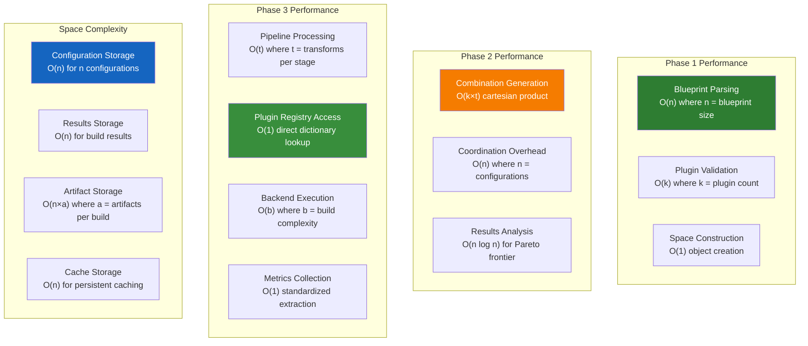

### Scalability Patterns

| Component | Small Scale (< 100 configs) | Medium Scale (100-10K configs) | Large Scale (> 10K configs) |
|-----------|-----------------------------|---------------------------------|-----------------------------|
| **Phase 1** | Instant (< 1s) | Fast (1-5s) | Still fast (5-30s) |
| **Phase 2 Generation** | Instant (< 1s) | Fast (1-10s) | Moderate (10-60s) |
| **Phase 2 Coordination** | Minimal overhead | Low overhead | Moderate overhead |
| **Phase 3 Pipeline** | Instant (< 0.1s) | Fast (< 1s) | Still fast (< 5s) |
| **Phase 3 Backend Execution** | Minutes (build-dependent) | Hours (parallelizable) | Days (distributed) |
| **Memory Usage** | Minimal (< 10MB) | Moderate (10-100MB) | High (100MB-1GB) |
| **Artifact Storage** | Small (< 100MB) | Moderate (< 10GB) | Large (> 10GB) |
| **Resume Capability** | Not needed | Helpful | Essential |

## Extension Points

### Hook System Extensions

```python
# Custom hook implementation
class PerformanceOptimizationHook(ExplorationHook):
    def __init__(self, target_throughput: float):
        self.target_throughput = target_throughput
        self.good_configs_found = 0
    
    def on_exploration_start(self, design_space, exploration_results):
        logger.info(f"Targeting throughput >= {self.target_throughput}")
    
    def on_combinations_generated(self, configs):
        # Could filter configs based on static analysis
        pass
    
    def on_build_complete(self, config, result):
        if result.metrics and result.metrics.throughput >= self.target_throughput:
            self.good_configs_found += 1
            logger.info(f"Found good config #{self.good_configs_found}: {config.id}")
    
    def on_exploration_complete(self, exploration_results):
        logger.info(f"Found {self.good_configs_found} configs meeting target")

# Custom build runner
class CustomBuildRunner(BuildRunnerInterface):
    def __init__(self, backend_type: str):
        self.backend_type = backend_type
    
    def run(self, config: BuildConfig) -> BuildResult:
        # Custom build execution logic
        # Model path available in config.model_path
        # All configuration in config object
        pass
```

### Backend System Extensions

```python
# Custom backend implementation for new FPGA toolchains
from brainsmith.core.phase3 import BuildRunnerInterface, BuildResult, BuildStatus

class CustomFPGABackend(BuildRunnerInterface):
    def __init__(self, toolchain_path: str, optimization_level: int = 2):
        self.toolchain_path = toolchain_path
        self.optimization_level = optimization_level
    
    def run(self, config: BuildConfig) -> BuildResult:
        result = BuildResult(config_id=config.id)
        
        try:
            # Extract model path and transforms from config
            model_path = config.model_path
            transforms = config.transforms_by_stage
            
            # Custom toolchain execution
            build_artifacts = self._execute_custom_toolchain(
                model_path, transforms, config.output_dir
            )
            
            # Collect custom metrics
            metrics = self._collect_custom_metrics(build_artifacts)
            result.metrics = metrics
            result.artifacts = build_artifacts
            
            result.complete(BuildStatus.SUCCESS)
            
        except Exception as e:
            result.complete(BuildStatus.FAILED, str(e))
        
        return result
    
    def get_backend_name(self) -> str:
        return f"Custom FPGA Toolchain v{self.optimization_level}"
    
    def get_supported_output_stages(self) -> List[OutputStage]:
        return [OutputStage.RTL, OutputStage.STITCHED_IP]

# Plugin system extensions for custom transforms
from brainsmith.core.plugins.registry import get_registry

class CustomTransformPipeline:
    def __init__(self):
        self.registry = get_registry()
    
    def register_custom_transforms(self):
        # Register domain-specific transforms
        @transform(stage="custom_optimization")
        class DomainSpecificOptimization:
            def apply(self, model):
                # Custom optimization logic
                return optimized_model
        
        @transform(stage="post_proc") 
        class CustomAnalysis:
            def apply(self, model):
                # Custom analysis logic
                return analysis_model

# Distributed execution extension
class DistributedBuildRunner(BuildRunnerInterface):
    def __init__(self, worker_nodes: List[str], coordinator_address: str):
        self.worker_nodes = worker_nodes
        self.coordinator = coordinator_address
    
    def run(self, config: BuildConfig) -> BuildResult:
        # Serialize config and send to available worker
        worker = self._select_available_worker()
        return self._execute_on_worker(worker, config)
```

## Error Handling

### Error Flow Architecture

```mermaid
flowchart TB
    subgraph "Phase 1 Errors"
        P1E1[BlueprintParseError<br/>YAML syntax/structure]
        P1E2[PluginNotFoundError<br/>Missing plugins]
        P1E3[ValidationError<br/>Invalid configurations]
        P1E4[ConfigurationError<br/>Environment issues]
    end
    
    subgraph "Phase 2 Errors"
        P2E1[GenerationError<br/>Invalid combinations]
        P2E2[ExecutionError<br/>Build coordination failures]
        P2E3[HookError<br/>Hook execution failures]
        P2E4[TimeoutError<br/>Exploration timeouts]
    end
    
    subgraph "Phase 3 Errors"
        P3E1[PreprocessingError<br/>Transform application failures]
        P3E2[BackendError<br/>Build execution failures]
        P3E3[PostprocessingError<br/>Analysis generation failures]
        P3E4[MetricsError<br/>Metrics collection failures]
    end
    
    subgraph "Error Handling Strategy"
        FAIL_FAST[Fail Fast<br/>Phase 1 validation]
        GRACEFUL_CONTINUATION[Graceful Continuation<br/>Phase 2 exploration]
        GRACEFUL_DEGRADATION[Graceful Degradation<br/>Phase 3 pipelines]
        REPORTING[Rich Error Context<br/>User guidance]
        RECOVERY[Recovery Mechanisms<br/>Resume & fallbacks]
    end
    
    P1E1 --> FAIL_FAST
    P1E2 --> FAIL_FAST
    P1E3 --> FAIL_FAST
    P1E4 --> FAIL_FAST
    
    P2E1 --> GRACEFUL_CONTINUATION
    P2E2 --> GRACEFUL_CONTINUATION
    P2E3 --> GRACEFUL_CONTINUATION
    P2E4 --> RECOVERY
    
    P3E1 --> GRACEFUL_DEGRADATION
    P3E2 --> FAIL_FAST
    P3E3 --> GRACEFUL_DEGRADATION
    P3E4 --> GRACEFUL_DEGRADATION
    
    FAIL_FAST --> REPORTING
    GRACEFUL_CONTINUATION --> REPORTING
    GRACEFUL_DEGRADATION --> REPORTING
    RECOVERY --> REPORTING
    
    style FAIL_FAST fill:#c62828,color:#fff
    style GRACEFUL_CONTINUATION fill:#f57c00,color:#fff
    style GRACEFUL_DEGRADATION fill:#d84315,color:#fff
    style RECOVERY fill:#2e7d32,color:#fff
```

### Error Context and Recovery

```python
# Phase 1 error handling
try:
    design_space = forge("model.onnx", "blueprint.yaml")
except BlueprintParseError as e:
    print(f"Blueprint error at line {e.line}: {e.message}")
    print(f"Suggestions: {e.suggestions}")
except PluginNotFoundError as e:
    print(f"Missing plugin: {e.plugin_name}")
    print(f"Available alternatives: {e.alternatives}")

# Phase 2 error handling
try:
    results = explore(design_space, build_runner_factory)
except Exception as e:
    # Phase 2 continues on individual failures
    # Check results for partial completion
    if hasattr(e, 'partial_results'):
        print(f"Completed {e.partial_results.success_count} builds")

# Phase 3 error handling examples
from brainsmith.core.phase3 import create_build_runner_factory

try:
    factory = create_build_runner_factory("legacy_finn")
    build_runner = factory()
    result = build_runner.run(build_config)
    
    if result.status == BuildStatus.FAILED:
        print(f"Build failed: {result.error_message}")
        print(f"Build duration: {result.duration_seconds:.1f}s")
        # Check logs for detailed error information
        if 'build_log' in result.logs:
            print(f"Build log available at: {result.logs['build_log']}")
    
except ImportError as e:
    print("FINN not available, falling back to mock backend")
    factory = create_build_runner_factory("mock")
    
# Preprocessing pipeline error handling
from brainsmith.core.phase3 import PreprocessingPipeline

pipeline = PreprocessingPipeline()
try:
    processed_model = pipeline.execute(config)
except Exception as e:
    print(f"Preprocessing failed, using passthrough: {e}")
    # Pipeline automatically falls back to passthrough processing
    processed_model = pipeline._passthrough_preprocessing(
        config.model_path, config.output_dir
    )
```

## Best Practices

### Configuration Design

```yaml
# ✅ Good: Clear, explicit configuration
version: "3.0"
hw_compiler:
  kernels:
    - "MatMul"                     # Auto-discovery
    - ("Softmax", ["SoftmaxHLS", "SoftmaxRTL"])  # Explicit backends
  transforms:
    cleanup: ["RemoveIdentity", "FoldConstants"]
    optimization: ["~Streamline", "SetPumped"]

# ❌ Avoid: Unclear or implicit configuration
hw_compiler:
  kernels: ["*"]                   # Too broad
  transforms: [["A", "B"], "C"]    # Unclear structure
```

### Performance Optimization

```python
# ✅ Good: Use hooks for monitoring
hooks = [
    LoggingHook(log_level="INFO"),           # Progress tracking
    CachingHook(cache_dir=".cache"),         # Resume capability
    EarlyStoppingHook(max_failures=50)      # Termination criteria
]

# ✅ Good: Constraint filtering
search:
  constraints:
    - metric: "lut_utilization"
      operator: "<="
      value: 0.85

# ✅ Good: Resume long explorations
results = explorer.explore(
    design_space,
    resume_from="dse_abc12345_config_00050"
)
```

### Integration Patterns

```python
# ✅ Good: Complete end-to-end pipeline
def create_complete_dse_pipeline(model_path: str, blueprint_path: str):
    # Phase 1: Construction with validation
    design_space = forge(model_path, blueprint_path)
    logger.info(f"Design space: {design_space.get_total_combinations()} configurations")
    
    # Phase 2: Exploration with proper backend
    build_runner_factory = create_build_runner_factory("auto")
    explorer = ExplorerEngine(
        build_runner_factory=build_runner_factory,
        hooks=[LoggingHook(), CachingHook()]
    )
    
    # Execute exploration
    results = explorer.explore(design_space)
    
    # Analyze results with Phase 3 artifacts
    best_result = results.get_successful_results()[0]
    logger.info(f"Best config artifacts: {list(best_result.artifacts.keys())}")
    
    return results

# ✅ Good: Custom backend integration
def create_custom_backend_pipeline():
    # Define custom backend
    class OptimizedBackend(BuildRunnerInterface):
        def run(self, config: BuildConfig) -> BuildResult:
            # Extract model path and transforms from config
            model_path = config.model_path
            transforms_by_stage = config.transforms_by_stage
            
            # Custom optimization logic
            result = self._execute_optimized_build(model_path, transforms_by_stage)
            return result
    
    # Use custom backend in exploration
    factory = lambda: BuildRunner(OptimizedBackend())
    results = explore(design_space, factory)
    
    return results

# ✅ Good: Error handling across all phases
def robust_dse_execution(model_path, blueprint_path):
    try:
        # Phase 1: Fail-fast validation
        design_space = forge(model_path, blueprint_path)
        
        # Phase 2: Graceful continuation on individual failures
        build_runner_factory = create_build_runner_factory("auto")
        results = explore(design_space, build_runner_factory)
        
        # Check for any successful builds
        successful_results = results.get_successful_results()
        if not successful_results:
            logger.error("No successful builds found")
            return None
            
        # Analyze artifacts from Phase 3
        for result in successful_results[:5]:  # Top 5 results
            logger.info(f"Config {result.config_id}:")
            logger.info(f"  Metrics: {result.metrics}")
            logger.info(f"  Artifacts: {list(result.artifacts.keys())}")
        
        return results
        
    except ValidationError as e:
        logger.error(f"Phase 1 validation failed: {e}")
        return None
    except Exception as e:
        logger.error(f"Exploration failed: {e}")
        return None

# ✅ Good: Plugin registry best practices
def configure_custom_transforms():
    from brainsmith.core.plugins.registry import get_registry
    
    # Access registry for transform configuration
    registry = get_registry()
    
    # Verify transforms are available before use
    required_transforms = ["ConvertAdd", "RemoveIdentity", "AnalyzeLatency"]
    for transform_name in required_transforms:
        if not registry.get_transform(transform_name):
            logger.warning(f"Transform '{transform_name}' not available")
    
    # Configure stage-based transforms
    blueprint_config = {
        "hw_compiler": {
            "transforms": {
                "pre_proc": ["ConvertAdd", "RemoveIdentity"], 
                "post_proc": ["AnalyzeLatency", "VerifyOps"]
            }
        }
    }
    
    return blueprint_config
```

## Summary

The complete Brainsmith DSE v3 system provides a robust, scalable, end-to-end solution for FPGA AI accelerator development. Key architectural strengths include:

### Phase Integration Excellence
- **Clean Phase Boundaries**: Each phase has clear inputs, outputs, and responsibilities
- **Self-Contained Configurations**: BuildConfigs include all execution information (model path, transforms, settings)
- **Seamless Data Flow**: DesignSpace → BuildConfig → BuildResult → ExplorationResults

### Perfect Code Implementation
- **Technical Debt Elimination**: Dual transform/processing system unified into transforms_by_stage
- **O(1) Performance**: Direct dictionary lookups throughout the system
- **Real Transform Execution**: QONNX ModelWrapper integration with graceful fallbacks
- **Stage Naming Fix**: Critical bug fix ensuring proper transform stage matching

### Multi-Backend Architecture
- **Backend Abstraction**: Clean BuildRunnerInterface supporting multiple FPGA toolchains
- **Shared Pipelines**: Consistent preprocessing/postprocessing across all backends
- **Production Ready**: Legacy FINN backend with synthesis and timing analysis
- **Future Extensible**: Framework for next-generation toolchains

### Plugin Registry Integration
- **Direct Access**: O(1) plugin lookups across all phases
- **Stage Organization**: Transform organization by 'pre_proc' and 'post_proc' stages
- **Framework Support**: QONNX and FINN transforms seamlessly integrated
- **Graceful Fallbacks**: Robust handling when plugins or frameworks unavailable

### Comprehensive Error Handling
- **Fail-Fast Validation**: Phase 1 catches errors early to prevent expensive failures
- **Graceful Continuation**: Phase 2 continues exploration despite individual build failures
- **Graceful Degradation**: Phase 3 pipelines degrade gracefully with informative fallbacks
- **Rich Context**: Detailed error messages with recovery suggestions

### Performance and Scalability
- **Efficient Algorithms**: Optimized for both small-scale testing and large-scale exploration
- **Resume Capability**: Support for long-running explorations with checkpoint recovery
- **Memory Efficiency**: Linear scaling with minimal overhead
- **Parallel Ready**: Architecture supports future distributed execution

### Extensibility Points
- **Hook System**: Comprehensive extension points for custom exploration behavior
- **Custom Backends**: Clean interface for new FPGA toolchain integration
- **Plugin System**: Support for domain-specific transforms and optimizations
- **Framework Integration**: Easy integration with external tools and libraries

This architecture successfully delivers on the Perfect Code framework principles while providing both easy-to-use APIs for common cases and extensive customization capabilities for advanced scenarios. The three-phase system creates a complete toolchain from ONNX models to optimized FPGA implementations.