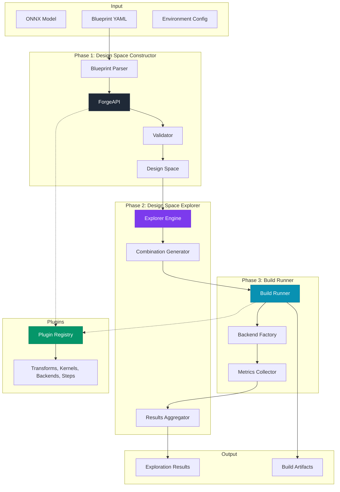

# Brainsmith Core: DSE v3 Architecture

## Overview

Brainsmith DSE v3 is a three-phase design space exploration system for FPGA AI accelerator development. It systematically explores hardware implementation options for neural networks, evaluating different algorithms, parallelization strategies, and resource allocations to find optimal configurations.

## Table of Contents

1. [System Architecture](#system-architecture)
2. [Three-Phase Pipeline](#three-phase-pipeline)
3. [Data Flow](#data-flow)
4. [Plugin System](#plugin-system)
5. [Backend System](#backend-system)
6. [Configuration](#configuration)
7. [API Reference](#api-reference)
8. [Error Handling](#error-handling)
9. [Performance](#performance)
10. [Extension Guide](#extension-guide)

## System Architecture



### Core Concepts

- **Design Space**: Complete set of possible hardware implementations (`DesignSpace` class)
- **Blueprint**: YAML configuration defining the exploration space
- **Build Configuration**: Specific point in the design space (`BuildConfig`)

## Three-Phase Pipeline

### [Phase 1: Design Space Constructor](../../docs/PHASE2_ARCHITECTURE.md)


Parses blueprint YAML, validates constraints, expands all variant combinations, and outputs a complete design space for exploration.

### [Phase 2: Design Space Explorer](../../docs/PHASE2_ARCHITECTURE.md)


Generates build configurations from design space, estimates performance metrics, ranks by Pareto optimality, executes selected builds in parallel, and aggregates results.

### [Phase 3: Build Runner](../../docs/PHASE3_ARCHITECTURE.md)


Selects appropriate backend (FINN/Future/Mock), applies preprocessing transforms, executes hardware build, runs postprocessing steps, and collects standardized metrics. \n

## Data Structure Flow


## Plugin System

### Plugin Types

- **Transforms**: Model graph transformations (`@transform` decorator)
- **Kernels**: Hardware operator implementations (`@kernel` decorator)
- **Backends**: Code generation backends (`@backend` decorator)
- **Steps**: Pipeline processing steps (`@step` decorator)

**Detailed Plugin Documentation:** [Plugin Architecture](plugins/ARCHITECTURE.md)

### Registration Example

```python
@transform(name="CustomOpt", stage="optimization", framework="qonnx")
class CustomOptimization:
    def apply(self, model):
        return model

@kernel(name="MatMul", backends=["hls", "rtl"])
class MatMul:
    def get_nodeattr_types(self):
        return {"folding": ("i", True, 1)}
```

## Backend System

### Factory Pattern


### Backend Interface

```python
class BuildRunnerInterface:
    def get_backend_name(self) -> str
    def get_supported_output_stages(self) -> List[OutputStage]
    def run(self, config: BuildConfig) -> BuildResult
```

## Configuration

### Blueprint Schema

```yaml
version: "3.0"
name: "BERT Exploration"
description: "Blueprint for exploring BERT acceleration options"

hw_compiler:
  # For future FINN-Brainsmith API (not yet implemented)
  kernels:
    # Kernel name and backend options
    - ["MatrixVectorUnit", ["hls", "rtl"]]
    - ["LayerNorm", ["hls"]]
    - ["Softmax", ["hls", "rtl"]]
    
  transforms:
    # Transform stages and options
    cleanup:
      - "RemoveIdentityOps"
      - "RemoveUnusedTensors"
    topology_opt:
      - "ExpandNorms"
      - "FoldConstants"
      
  # For legacy FINN backend only
  build_steps:
    # Sequential pipeline execution steps
    - "cleanup"
    - "brainsmith:qonnx_to_finn"
    - "streamline"
    - "create_dataflow_partition"
    - "specialize_layers"
    - "hw_codegen"
    - "finn:create_stitched_ip"
    
  config_flags:
    target_device: "xczu7ev-ffvc1156-2-e"
    target_clock_ns: 3.33
    target_fps: 1000

finn_config:
  board: "Pynq-Z1"
  clock_period_ns: 3.33
  auto_fifo_depths: true

search:
  strategy: "exhaustive"  # or "random", "genetic"
  constraints:
    max_luts: 100000
    max_brams: 500

global:
  output_stage: "stitched_ip"
  working_directory: "./dse_results"
```

### Environment Configuration

```yaml
dse:
  phase2:
    explorer:
      parallel_evaluations: 8
      timeout_per_build_s: 3600
    ranking:
      algorithm: "pareto"
      weights:
        performance: 0.4
        resources: 0.3
        power: 0.3
  
  phase3:
    backends:
      finn:
        vivado_path: "/opt/Xilinx/Vivado/2022.2"
        build_dir: "/tmp/finn_builds"

environment:
  output_dir: "./dse_results"
  log_level: "INFO"
```

## API Reference

### Core API

```python
# Simple usage
from brainsmith.core import explore
results = explore("model.onnx", "blueprint.yaml")

# Advanced usage
from brainsmith.core.phase1 import ForgeAPI
from brainsmith.core.phase2 import ExplorerEngine

forge = ForgeAPI()
design_space = forge.parse_blueprint("exploration.yaml")

explorer = ExplorerEngine(design_space, max_workers=8)
results = explorer.explore(selection_ratio=0.1)
```

### Plugin API

```python
from brainsmith.core.plugins import transforms as tfm

# Direct access
model = tfm.FoldConstants().apply(model)

# Query plugins
cleanup_transforms = tfm.find(stage="cleanup")
hls_kernels = kern.find(backend="hls")
```

### Results API

```python
# Analysis
best = results.get_best()
pareto = results.get_pareto_frontier()
df = results.to_dataframe()

# Visualization
results.plot_pareto_frontier(x="resources.lut", y="performance.fps")

# Export
results.export_configs("top_configs.json", top_k=10)
results.generate_report("report.html")
```

## Error Handling

### Error Hierarchy


### Recovery Strategy

- **Transient errors**: Retry with exponential backoff
- **Permanent errors**: Skip configuration, continue exploration
- **Fatal errors**: Clean shutdown with partial results

## Performance

### Complexity Analysis

| Component | Operation | Time | Space |
|-----------|-----------|------|-------|
| Plugin Registry | Lookup | O(1) | O(n) |
| Design Space | Generation | O(∏di) | O(∏di) |
| Ranking | Pareto frontier | O(n log n) | O(n) |
| Build Execution | Parallel | O(n/p) | O(p) |

### Optimizations

- Pre-computed plugin indexes for O(1) access
- Parallel build execution with thread pools
- Transform result caching
- Early pruning of invalid configurations

## Extension Guide

### Adding Custom Components

1. **Transform**: Inherit base class, add `@transform` decorator
2. **Kernel**: Inherit `HWCustomOp`, add `@kernel` decorator  
3. **Backend**: Implement `BuildRunnerInterface`, add `@backend` decorator
4. **Step**: Define logic, add `@step` decorator

### Lifecycle Hooks

```python
class CustomHooks(ExplorationHooks):
    def on_exploration_start(self, design_space):
        print(f"Starting exploration of {len(design_space)} configs")
    
    def on_build_complete(self, result):
        if result.status == BuildStatus.FAILED:
            print(f"Build failed: {result.error}")

explorer.register_hooks(CustomHooks())
```

### Integration Examples

```python
# MLflow integration
import mlflow
with mlflow.start_run():
    results = explore("model.onnx", "blueprint.yaml")
    mlflow.log_metric("best_fps", results.get_best().metrics.performance.fps)

# CI/CD testing
def test_model_meets_requirements():
    results = explore("model.onnx", "ci_blueprint.yaml")
    assert results.get_best().metrics.performance.fps >= 1000
```

---

*For implementation details, see the source code and inline documentation in the respective module files.*