# Phase 1: Design Space Constructor - Architecture Document

## Overview

Phase 1 of the Brainsmith DSE v3 toolchain is responsible for transforming user inputs (ONNX model + Blueprint YAML) into a validated, structured `DesignSpace` object. This document provides comprehensive architectural documentation with visual diagrams.

## Table of Contents

1. [High-Level Architecture](#high-level-architecture)
2. [Component Architecture](#component-architecture)
3. [Data Flow](#data-flow)
4. [Class Relationships](#class-relationships)
5. [Sequence Diagrams](#sequence-diagrams)
6. [Error Handling](#error-handling)
7. [Plugin Integration](#plugin-integration)
8. [Configuration Management](#configuration-management)

## High-Level Architecture

Phase 1 serves as the entry point for the DSE system, preparing the design space for exploration in Phase 2.


## Component Architecture

Phase 1 consists of several key components working together to parse, validate, and construct the design space.


## Data Flow

The data flow through Phase 1 shows how raw inputs are transformed into validated design spaces.

```mermaid
flowchart LR
    subgraph "Inputs"
        MODEL[model.onnx]
        YAML[blueprint.yaml]
        CONFIG[Config Sources<br/>- Environment<br/>- User Config<br/>- Defaults]
    end
    
    subgraph "Parsing"
        LOAD[Load Blueprint<br/>YAML → Dict]
        PARSE[Parse Sections<br/>- hw_compiler<br/>- processing<br/>- search<br/>- global]
        VALIDATE_PLUGINS[Validate Plugins<br/>- Check existence<br/>- Auto-discover backends]
    end
    
    subgraph "Construction"
        BUILD_DS[Build DesignSpace<br/>- HWCompilerSpace<br/>- ProcessingSpace<br/>- SearchConfig<br/>- GlobalConfig]
    end
    
    subgraph "Validation"
        VAL_MODEL[Validate Model<br/>- File exists<br/>- Is ONNX]
        VAL_CONFIG[Validate Config<br/>- Constraints<br/>- Limits<br/>- Paths]
        VAL_SPACE[Validate Space<br/>- Combinations<br/>- Feasibility]
    end
    
    subgraph "Output"
        DS[DesignSpace<br/>Object]
    end
    
    MODEL --> VAL_MODEL
    YAML --> LOAD
    CONFIG --> PARSE
    LOAD --> PARSE
    PARSE --> VALIDATE_PLUGINS
    VALIDATE_PLUGINS --> BUILD_DS
    BUILD_DS --> VAL_CONFIG
    VAL_MODEL --> VAL_SPACE
    VAL_CONFIG --> VAL_SPACE
    VAL_SPACE --> DS
```



## Class Relationships

The core data structures and their relationships define the design space representation.


## Sequence Diagrams

### Main Forge Process

The sequence of operations when constructing a design space.


### Kernel Auto-Discovery

How kernels specified as simple strings get their backends auto-discovered.


## Error Handling

Phase 1 implements comprehensive error handling with helpful suggestions.


## Plugin Integration

How Phase 1 integrates with the plugin registry for validation and auto-discovery.


## Configuration Management

The hierarchical configuration system allows settings at multiple levels.


## Key Design Decisions

### 1. Direct Model Path
- ONNX model path is passed directly without analysis
- Validation ensures file exists and has .onnx extension
- Keeps Phase 1 focused on blueprint parsing

### 2. Plugin-Aware Parsing
- All plugin references validated at parse time
- Auto-discovery reduces blueprint verbosity
- Helpful error messages with available alternatives

### 3. Combinatorial Expansion
- Design space defines the space, not individual configs
- Lazy evaluation - combinations generated on demand
- Supports complex patterns (optional, mutually exclusive)

### 4. Fail-Fast Validation
- Comprehensive validation before expensive operations
- Errors vs warnings distinction
- Multiple errors collected and reported together

### 5. Clean Separation
- Phase 1 only constructs the space
- No execution or exploration logic
- Clear handoff to Phase 2 via DesignSpace object

## Usage Example

```python
from brainsmith.core.phase1 import forge

# Simple usage
design_space = forge("model.onnx", "blueprint.yaml")
print(f"Total combinations: {design_space.get_total_combinations()}")

# With optimization analysis
from brainsmith.core.phase1 import ForgeAPI
api = ForgeAPI(verbose=True)
design_space = api.forge_optimized("model.onnx", "blueprint.yaml")
```

## Summary

Phase 1 provides a robust, validated foundation for the DSE system by:
- Parsing complex blueprint specifications
- Validating all configurations against the plugin registry
- Auto-discovering available options
- Constructing a complete design space representation
- Providing clear error messages and helpful suggestions

The architecture emphasizes simplicity, correctness, and performance while maintaining flexibility for future enhancements.