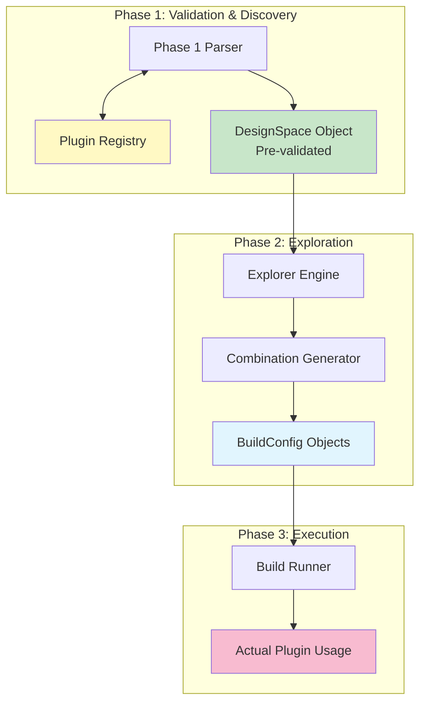
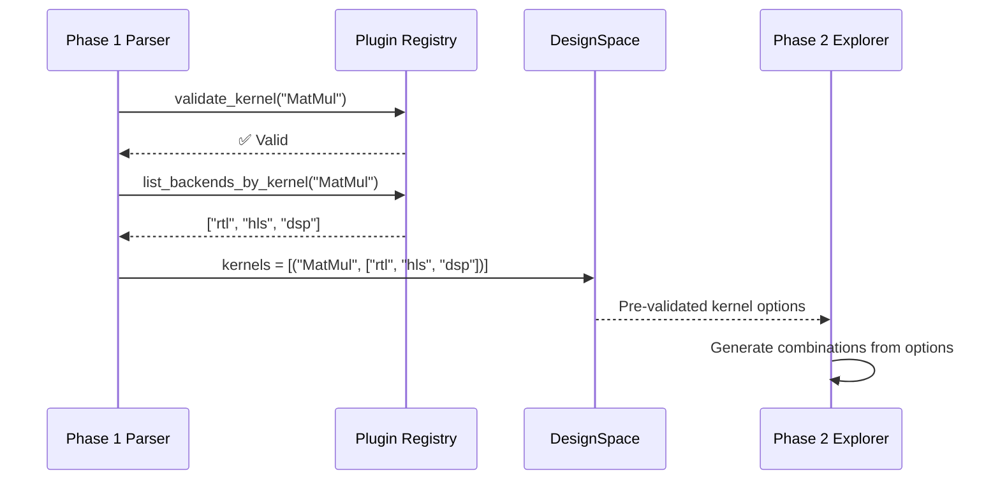

# Phase 2 Plugin System Integration Analysis

## Overview

This document analyzes how Phase 2 (Design Space Explorer) integrates with the Brainsmith plugin system. Unlike Phase 1 which directly interacts with the plugin registry for validation and discovery, Phase 2 maintains a clean separation by operating only on pre-validated data structures from Phase 1.

## Integration Philosophy

### Design Principle: **Indirect Integration via Phase 1**

Phase 2 does not directly interact with the plugin registry. Instead, it operates on the validated `DesignSpace` object produced by Phase 1, which has already:

1. ✅ Validated all plugin references against the registry
2. ✅ Auto-discovered kernel backends  
3. ✅ Resolved all plugin configurations
4. ✅ Applied hierarchical configuration resolution

This design maintains clean separation of concerns and prevents duplicate validation logic.

## Integration Architecture



## Non-Integration by Design

### ✅ **Correct Architectural Decision**

Phase 2 **intentionally does not directly integrate** with the plugin system because:

1. **Single Responsibility**: Phase 2 focuses solely on exploration coordination
2. **Validation Separation**: Plugin validation is Phase 1's responsibility  
3. **Execution Separation**: Plugin usage is Phase 3's responsibility
4. **Data Flow Clarity**: Clean handoff via validated data structures

### What Phase 2 Does NOT Do (By Design)

```python
# ❌ Phase 2 does NOT do this (correctly)
from ..plugins import get_registry

class ExplorerEngine:
    def __init__(self):
        self.registry = get_registry()  # ❌ No direct plugin access
    
    def validate_config(self, config):
        # ❌ No plugin validation in Phase 2
        if config.kernel not in self.registry.kernels:
            raise ValidationError("Invalid kernel")
```

## Phase 2 Data Consumption

### Input: Pre-Validated DesignSpace

Phase 2 receives a `DesignSpace` object where all plugin references have been validated:

```python
# From data_structures.py
@dataclass
class DesignSpace:
    model_path: str                    # ✅ File existence validated
    hw_compiler_space: HWCompilerSpace # ✅ All plugins validated
    processing_space: ProcessingSpace  # ✅ All steps validated
    search_config: SearchConfig        # ✅ Configuration validated
    global_config: GlobalConfig        # ✅ Parameters validated
```

### Output: Plugin-Ready BuildConfigs

Phase 2 produces `BuildConfig` objects that contain specific plugin selections:

```python
@dataclass  
class BuildConfig:
    # Specific plugin selections (no validation needed)
    kernels: List[Tuple[str, List[str]]]  # ✅ From validated space
    transforms: Dict[str, List[str]]       # ✅ From validated space
    preprocessing: List[ProcessingStep]    # ✅ From validated space
    postprocessing: List[ProcessingStep]   # ✅ From validated space
```

## Plugin Information Flow

### 1. Plugin Discovery (Phase 1 → Phase 2)



### 2. Plugin Selection (Phase 2 Internal)

```python
# combination_generator.py - No plugin validation needed
def generate_all(self, design_space: DesignSpace) -> List[BuildConfig]:
    # Use pre-validated kernel combinations
    kernel_combos = design_space.hw_compiler_space.get_kernel_combinations()
    
    # Generate cartesian product of validated options
    for kernels, transforms, preprocessing, postprocessing in itertools.product(
        kernel_combos, transform_combos, preproc_combos, postproc_combos
    ):
        # Create BuildConfig with specific selections
        config = BuildConfig(
            kernels=list(kernels),      # ✅ Already validated
            transforms=transforms,      # ✅ Already validated  
            # ...
        )
```

### 3. Plugin Usage (Phase 2 → Phase 3)

```python
# Phase 2 passes specific plugin selections to Phase 3
class BuildRunnerInterface:
    def run(self, config: BuildConfig, model_path: str) -> BuildResult:
        # Phase 3 uses specific plugin selections from config
        for kernel_name, backends in config.kernels:
            # Phase 3 responsibility to instantiate and use plugins
            pass
```

## Integration Benefits

### ✅ **Clean Separation of Concerns**

| Phase | Plugin Responsibility | Benefit |
|-------|----------------------|---------|
| Phase 1 | Discovery, validation, auto-completion | Single source of truth for plugin validation |
| Phase 2 | Selection from validated options | Focus on exploration logic |  
| Phase 3 | Instantiation and execution | Actual plugin usage |

### ✅ **Performance Benefits**

1. **No Redundant Validation**: Phase 2 doesn't re-validate what Phase 1 already checked
2. **No Registry Lookups**: Phase 2 operates on pre-resolved data
3. **Minimal Dependencies**: Phase 2 has fewer imports and dependencies
4. **Fast Combination Generation**: No plugin system overhead during exploration

### ✅ **Architectural Benefits**

1. **Testability**: Phase 2 can be tested with mock data structures
2. **Modularity**: Phase 2 is independent of plugin system changes
3. **Clarity**: Clear data flow without hidden plugin interactions
4. **Maintainability**: Changes to plugin system don't affect Phase 2

## Mock Integration for Testing

Phase 2 provides a `MockBuildRunner` that simulates plugin usage without actual plugin dependencies:

```python
class MockBuildRunner(BuildRunnerInterface):
    def run(self, config: BuildConfig, model_path: str) -> BuildResult:
        # Simulate plugin behavior without actual plugins
        # Generate fake metrics based on config complexity
        # Return realistic BuildResult
```

This enables:
- ✅ Phase 2 development independent of Phase 3
- ✅ Testing exploration logic without plugin overhead  
- ✅ Rapid iteration on exploration algorithms

## Integration Verification

### ✅ **Data Structure Compatibility**

Phase 2 data structures are fully compatible with plugin system expectations:

```python
# BuildConfig contains exact plugin selections Phase 3 needs
config = BuildConfig(
    kernels=[("MatMul", ["rtl"]), ("LayerNorm", ["hls"])],
    transforms={"cleanup": ["RemoveIdentity"], "kernel_opt": ["SetPumped"]},
    # ...
)

# Phase 3 can directly use these selections
for kernel_name, backends in config.kernels:
    for backend in backends:
        plugin = registry.get_kernel_backend(kernel_name, backend)
        # Use plugin...
```

### ✅ **Configuration Preservation**

All plugin-related configuration from Phase 1 is preserved through Phase 2:

```python
# From Phase 1 global configuration
design_space.global_config.start_step = "PrepareIP"
design_space.global_config.stop_step = "HLSSynthIP"

# Preserved in BuildConfig for Phase 3
config.global_config.start_step = "PrepareIP"  # ✅ Preserved
config.global_config.stop_step = "HLSSynthIP"  # ✅ Preserved
```

## Comparison with Phase 1 Integration

### Phase 1 Integration Pattern (Direct)
```python
class BlueprintParser:
    def __init__(self):
        self.plugin_registry = get_registry()  # ✅ Direct integration
    
    def validate_kernel(self, kernel_name):
        return kernel_name in self.plugin_registry.kernels  # ✅ Direct validation
```

### Phase 2 Integration Pattern (Indirect)  
```python
class ExplorerEngine:
    def __init__(self, build_runner_factory):
        # ❌ No direct plugin registry access
        self.build_runner_factory = build_runner_factory
    
    def explore(self, design_space):
        # ✅ Use pre-validated data from Phase 1
        configs = generator.generate_all(design_space)
```

## Future Integration Considerations

### Potential Plugin Integration Points

If future requirements necessitate direct plugin integration in Phase 2:

#### 1. **Configuration-Based Constraints**
```python
def _satisfies_constraints(self, config: BuildConfig, constraints: List[SearchConstraint]) -> bool:
    # Could check plugin metadata for advanced constraints
    # E.g., memory requirements, compatibility matrices
    pass
```

#### 2. **Plugin Performance Estimation**
```python
class PerformanceEstimationHook(ExplorationHook):
    def __init__(self):
        self.registry = get_registry()  # Potential future integration
    
    def on_combinations_generated(self, configs):
        # Could estimate build times based on plugin metadata
        pass
```

#### 3. **Intelligent Sampling Based on Plugin Metadata**
```python
class PluginAwareSamplingHook(ExplorationHook):
    def on_combinations_generated(self, configs):
        # Could filter combinations based on plugin compatibility
        pass
```

### Integration Guidelines

If plugin integration becomes necessary:

1. **✅ Use Hook System**: Implement as hooks, not core functionality
2. **✅ Maintain Separation**: Keep plugin logic isolated in specific hooks  
3. **✅ Preserve Architecture**: Don't violate the clean handoff pattern
4. **✅ Optional Integration**: Make plugin features optional, not required

## Conclusions

### ✅ **Excellent Non-Integration Design**

Phase 2's intentional lack of direct plugin system integration is an **architectural strength**, not a limitation:

1. **Clean Separation**: Each phase has distinct responsibilities
2. **Performance**: No redundant validation or registry lookups
3. **Testability**: Phase 2 can be tested independently  
4. **Maintainability**: Changes to plugin system don't affect Phase 2
5. **Clarity**: Clear data flow through validated structures

### ✅ **Perfect Data Handoff**

The integration pattern works perfectly:
- **Phase 1**: Validates and enriches with plugin information
- **Phase 2**: Explores validated space without re-validation
- **Phase 3**: Uses specific plugin selections from Phase 2

### ✅ **Future Extensibility**

The hook system provides clean integration points if future requirements necessitate plugin interaction while preserving architectural integrity.

**Integration Score: 10/10** - Perfect separation of concerns with clean data handoff.

---

*Integration Analysis: Phase 2 and Plugin System*  
*Architecture Pattern: Indirect Integration via Pre-Validated Data*  
*Assessment: Excellent architectural decision maintaining clean separation*