# Brainsmith Plugin System Architecture

## Overview

The Brainsmith plugin system is a high-performance registry-based architecture that manages transforms, kernels, backends, and steps for FPGA compilation. It achieves zero discovery overhead through decoration-time registration and provides O(1) plugin access through direct class returns.

## Core Design Principles

1. **Direct Registration** - Plugins register at decoration time, eliminating discovery
2. **Pre-computed Indexes** - All lookups are optimized through indexing at registration
3. **Direct Class Access** - Collections return actual classes, not wrapper objects
4. **Universal Framework Support** - All plugin types support framework qualification
5. **Perfect Code Simplicity** - Minimal abstraction layers, maximum clarity

## High-Level Architecture

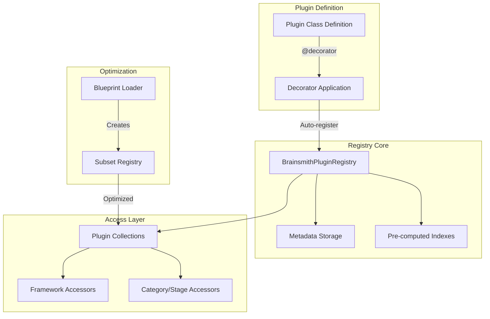

## Component Architecture

### 1. Registry (`registry.py`)

The central component that stores all plugins and maintains indexes for efficient queries.

#### Registry Data Structure

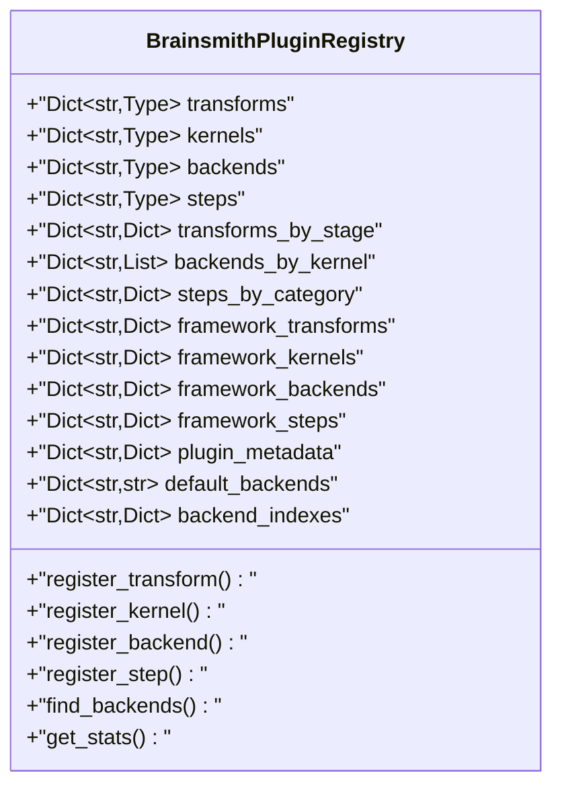

#### Key Design Decisions

- **Steps are first-class plugins** - Separate registry, not transforms with metadata
- **Universal framework support** - All plugin types have framework indexes
- **Backend names are unique** - Not composite keys like "Kernel_hls"
- **Direct class storage** - No wrapper objects in registry
- **Multiple indexes** - Enable O(1) queries by different criteria

### 2. Decorators (`decorators.py`)

Provide auto-registration at decoration time with validation.

#### Registration Flow

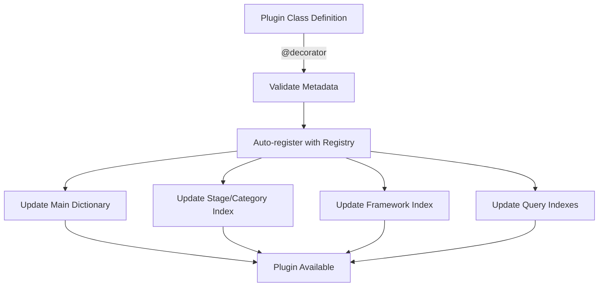

#### Decorator Types

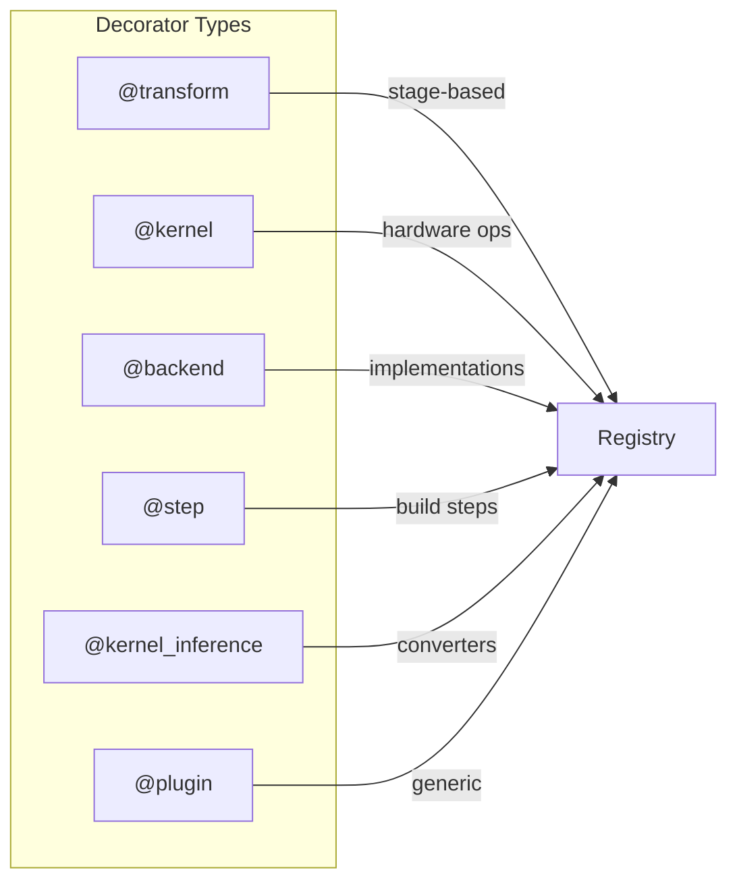

All decorators support `framework` parameter for framework qualification.

### 3. Collections (`plugin_collections.py`)

Provide natural access patterns through direct registry delegation.

#### Collection Access Flow

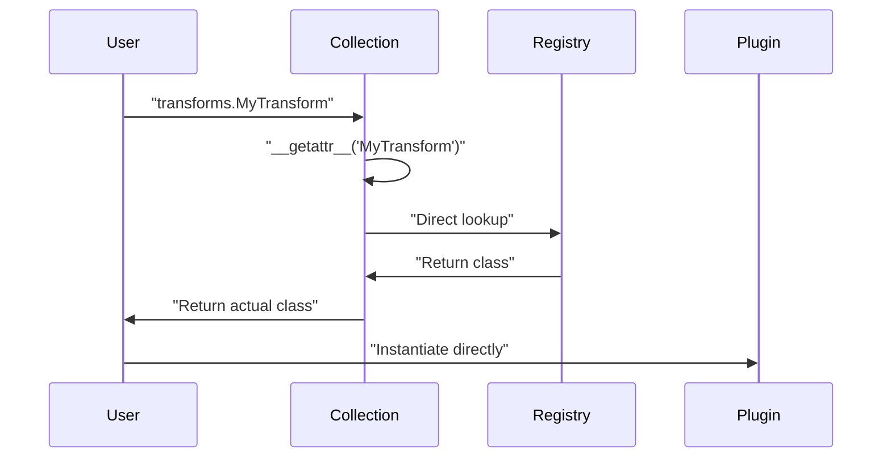

#### Access Patterns

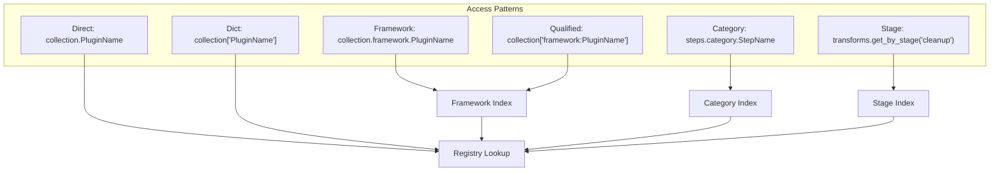

### 4. Framework Adapters (`framework_adapters.py`)

Integrate external QONNX and FINN plugins.

#### Framework Integration Flow

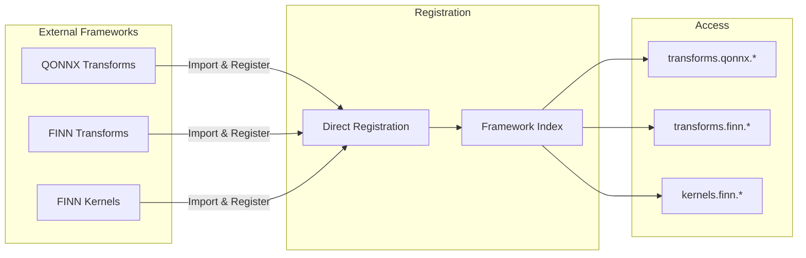

No wrapper classes needed - external classes are registered directly.

### 5. Blueprint Loader (`blueprint_loader.py`)

Optimizes plugin loading for production by creating subset registries.

#### Blueprint Processing Pipeline

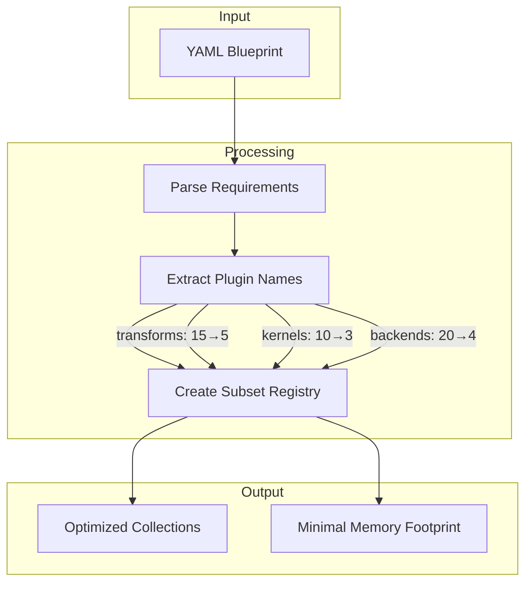

## Data Flow

### Plugin Registration

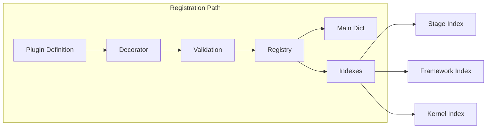

### Plugin Access

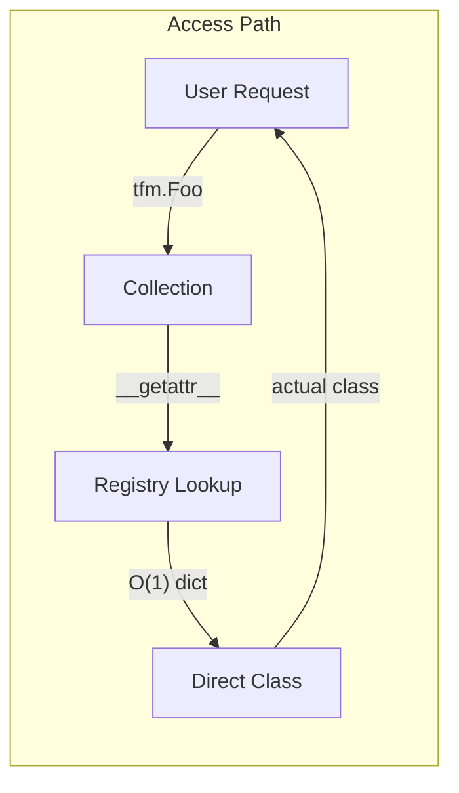

### Query Operations

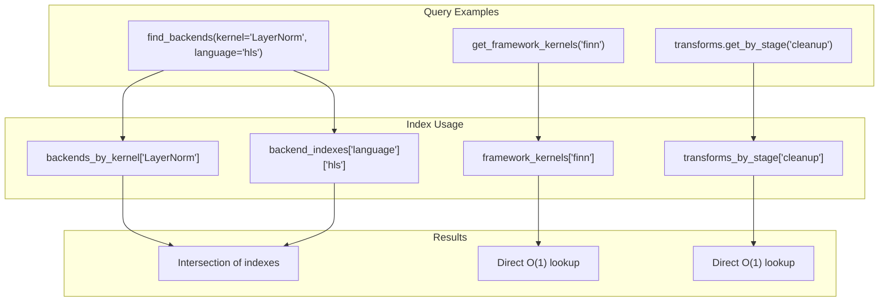

## Performance Characteristics

### Time Complexity

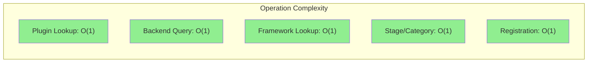

### Space Complexity

- **Main storage**: O(n) where n = number of plugins
- **Framework indexes**: O(f*n) where f = frameworks, n = plugins per framework
- **Category/stage indexes**: O(c*n) where c = categories/stages
- **Metadata**: O(n*p) where p = avg properties per plugin

### Startup Performance

- **Import time**: < 1ms (no discovery needed)
- **Registration**: O(1) per plugin
- **Index updates**: O(1) amortized
- **First access**: Sub-millisecond

## Integration Points

### System Integration

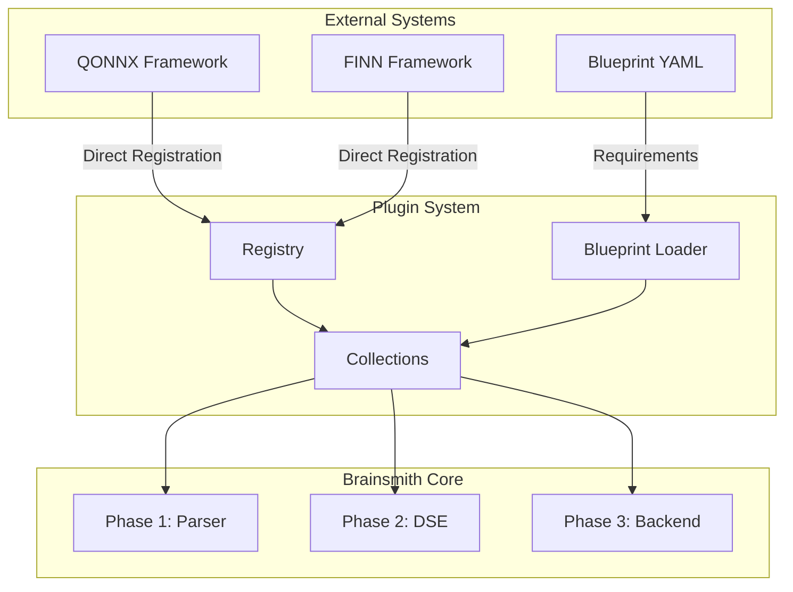

## Design Rationale

### Why Direct Class Access?

1. **Performance** - No wrapper function call overhead
2. **Simplicity** - What you see is what you get
3. **Debugging** - Clearer stack traces, no wrapper confusion
4. **Type Safety** - IDEs can provide proper type hints

### Why Universal Framework Support?

1. **Consistency** - All plugin types work the same way
2. **Flexibility** - Any plugin can come from any framework
3. **Future-Proof** - New frameworks easily integrated
4. **Natural API** - `kernels.finn.SomeKernel` is intuitive

### Why Steps as Separate Plugin Type?

1. **Clarity** - Steps are not transforms, they're build operations
2. **Organization** - Category-based organization vs stage-based
3. **Metadata** - Different metadata requirements than transforms
4. **API Consistency** - All plugin types should be first-class

### Why Multiple Access Patterns?

1. **Flexibility** - Different use cases prefer different patterns
2. **Blueprint Compatibility** - String lookup needed for YAML
3. **Framework Qualification** - Namespace collision resolution
4. **Developer Experience** - Natural for different contexts

## Future Considerations

### Extensibility

- New plugin types can be added by extending the base patterns
- New indexes can be added for new query patterns
- Framework adapters can integrate any external system

### Scalability

- Registry scales linearly with plugin count
- Framework indexes scale with frameworks * plugins
- Blueprint optimization reduces production footprint

### Compatibility

- Direct class access maintains type compatibility
- Framework qualification preserves namespace separation
- Multiple access patterns provide migration paths