# BrainSmith Libraries: Registry-Driven Component System & Developer Guide

**A comprehensive guide to BrainSmith's registry-driven library architecture and component development framework**

---

## Table of Contents

1. [Overview](#1-overview)
2. [Registry Dictionary Architecture](#2-registry-dictionary-architecture)
3. [Library Components](#3-library-components)
4. [Development Workflow](#4-development-workflow)
5. [Validation & Quality Assurance](#5-validation--quality-assurance)
6. [Registry Management](#6-registry-management)
7. [Integration Patterns](#7-integration-patterns)
8. [Developer Reference](#8-developer-reference)

---

## 1. Overview

**BrainSmith implements a registry-driven library system that eliminates filesystem scanning complexity while providing explicit component management through dictionary-based registries.** The system supports five specialized libraries with standardized interfaces and comprehensive validation.

### Library Architecture

*Source: [`brainsmith/libraries/__init__.py`](brainsmith/libraries/__init__.py:3)*

```mermaid
graph TB
    A[BrainSmith Libraries] --> B[🔧 Kernels]
    A --> C[🔄 Transforms]
    A --> D[📊 Analysis]
    A --> E[📋 Blueprints]
    A --> F[🤖 Automation]
    
    B --> B1[AVAILABLE_KERNELS<br/>Registry Dict]
    C --> C1[AVAILABLE_TRANSFORMS<br/>Registry Dict]
    D --> D1[AVAILABLE_ANALYSIS_TOOLS<br/>Registry Dict]
    E --> E1[AVAILABLE_BLUEPRINTS<br/>Registry Dict]
    F --> F1[Function-Based<br/>No Registry]
    
    G[Validation System] --> A
    G --> H[Registry Integrity]
    G --> I[Drift Detection]
    G --> J[Health Monitoring]
```



### Core Principles

*Source: [`brainsmith/libraries/validation.py`](brainsmith/libraries/validation.py:3)*

1. **Registry-Driven**: Explicit component mapping replaces filesystem scanning
2. **Fail-Fast Validation**: Immediate error detection for missing components
3. **Development Mode**: Drift detection between registry and filesystem reality
4. **Zero-Magic Discovery**: No hidden discovery mechanisms

### Library Portfolio

| Library | Purpose | Registry Type | Component Count* |
|---------|---------|---------------|------------------|
| **Kernels** | Hardware accelerator implementations | Directory mapping | ~2 kernels |
| **Transforms** | Model transformation pipeline | Function mapping | ~10 transforms |
| **Analysis** | Performance analysis tools | Mixed function/class | ~3 tools |
| **Blueprints** | Design configuration templates | File path mapping | ~2 blueprints |
| **Automation** | Workflow orchestration | Function-based, no registry | N/A |

*\*Counts from validation system inspection*

---

## 2. Registry Dictionary Architecture

**Each library implements a standardized registry pattern using explicit dictionaries to map component names to implementations, eliminating complex discovery mechanisms.**

### Registry Pattern Structure

Every registry-driven library follows this pattern:

```python
# Standard registry interface pattern
AVAILABLE_COMPONENTS = {
    "component_name": implementation_reference,
    # Direct mapping: name -> implementation
}

def get_component(name: str) -> ComponentType:
    """Get component by name with fail-fast errors"""
    if name not in AVAILABLE_COMPONENTS:
        available = ", ".join(sorted(AVAILABLE_COMPONENTS.keys()))
        raise KeyError(f"Component '{name}' not found. Available: {available}")
    return AVAILABLE_COMPONENTS[name]

def list_components() -> List[str]:
    """List all available component names"""
    return list(AVAILABLE_COMPONENTS.keys())
```

### Registry Types by Library

#### Kernels Library
*Source: [`brainsmith/libraries/validation.py`](brainsmith/libraries/validation.py:51)*

```python
# Directory-based registry for complex packages
AVAILABLE_KERNELS = {
    "conv2d_hls": "conv2d_hls",        # name -> directory path
    "matmul_rtl": "matmul_rtl"         # name -> directory path
}

# Each directory contains kernel.yaml + implementation files
```

#### Transforms Library
*Source: [`brainsmith/libraries/validation.py`](brainsmith/libraries/validation.py:74)*

```python
# Function-based registry for pipeline steps
AVAILABLE_TRANSFORMS = {
    "cleanup": cleanup_step,                    # name -> function
    "streamlining": streamlining_step,          # name -> function
    "infer_hardware": infer_hardware_step       # name -> function
}
```

#### Analysis Library
*Source: [`brainsmith/libraries/validation.py`](brainsmith/libraries/validation.py:97)*

```python
# Mixed registry for tools and classes
AVAILABLE_ANALYSIS_TOOLS = {
    "roofline_analysis": roofline_analysis,     # name -> function
    "roofline_profiler": RooflineProfiler,      # name -> class
    "generate_hw_kernel": generate_hw_kernel    # name -> function
}
```

#### Blueprints Library
*Source: [`brainsmith/libraries/validation.py`](brainsmith/libraries/validation.py:120)*

```python
# File path registry for configuration templates
AVAILABLE_BLUEPRINTS = {
    "cnn_accelerator": "basic/cnn_accelerator.yaml",           # name -> file path
    "mobilenet_accelerator": "advanced/mobilenet_accelerator.yaml"  # name -> file path
}
```

### Benefits Over Filesystem Scanning

**Registry Dictionary Pattern Advantages:**

✅ **Explicit Control**: Clear mapping between names and implementations  
✅ **Fast Access**: O(1) lookup vs O(n) filesystem traversal  
✅ **Fail-Fast Errors**: Immediate feedback for invalid component names  
✅ **Zero Dependencies**: No complex discovery or scanning logic  
✅ **Testable**: Easy to mock and unit test  

❌ **Eliminated Complexity**: No magical filesystem scanning, no complex loader hierarchies, no hidden state mutations

---

## 3. Library Components

### 3.1 Kernels Library

**Hardware accelerator implementations with HLS/RTL sources and FINN integration.**

#### Component Structure

```bash
brainsmith/libraries/kernels/
├── __init__.py                 # Registry and interface
├── CONTRIBUTOR_GUIDE.md        # Developer documentation
├── DESIGN.md                   # Architecture overview
├── functions.py                # Kernel business logic
├── types.py                    # Data structures
├── package_loader.py           # Package loading utilities
├── conv2d_hls/                 # Example kernel package
│   ├── kernel.yaml            # Package manifest
│   ├── conv2d_source_RTL.sv   # RTL implementation
│   ├── conv2d_hw_custom_op.py # Python backend
│   └── conv2d_rtl_backend.py  # RTL backend
└── custom_ops/                 # Custom operation implementations
```

#### Registry Interface

*Source: [`brainsmith/libraries/kernels/__init__.py`](brainsmith/libraries/kernels/__init__.py:32)*

```python
from brainsmith.libraries.kernels import get_kernel, list_kernels

# List available kernels
kernels = list_kernels()  # ['conv2d_hls', 'matmul_rtl']

# Get specific kernel package
kernel = get_kernel('conv2d_hls')
print(f"Kernel: {kernel.name}, Type: {kernel.operator_type}")

# Get kernel file paths
files = get_kernel_files('conv2d_hls')
# Returns: {'rtl_source': '/path/to/conv2d_source_RTL.sv', ...}
```

### 3.2 Transforms Library

**Model transformation operations for compilation pipeline steps.**

#### Component Structure

```bash
brainsmith/libraries/transforms/
├── __init__.py                 # Registry and interface
├── operations/                 # Direct model operations
│   ├── convert_to_hw_layers.py
│   └── expand_norms.py
└── steps/                      # Pipeline transformation steps
    ├── cleanup.py
    ├── streamlining.py
    ├── hardware.py
    └── optimizations.py
```

#### Registry Interface

*Source: [`brainsmith/libraries/transforms/__init__.py`](brainsmith/libraries/transforms/__init__.py:34)*

```python
from brainsmith.libraries.transforms import get_transform, list_transforms

# List available transforms
transforms = list_transforms()  
# ['cleanup', 'streamlining', 'infer_hardware', ...]

# Get and apply transform
cleanup_fn = get_transform('cleanup')
transformed_model = cleanup_fn(model, config)
```

### 3.3 Analysis Library

**Performance analysis tools, profiling capabilities, and hardware kernel generation.**

#### Component Structure

```bash
brainsmith/libraries/analysis/
├── __init__.py                 # Registry and interface
├── profiling/                  # Performance profiling tools
│   ├── roofline_analysis.py
│   ├── roofline_runner.py
│   └── model_profiling.py
└── tools/                      # Analysis utilities
    ├── gen_kernel.py
    └── hw_kernel_gen/          # Hardware kernel generation framework
        ├── hkg.py
        ├── generators/
        └── rtl_parser/
```

#### Registry Interface

*Source: [`brainsmith/libraries/analysis/__init__.py`](brainsmith/libraries/analysis/__init__.py:28)*

```python
from brainsmith.libraries.analysis import get_analysis_tool, list_analysis_tools

# List available tools
tools = list_analysis_tools()  # ['roofline_analysis', 'roofline_profiler', ...]

# Get analysis function
roofline_fn = get_analysis_tool('roofline_analysis')
results = roofline_fn(model_path, platform_config)

# Get profiler class
RooflineProfiler = get_analysis_tool('roofline_profiler')
profiler = RooflineProfiler(platform="zynq")
profile_data = profiler.profile(model)
```

### 3.4 Blueprints Library

**Design configuration templates for accelerator blueprints.**

#### Component Structure

```bash
brainsmith/libraries/blueprints/
├── __init__.py                     # Registry and interface
├── basic/
│   └── cnn_accelerator.yaml      # Basic CNN accelerator blueprint
└── advanced/
    └── mobilenet_accelerator.yaml # Advanced MobileNet blueprint
```

#### Registry Interface

*Source: [`brainsmith/libraries/blueprints/__init__.py`](brainsmith/libraries/blueprints/__init__.py:24)*

```python
from brainsmith.libraries.blueprints import get_blueprint, list_blueprints

# List available blueprints
blueprints = list_blueprints()  # ['cnn_accelerator', 'mobilenet_accelerator']

# Get blueprint file path
blueprint_path = get_blueprint('cnn_accelerator')

# Load blueprint data
blueprint_data = load_blueprint_yaml('cnn_accelerator')
```

### 3.5 Automation Library

**Workflow automation utilities - function-based without registry.**

*Source: [`brainsmith/libraries/validation.py`](brainsmith/libraries/validation.py:142)*

#### Component Structure

```bash
brainsmith/libraries/automation/
├── __init__.py                 # Function exports
├── sweep.py                    # Parameter sweep utilities
└── batch.py                    # Batch processing utilities
```

#### Function Interface

*Source: [`brainsmith/libraries/automation/__init__.py`](brainsmith/libraries/automation/__init__.py:47)*

```python
from brainsmith.libraries.automation import (
    parameter_sweep,    # Core parameter exploration
    batch_process,      # Core batch processing  
    find_best,          # Result optimization
    aggregate_stats     # Statistical analysis
)

# No registry - direct function access
results = parameter_sweep(model_path, blueprint_path, param_ranges)
best = find_best(results, metric='throughput')
```

---

## 4. Development Workflow

### 4.1 Adding Kernel Components

**Two-step process: Create kernel package + register in dictionary.**

*Source: [`brainsmith/libraries/kernels/CONTRIBUTOR_GUIDE.md`](brainsmith/libraries/kernels/CONTRIBUTOR_GUIDE.md:7)*

#### Step 1: Create Kernel Package

```bash
# Create kernel directory structure
mkdir brainsmith/libraries/kernels/my_new_kernel/
cd brainsmith/libraries/kernels/my_new_kernel/

# Create manifest file
cat > kernel.yaml << EOF
name: "my_new_kernel"
operator_type: "Convolution"
backend: "HLS"
version: "1.0.0"
author: "Developer Name"
description: "Custom kernel implementation"

parameters:
  pe_range: [1, 32]
  simd_range: [1, 16]
  supported_datatypes: ["int8", "int16"]

files:
  rtl_source: "my_new_kernel_source.sv"
  hw_custom_op: "my_new_kernel_hw_custom_op.py"
  rtl_backend: "my_new_kernel_rtl_backend.py"

performance:
  base_throughput: 1000
  base_latency: 10
  resource_estimates:
    luts: 5000
    dsps: 16
    brams: 4
EOF

# Add implementation files
touch my_new_kernel_source.sv
touch my_new_kernel_hw_custom_op.py  
touch my_new_kernel_rtl_backend.py
```

#### Step 2: Register in Dictionary

Edit `brainsmith/libraries/kernels/__init__.py`:

```python
# Simple registry maps kernel names to their package directories
AVAILABLE_KERNELS = {
    "conv2d_hls": "conv2d_hls",
    "matmul_rtl": "matmul_rtl",
    "my_new_kernel": "my_new_kernel",  # ADD THIS LINE
}
```

#### Step 3: Validate Registration

```python
from brainsmith.libraries.kernels import get_kernel, list_kernels

# Test registration
assert "my_new_kernel" in list_kernels()
kernel = get_kernel("my_new_kernel")
assert kernel.name == "my_new_kernel"
print("✅ Kernel successfully registered!")
```

### 4.2 Adding Transform Components

#### Step 1: Create Transform Function

```python
# brainsmith/libraries/transforms/steps/my_transform.py
def my_custom_transform_step(model, config=None):
    """
    Custom model transformation step.
    
    Args:
        model: ONNX model to transform
        config: Optional configuration dictionary
        
    Returns:
        Transformed ONNX model
    """
    # Implementation logic
    return transformed_model
```

#### Step 2: Register Transform

Edit `brainsmith/libraries/transforms/__init__.py`:

```python
# Import new transform
from .steps.my_transform import my_custom_transform_step

# Add to registry
AVAILABLE_TRANSFORMS = {
    "cleanup": cleanup_step,
    "streamlining": streamlining_step,
    "my_custom_transform": my_custom_transform_step,  # ADD THIS LINE
}
```

### 4.3 Adding Analysis Tools

#### Step 1: Create Analysis Function/Class

```python
# brainsmith/libraries/analysis/tools/my_analysis.py
def my_performance_analyzer(model_path, config=None):
    """Custom performance analysis tool."""
    return {"analysis_results": {}}

class MyCustomProfiler:
    """Custom profiler implementation."""
    def __init__(self, platform="generic"):
        self.platform = platform
    
    def profile(self, model):
        return {"profile_data": {}}
```

#### Step 2: Register Analysis Tool

Edit `brainsmith/libraries/analysis/__init__.py`:

```python
# Import new tools
from .tools.my_analysis import my_performance_analyzer, MyCustomProfiler

# Add to registry
AVAILABLE_ANALYSIS_TOOLS = {
    "roofline_analysis": roofline_analysis,
    "roofline_profiler": RooflineProfiler,
    "my_performance_analyzer": my_performance_analyzer,  # ADD THIS LINE
    "my_custom_profiler": MyCustomProfiler,              # ADD THIS LINE
}
```

### 4.4 Adding Blueprint Templates

#### Step 1: Create Blueprint YAML

```yaml
# brainsmith/libraries/blueprints/custom/my_blueprint.yaml
name: "my_custom_blueprint"
version: "1.0.0"
description: "Custom accelerator blueprint"

targets:
  throughput:
    direction: "maximize"
    target: 1000

constraints:
  max_luts: 0.8
  max_dsps: 0.9
  target_frequency: 200

parameters:
  pe_count:
    type: "integer"
    range_min: 1
    range_max: 64
    default: 16
```

#### Step 2: Register Blueprint

Edit `brainsmith/libraries/blueprints/__init__.py`:

```python
# Add to registry
AVAILABLE_BLUEPRINTS = {
    "cnn_accelerator": "basic/cnn_accelerator.yaml",
    "mobilenet_accelerator": "advanced/mobilenet_accelerator.yaml",
    "my_custom_blueprint": "custom/my_blueprint.yaml",  # ADD THIS LINE
}
```

---

## 5. Validation & Quality Assurance

**Comprehensive validation system prevents registry-reality desynchronization and ensures component integrity.**

### Registry Validation System

*Source: [`brainsmith/libraries/validation.py`](brainsmith/libraries/validation.py:16)*

#### Comprehensive Validation

```python
from brainsmith.libraries.validation import validate_all_registries

# Run complete validation
report = validate_all_registries()

# Report structure:
# {
#     'status': 'healthy' | 'degraded' | 'critical',
#     'libraries': {
#         'kernels': {'errors': [], 'warnings': [], 'component_count': 2},
#         'transforms': {'errors': [], 'warnings': [], 'component_count': 10},
#         'analysis': {'errors': [], 'warnings': [], 'component_count': 3},
#         'blueprints': {'errors': [], 'warnings': [], 'component_count': 2},
#         'automation': {'status': 'no_registry'}
#     },
#     'summary': {
#         'total_components': 17,
#         'failed_components': 0,
#         'drift_detected': False
#     }
# }
```

#### CLI Validation Tool

*Source: [`brainsmith/libraries/validation.py`](brainsmith/libraries/validation.py:284)*

```bash
# Run validation from command line
python -m brainsmith.libraries.validation

# Example output:
# 🔍 BrainSmith Libraries Registry Validation
# ==================================================
# 
# 📊 Overall Status: HEALTHY
# 📦 Total Components: 17
# ❌ Failed Components: 0
# 
# 📋 Library Details:
#   ✅ kernels: 2 components
#   ✅ transforms: 10 components  
#   ✅ analysis: 3 components
#   ✅ blueprints: 2 components
#   ℹ️  automation: no_registry
```

### Development Mode Drift Detection

*Source: [`brainsmith/libraries/validation.py`](brainsmith/libraries/validation.py:216)*

Enable development mode to detect unregistered components:

```bash
# Enable development mode
export BRAINSMITH_DEV_MODE=1

# Run validation - detects filesystem vs registry mismatches
python -m brainsmith.libraries.validation

# Example drift detection:
# ⚠️  DEV MODE: Unregistered kernels found: ['new_experimental_kernel']
# ⚠️  DEV MODE: Orphaned kernel entries: ['removed_old_kernel']
```

### Component Integrity Testing

*Source: [`brainsmith/libraries/validation.py`](brainsmith/libraries/validation.py:178)*

```python
# Test specific library integrity
from brainsmith.libraries.validation import validate_registry_integrity
from brainsmith.libraries.kernels import AVAILABLE_KERNELS, get_kernel

errors = validate_registry_integrity('kernels', AVAILABLE_KERNELS, get_kernel)
if errors:
    print("Registry errors found:")
    for error in errors:
        print(f"  ❌ {error}")
else:
    print("✅ All components load successfully")
```

### Health Check Integration

*Source: [`brainsmith/libraries/validation.py`](brainsmith/libraries/validation.py:275)*

```python
# Quick health check for CI/CD
from brainsmith.libraries.validation import run_health_check

if run_health_check():
    print("✅ All libraries healthy")
    exit(0)
else:
    print("❌ Library health check failed")
    exit(1)
```

---

## 6. Registry Management

### 6.1 Registry Patterns by Component Type

#### Directory-Based Components (Kernels)

```python
# Kernels map names to directory paths
AVAILABLE_KERNELS = {
    "component_name": "directory_name"
}

# Directory must contain kernel.yaml manifest
def get_kernel(name: str) -> KernelPackage:
    package_dir = AVAILABLE_KERNELS[name]
    return load_kernel_package(package_dir)
```

#### Function-Based Components (Transforms)

```python
# Transforms map names directly to functions
AVAILABLE_TRANSFORMS = {
    "transform_name": transform_function
}

def get_transform(name: str) -> Callable:
    return AVAILABLE_TRANSFORMS[name]
```

#### Mixed Components (Analysis)

```python
# Analysis tools map names to functions OR classes
AVAILABLE_ANALYSIS_TOOLS = {
    "function_tool": analysis_function,
    "class_tool": AnalysisClass
}

def get_analysis_tool(name: str) -> Union[Callable, Type]:
    return AVAILABLE_ANALYSIS_TOOLS[name]
```

#### File-Based Components (Blueprints)

```python
# Blueprints map names to file paths
AVAILABLE_BLUEPRINTS = {
    "blueprint_name": "relative/path/to/blueprint.yaml"
}

def get_blueprint(name: str) -> str:
    relative_path = AVAILABLE_BLUEPRINTS[name]
    return str(Path(__file__).parent / relative_path)
```

### 6.2 Error Handling Patterns

#### Fail-Fast Component Access

```python
def get_component(name: str) -> ComponentType:
    """Standard error handling pattern for all registries"""
    if name not in AVAILABLE_COMPONENTS:
        available = ", ".join(sorted(AVAILABLE_COMPONENTS.keys()))
        raise KeyError(f"Component '{name}' not found. Available: {available}")
    
    try:
        return load_component(AVAILABLE_COMPONENTS[name])
    except FileNotFoundError as e:
        raise FileNotFoundError(f"Component '{name}' files missing: {e}")
    except ImportError as e:
        raise ImportError(f"Component '{name}' import failed: {e}")
```

#### Graceful Degradation

```python
def safe_get_component(name: str) -> Optional[ComponentType]:
    """Safe component access with graceful degradation"""
    try:
        return get_component(name)
    except Exception as e:
        logger.warning(f"Failed to load component '{name}': {e}")
        return None
```

### 6.3 Registry Maintenance

#### Adding Components Safely

```python
# 1. Test component loads correctly
def test_new_component():
    # Verify component works before registration
    assert new_component_function() is not None

# 2. Add to registry dictionary
AVAILABLE_COMPONENTS["new_component"] = new_component_function

# 3. Validate registration
from brainsmith.libraries.validation import validate_registry_integrity
errors = validate_registry_integrity('library', AVAILABLE_COMPONENTS, get_component)
assert not errors, f"Registration errors: {errors}"
```

#### Removing Components

```python
# 1. Check for dependencies
def check_component_usage(component_name):
    # Scan for references to component
    pass

# 2. Remove from registry
del AVAILABLE_COMPONENTS["old_component"]

# 3. Validate removal doesn't break system
assert run_health_check(), "Health check failed after component removal"
```

---

## 7. Integration Patterns

### 7.1 Core API Integration

*Source: [`brainsmith/libraries/__init__.py`](brainsmith/libraries/__init__.py:12)*

```python
# Libraries integrate seamlessly with core forge() function
from brainsmith.core.api import forge

# Components are automatically available during compilation
result = forge(
    model_path='model.onnx',
    blueprint_path='blueprint.yaml',
    # Library components used implicitly based on blueprint
)
```

### 7.2 DSE Integration

```python
# Components participate in Design Space Exploration
from brainsmith.core.dse import DSEInterface
from brainsmith.libraries.kernels import list_kernels

config = DSEConfiguration(
    available_kernels=list_kernels(),  # All registered kernels available
    # ... other config
)

dse = DSEInterface(config)
results = dse.explore_design_space(model_path='model.onnx')
```

### 7.3 Hooks Integration

```python
# Libraries can register for optimization events
from brainsmith.core.hooks import register_event_handler

def library_event_handler(event):
    if event.event_type == 'component_selection':
        # React to component selection
        logger.info(f"Component selected: {event.data['component_name']}")

register_event_handler('component_selection', library_event_handler)
```

### 7.4 Validation Integration

```python
# Continuous validation during development
from brainsmith.libraries.validation import validate_all_registries

def pre_commit_hook():
    """Run before commits to ensure registry integrity"""
    report = validate_all_registries()
    if report['status'] != 'healthy':
        raise RuntimeError(f"Registry validation failed: {report}")
    return True
```

---

## 8. Developer Reference

### 8.1 Common Registry Patterns

#### Standard Registry Template

```python
# Template for new library registries
AVAILABLE_COMPONENTS = {
    "component1": implementation1,
    "component2": implementation2,
}

def get_component(name: str) -> ComponentType:
    if name not in AVAILABLE_COMPONENTS:
        available = ", ".join(sorted(AVAILABLE_COMPONENTS.keys()))
        raise KeyError(f"Component '{name}' not found. Available: {available}")
    return AVAILABLE_COMPONENTS[name]

def list_components() -> List[str]:
    return list(AVAILABLE_COMPONENTS.keys())
```

#### Component Validation

```python
def validate_component(component) -> bool:
    """Validate component meets interface requirements"""
    # Check required attributes/methods
    if not hasattr(component, 'required_method'):
        return False
    
    # Check callable interface
    if not callable(component.required_method):
        return False
    
    return True
```

### 8.2 Testing Patterns

#### Registry Testing

```python
import unittest
from brainsmith.libraries.kernels import get_kernel, list_kernels, AVAILABLE_KERNELS

class TestKernelsRegistry(unittest.TestCase):
    def test_all_kernels_loadable(self):
        """Test all registered kernels can be loaded"""
        for kernel_name in AVAILABLE_KERNELS:
            with self.subTest(kernel=kernel_name):
                kernel = get_kernel(kernel_name)
                self.assertIsNotNone(kernel)
                self.assertEqual(kernel.name, kernel_name)
    
    def test_invalid_kernel_raises_error(self):
        """Test accessing invalid kernel raises clear error"""
        with self.assertRaises(KeyError) as context:
            get_kernel("nonexistent_kernel")
        
        self.assertIn("Available:", str(context.exception))
```

#### Integration Testing

```python
def test_library_integration():
    """Test library integrates with core system"""
    from brainsmith.core.api import forge
    
    # Test component is available during forge
    result = forge('test_model.onnx', 'test_blueprint.yaml')
    
    # Verify component was used (specific to implementation)
    assert 'expected_component' in str(result)
```

### 8.3 Troubleshooting Guide

#### Common Issues

**Issue**: Component not found after registration
```python
# Check registry syntax
AVAILABLE_COMPONENTS = {
    "name": implementation,  # Missing comma causes issues
    "name2": implementation2  # This won't be registered
}

# Solution: Verify comma separation
AVAILABLE_COMPONENTS = {
    "name": implementation,   # ✅ Proper comma
    "name2": implementation2  # ✅ Last entry OK without comma
}
```

**Issue**: Import errors during component loading
```python
# Check import paths are correct
from .my_module import my_function  # ❌ Relative imports can fail

# Solution: Use absolute imports
from brainsmith.libraries.mylibrary.my_module import my_function  # ✅
```

**Issue**: Validation failures in CI
```python
# Run validation locally first
python -m brainsmith.libraries.validation

# Enable debug logging
import logging
logging.basicConfig(level=logging.DEBUG)
```

#### Debug Commands

```bash
# Check registry health
python -c "from brainsmith.libraries.validation import run_health_check; print('Healthy' if run_health_check() else 'Failed')"

# List all components
python -c "
from brainsmith.libraries import kernels, transforms, analysis, blueprints
print('Kernels:', kernels.list_kernels())
print('Transforms:', transforms.list_transforms()) 
print('Analysis:', analysis.list_analysis_tools())
print('Blueprints:', blueprints.list_blueprints())
"

# Test specific component
python -c "
from brainsmith.libraries.kernels import get_kernel
kernel = get_kernel('conv2d_hls')
print(f'Loaded: {kernel.name}')
"
```

### 8.4 Best Practices

1. **Always validate after changes**: Run `validate_all_registries()` after modifications
2. **Use development mode**: Enable `BRAINSMITH_DEV_MODE` to detect drift
3. **Test components independently**: Verify components work before registration
4. **Follow naming conventions**: Use descriptive, consistent component names
5. **Document thoroughly**: Include comprehensive docstrings and examples
6. **Handle errors gracefully**: Provide clear error messages with suggestions

---

**BrainSmith Libraries Developer Guide v2.0** - *Registry-driven component system with comprehensive validation*

*Last Updated: December 2024*