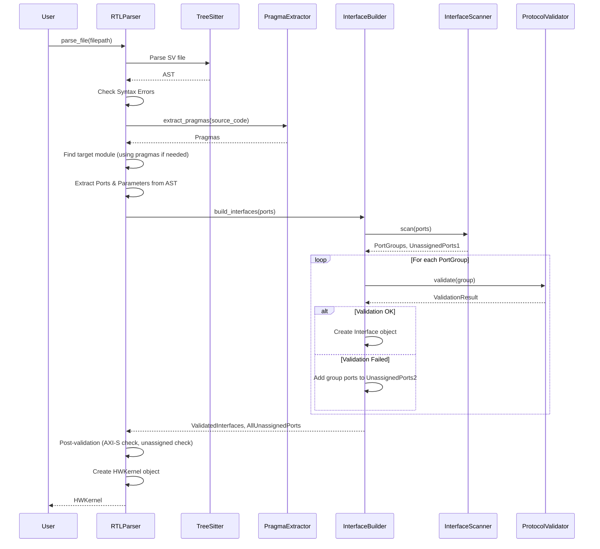

# Brainsmith SystemVerilog RTL Parser

## Overview

This directory contains the SystemVerilog RTL parser used within the Brainsmith framework. Its primary purpose is to analyze SystemVerilog hardware kernel files (`.sv`) and extract crucial information about the module's interface, parameters, and specific Brainsmith pragmas. This extracted information, structured into an `HWKernel` object, is essential for downstream tools, particularly the hardware kernel generator, to understand how to interact with and integrate the kernel.

The parser focuses on identifying standard interface protocols like AXI-Stream and AXI-Lite, along with global control signals (like clocks and resets), based on common naming conventions.

## How it Works

The parsing process involves several steps orchestrated by the `RTLParser`:

1.  **Grammar Loading:** It loads a pre-compiled `tree-sitter` SystemVerilog grammar library (`sv.so`) using `grammar.py`.
2.  **AST Generation:** The `RTLParser` (`parser.py`) uses the loaded grammar to parse the input SystemVerilog file into an Abstract Syntax Tree (AST).
3.  **Syntax Check:** It performs a basic check for syntax errors reported by `tree-sitter`.
4.  **Pragma Extraction:** It scans the source code comments for `//@brainsmith` pragmas using `pragma.py`.
5.  **Module Selection:** It identifies all `module` declarations in the AST. If multiple modules exist, it uses the `//@brainsmith TOP_MODULE <name>` pragma to select the target module. If no pragma is present and multiple modules exist, or if no modules are found, it raises an error.
6.  **Header Extraction:** For the target module, it extracts the module name, parameters (name, type, default value), and ports (name, direction, width) by traversing the relevant AST nodes (`parser.py`).
7.  **Interface Building:**
    *   The `InterfaceBuilder` (`interface_builder.py`) is invoked with the list of extracted ports.
    *   It uses the `InterfaceScanner` (`interface_scanner.py`) to group ports based on naming conventions (e.g., `in0_TDATA`, `config_AWADDR`, `ap_clk`) into potential `PortGroup` objects representing Global, AXI-Stream, or AXI-Lite interfaces.
    *   Each potential `PortGroup` is then validated by the `ProtocolValidator` (`protocol_validator.py`) to ensure it meets the minimum requirements for its identified type (e.g., required signals, correct directions). Protocol definitions (signal names, requirements, directions) are defined within `protocol_validator.py`.
    *   Only valid `PortGroup` objects are converted into `Interface` objects. Ports from invalid groups are collected.
8.  **Result Aggregation:** The `RTLParser` aggregates the module name, parameters, the dictionary of validated `Interface` objects, and any extracted pragmas into an `HWKernel` data object (`data.py`).
9.  **Post-Validation:** The `RTLParser` performs final checks, ensuring at least one AXI-Stream interface was found and raising an error if any ports remain unassigned after the interface building process.
10. **Return Value:** The validated `HWKernel` object is returned.

## Workflow Diagram



## Key Components

*   `parser.py`: Main class `RTLParser` orchestrating the parsing flow. Handles AST traversal for module, parameter, and port extraction. Performs final validation checks.
*   `grammar.py`: Handles loading the `tree-sitter` grammar (`.so` file) and defines node type constants.
*   `data.py`: Defines all core data structures: Enums (`Direction`, `InterfaceType`, `PragmaType`) and Dataclasses (`HWKernel`, `Port`, `Parameter`, `Pragma`, `Interface`, `PortGroup`, `ValidationResult`). This is the central definition of the parser's data model.
*   `pragma.py`: Logic for extracting `//@brainsmith` pragmas from comments. Defines `PragmaParser` which uses the `PragmaType` enum for validation and handler dispatch.
*   `interface_scanner.py`: Class `InterfaceScanner` identifies potential interface groups (`PortGroup`) based on port naming conventions using regex.
*   `protocol_validator.py`: Class `ProtocolValidator` validates that identified `PortGroup` objects adhere to protocol rules (required signals, directions). **Defines the expected signal patterns and rules for each interface type.**
*   `interface_builder.py`: Class `InterfaceBuilder` coordinates the `InterfaceScanner` and `ProtocolValidator` to produce a dictionary of validated `Interface` objects and a list of unassigned ports.

## Usage Example

Here's a simple example demonstrating how to use the `RTLParser`:

```python
import os
from brainsmith.tools.hw_kernel_gen.rtl_parser import RTLParser, ParserError

# Define some example SystemVerilog code
sv_code = """
module my_simple_kernel #(
    parameter DATA_WIDTH = 32
) (
    input logic clk,
    input logic rst_n,

    // AXI-Stream Input
    input logic [DATA_WIDTH-1:0] in0_TDATA,
    input logic                  in0_TVALID,
    output logic                 in0_TREADY,

    // AXI-Stream Output
    output logic [DATA_WIDTH-1:0] out0_TDATA,
    output logic                  out0_TVALID,
    input logic                   out0_TREADY
);

    // Simple passthrough logic (example)
    assign out0_TDATA = in0_TDATA;
    assign out0_TVALID = in0_TVALID;
    assign in0_TREADY = out0_TREADY;

endmodule
"""

# Create a dummy file for the example
file_path = "my_simple_kernel.sv"
with open(file_path, "w") as f:
    f.write(sv_code)

# --- Parser Usage ---
try:
    # 1. Instantiate the parser
    parser = RTLParser(debug=False) # Set debug=True for verbose logging

    # 2. Parse the SystemVerilog file
    print(f"Parsing file: {file_path}")
    hw_kernel_info = parser.parse_file(file_path)

    # 3. Access the extracted information
    print(f"\nSuccessfully parsed module: {hw_kernel_info.module_name}")

    print("\nParameters:")
    if hw_kernel_info.parameters:
        for name, param in hw_kernel_info.parameters.items():
            print(f"- {name}: Type={param.type}, Default={param.default_value}")
    else:
        print("- None")

    print("\nInterfaces:")
    if hw_kernel_info.interfaces:
        for name, interface in hw_kernel_info.interfaces.items():
            print(f"- Name: {name}")
            print(f"  Type: {interface.type.value}")
            # Ports dict keys depend on interface type (full name for global, suffix for AXI-S, signal for AXI-L)
            print(f"  Port Keys: {list(interface.ports.keys())}")
            print(f"  Port Names: {[p.name for p in interface.ports.values()]}")
            if interface.metadata:
                print(f"  Metadata: {interface.metadata}")
    else:
        print("- None")

    print("\nPragmas:")
    if hw_kernel_info.pragmas:
        for pragma in hw_kernel_info.pragmas:
            print(f"- Type: {pragma.type.name}, Args: {pragma.args}")
    else:
        print("- None")

except ParserError as e:
    print(f"Error parsing file: {e}")
except FileNotFoundError:
    print(f"Error: File not found at {file_path}")
finally:
    # Clean up the dummy file
    if os.path.exists(file_path):
        os.remove(file_path)
        print(f"\nCleaned up {file_path}")
# --- End Parser Usage ---
```
